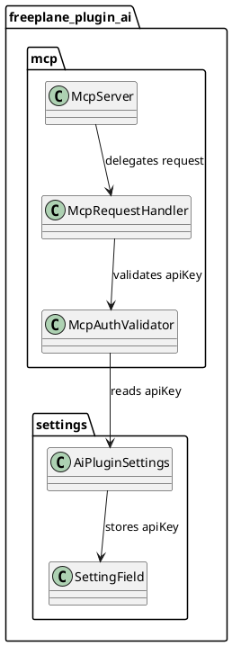

# Task: Add MCP server API key authentication
- **Task Identifier:** 2026-02-05-mcp-authentication
- **Scope:** Add optional API key authentication for the Freeplane MCP
  server, configured in the existing AI plugin settings. The server must
  validate the key on incoming requests and reject unauthorized access.
- **Motivation:** MCP server exposure should be controllable with a simple
  shared secret that can be configured by the user.
- **Developer Briefing:** Introduce an API key setting in the AI plugin
  settings and enforce it on MCP server requests. The key should be
  optional and preserved across restarts. When set, the server validates
  requests using a single header value and returns an authorization
  error on mismatch. No changes are required for logging or secret
  redaction.
- **Research:**
  - The MCP server is part of the Freeplane AI plugin and relies on the
    existing plugin settings storage.
  - The settings UI currently supports string fields.
  - MCP request handling already has a centralized entry point that can
    apply authentication checks before dispatching tools.
- **Design:**

The MCP server reads the configured API key from AI plugin settings. If
no key is set, requests proceed without authentication. If a key is set,
requests must include a matching header value; otherwise the server
returns an authorization error and does not invoke tools.
- **Test specification:**
  - Deferred. No tests planned yet per request.
