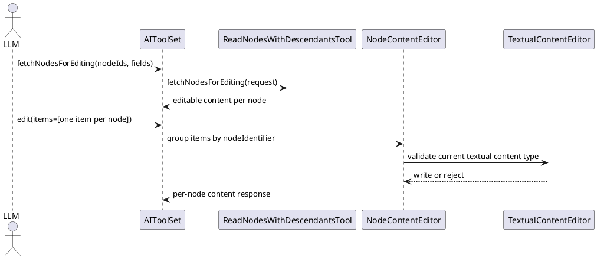
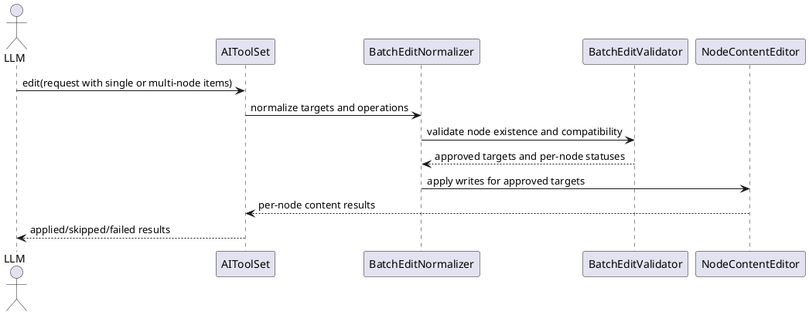

# Task: Add batch node edit support to AI tools
- **Task Identifier:** 2026-04-09-batch-edit
- **Scope:** Extend the existing typed AI edit surface so one edit
  instruction can target multiple nodes with shared semantics and
  explicit compatibility handling, while preserving current textual
  content safeguards.
- **Motivation:** Many user requests apply the same validated change to
  many nodes. The current `edit` tool can touch multiple nodes only by
  duplicating per-node items, which is verbose for clients and covers a
  large subset of the use cases raised for script execution.
- **Scenario:** When a user asks AI to apply the same change across a
  set of nodes, AI can send one typed batch instruction instead of one
  edit item per node. For `TEXT`, `DETAILS`, and `NOTE`, AI first reads
  editable metadata for the target nodes, groups compatible nodes by
  content type when needed, and applies one batch edit per compatible
  group. If any node is missing, not editable, or has an incompatible
  context, the tool follows an explicit policy and reports that outcome
  instead of silently skipping the node.
- **Constraints:**
  - Stay within the typed edit tool family; do not require script
    execution for same-change bulk edits.
  - Preserve `fetchNodesForEditing` as the normal precondition for
    `TEXT`, `DETAILS`, and `NOTE` edits unless equivalent safety
    metadata is embedded in the edit contract.
  - Non-textual edits (`ATTRIBUTES`, `TAGS`, `ICONS`, `STYLE`,
    `HYPERLINK`) should remain usable without
    `fetchNodesForEditing` unless research identifies hidden
    compatibility rules.
  - Default semantics must be deterministic and must not silently omit
    incompatible targets.
  - If best-effort mode is supported, it must be explicit and must
    return per-node `APPLIED`, `SKIPPED`, or `FAILED` status.
  - Avoid applying any writes before validating node existence and
    request compatibility when the chosen policy is fail-fast.
- **Briefing:** The current AI tool surface already separates
  `fetchNodesForEditing` from `edit`. Textual edits require
  `originalContentType` and revalidate the current content type at write
  time. `EditableContentReader` already exposes editability for formula
  content. Existing `edit` grouping happens only after the caller has
  duplicated one item per node, and invalid node identifiers can still
  produce late failure after valid nodes were already edited.
- **Research:**
  - `AIToolSet.edit(...)` documents `fetchNodesForEditing` as required
    before `TEXT`, `DETAILS`, and `NOTE` edits and treats
    `originalContentType` as required for those elements.
  - `ReadNodesWithDescendantsTool.fetchNodesForEditing(...)` already
    accepts multiple node identifiers in one request and returns
    editable content per node, including textual content type metadata.
  - `EditableContentReader` marks formula-based text and attributes as
    `isEditable=false` and exposes `FORMULA` content type, so batch
    textual editing must account for non-editable targets.
  - `TextualContentEditor` rechecks the current content type before
    writing and rejects drift with a "Content type has changed; read
    editable content again." error, so batch text edits cannot rely on
    stale metadata.
  - Existing `editNodes(...)` groups items by node identifier, edits
    valid nodes, and only then throws if some node identifiers were
    invalid. The current API therefore already has implicit
    partial-success edge cases that should not be expanded by batch
    support.
  - The discussion concluded that typed batch edits cover the common
    same-change bulk-edit cases more safely than a general script tool
    and should be the first extension to pursue.


- **Design:**
  - Extend the current `edit` tool contract instead of adding a
    scripting workaround for bulk edits.
  - Add first-class batch targeting to one edit instruction so the
    caller can target either one node or a list of nodes without
    repeating the rest of the instruction payload.
  - Keep `fetchNodesForEditing` as the discovery step for
    `TEXT`, `DETAILS`, and `NOTE`. A batch textual edit may use one
    shared `originalContentType` only when all targeted nodes are
    homogeneous. Mixed textual content types must either be split by
    the caller into multiple batch instructions or be handled through
    an explicit skip policy if that mode is approved.
  - Introduce an explicit compatibility policy enum so batch edits can
    distinguish deterministic fail-fast behavior from approved
    best-effort behavior.
  - Prevalidate node existence and policy-dependent compatibility before
    any writes in fail-fast mode.
  - Return per-node outcome records whenever an instruction targets more
    than one node or uses best-effort compatibility handling.
  - Prefer one underlying execution path for single-node and multi-node
    edits so validation and undo-aware behavior stay aligned.



Target request and response structure:

```text
EditRequest
  mapIdentifier : String
  userSummary : String?
  items : List<EditInstruction>

EditInstruction
  nodeIdentifier : String?
  nodeIdentifiers : List<String>?
  editedElement : EditedElement
  originalContentType : ContentType?
  value : String?
  index : Integer?
  operation : EditOperation?
  targetKey : String?
  compatibilityPolicy : EditCompatibilityPolicy?

EditCompatibilityPolicy
  FAIL_FAST
  SKIP_INCOMPATIBLE

EditResultItem
  nodeIdentifier : String
  status : EditTargetStatus
  skipReason : String?
  errorMessage : String?
  content : NodeContentItem?

EditTargetStatus
  APPLIED
  SKIPPED
  FAILED
```
- **Test specification:**
  - Automated tests:
    - Verify a non-textual batch edit can target multiple nodes without
      `fetchNodesForEditing`.
    - Verify textual batch edits reject missing `originalContentType`
      and still revalidate current content type at write time.
    - Verify formula-based or otherwise non-editable textual targets are
      reported deterministically.
    - Verify fail-fast mode validates node identifiers and compatibility
      before any writes occur.
    - Verify skip mode returns stable per-node `APPLIED`, `SKIPPED`,
      and `FAILED` statuses with reasons.
    - Verify mixed textual content types require caller splitting or
      follow the approved explicit skip semantics.
    - Verify single-node edits and batch edits share consistent
      validation and undo-aware behavior.
  - Manual tests: N/A
