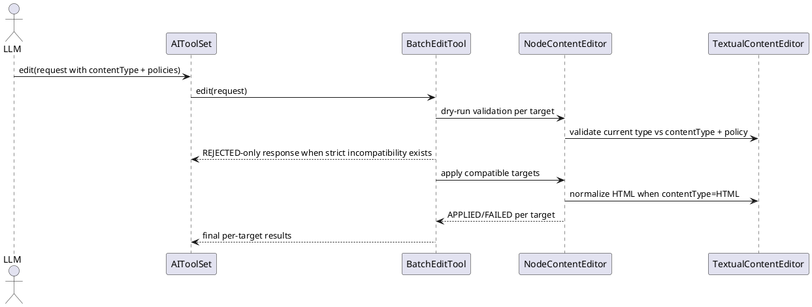

# Task: Enforce explicit content type policy in edit tool
- **Task Identifier:** 2026-04-12-content-type
- **Scope:** Replace textual edit type handling based on
  `originalContentType` with explicit `contentType`, add a request-level
  `contentTypeChangePolicy`, and normalize HTML textual edits so the
  tool auto-adds `<html>` handling when the caller omits it.
- **Motivation:** Current textual edit safety depends on a fetch-first
  round-trip and `originalContentType`. The new contract should let AI
  state intended textual type directly, keep compatibility safety rules
  deterministic, and reduce fragile HTML-prefix mistakes.
- **Scenario:** AI sends an `edit` request with batched instructions.
  For `TEXT`, `DETAILS`, or `NOTE`, each item explicitly provides
  `contentType`. With default
  `contentTypeChangePolicy=DISALLOW_CONTENT_TYPE_CHANGES`, requested
  type mismatches are treated as incompatibilities and follow the
  existing compatibility policy (`SKIP_INCOMPATIBLE_FIELDS` or
  `REJECT_ON_ANY_INCOMPATIBLE`). With
  `contentTypeChangePolicy=ALLOW_CONTENT_TYPE_CHANGES`, textual type
  migration is allowed for supported types. When `contentType=HTML` and
  the value does not already start with `<html>`, the tool normalizes it
  to HTML before writing.
- **Constraints:**
  - Keep the current batch contract with `nodeIdentifiers` and per-
    target statuses (`APPLIED`, `SKIPPED`, `REJECTED`, `FAILED`).
  - Replace `originalContentType` with `contentType` in typed edit
    payloads; do not add compatibility aliases.
  - `contentType` is required for textual edit elements (`TEXT`,
    `DETAILS`, `NOTE`) and must be absent for non-textual elements.
  - `contentTypeChangePolicy` is request-level. It is valid only when at
    least one textual edit instruction is present.
  - If `contentTypeChangePolicy` is provided in a request with no
    textual edits, return a request validation error.
  - Content type changes must require
    `contentTypeChangePolicy=ALLOW_CONTENT_TYPE_CHANGES`; otherwise they
    are incompatibilities.
  - Formula migration support stays out of this task and should be
    designed in the scripting-tool follow-up work.
- **Briefing:** `AIToolSet.edit(...)` delegates to `BatchEditTool`,
  which coordinates dry-run validation and apply loops. `NodeContentEditItem`
  currently exposes `originalContentType`. `NodeContentEditor` and
  `TextualContentEditor` handle textual compatibility and write logic.
  `TextualContentEditor` currently relies on existing type checks and
  value parsing rules for HTML/Markdown/LaTeX.
- **Research:**
  - The current typed edit schema still names textual type as
    `originalContentType` and documents a fetch-first flow.
  - Batch execution already supports request-level compatibility policy
    and per-target statuses.
  - Strict compatibility mode already performs dry-run validation and
    returns only incompatible targets as `REJECTED` with zero writes.
  - Non-textual editors do not need textual content type metadata.
  - Existing textual handling treats HTML specially when values start
    with `<html>`, making prefix omissions a recurring client error
    source.
- **Design:**
  - Update typed request contracts:
    - `NodeContentEditItem.contentType : ContentType?`
    - remove `originalContentType` from typed contract and docs.
    - add `EditRequest.contentTypeChangePolicy : ContentTypeChangePolicy?`
      with default `DISALLOW_CONTENT_TYPE_CHANGES`.
  - Add enum:

```text
ContentTypeChangePolicy
  DISALLOW_CONTENT_TYPE_CHANGES
  ALLOW_CONTENT_TYPE_CHANGES
```

  - Validation and compatibility rules:
    - textual item without `contentType` => incompatibility.
    - non-textual item with `contentType` => incompatibility.
    - provided `contentTypeChangePolicy` without any textual item =>
      request validation error.
    - with `DISALLOW_CONTENT_TYPE_CHANGES`, requested textual
      `contentType` must match current textual type; mismatch =>
      incompatibility.
    - with `ALLOW_CONTENT_TYPE_CHANGES`, supported textual type changes
      are allowed and applied.
  - Preserve compatibility policy behavior:
    - `SKIP_INCOMPATIBLE_FIELDS`: return per-target
      `APPLIED/SKIPPED/FAILED`.
    - `REJECT_ON_ANY_INCOMPATIBLE`: if any incompatible targets exist,
      return only those targets as `REJECTED` and perform no writes.
      If validation passes, run writes and report write-time failures as
      `FAILED`.
  - HTML normalization rule:
    - for textual items with `contentType=HTML`, normalize non-HTML
      input to HTML before write so callers do not need to prepend
      `<html>` manually.
  - Update tool descriptions and schema field docs to use canonical
    names and policy semantics.


- **Test specification:**
  - Automated tests:
    - Verify textual items require `contentType`.
    - Verify non-textual items with `contentType` are incompatible and
      follow compatibility policy outcomes.
    - Verify `contentTypeChangePolicy` defaults to
      `DISALLOW_CONTENT_TYPE_CHANGES`.
    - Verify requests with `contentTypeChangePolicy` and no textual
      items fail request validation.
    - Verify textual type mismatch under
      `DISALLOW_CONTENT_TYPE_CHANGES` is incompatible and yields
      `SKIPPED` or `REJECTED` by compatibility policy.
    - Verify textual type mismatch under
      `ALLOW_CONTENT_TYPE_CHANGES` is accepted for supported types.
    - Verify strict incompatibility responses include only incompatible
      `REJECTED` targets and perform zero writes.
    - Verify strict mode still reports apply-phase runtime failures as
      `FAILED` when dry-run passes.
    - Verify `contentType=HTML` with non-HTML input is normalized to
      HTML and written correctly.
    - Verify MCP tool metadata and descriptions expose `contentType` and
      `contentTypeChangePolicy` semantics without
      `originalContentType` wording.
  - Manual tests: N/A
