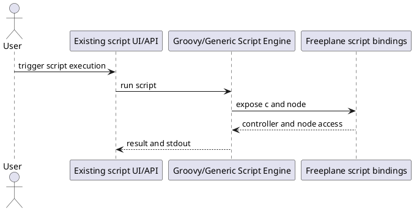
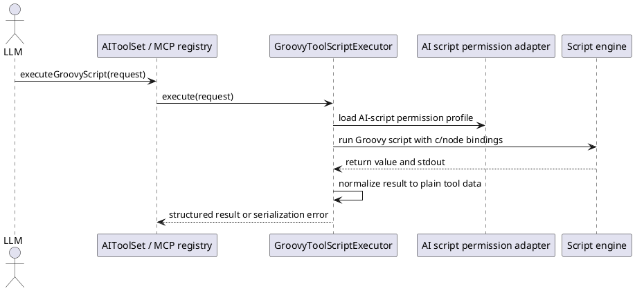

# Task: Add optional Groovy script execution tool for AI and MCP
- **Task Identifier:** 2026-04-09-script-tool
- **Scope:** Add an optional Groovy script execution tool for internal
  AI and MCP that can be enabled separately, runs under a dedicated
  AI-script permission profile, optionally requires user review in tool
  chat before execution, and returns only plain tool data or captured
  text.
- **Motivation:** Some workflows need traversal, aggregation,
  reporting, or direct API access that typed tools do not cover. LLMs
  can already draft Freeplane Groovy scripts, but there is no tool path
  that executes them from AI or MCP.
- **Scenario:** A user enables Groovy tool scripts for internal AI,
  MCP, or both. AI submits a Groovy script with optional map and node
  context. If `ai_script_execution_requires_review` is enabled, tool
  chat shows the submitted script in a temporary Groovy/plain-text
  editor pane with allow and skip controls before execution. If the
  user allows the script, Freeplane executes it with the configured
  AI-script permissions, captures stdout, and returns a plain-data
  result. If the user skips execution, that outcome is returned to AI.
  If the script returns unsupported Java objects, the tool fails with
  guidance to convert the result to strings, lists, or maps.
- **Constraints:**
  - Tool exposure to internal AI and MCP must be controlled
    separately.
  - AI-script permission flags for file read, file write, network, and
    exec must live in a dedicated configuration block and default to
    `false`.
  - `ai_script_execution_requires_review` must default to `true`.
  - Once the user explicitly enables the capability and selects a
    permission profile, the tool must not silently downgrade that
    profile.
  - The main trust boundary is access to open maps and live controller
    operations, not only OS-level permissions.
  - Result serialization must not promise arbitrary Java object graphs;
    only JSON-safe values and/or captured text are valid outputs.
  - One shared execution implementation should serve internal AI and MCP
    unless research finds a concrete difference.
  - The feature needs built-in usage guidance for LLMs, not only a bare
    tool signature.
  - When script review is enabled and a tool call includes script
    source, tool chat must show a temporary `JEditorPane` with the
    submitted script and allow/skip buttons before execution.
  - After the user chooses allow or skip, the temporary review editor
    must be hidden again.
  - Skipped execution must be returned to AI as an explicit
    `USER_SKIPPED` tool outcome.
- **Briefing:** Freeplane scripting binds `c` and `node`; `c` is a
  read-write controller that can enumerate open maps. Existing scripting
  already has permission controls, signed-script trust, and
  all-permission APIs, but those paths should not silently define the
  new AI tool contract. Even with file, network, and exec blocked, the
  tool result itself remains an output channel for map data.
- **Research:**
  - `GenericScript` binds `c` and `node` into the script context for
    execution.
  - `Controller` is a read-write script surface and exposes open maps,
    selection, undo control, map creation, and headless loading.
  - Existing scripting permissions already model file read, file
    write/delete, network, and exec. Existing script security also
    protects secured properties and restores permission-derived
    behavior after execution.
  - Existing proxy and headless APIs include routes to unrestricted or
    all-permission execution, so the AI tool must choose its own
    explicit permission profile instead of inheriting an unrestricted
    path accidentally.
  - Disabling network does not prevent map contents from reaching the
    model because the tool response itself can carry that data.
  - The requested UX adds a user review gate in tool chat instead of
    silent execution when the review flag is enabled.
  - Arbitrary Java object serialization is not practical for this tool.
    Cycles, internal state, and unstable `toString()` behavior require a
    narrow result contract.
  - The discussion concluded that multiedit likely covers the first
    wave of bulk-edit use cases, leaving script execution for
    aggregation, reporting, traversal, or API access that typed tools do
    not cover.


- **Design:**
  - Implement one `GroovyToolScriptExecutor` shared by internal AI tool
    wiring and MCP tool registration.
  - Add separate configuration keys for exposure and permissions:
    - `ai_chat_script_execution_enabled`
    - `ai_mcp_script_execution_enabled`
    - `ai_script_execution_requires_review`
    - `ai_script_execution_without_file_restriction`
    - `ai_script_execution_without_write_restriction`
    - `ai_script_execution_without_network_restriction`
    - `ai_script_execution_without_exec_restriction`
  - Reuse existing scripting permission enforcement, but source it from
    the dedicated AI-script configuration block rather than general
    script defaults.
  - Keep script input minimal: script source, optional map identifier,
    optional node identifier, and optional requested result mode.
  - If `ai_script_execution_requires_review` is `true` and the request
    includes
    script source:
    - show a temporary tool-chat `JEditorPane` for Groovy/plain-text
      display,
    - render the submitted script in that editor,
    - show allow and skip buttons next to the editor,
    - execute only after allow,
    - return a non-success outcome to AI when the user skips,
    - hide the editor again after allow or skip.
  - Make the result contract explicit:
    - return JSON-safe values (`null`, booleans, numbers, strings,
      lists, maps) as structured tool data,
    - capture stdout as text,
    - reject unsupported return types with a clear error that instructs
      the caller to convert the result to plain data.
  - Provide built-in usage guidance visible to both internal AI and MCP
    clients:
    - tool description explaining `c` and `node`,
    - a small cookbook with examples for traversal, aggregation, and
      converting results to lists or maps,
    - guidance about the default permission profile and how unsupported
      result types fail.
  - Register the tool only on surfaces whose exposure flag is enabled so
    disabled surfaces do not advertise it.



Target request and response structure:

```text
ExecuteGroovyScriptRequest
  mapIdentifier : String?
  nodeIdentifier : String?
  script : String
  resultMode : ScriptResultMode?

ScriptResultMode
  AUTO
  STRUCTURED
  TEXT

ExecuteGroovyScriptResponse
  status : ScriptExecutionStatus
  structuredResult : JSON-safe value?
  textResult : String?
  stdout : String?
  errorMessage : String?

ScriptExecutionStatus
  SUCCESS
  USER_SKIPPED
  EXECUTION_ERROR
  SERIALIZATION_ERROR
```
- **Test specification:**
  - Automated tests:
    - Verify the tool is advertised only when the corresponding
      internal-AI or MCP exposure flag is enabled.
    - Verify the dedicated AI-script permission block maps to the
      existing scripting permission enforcement without silent
      downgrades.
    - Verify scripts can access live map and node context when the tool
      is enabled.
    - Verify file, write, network, and exec operations are blocked by
      default and become allowed only when the corresponding
      AI-script permission flag is enabled.
    - Verify JSON-safe values are returned as structured tool data.
    - Verify unsupported Java object return values produce a stable
      serialization error with guidance to convert to plain data.
    - Verify stdout capture is returned alongside successful or failed
      execution.
    - Verify `ai_script_execution_requires_review` defaults to `true`.
    - Verify a script call shows the review `JEditorPane` only when the
      review flag is enabled and script source is present.
    - Verify the review pane shows the submitted script together with
      allow and skip controls.
    - Verify allow continues execution and skip returns a non-success
      result to AI without executing the script.
    - Verify the review editor is hidden again after allow or skip.
    - Verify internal AI and MCP share the same execution behavior and
      result normalization path.
  - Manual tests:
    - Enable the tool for one surface only and verify that only that
      surface can discover and use it.
    - Run a small traversal script that returns a list of plain maps and
      verify the response is consumable in follow-up AI reasoning.
    - With script review enabled, confirm the script appears in tool
      chat before execution, allow runs it, skip prevents execution, and
      the temporary editor disappears after either choice.
