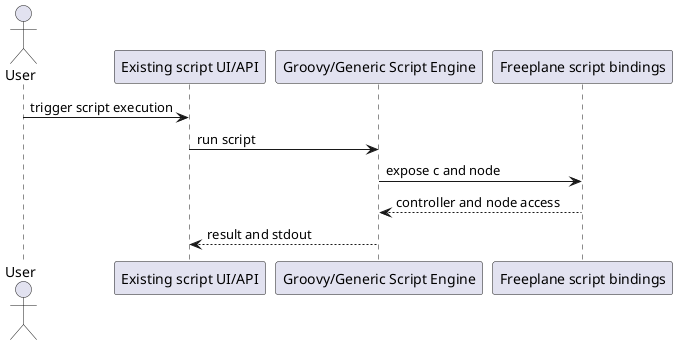
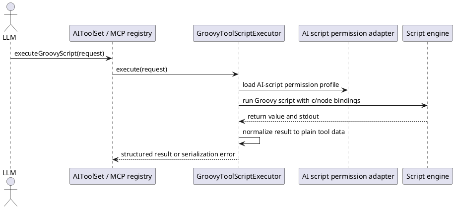
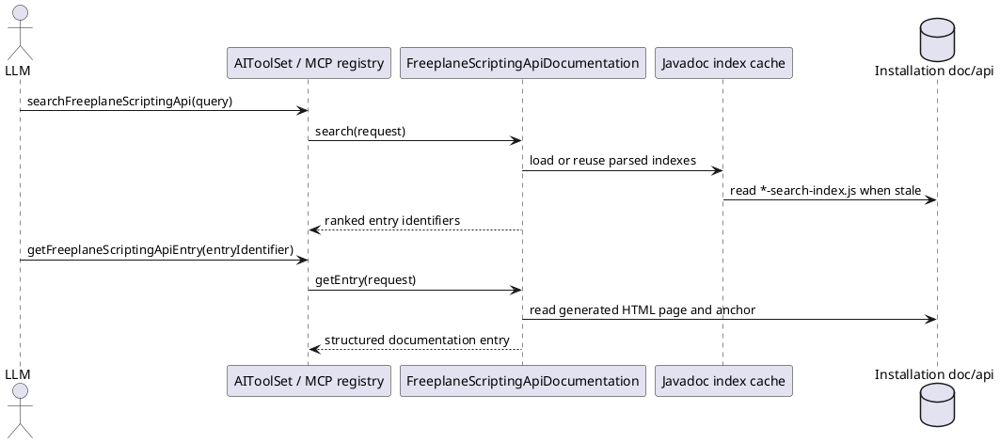

# Task: Add optional Groovy script execution tool for AI and MCP
- **Task Identifier:** 2026-04-09-script-tool
- **Scope:** Add an optional Groovy script execution tool for internal
  AI and MCP that can be enabled separately, runs under a dedicated
  AI-script permission profile, optionally requires user review in tool
  chat before execution, and returns only plain tool data or captured
  text. Add on-demand scripting API documentation tools so LLMs can
  inspect the distributed Freeplane API documentation before writing
  unfamiliar scripts without injecting the full API reference by default.
- **Motivation:** Some workflows need traversal, aggregation,
  reporting, or direct API access that typed tools do not cover. LLMs
  can already draft Freeplane Groovy scripts, but there is no tool path
  that executes them from AI or MCP.
- **Scenario:** A user enables Groovy tool scripts for internal AI,
  MCP, or both. AI submits a Groovy script with optional map and node
  context. If `ai_script_execution_requires_review` is enabled, tool
  chat shows the submitted script in a temporary Groovy/plain-text
  editor pane with allow and skip controls before execution. If the
  user allows the script, Freeplane executes it with the configured
  AI-script permissions, captures stdout, and returns a plain-data
  result. If the user skips execution, that outcome is returned to AI.
  If the script returns unsupported Java objects, the tool fails with
  guidance to convert the result to strings, lists, or maps.
- **Constraints:**
  - Tool exposure to internal AI and MCP must be controlled
    separately.
  - AI-script permission flags for file read, file write, network, and
    exec must live in a dedicated configuration block and default to
    `false`.
  - `ai_script_execution_requires_review` must default to `true`.
  - Once the user explicitly enables the capability and selects a
    permission profile, the tool must not silently downgrade that
    profile.
  - The main trust boundary is access to open maps and live controller
    operations, not only OS-level permissions.
  - Result serialization must not promise arbitrary Java object graphs;
    only JSON-safe values and/or captured text are valid outputs.
  - One shared execution implementation should serve internal AI and MCP
    unless research finds a concrete difference.
  - The feature needs built-in usage guidance for LLMs, not only a bare
    tool signature.
  - When script review is enabled and a tool call includes script
    source, tool chat must show a temporary `JEditorPane` with the
    submitted script and allow/skip buttons before execution.
  - After the user chooses allow or skip, the temporary review editor
    must be hidden again.
  - Skipped execution must be returned to AI as an explicit
    `USER_SKIPPED` tool outcome.
- **Briefing:** Freeplane scripting binds `c` and `node`; `c` is a
  read-write controller that can enumerate open maps. Existing scripting
  already has permission controls, signed-script trust, and
  all-permission APIs, but those paths should not silently define the
  new AI tool contract. Even with file, network, and exec blocked, the
  tool result itself remains an output channel for map data.
- **Research:**
  - `GenericScript` binds `c` and `node` into the script context for
    execution.
  - `Controller` is a read-write script surface and exposes open maps,
    selection, undo control, map creation, and headless loading.
  - Existing scripting permissions already model file read, file
    write/delete, network, and exec. Existing script security also
    protects secured properties and restores permission-derived
    behavior after execution.
  - Existing proxy and headless APIs include routes to unrestricted or
    all-permission execution, so the AI tool must choose its own
    explicit permission profile instead of inheriting an unrestricted
    path accidentally.
  - Disabling network does not prevent map contents from reaching the
    model because the tool response itself can carry that data.
  - The requested UX adds a user review gate in tool chat instead of
    silent execution when the review flag is enabled.
  - Arbitrary Java object serialization is not practical for this tool.
    Cycles, internal state, and unstable `toString()` behavior require a
    narrow result contract.
  - The discussion concluded that multiedit likely covers the first
    wave of bulk-edit use cases, leaving script execution for
    aggregation, reporting, traversal, or API access that typed tools do
    not cover.


- **Design:**
  - Implement one `GroovyToolScriptExecutor` shared by internal AI tool
    wiring and MCP tool registration.
  - Add separate configuration keys for exposure and permissions:
    - `ai_chat_script_execution_enabled`
    - `ai_mcp_script_execution_enabled`
    - `ai_script_execution_requires_review`
    - `ai_script_execution_without_file_restriction`
    - `ai_script_execution_without_write_restriction`
    - `ai_script_execution_without_network_restriction`
    - `ai_script_execution_without_exec_restriction`
  - Reuse existing scripting permission enforcement, but source it from
    the dedicated AI-script configuration block rather than general
    script defaults.
  - Keep script input minimal: script source, optional map identifier,
    optional node identifier, and optional requested result mode.
  - If `ai_script_execution_requires_review` is `true` and the request
    includes
    script source:
    - show a temporary tool-chat `JEditorPane` for Groovy/plain-text
      display,
    - render the submitted script in that editor,
    - show allow and skip buttons next to the editor,
    - execute only after allow,
    - return a non-success outcome to AI when the user skips,
    - hide the editor again after allow or skip.
  - Make the result contract explicit:
    - return JSON-safe values (`null`, booleans, numbers, strings,
      lists, maps) as structured tool data,
    - capture stdout as text,
    - reject unsupported return types with a clear error that instructs
      the caller to convert the result to plain data.
  - Provide built-in usage guidance visible to both internal AI and MCP
    clients:
    - tool description explaining `c` and `node`,
    - a small cookbook with examples for traversal, aggregation, and
      converting results to lists or maps,
    - guidance about the default permission profile and how unsupported
      result types fail.
  - Register the tool only on surfaces whose exposure flag is enabled so
    disabled surfaces do not advertise it.



Target request and response structure:

```text
ExecuteGroovyScriptRequest
  mapIdentifier : String?
  nodeIdentifier : String?
  script : String
  resultMode : ScriptResultMode?

ScriptResultMode
  AUTO
  STRUCTURED
  TEXT

ExecuteGroovyScriptResponse
  status : ScriptExecutionStatus
  structuredResult : JSON-safe value?
  textResult : String?
  stdout : String?
  errorMessage : String?

ScriptExecutionStatus
  SUCCESS
  USER_SKIPPED
  EXECUTION_ERROR
  SERIALIZATION_ERROR
```
- **Test specification:**
  - Automated tests:
    - Verify the tool is advertised only when the corresponding
      internal-AI or MCP exposure flag is enabled.
    - Verify the dedicated AI-script permission block maps to the
      existing scripting permission enforcement without silent
      downgrades.
    - Verify scripts can access live map and node context when the tool
      is enabled.
    - Verify file, write, network, and exec operations are blocked by
      default and become allowed only when the corresponding
      AI-script permission flag is enabled.
    - Verify JSON-safe values are returned as structured tool data.
    - Verify unsupported Java object return values produce a stable
      serialization error with guidance to convert to plain data.
    - Verify stdout capture is returned alongside successful or failed
      execution.
    - Verify `ai_script_execution_requires_review` defaults to `true`.
    - Verify a script call shows the review `JEditorPane` only when the
      review flag is enabled and script source is present.
    - Verify the review pane shows the submitted script together with
      allow and skip controls.
    - Verify allow continues execution and skip returns a non-success
      result to AI without executing the script.
    - Verify the review editor is hidden again after allow or skip.
    - Verify internal AI and MCP share the same execution behavior and
      result normalization path.
  - Manual tests:
    - Enable the tool for one surface only and verify that only that
      surface can discover and use it.
    - Run a small traversal script that returns a list of plain maps and
      verify the response is consumable in follow-up AI reasoning.
    - With script review enabled, confirm the script appears in tool
      chat before execution, allow runs it, skip prevents execution, and
      the temporary editor disappears after either choice.

## Subtask: Expose scripting API documentation tools
- **Status:** backlog
- **Scope:** Add read-only, on-demand tools for internal AI and MCP to
  search and read the distributed Freeplane scripting API documentation.
  These tools support the Groovy script execution tool without adding the
  full API reference to default chat or MCP context.
- **Motivation:** The Groovy execution tool is only useful when the LLM
  can discover the Freeplane scripting API. A user previously gave an LLM
  a broad API reference and a large utility script so it could write
  Freeplane Groovy, but injecting that volume of content by default would
  be noisy and would duplicate generated documentation.
- **Scenario:** An LLM wants to write or review a Groovy script for the
  user. Before using unfamiliar Freeplane APIs, it calls
  `getFreeplaneScriptingApiOverview`, then
  `searchFreeplaneScriptingApi` with the needed concept, then
  `getFreeplaneScriptingApiEntry` for exact type or member details. If it
  needs a snippet, it calls `getFreeplaneScriptingApiExamples` for
  examples extracted from the distributed Javadocs. The script execution
  tool description tells the LLM that these documentation tools exist,
  but no large API reference is injected unless requested by tool calls.
- **Constraints:**
  - The runtime documentation source must be the distributed
    `doc/api` tree under `ResourceController.getInstallationBaseDir()`;
    in development this is `BIN/doc/api`.
  - `DIST` copies are packaging output and must not be used as the
    canonical documentation source.
  - Source files under `freeplane_api` and `freeplane_plugin_script` are
    useful for development research but must not be required at runtime.
  - Do not maintain a second manual API reference. The tools must parse
    generated Javadoc indexes and generated Javadoc HTML.
  - Do not inject broad API documentation into the script execution tool
    description or default chat system message.
  - Expose the same documentation tools through LangChain4j and MCP.
  - Documentation tools must be read-only and must not execute scripts or
    inspect maps.
  - Search results should prefer the supported scripting API surface:
    `org.freeplane.plugin.script.proxy`, `org.freeplane.api`,
    `org.freeplane.plugin.script`, `org.freeplane.core.util`, and
    `org.freeplane.core.ui.components`.
  - Search results should prefer proxy scripting entries over inherited
    base API entries when both are relevant, because Groovy scripts use
    the proxy surface.
  - Internal Freeplane implementation APIs must not be promoted unless
    the query explicitly asks for internals and those internals are
    present in the distributed API documentation.
  - If the distributed `doc/api` tree is missing or unreadable, the tools
    must fail with a clear documentation-unavailable result instead of
    silently falling back to source code.
  - The user-provided `reference.md` and `utilityPanels.groovy` files are
    research examples only. They must not become bundled default context;
    `utilityPanels.groovy` demonstrates advanced Swing/internal usage and
    should not bias normal scripting guidance toward fragile internals.
- **Briefing:** Freeplane is used by LLMs through the internal
  LangChain4j tool set and as an MCP server exposing the same tool set.
  `ModelContextProtocolToolRegistry` builds MCP tool metadata from
  LangChain4j tool specifications, so adding methods to `AIToolSet` makes
  them available to both surfaces when wired normally. Existing scripting
  documentation is already distributed under `doc/api`. The scripting
  help action resolves it with
  `ResourceController.getResourceController().getInstallationBaseDir()`
  plus `/doc/api/index.html`.
- **Research:**
  - `BIN/doc/api` contains generated Javadoc output and is distributed.
  - `BIN/doc/api/type-search-index.js`,
    `BIN/doc/api/member-search-index.js`,
    `BIN/doc/api/package-search-index.js`, and
    `BIN/doc/api/tag-search-index.js` are generated search indexes with
    JSON-like arrays assigned to JavaScript variables and followed by
    `updateSearchResults();`.
  - `BIN/doc/api/index.html` is the generated package index, while
    `BIN/doc/api/overview-summary.html` redirects to `index.html`.
  - `BIN/doc/api/org/freeplane/plugin/script/proxy/Proxy.html` documents
    the proxy API and its read-only/read-write interface split.
  - `BIN/doc/api/org/freeplane/plugin/script/FreeplaneScriptBaseClass.html`
    documents global script helpers such as `ui`, `logger`, `htmlUtils`,
    `textUtils`, `menuUtils`, and `config`.
  - Type and member pages under `BIN/doc/api/org/freeplane/api` document
    the inherited API used by the proxy scripting surface.
  - Search index entries contain enough data to build documentation page
    paths: package (`p`), class/type (`c`), label (`l`), and member
    anchor (`u`) when an anchor is needed.
  - Full descriptions, parameters, return values, examples, deprecation
    notes, and since notes live in the generated HTML pages, not in the
    search index files.
  - Existing tool names are camelCase method names exposed from
    `AIToolSet`; MCP uses the same names from the LangChain4j tool
    specifications.
- **Design:**
  - Add a documentation package under the AI tool module:
    `org.freeplane.plugin.ai.tools.scriptapi`.
  - Add one shared `FreeplaneScriptingApiDocumentation` implementation
    used by internal AI and MCP through `AIToolSet`.
  - Resolve the documentation root from
    `ResourceController.getResourceController().getInstallationBaseDir()`
    plus `doc/api`.
  - Add these `AIToolSet` methods and tool names:
    - `getFreeplaneScriptingApiOverview`
    - `searchFreeplaneScriptingApi`
    - `getFreeplaneScriptingApiEntry`
    - `getFreeplaneScriptingApiExamples`
  - `getFreeplaneScriptingApiOverview` reads the generated docs and
    returns concise orientation from:
    - `index.html` for available packages,
    - `org/freeplane/plugin/script/proxy/Proxy.html` for the proxy API
      and read-only/read-write split,
    - `org/freeplane/plugin/script/FreeplaneScriptBaseClass.html` for
      script globals and utility shortcuts.
  - The script execution tool description should contain only a short
    pointer: scripts receive `node` and `c`; before using unfamiliar
    Freeplane APIs, call the Freeplane scripting API documentation tools;
    return only JSON-safe values or text.
  - `searchFreeplaneScriptingApi` parses the generated Javadoc index
    files on first use, caches an immutable in-memory index keyed by the
    documentation root path and index file last-modified timestamps, and
    invalidates the cache when those timestamps change.
  - `limit` parameters default to 10 and are clamped to 25. Overview,
    entry, and example responses must use bounded text excerpts and set
    `truncated=true` when content is omitted to keep tool results small.
  - The Javadoc index parser strips the generated JavaScript assignment
    prefix and trailing `updateSearchResults();`, then parses the
    remaining array with Jackson.
  - Search ranking:
    - exact type/member matches before partial matches,
    - query matches in labels before package-only matches,
    - `org.freeplane.plugin.script.proxy` before `org.freeplane.api`,
    - `org.freeplane.api` before script utility packages,
    - deprecated entries after non-deprecated matches with equal score,
    - stable ordering by package, type, member, and anchor as a final
      tie-breaker.
  - `getFreeplaneScriptingApiEntry` accepts only an
    `entryIdentifier` returned by search or examples. It resolves the
    generated HTML path and optional member anchor, extracts the class or
    member section, converts the bounded HTML to plain text with existing
    Freeplane HTML utilities, and returns structured fields.
  - Invalid or unknown `entryIdentifier` values return a clear
    `errorMessage`; the tool must never treat `entryIdentifier` as a
    caller-provided file path.
  - `getFreeplaneScriptingApiExamples` searches generated Javadoc pages
    for matching `<pre>` blocks and examples in bounded class/member
    sections. It returns only examples that can be tied to a generated
    documentation entry identifier.
  - Use these stable entry identifier formats:
    - `package:<packageName>`
    - `type:<packageName>:<typeName>`
    - `member:<packageName>:<typeName>:<anchor>`
    - `tag:<label>:<anchor>`
  - Do not expose file-system paths in `entryIdentifier`. Responses may
    include `documentationPath` relative to the documentation root for
    traceability.



Target request and response structure:

```text
FreeplaneScriptingApiOverviewRequest
  topic : String?

FreeplaneScriptingApiOverviewResponse
  documentationAvailable : boolean
  overview : String?
  entryPoints : List<ScriptingApiSearchResult>
  truncated : boolean
  errorMessage : String?

FreeplaneScriptingApiSearchRequest
  query : String
  kind : ScriptingApiSearchKind?
  limit : Integer?

ScriptingApiSearchKind
  ANY
  PACKAGE
  TYPE
  MEMBER
  TAG
  EXAMPLE

FreeplaneScriptingApiSearchResponse
  documentationAvailable : boolean
  results : List<ScriptingApiSearchResult>
  truncated : boolean
  errorMessage : String?

ScriptingApiSearchResult
  entryIdentifier : String
  kind : ScriptingApiEntryKind
  packageName : String?
  typeName : String?
  memberName : String?
  displayName : String
  documentationPath : String?
  anchor : String?
  summary : String?
  deprecated : boolean

ScriptingApiEntryKind
  PACKAGE
  TYPE
  MEMBER
  TAG
  EXAMPLE

FreeplaneScriptingApiEntryRequest
  entryIdentifier : String

FreeplaneScriptingApiEntryResponse
  documentationAvailable : boolean
  entryIdentifier : String
  kind : ScriptingApiEntryKind
  title : String?
  signature : String?
  description : String?
  parameters : List<ScriptingApiParameter>
  returnDescription : String?
  examples : List<String>
  relatedEntryIdentifiers : List<String>
  documentationPath : String?
  deprecated : boolean
  since : String?
  truncated : boolean
  errorMessage : String?

ScriptingApiParameter
  name : String
  description : String?

FreeplaneScriptingApiExamplesRequest
  topic : String
  limit : Integer?

FreeplaneScriptingApiExamplesResponse
  documentationAvailable : boolean
  examples : List<ScriptingApiExample>
  truncated : boolean
  errorMessage : String?

ScriptingApiExample
  entryIdentifier : String
  title : String
  code : String
  documentationPath : String
```

  - Completeness check:
    - Runtime documentation source is defined and limited to
      distributed `doc/api`.
    - Source and `DIST` fallback paths are explicitly excluded.
    - Tool surfaces are covered through shared `AIToolSet` exposure to
      LangChain4j and MCP.
    - Default context size is controlled by on-demand tools instead of
      API injection.
    - Search, entry retrieval, examples, unavailable-docs failure mode,
      caching, ranking, bounded results, invalid identifiers, and stable
      identifiers are specified.
    - Request and response structures are complete enough for schema
      generation and MCP publication.
- **Test specification:**
  - Automated tests:
    - Verify the documentation root resolver uses
      `ResourceController.getInstallationBaseDir()` plus `doc/api`.
    - Verify missing `doc/api` returns
      `documentationAvailable=false` with a clear `errorMessage`.
    - Verify source directories and `DIST` paths are not used by the
      production documentation resolver.
    - Verify the Javadoc index parser reads type, member, package, and
      tag entries from generated index JavaScript.
    - Verify search ranking prefers proxy scripting entries over base API
      entries for overlapping names.
    - Verify search ranking demotes deprecated entries when an otherwise
      equivalent non-deprecated entry exists.
    - Verify `getFreeplaneScriptingApiEntry` resolves a type entry to
      the expected generated HTML page.
    - Verify `getFreeplaneScriptingApiEntry` resolves a member entry to
      the expected generated HTML anchor.
    - Verify invalid `entryIdentifier` input returns a clear error and
      does not resolve as a file path.
    - Verify HTML extraction returns bounded text for a type section and
      does not return an entire Javadoc page.
    - Verify search, entry, overview, and example responses honor size
      limits and set `truncated=true` when applicable.
    - Verify examples are extracted from generated Javadoc `<pre>`
      blocks and include the source entry identifier.
    - Verify all four documentation tools are advertised by LangChain4j
      tool specifications and therefore appear in MCP tool listing.
    - Verify the script execution tool description points to the
      documentation tools without embedding broad API reference content.
  - Manual tests:
    - Start Freeplane from `BIN` and verify a chat model can search for
      node traversal APIs, read the relevant entry, and draft a script
      returning JSON-safe plain data.
    - Connect through MCP and verify the same documentation tools are
      discoverable and usable before calling the script execution tool.
