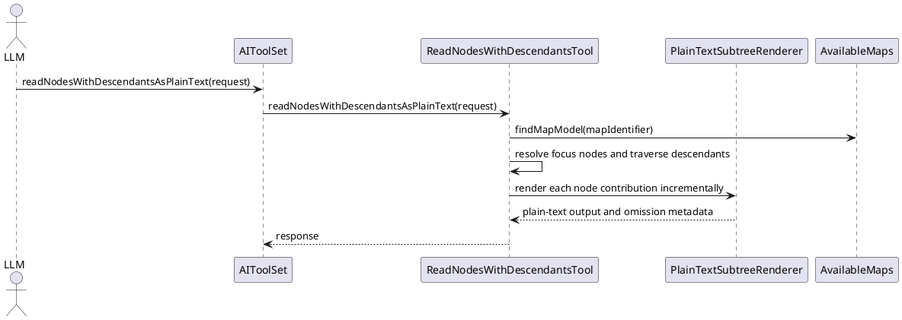

# Task: Add plain-text subtree read tool
- **Task Identifier:** 2026-04-09-plain-text-read
- **Scope:** Add an MCP read tool that exports one or more map subtrees
  as compact plain text for LLM context consumption, using the existing
  subtree read request shape and hierarchy semantics.
- **Motivation:** `readNodesWithDescendants` is effective for
  structured node manipulation, but its JSON envelope consumes too much
  of the character budget for read-only context gathering on large maps.
- **Scenario:** When an MCP client needs broad read-only context from
  one or more nodes, it can request the same subtree selection as
  `readNodesWithDescendants` and receive a plain-text rendering that
  preserves hierarchy by indentation while using the character budget
  for content rather than JSON structure.
- **Constraints:**
  - The new tool must complement `readNodesWithDescendants`, not
    replace it.
  - The request contract should reuse
    `ReadNodesWithDescendantsRequest` unless discussion identifies a
    concrete gap that requires an additional option.
  - Character-budget enforcement must be based on rendered plain text,
    including indentation and line breaks, rather than serialized JSON
    size.
  - The response should optimize for LLM consumption and therefore must
    not require node identifiers or per-node JSON objects in the main
    payload.
  - Requested context sections need an explicit plain-text rendering
    contract before implementation.
- **Briefing:** The existing MCP surface exposes
  `readNodesWithDescendants`, `fetchNodesForEditing`,
  `getSelectedMapAndNodeIdentifiers`, `searchNodes`, and several list
  or edit tools through `AIToolSet`. The codebase also contains a
  standalone `BreadcrumbsTool` with tests, but it is not currently
  wired into `AIToolSet` and therefore is not available over MCP.
- **Research:**
  - `AIToolSet` currently exposes `readNodesWithDescendants` and
    `fetchNodesForEditing`, but no plain-text subtree export.
  - `ReadNodesWithDescendantsTool` resolves maps and focus nodes,
    traverses the subtree, and already derives `NodeDepthItem`
    instances that contain `depth` and `unformattedText`.
  - The current budget logic measures serialized object size with
    `measureSerializedLength(...)`, which means a postprocessor that
    runs only after the full JSON response is built would still lose
    most of the available budget to JSON overhead.
  - `ContextSection` currently includes `BREADCRUMB_PATH`,
    `PARENT_SUMMARY`, `QUALIFIERS`, `HYPERLINK`,
    `OUTGOING_CONNECTORS`, `INCOMING_CONNECTORS`, and
    `CLONE_METADATA`; the existing JSON tool returns these as fields,
    not as rendered text.
  - `BreadcrumbsTool` is implemented and covered by tests, so the gap
    there is exposure through `AIToolSet`, not missing core logic.
- **Design:**
  - Add a new MCP tool method in `AIToolSet` named
    `readNodesWithDescendantsAsPlainText`.
  - Reuse `ReadNodesWithDescendantsRequest` for subtree selection,
    depth configuration, and maximum character budget.
  - Implement the plain-text tool in `ReadNodesWithDescendantsTool` or
    a closely related helper so it can reuse request validation, map
    lookup, focus-node resolution, and subtree traversal.
  - Do not budget against the intermediate JSON response. Instead,
    render each node contribution incrementally as plain text and count
    only the rendered contribution plus separators.
  - Render the main hierarchy as one indented line per node using
    `NodeDepthItem.depth` and `NodeDepthItem.unformattedText`.
  - Define how requested context sections map to additional text lines.
    At minimum, this needs a decision for `breadcrumbPath`,
    `hyperlink`, qualifiers, connectors, clone metadata, and parent
    summary.
  - Return a response shape that keeps the primary payload as plain
    text. If truncation or omission details are needed, carry them
    separately without reintroducing per-node JSON overhead.

- **Test specification:**
  - Automated tests:
    - Verify the tool reuses subtree selection defaults from
      `ReadNodesWithDescendantsRequest`, including root default and
      depth handling.
    - Verify the rendered output preserves node order and indentation.
    - Verify the character budget is enforced against rendered text,
      not serialized JSON size.
    - Verify multi-root requests render each requested subtree
      deterministically and report omissions when the budget is hit.
    - Verify requested context sections render in the agreed plain-text
      format.
    - Verify large-tree cases that fail under the JSON tool can still
      return substantial content under the same budget with the
      plain-text tool.
  - Manual tests: N/A
