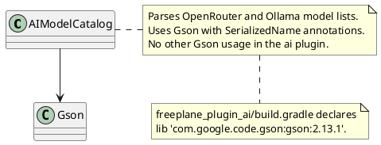
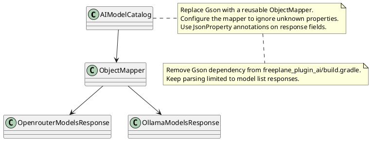

# Task: Remove Gson dependency from ai plugin
- **Scope:** Remove the Gson dependency from the ai plugin build file and use Jackson provided by LangChain4j instead.
- **Modified production files:**
  - freeplane_plugin_ai/build.gradle
  - freeplane_plugin_ai/src/main/java/org/freeplane/plugin/ai/chat/AIModelCatalog.java
- **Modified test files:**
  - freeplane_plugin_ai/src/test/java/org/freeplane/plugin/ai/chat/AIModelCatalogTest.java
- **Research:**

- **Design:**

- **Test specification:**
  - Add a unit test that parses a sample OpenRouter response and returns the expected model identifiers.
  - Add a unit test that parses a sample Ollama response and returns the expected model names.
