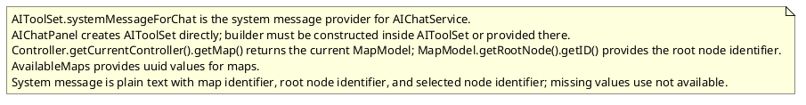
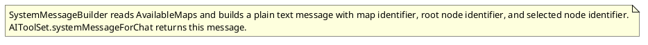

# Task: System message map identifiers for reading methods
- **Scope:** Add the current map identifier, current root node identifier, and current selected node identifier to the system message output for reading methods.
- **Modified production files:**
  - freeplane_plugin_ai/src/main/java/org/freeplane/plugin/ai/chat/SystemMessageBuilder.java
  - freeplane_plugin_ai/src/main/java/org/freeplane/plugin/ai/maps/AvailableMaps.java
  - freeplane_plugin_ai/src/main/java/org/freeplane/plugin/ai/maps/ControllerMapModelProvider.java
  - freeplane_plugin_ai/src/main/java/org/freeplane/plugin/ai/maps/MapModelProvider.java
  - freeplane_plugin_ai/src/main/java/org/freeplane/plugin/ai/tools/AIToolSet.java
- **Modified test files:**
  - freeplane_plugin_ai/src/test/java/org/freeplane/plugin/ai/chat/SystemMessageBuilderTest.java
  - freeplane_plugin_ai/src/test/java/org/freeplane/plugin/ai/maps/AvailableMapsTest.java
- **Research:**

- **Design:**

- **Test specification:**
  - Verify identifiers are present when available.
  - Verify not available when map or selection is missing.
