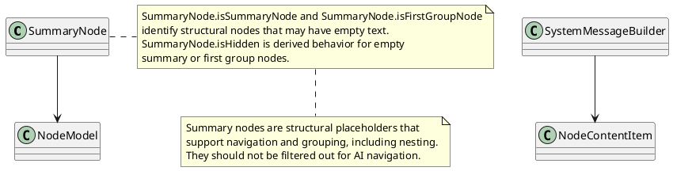
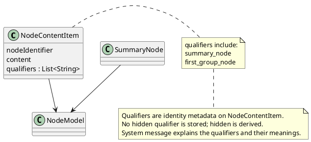

# Task: Node content qualifiers for summary nodes
- **Scope:** Add node qualifiers so AI can recognize summary and first group nodes without filtering them out; explain qualifiers in the system message.
- **Research:**

- **Design:**

- **Test specification:**
  - Verify summary nodes include summary_node qualifier.
  - Verify first group nodes include first_group_node qualifier.
  - Verify non summary nodes have no qualifiers.
  - Verify system message includes qualifier descriptions.
