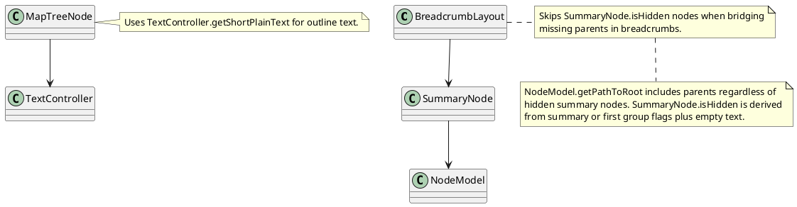
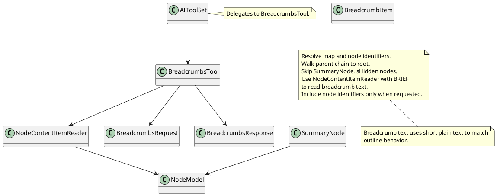

# Task: Implement get_breadcrumbs tool
- **Scope:** Implement get_breadcrumbs to return the root to node path, skipping hidden summary nodes and optionally including node identifiers.
- **Modified production files:**
  - freeplane_plugin_ai/src/main/java/org/freeplane/plugin/ai/tools/AIToolSet.java
  - freeplane_plugin_ai/src/main/java/org/freeplane/plugin/ai/tools/BreadcrumbsTool.java
  - freeplane_plugin_ai/src/main/java/org/freeplane/plugin/ai/tools/NodeContentItemReader.java
- **Modified test files:**
  - freeplane_plugin_ai/src/test/java/org/freeplane/plugin/ai/tools/BreadcrumbsToolTest.java
  - freeplane_plugin_ai/src/test/java/org/freeplane/plugin/ai/tools/NodeContentItemReaderTest.java
- **Research:**

- **Design:**

- **Test specification:**
  - Verify breadcrumbs include root to target nodes in order.
  - Verify SummaryNode.isHidden nodes are skipped.
  - Verify node identifiers are included only when requested.
  - Verify invalid map or node identifiers raise errors.
