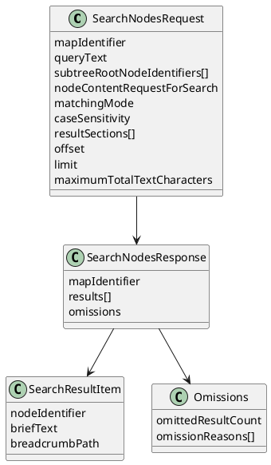

# Task: Search nodes using NodeContentRequest scope
- **Scope:** Add a search tool that accepts subtree roots and pagination, scopes search using NodeContentRequest, and enforces a total text budget by omitting results instead of truncating values.
- **Research:**
  - Search should be independent from map filter state to avoid hidden scope changes.
  - Subtree roots allow targeted search without additional filter tools.
  - Pagination controls reduce payload size and support incremental browsing.
  - Omitting results under a total text budget keeps response values intact.
- **Design:**
  - Query plus subtreeRootNodeIdentifiers define search scope.
  - Offset and limit control pagination.
  - NodeContentRequest selects which fields are searched.
  - Exact JavaScript Object Notation length budget with omissions instead of truncation.
  - Case sensitivity controls apply to all matching modes.
  - Tool schema marks optional fields explicitly and documents non-trivial defaults in field descriptions.
- **Design diagram:**

- **Request parameters:**
  - `mapIdentifier`: Map identifier string.
  - `queryText`: Search query string.
  - `subtreeRootNodeIdentifiers`: List of node identifier strings that restrict search to those subtrees. When empty or null, search the whole map.
  - `nodeContentRequestForSearch`: NodeContentRequest that selects which content fields are searched.
  - `matchingMode`: SearchMatchingMode. Default `CONTAINS`.
  - `caseSensitivity`: SearchCaseSensitivity. Default `CASE_INSENSITIVE`.
  - `resultSections`: List of values. Supported values: `BREADCRUMB_PATH`.
  - `offset`: Integer. Default 0.
  - `limit`: Integer. Default 200.
  - `maximumTotalTextCharacters`: Integer. Default 65536.
- **Response fields:**
  - `mapIdentifier`: Map identifier string.
  - `results`: List of SearchResultItem entries.
  - `omissions`: Object, only when omissions occur.
- **SearchResultItem:**
  - `nodeIdentifier`: Node identifier string.
  - `briefText`: String.
  - `breadcrumbPath`: String, only when `BREADCRUMB_PATH` is present in resultSections.
- **Omissions:**
  - `omittedResultCount`: Integer.
  - `omissionReasons`: List of OmissionReason values.
- **Behavior:**
  - Results are ordered by map traversal order within each subtree root, and then filtered by offset and limit.
  - The total text budget uses exact JavaScript Object Notation serialization length and omits results rather than truncating values, with omissionReasons containing `TEXT_BUDGET`.
  - Search matching is controlled by matchingMode and caseSensitivity. CONTAINS uses substring matching, EQUALS uses full value matching, and REGULAR_EXPRESSION uses Java regular expression matching on the selected fields. CASE_INSENSITIVE applies to all modes.
  - Icon descriptions are matched when icons are included in nodeContentRequestForSearch; emoji icon descriptions also match their description keys.
  - Duplicate subtree root node identifiers return an error with message "duplicate subtree root node identifiers".
  - Unknown subtree root node identifiers return an error with message "Unknown node identifiers: ..." and the list of unknown identifiers.
  - Search remains independent from filter state.
- **Test specification:**
  - Verify subtreeRootNodeIdentifiers limits search scope.
  - Verify offset and limit paginate results.
  - Verify NodeContentRequest controls which fields are searched.
  - Verify breadcrumbPath is included only when requested.
  - Verify caseSensitivity applies to contains, equals, and regular expression matching.
  - Verify total text budget omits results and sets omissionReasons to `TEXT_BUDGET`.
