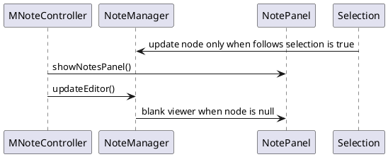
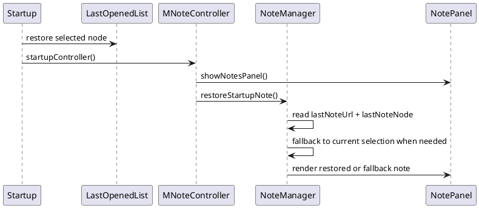

# Task: Restore frozen note on startup
- **Task Identifier:** 2026-03-20-frozen-note
- **Scope:** Restore note-panel startup behavior when `Note follows
  selection` is disabled by persisting one frozen note target
  `(map, node)` across application shutdown and startup. If that frozen
  target cannot be restored, initialize the note panel from the current
  selection once at startup without changing the runtime meaning of
  `Note follows selection`.
- **Motivation:** The current note panel keeps one frozen note target in
  memory, not one target per map. Startup loses that frozen target, so
  the note panel reopens blank and without the HTML toolbar. Fixing the
  startup restore path should match the current global frozen-note
  model instead of introducing new per-map behavior.
- **Scenario:** A user disables `Note follows selection`, freezes the
  note panel on a note in map A, closes Freeplane, and starts it again.
  If map A is reopened and the node still exists, Freeplane should
  restore that frozen note. If map A is not reopened, or the node no
  longer exists, Freeplane should initialize the note panel from the
  currently selected node once and keep `Note follows selection`
  disabled afterward.
- **Constraints:**
  - Persist one frozen note target, not one target per open map.
  - Preserve the current runtime meaning of `Note follows selection`:
    this task changes startup restore only.
  - Keep existing selected-node restore behavior in `LastOpenedList`
    unchanged.
  - If the saved frozen note target cannot be restored, fall back to
    the startup selection instead of leaving the note panel blank.
- **Briefing:** `NoteManager` currently stores the frozen note in a
  single `node` field. When `noteFollowsSelection=false`, that field is
  not updated on later selections or map switches. The startup fix
  should therefore restore one saved frozen note target, not invent
  per-map frozen-note state. `MNoteController` should remain the
  startup orchestrator for note UI. `NoteManager` should own choosing,
  saving, and restoring the startup note target because it already owns
  the active note node. Since `node` may be cleared during map-removal
  lifecycle before application shutdown finishes, note startup
  persistence should not rely only on `node`. `LastOpenedList` should continue to own
  selected-node restore only.
- **Research:**
  - The pre-change `NoteManager` updates `node` on selection only when
    `noteFollowsSelection=true`.
  - When `noteFollowsSelection=false`, switching to another map does not
    replace the frozen note target; the panel continues to point to the
    old node until some other action changes it.
  - `MNoteController.showNotesPanel()` creates the panel and calls
    `noteManager.updateEditor()` before any frozen note target is
    restored.
  - With `node == null`, `NoteManager.updateEditor()` switches the panel
    into blank viewer mode, which explains the missing toolbar on
    startup.
  - During map-removal lifecycle, `NoteManager` may clear `node` before
    `onApplicationStopped()` runs. A shutdown save that relies only on
    `node` can therefore lose the frozen note if its map closes before
    application shutdown completes.
  - `LastOpenedList` already restores selected-node and view-root state.
    That behavior is separate from frozen-note restore and should stay
    separate.

  The current frozen-note model is global in memory. Startup fails
  because no persisted frozen target exists to seed `NoteManager.node`
  before the panel is drawn.
- **Design:**
  - Keep ownership explicit:
    - `MNoteController.startupController()` remains responsible for
      note-panel startup sequencing.
    - `NoteManager` remains responsible for the active note target and
      gains startup restore logic for that target.
    - `LastOpenedList` remains responsible only for selected-node and
      view-root restore.
  - Add a `WeakReference<NodeModel>` field named
    `lastShownNoteNode` inside `NoteManager`. It represents the last
    note target actually shown by the note panel, independent of later
    map-removal cleanup of `node`.
  - Persist one frozen note target in dedicated note properties, for
    example `lastNoteUrl` and `lastNoteNode`. Use the map `URL`
    directly instead of `LastOpenedList` restorable identifiers. If the
    frozen note map has no `URL` at shutdown, clear the saved startup
    note target because it cannot be restored later.
  - `NoteManager` should not keep those properties updated during
    normal runtime. `MNoteController` should trigger a one-time
    `NoteManager` save of the frozen note target during
    `onApplicationStopped()`, before application properties are written
    to disk.
  - `NoteManager` should update `lastShownNoteNode` whenever the note
    panel target is effectively changed:
    1. when startup restore chooses a note target;
    2. when `noteFollowsSelection=true` selection changes update the
       shown note;
    3. when `noteFollowsSelection` is turned off and the current note
       target is initialized from selection.
  - The shutdown save should read from `lastShownNoteNode`, not from
    `node`. That keeps the frozen-note reference available even if the
    original map has already triggered `onRemove()` and cleared
    `node`.
  - `MNoteController.startupController()` should trigger
    `NoteManager.restoreStartupNote()` only after the note panel exists
    and selected-node restore has already settled.
  - Keep the new startup-target decision inside `NoteManager`, but make
    it explicit as package-private resolver methods with simple inputs
    and outputs. Do not introduce a new implementation unit for this
    task. The goal is to separate startup note selection logic from UI
    wiring and global lookups so the behavior can be tested directly.
  - `NoteManager.restoreStartupNote()` resolves the startup note target
    in this order:
    1. load `lastNoteUrl` and `lastNoteNode`;
    2. if an open map has the same `URL` and the node exists there, use
       it;
    3. otherwise use the current selected node once;
    4. keep `noteFollowsSelection=false` after initialization.
  - Do not introduce a new startup-specific service or store class for
    this task. The behavior belongs to existing note classes.

  This keeps startup behavior aligned with the existing single frozen
  note concept while removing the blank-panel failure mode.
- **Test specification:**
  - Automated tests:
    - Resolver test: when the saved frozen note `URL` and node are
      available, startup note resolution returns that saved target.
    - Resolver test: when the saved frozen note `URL` is not open,
      startup note resolution falls back to the current startup
      selection.
    - Resolver test: when the saved node no longer exists in the saved
      `URL`-matched map, startup note resolution falls back to the
      current startup selection.
    - Resolver test: empty saved startup-note properties resolve to no
      saved target.
    - Shutdown-save test: when `node` has been cleared by map-removal
      lifecycle but `lastShownNoteNode` still points to the last shown
      note target, shutdown persistence still saves that target.
  - Manual tests:
    - Freeze a note, restart with the same map reopened, and verify the
      frozen note returns with the HTML toolbar visible.
    - Freeze a note, restart without reopening that map, and verify the
      note panel starts on the current selection instead of blank.
    - Freeze a note, delete that node before restart, and verify the
      note panel falls back to the current selection.
