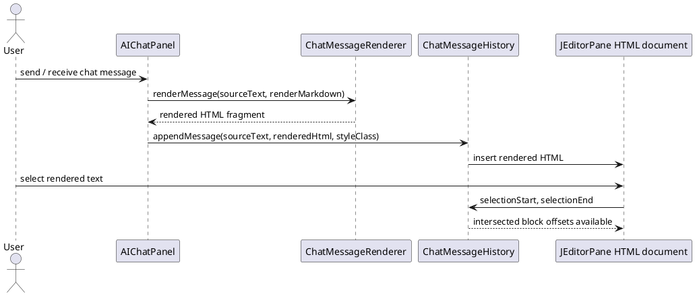
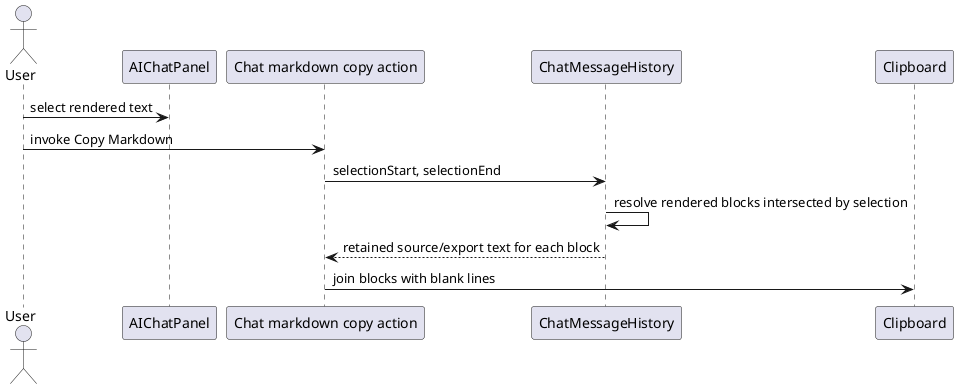
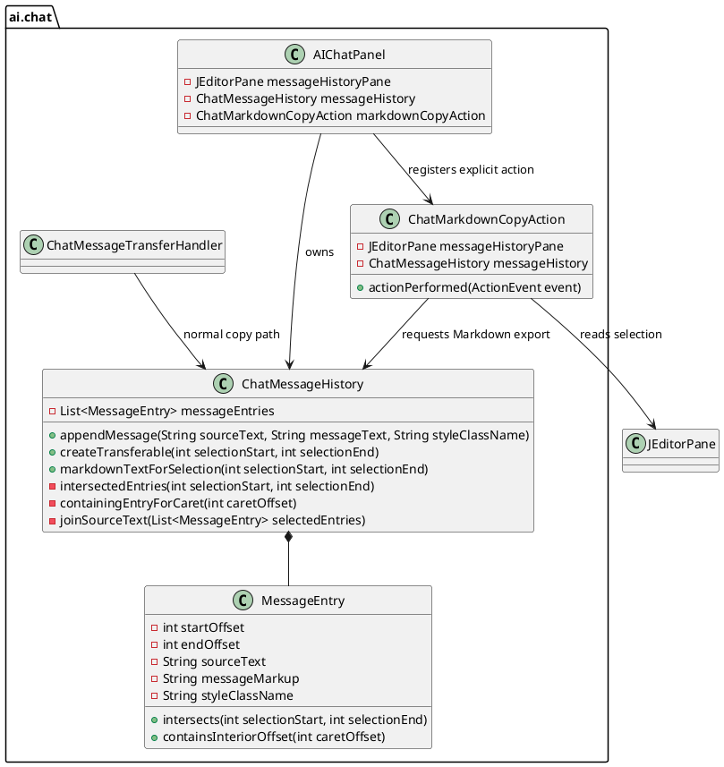

# Task: Copy selected visible chat blocks as Markdown
- **Task Identifier:** 2026-03-29-copy-markdown
- **Scope:** Design and implement one explicit `Copy Markdown` action
  for the AI chat panel. The action must use the current rendered
  selection only to choose which visible chat blocks to include, then
  copy those intersected blocks as whole blocks in Markdown/plain text
  form from retained source text. It must not implement whole-message
  copy, whole-conversation export, or exact fragment-to-Markdown
  reconstruction.
- **Motivation:** The chat panel renders assistant Markdown to HTML for
  display. Users still need a way to recover Markdown-oriented content,
  but arbitrary rendered selections do not map reliably back to exact
  Markdown source. A block-based copy action preserves useful Markdown
  behavior without making false promises about per-character source
  recovery.
- **Scenario:** A user highlights parts of one or more visible chat
  blocks in the AI chat panel and invokes `Copy Markdown`. The action
  copies every visible rendered block that the selection intersects,
  even if the selection covers only part of that block. If a tool,
  profile, or system block is visible and the selection intersects it,
  it is copied too. If the user does not want such blocks included,
  they first hide them so they are no longer rendered. If there is no
  selection, the action copies the block that strictly contains the
  caret. If the caret sits exactly on a boundary between rendered
  blocks, the action does nothing.
- **Constraints:**
  - Do not reconstruct Markdown from rendered HTML.
  - Treat rendered-text selection offsets and retained source text as
    different coordinate systems.
  - Use the selection only as a block filter, not as a Markdown range.
  - Keep retained source/export text in the message model or adjacent
    in-memory structures, not in DOM attributes.
  - The action must copy only visible rendered blocks that the current
    selection intersects.
  - If there is no selection, the action may copy only the block that
    strictly contains the caret.
  - If the caret is exactly on a rendered block boundary, the action
    must not change clipboard contents.
  - Keep normal copy behavior unchanged. The new action is explicit and
    separate from default rendered-text copy.
- **Briefing:** The chat panel lives in `freeplane_plugin_ai`.
  `AIChatPanel` renders chat history into a `JEditorPane`.
  `ChatMessageHistory` already stores each rendered block with retained
  `sourceText`, rendered markup, and document offsets. That offset data
  is sufficient to answer “which rendered blocks does this selection
  intersect?” without trying to map a rendered substring back to exact
  Markdown positions.
- **Research:**
  - `ChatMessageRenderer` renders assistant messages with
    `io.github.gitbucket.markedj.Marked`.
  - The project currently uses `markedj` 1.0.20 from
    `freeplane_plugin_markdown/build.gradle`.
  - `markedj` exposes lexer/parser/token hooks, but its tokens do not
    carry source offsets or source-position metadata. `Marked.marked(...)`
    returns HTML only.
  - `AIChatPanel.appendChatMessageInternal(...)` already passes raw
    source text into `ChatMessageHistory.appendMessage(sourceText,
    renderedText, styleClassName)`.
  - `ChatMemoryHistoryRenderer` rebuilds visible chat history from
    retained chat state and again appends source text alongside rendered
    HTML.
  - `ChatMessageHistory` already stores adjacent in-memory
    `messageEntries` with `startOffset`, `endOffset`, `sourceText`,
    rendered markup, and style class. This is enough to detect which
    rendered blocks are intersected by a selection.
  - Default copy today is handled by `ChatMessageTransferHandler` and
    `ChatMessageHistory.createTransferable(...)`. Partial selections
    copy rendered plain text and HTML. That behavior is still correct
    for normal copy and should remain unchanged.
  - Because the source text is already retained per rendered block, the
    missing capability is not “recover exact Markdown for a selected
    fragment” but “define a block-based Markdown copy action that uses
    selection only to choose whole visible blocks.”

The current implementation already retains the data needed for
selection-to-block resolution. What it does not have, and should not
pretend to have, is exact selected-fragment-to-Markdown mapping.
- **Design:**

Keep normal copy behavior unchanged. Add one explicit `Copy Markdown`
action for the chat panel with this behavior:

- Read the current rendered selection from `messageHistoryPane`.
- If `selectionStart != selectionEnd`, resolve all visible rendered
  blocks whose stored document ranges intersect the selection.
- If `selectionStart == selectionEnd`, treat the value as a caret
  position and copy only the block whose stored range strictly contains
  that caret.
- If the caret does not fall strictly inside any block, do nothing.
- Resolve all visible rendered blocks whose stored document ranges
  intersect the selection or contain the caret.
- Copy the retained text for each intersected block in visible order,
  separated by blank lines.
- Use each block's retained `sourceText` as the exported
  Markdown/plain-text representation. For assistant and user entries
  this preserves the original message source. For synthetic rendered
  entries such as tool summaries or profile/system labels, this
  preserves the text retained for that rendered block.
- Do not attempt to trim a block down to the exact highlighted
  substring.
- Do not add whole-chat export behavior. The action is strictly driven
  by the current selection.

Implementation units and responsibilities:

- `AIChatPanel` remains the chat UI integration point in
  `freeplane_plugin_ai/.../AIChatPanel.java`. It should instantiate and
  register the explicit `Copy Markdown` action in the chat UI, but it
  should not duplicate selection-to-block resolution logic.
- `ChatMarkdownCopyAction` should be a new package-private class in
  `freeplane_plugin_ai/.../ChatMarkdownCopyAction.java`. It owns only
  user-triggered action flow: read the current selection from the pane,
  request export text from `ChatMessageHistory`, and copy non-empty
  results to the clipboard.
- `ChatMessageHistory` remains the source of truth for rendered block
  offsets. It should gain one public helper,
  `markdownTextForSelection(int selectionStart, int selectionEnd)`,
  which returns the blank-line-joined retained text for all intersected
  entries, or the single retained text entry containing the caret when
  the selection is empty, or `null` when no entry matches.
- `ChatMessageHistory` should add one private helper,
  `intersectedEntries(int selectionStart, int selectionEnd)`, so the
  range-intersection rule is defined once and reused by both the
  existing transferable path and the new Markdown export path for
  non-empty selections.
- `ChatMessageHistory` should add one private helper,
  `containingEntryForCaret(int caretOffset)`, for empty-selection
  invocation. That helper must use a strict interior-offset test so
  boundaries between blocks do not count as belonging to either block.
- `MessageEntry` should remain an internal immutable structure of
  `ChatMessageHistory`. If that class stays nested, it should still own
  the interval predicates used to test selection intersection and
  interior-caret containment, so offset logic does not drift across
  methods.
- `ChatMessageTransferHandler` remains unchanged as the path for normal
  copy and drag behavior. The explicit Markdown action must not replace
  or fork that default behavior.

Selection rule:

- A rendered block is selected for Markdown export when
  `selectionStart < entry.endOffset && selectionEnd > entry.startOffset`.
- For empty selection, a rendered block contains the caret only when
  `entry.startOffset < caretOffset && caretOffset < entry.endOffset`.
- This rule intentionally treats the rendered selection as a block
  filter only. It does not imply any exact Markdown-range mapping inside
  the block source.
- **Test specification:**
  - Automated tests:
    - `ChatMessageHistory` test: a partial selection inside one rendered
      Markdown message returns the whole retained `sourceText` of that
      block, not only the selected substring.
    - `ChatMessageHistory` test: a selection spanning multiple rendered
      blocks returns all intersected blocks in visible order with blank
      lines between them.
    - `ChatMessageHistory` test: a visible tool or system block is
      included when the selection intersects it.
    - `ChatMessageHistory` test: empty selection with caret strictly
      inside one block returns that whole retained block text.
    - `ChatMessageHistory` test: empty selection with caret exactly on
      a boundary between blocks returns no Markdown export text.
    - `ChatMarkdownCopyAction` test: invoking the action with exported
      text copies that text to the clipboard and invoking it with no
      exported text leaves clipboard output unchanged.
    - Regression test: normal rendered copy behavior through
      `ChatMessageTransferHandler` still returns selected plain text and
      is not replaced by the new action.
  - Manual tests:
    - Select part of one assistant message and invoke `Copy Markdown`;
      paste into a Markdown-aware editor and verify the whole block is
      copied.
    - Select across assistant, tool, and system blocks and verify all
      intersected visible blocks are copied in screen order.
    - Hide tool-call rendering, repeat the selection, and verify hidden
      blocks are not included because they are no longer rendered.
    - Place the caret inside one visible block with no active
      selection, invoke `Copy Markdown`, and verify that whole block is
      copied.
    - Place the caret exactly on a boundary between visible blocks,
      invoke `Copy Markdown`, and verify nothing is copied.
