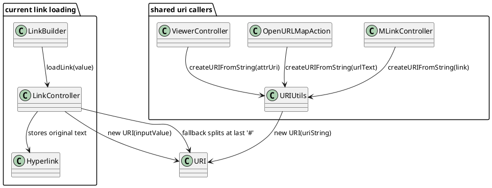
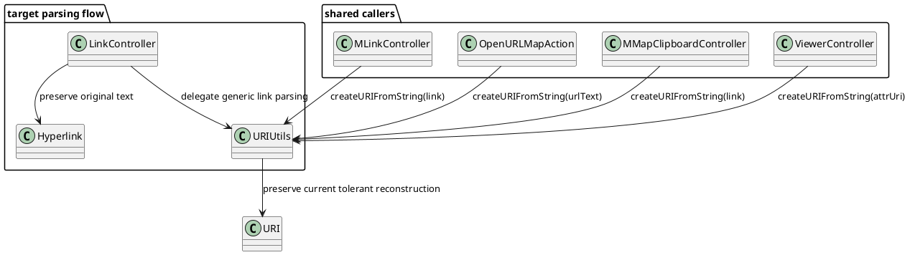

# Task: Normalize browser-compatible link fragments
- **Task Identifier:** 2026-04-04-link-fragments
- **Scope:** Normalize parsing of external URIs whose fragment text
  contains characters that browsers accept after the first `#` but
  Java's one-argument `URI` constructor rejects. Cover the shared core
  parsing entry points used for map loading, manual link entry, pasted
  links, and URL-based open actions. Leave browser launching, map link
  storage format, and non-fragment URI validation rules unchanged.
- **Motivation:** Freeplane currently rejects links such as the
  reported MOOSE documentation URL during map reload. The exception
  blocks navigation to URLs that are accepted by browsers and that
  already appear in existing maps.
- **Scenario:** A node stores an external hyperlink whose fragment text
  starts with a literal `#`, for example a URL ending in
  `##(DETECTION_AREAS).New`. Reopening the map, editing the link, or
  activating the hyperlink should not show a URI error. Freeplane
  should treat everything after the first `#` as fragment text,
  construct a valid `URI` for navigation, and keep the original link
  text unchanged for display and serialization.
- **Constraints:** Preserve single-hash local node references such as
  `#ID_123`. Keep invalid authorities and clearly malformed URLs
  failing with `URISyntaxException`, but preserve already-working
  tolerant parsing such as space normalization for user-entered
  external URLs. Keep specialized SMB and file path handling in
  `LinkController` intact. Avoid rewriting stored hyperlink strings;
  normalization should affect parsed `URI` objects, not the visible
  link text. Preserve already-working user-visible parsing behavior and
  only increase accepted valid inputs. Keep changes in `LinkController`
  minimal because it is an untested area; place new logic in a
  separately testable utility path.
- **Briefing:** The reported failure starts in
  `LinkController.loadLink(...)` while reading map XML, but the same raw
  parsing pattern also exists in `URIUtils.createURIFromString(...)`.
  `LinkController` handles SMB paths, Windows/file references, and
  generic external links before wrapping them in `Hyperlink`.
  `Hyperlink` can preserve the original string separately from the
  normalized `URI`, which allows a fix without forcing map rewrites.
- **Research:**
  - `LinkController.loadLink(...)` uses
    `LinkController.createHyperlink(...)` for non-local links during map
    load. A thrown `URISyntaxException` logs a warning, shows
    `link_error`, and leaves the node without a usable hyperlink.
  - `LinkController.createHyperlink(...)` first tries
    `new URI(inputValue)`. For the reported MOOSE URL, Java treats the
    substring after the first `#` as the fragment and rejects the raw
    second `#` as an illegal fragment character.
  - After the initial failure, `LinkController` falls back to a generic
    `[scheme:]scheme-specific-part[#fragment]` pattern that captures the
    fragment after the last `#`. With the reported URL that produces a
    base part ending in `...html#` and a fragment of
    `(DETECTION_AREAS).New`, which changes semantics because the extra
    `#` is moved into the path and percent-encoded as `%23`.
  - `URIUtils.createURIFromString(...)` repeats the same direct
    `new URI(uriString)` attempt and currently repairs only file or
    relative paths with spaces. It rethrows the reported absolute URL
    and any similar URI whose only problem is raw fragment text that
    starts with `#`.
  - `URIUtils.createURIFromString(...)` is used by
    `MLinkController`, `OpenURLMapAction`,
    `MMapClipboardController`, `ViewerController`, and `FileOpener`, so
    fragment normalization must be shared instead of fixed only in map
    loading.
  - The current `LinkController` generic fallback is more permissive
    than `URIUtils.createURIFromString(...)`: for absolute
    `http`/`https` URLs with unencoded spaces in the path it uses
    `new URI(scheme, schemeSpecificPart, fragment)` and therefore
    percent-encodes the spaces instead of throwing. A direct delegation
    from `LinkController` to the current `URIUtils.createURIFromString`
    contract would therefore be a behavior regression unrelated to the
    reported fragment defect.
  - The intended user-facing contract is tolerant parsing for
    user-entered or map-loaded links that preserves current successful
    behavior, keeps file-specific treatment, and accepts additional
    browser-compatible inputs such as fragments that begin with a
    literal `#`.
  - `LinkController` currently has no focused unit-test coverage in
    `freeplane/src/test/java`, while `URIUtils` already has a dedicated
    test class. That makes `URIUtils` the safer place for new parsing
    behavior and keeps the `LinkController` delta reviewable.
  - `Hyperlink` stores both a `URI` and an optional original string.
    `LinkController` can therefore keep `Hyperlink.toString()` equal to
    the literal user or map value while `Hyperlink.getUri()` returns a
    normalized, browser-launchable `URI`.

- **Design:**

Broaden `URIUtils.createURIFromString(...)` so it becomes the shared,
tolerant parser for user-entered and map-loaded URI text. After the
existing direct `new URI(...)` attempt fails, preserve current
successful behavior and add the fragment-preserving repair path:
split the input at the first `#`, not the last one, treat the entire
remainder as raw fragment text, and rebuild the URI with
multi-argument constructors so Java escapes only the illegal
characters.

Keep current validation boundaries:
- Preserve the current `LinkController` behavior for absolute
  HTTP/HTTPS URLs with unencoded spaces in the path by making
  `URIUtils.createURIFromString(...)` at least as permissive for those
  inputs.
- For relative paths and file URIs, retain the existing path/query
  handling and allow fragment text that begins with `#`.
- For `LinkController`, keep the existing SMB and file-specific
  branches. Replace only the generic parsing fallback with a delegation
  to `URIUtils`, so the untested area performs wiring only and does
  not own fragment normalization rules.
- Keep invalid authorities and clearly malformed inputs failing with
  `URISyntaxException`; the goal is to increase friendliness, not to
  silently reinterpret arbitrary broken input.

When `LinkController` creates a hyperlink from raw text, continue to
use `new Hyperlink(inputValue, normalizedUri)` so the original link
text is preserved for UI display and map serialization while
navigation uses the normalized `URI`.

- **Test specification:**
  - Automated tests:
    - Extend `URIUtilsTest` so it defines the broadened friendly
      parsing contract for absolute, relative, and file URI cases whose
      fragment text begins with `#`.
    - Add a focused `URIUtilsTest` for the reported MOOSE URL and
      assert that the parsed `URI` fragment equals
      `#(DETECTION_AREAS).New` while the path remains
      `/MOOSE_DOCS_DEVELOP/Documentation/Functional.Detection.html`.
    - Add regression coverage that
      `http://example.com/path with spaces/page.html#section1` is
      accepted by `URIUtils.createURIFromString(...)` and preserves the
      current normalization behavior.
    - Add regression coverage that already-valid links such as
      `#ID_123` and `https://example.com/path#section` remain
      unchanged.
    - Keep failure coverage for malformed inputs that should still
      throw, such as invalid authorities.
    - If a lightweight test seam already exists, add one narrow test
      that `LinkController.createHyperlink(...)` preserves the original
      string while using the normalized `URI`. Otherwise keep
      `LinkController` untested and rely on the `URIUtils` contract plus
      manual verification, so the task does not introduce broad testing
      work in an untested area.
  - Manual tests:
    - Reopen a map containing the reported MOOSE URL and verify that no
      `link_error` dialog is shown.
    - Activate the stored hyperlink and verify that the browser opens
      the correct anchored page.
    - Paste the same URL into the manual link editor and verify that it
      saves, reloads, and remains unchanged as visible link text.
