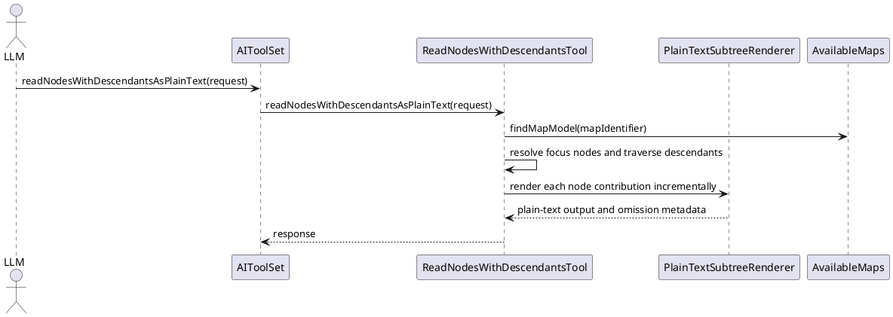

# Task: Add plain-text subtree read tool
- **Task Identifier:** 2026-04-09-plain-text-read
- **Scope:** Add an MCP read tool that exports one or more map subtrees
  as compact plain text for LLM context consumption, using the existing
  subtree read request shape and hierarchy semantics.
- **Motivation:** `readNodesWithDescendants` is effective for
  structured node manipulation, but its JSON envelope consumes too much
  of the character budget for read-only context gathering on large maps.
- **Scenario:** When an MCP client needs broad read-only context from
  one or more nodes, it can request the same subtree selection as
  `readNodesWithDescendants` and receive a plain-text rendering that
  preserves hierarchy by indentation while using the character budget
  for content rather than JSON structure.
- **Constraints:**
  - The new tool must complement `readNodesWithDescendants`, not
    replace it.
  - The request contract should reuse
    `ReadNodesWithDescendantsRequest` unless discussion identifies a
    concrete gap that requires an additional option.
  - Character-budget enforcement must be based on rendered plain text,
    including indentation and line breaks, rather than serialized JSON
    size.
  - The response should optimize for LLM consumption and therefore must
    not require node identifiers or per-node JSON objects in the main
    payload.
  - Requested context sections need an explicit plain-text rendering
    contract before implementation.
- **Briefing:** The existing MCP surface exposes
  `readNodesWithDescendants`, `fetchNodesForEditing`,
  `getSelectedMapAndNodeIdentifiers`, `searchNodes`, and several list
  or edit tools through `AIToolSet`. The codebase also contains a
  standalone `BreadcrumbsTool` with tests, but it is not currently
  wired into `AIToolSet` and therefore is not available over MCP.
- **Research:**
  - `AIToolSet` currently exposes `readNodesWithDescendants` and
    `fetchNodesForEditing`, but no plain-text subtree export.
  - `ReadNodesWithDescendantsTool` resolves maps and focus nodes,
    traverses the subtree, and already derives `NodeDepthItem`
    instances that contain `depth` and `unformattedText`.
  - The current budget logic measures serialized object size with
    `measureSerializedLength(...)`, which means a postprocessor that
    runs only after the full JSON response is built would still lose
    most of the available budget to JSON overhead.
  - `ContextSection` currently includes `BREADCRUMB_PATH`,
    `PARENT_SUMMARY`, `QUALIFIERS`, `HYPERLINK`,
    `OUTGOING_CONNECTORS`, `INCOMING_CONNECTORS`, and
    `CLONE_METADATA`; the existing JSON tool returns these as fields,
    not as rendered text.
  - `BreadcrumbsTool` is implemented and covered by tests, so the gap
    there is exposure through `AIToolSet`, not missing core logic.
- **Design:**
  - Add a new `AIToolSet` tool method named
    `readNodesWithDescendantsAsPlainText` so the same method is exposed
    through LangChain4j and MCP.
  - Reuse `ReadNodesWithDescendantsRequest` for subtree selection,
    depth configuration, and maximum character budget.
  - Implement the plain-text tool in `ReadNodesWithDescendantsTool` so
    it can reuse request validation, map lookup, focus-node
    resolution, parent-node lookup, and subtree traversal.
  - Return a dedicated response object whose primary payload is plain
    text:

```text
ReadNodesWithDescendantsAsPlainTextResponse
  mapIdentifier : String
  plainText : String
  omissions : Omissions?
```

  - Do not budget against the intermediate JSON response. Instead,
    render each focus block incrementally as plain text and count only
    the exact returned characters, including indentation, labels, line
    breaks, and blank lines between focus blocks.
  - Render each requested focus subtree as one block. Separate multiple
    focus blocks with a blank line.
  - Render subtree nodes with two spaces per depth level and a `- `
    bullet prefix on the first line of each node contribution.
  - When `NodeDepthItem.unformattedText` contains multiple lines, place
    the first line after the bullet and indent continuation lines under
    that node with two additional spaces beyond the bullet indent.
  - Render requested context sections with this contract:
    - `BREADCRUMB_PATH`: a leading line
      `breadcrumbPath: <path>` before the focus subtree block.
    - `PARENT_SUMMARY`: a leading `parentSummary:` line followed by the
      parent node rendered as an indented node block using the same
      text and metadata rules as normal nodes, but outside the returned
      subtree hierarchy.
    - `QUALIFIERS`: append ` [q1, q2]` to the first rendered line of the
      affected node.
    - `HYPERLINK`: add an indented continuation line
      `hyperlink: <url>` for the affected node.
    - `OUTGOING_CONNECTORS`: add one indented continuation line per
      connector in the form
      `outgoingConnector: <sourceId> -> <targetId> [sourceLabel=..., middleLabel=..., targetLabel=...]`.
    - `INCOMING_CONNECTORS`: add one indented continuation line per
      connector in the form
      `incomingConnector: <sourceId> -> <targetId> [sourceLabel=..., middleLabel=..., targetLabel=...]`.
    - `CLONE_METADATA`: add an indented continuation line
      `cloneMetadata: cloneTreeRoot=<bool>, cloneTreeNode=<bool>, cloneNodeIdentifiers=<id1, id2>`.
  - Budgeting is node-contribution based: if the next complete node or
    focus-block separator would exceed the remaining character budget,
    omit that node or remaining focus blocks instead of truncating a
    line mid-node.
  - Aggregate omitted focus-node, child, and descendant counts into the
    response `omissions` with `OmissionReason.TEXT_BUDGET`.


- **Test specification:**
  - Automated tests:
    - Verify the tool reuses subtree selection defaults from
      `ReadNodesWithDescendantsRequest`, including root default and
      depth handling.
    - Verify the rendered output preserves node order, blank-line block
      separation, and two-space indentation with `- ` bullets.
    - Verify multiline full-content nodes render continuation lines
      under the node instead of collapsing them into one line.
    - Verify the character budget is enforced against rendered plain
      text, including indentation and blank lines, not serialized JSON
      size.
    - Verify multi-root requests render each requested subtree
      deterministically and aggregate omissions when the budget is hit.
    - Verify `BREADCRUMB_PATH` and `PARENT_SUMMARY` render as leading
      plain-text context lines for each focus block.
    - Verify `QUALIFIERS`, `HYPERLINK`, connector sections, and clone
      metadata render in the agreed plain-text format.
    - Verify large-tree cases that fail under the JSON tool can still
      return substantial content under the same budget with the
      plain-text tool.
    - Verify the new method is exposed through `AIToolSet` so it is
      available to MCP schema generation.
  - Manual tests: N/A
