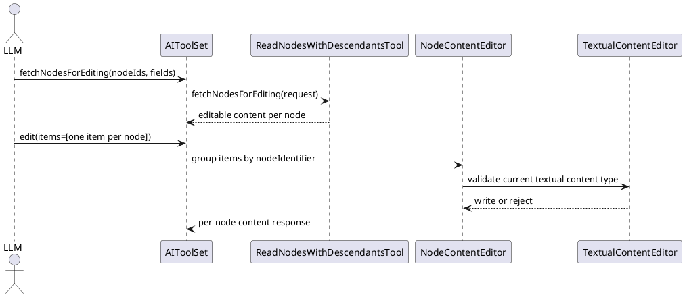
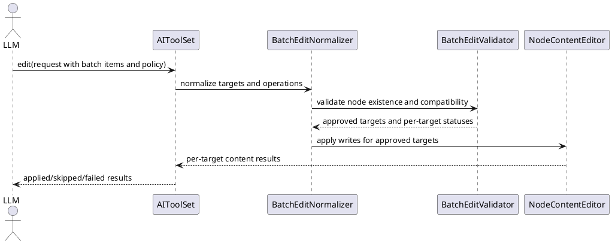

# Task: Add batch node edit support to AI tools
- **Task Identifier:** 2026-04-09-batch-edit
- **Scope:** Extend the existing typed AI edit surface so one edit
  instruction can target multiple nodes with shared semantics and
  explicit compatibility handling, while preserving current textual
  content safeguards.
- **Motivation:** Many user requests apply the same validated change to
  many nodes. The current `edit` tool can touch multiple nodes only by
  duplicating per-node items, which is verbose for clients and covers a
  large subset of the use cases raised for script execution.
- **Scenario:** When a user asks AI to apply the same change across a
  set of nodes, AI sends one typed batch instruction with
  `nodeIdentifiers` instead of duplicating one item per node. For
  `TEXT`, `DETAILS`, and `NOTE`, AI first reads editable metadata for
  the target nodes and groups compatible nodes by content type when
  needed. With default `SKIP_INCOMPATIBLE_FIELDS`, the tool applies
  compatible target-field edits and reports deterministic skip reasons
  for incompatible targets. With `REJECT_ON_ANY_INCOMPATIBLE`, the
  tool performs strict dry-run validation first; if incompatibilities
  exist, it performs no writes and returns only incompatible targets as
  `REJECTED` with reasons.
- **Constraints:**
  - Stay within the typed edit tool family; do not require script
    execution for same-change bulk edits.
  - Preserve `fetchNodesForEditing` as the normal precondition for
    `TEXT`, `DETAILS`, and `NOTE` edits unless equivalent safety
    metadata is embedded in the edit contract.
  - Non-textual edits (`ATTRIBUTES`, `TAGS`, `ICONS`, `STYLE`,
    `HYPERLINK`) should remain usable without
    `fetchNodesForEditing` unless research identifies hidden
    compatibility rules.
  - Edit instructions must use `nodeIdentifiers` only; each instruction
    requires a non-empty array.
  - Compatibility handling must be explicit and deterministic:
    `SKIP_INCOMPATIBLE_FIELDS` is the default, and
    `REJECT_ON_ANY_INCOMPATIBLE` performs strict dry-run validation
    before writes.
  - `SKIP_INCOMPATIBLE_FIELDS` must return deterministic per-target
    `APPLIED`, `SKIPPED`, or `FAILED` statuses with clear field-level
    skip reasons.
  - `REJECT_ON_ANY_INCOMPATIBLE` must validate the whole request before
    any writes, apply zero writes when incompatibility exists, and
    return only incompatible targets as `REJECTED` with reasons.
- **Briefing:** The current AI tool surface already separates
  `fetchNodesForEditing` from `edit`. Textual edits require
  `originalContentType` and revalidate the current content type at write
  time. `EditableContentReader` already exposes editability for formula
  content. Existing `edit` grouping happens only after the caller has
  duplicated one item per node, and invalid node identifiers can still
  produce late failure after valid nodes were already edited.
- **Research:**
  - `AIToolSet.edit(...)` documents `fetchNodesForEditing` as required
    before `TEXT`, `DETAILS`, and `NOTE` edits and treats
    `originalContentType` as required for those elements.
  - `ReadNodesWithDescendantsTool.fetchNodesForEditing(...)` already
    accepts multiple node identifiers in one request and returns
    editable content per node, including textual content type metadata.
  - `EditableContentReader` marks formula-based text and attributes as
    `isEditable=false` and exposes `FORMULA` content type, so batch
    textual editing must account for non-editable targets.
  - `TextualContentEditor` rechecks the current content type before
    writing and rejects drift with a "Content type has changed; read
    editable content again." error, so batch text edits cannot rely on
    stale metadata.
  - Existing `editNodes(...)` groups items by node identifier, edits
    valid nodes, and only then throws if some node identifiers were
    invalid. The current API therefore already has implicit
    partial-success edge cases that should not be expanded by batch
    support.
  - The discussion concluded that typed batch edits cover the common
    same-change bulk-edit cases more safely than a general script tool
    and should be the first extension to pursue.


- **Design:**
  - Extend the current `edit` tool contract instead of adding a
    scripting workaround for bulk edits.
  - Replace per-item `nodeIdentifier` targeting with required
    `nodeIdentifiers` array targeting in each edit instruction.
  - Keep `fetchNodesForEditing` as the discovery step for
    `TEXT`, `DETAILS`, and `NOTE`. A batch textual edit may use one
    shared `originalContentType` only when targeted nodes are
    homogeneous for that instruction. If mixed textual content types are
    sent in one instruction, incompatible targets are handled by the
    selected compatibility policy.
  - Add request-level `compatibilityPolicy` with default
    `SKIP_INCOMPATIBLE_FIELDS`.
  - In `REJECT_ON_ANY_INCOMPATIBLE`, execute dry-run validation for the
    whole request before writes; when any target is incompatible,
    persist zero writes and return only incompatible targets as
    `REJECTED` with reasons.
  - In `SKIP_INCOMPATIBLE_FIELDS`, apply compatible target-field edits
    and return deterministic field-level skip reasons for incompatible
    targets.
  - Return `List<EditResultItem>` for all `edit` responses so single-
    node and multi-node flows share one output contract. In strict
    rejection responses, include only incompatible `REJECTED` targets.
  - Prefer one underlying execution path for single-node and multi-node
    edits so validation and undo-aware behavior stay aligned.



Target request and response structure:

```text
EditRequest
  mapIdentifier : String
  userSummary : String?
  compatibilityPolicy : EditCompatibilityPolicy?
  items : List<EditInstruction>

EditInstruction
  nodeIdentifiers : List<String>
  editedElement : EditedElement
  originalContentType : ContentType?
  value : String?
  index : Integer?
  operation : EditOperation?
  targetKey : String?

EditCompatibilityPolicy
  SKIP_INCOMPATIBLE_FIELDS
  REJECT_ON_ANY_INCOMPATIBLE

EditResultItem
  itemIndex : Integer
  nodeIdentifier : String
  editedElement : EditedElement
  status : EditTargetStatus
  incompatibleFieldReasons : List<String>?
  errorMessage : String?
  content : NodeContentItem?

EditTargetStatus
  APPLIED
  SKIPPED
  REJECTED
  FAILED
```
- **Test specification:**
  - Automated tests:
    - Verify each edit instruction requires a non-empty
      `nodeIdentifiers` array.
    - Verify a non-textual batch edit can target multiple nodes without
      `fetchNodesForEditing`.
    - Verify textual batch edits with missing `originalContentType`
      follow the selected compatibility policy (skip in default mode,
      reject in strict mode) and still revalidate current content type
      at write time.
    - Verify formula-based or otherwise non-editable textual targets are
      reported deterministically.
    - Verify `SKIP_INCOMPATIBLE_FIELDS` is the default policy when the
      request omits `compatibilityPolicy`.
    - Verify `REJECT_ON_ANY_INCOMPATIBLE` validates the whole request
      before writes and performs zero writes on incompatibility.
    - Verify strict incompatibility responses include only incompatible
      targets with `REJECTED` status and field-level reasons.
    - Verify `SKIP_INCOMPATIBLE_FIELDS` returns stable per-target
      `APPLIED`, `SKIPPED`, and `FAILED` statuses with field-level
      reasons.
    - Verify mixed textual content types are surfaced as
      incompatibilities when mixed in one instruction and follow the
      selected compatibility policy.
    - Verify `edit` returns `List<EditResultItem>` for both single-node
      and multi-node instructions.
    - Verify single-node and batch edits share consistent validation and
      undo-aware behavior.
  - Manual tests: N/A
