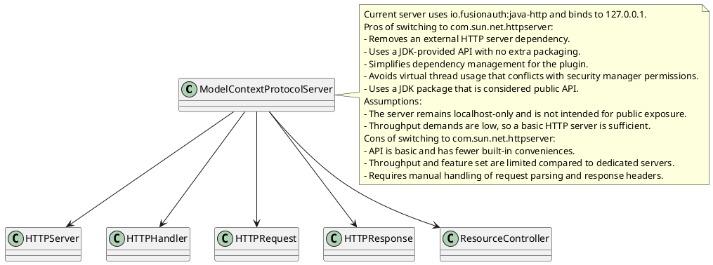
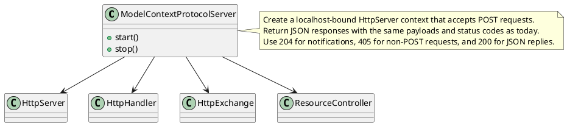

# Task: Model Context Protocol HTTP server swap
- **Scope:** Replace the Model Context Protocol HTTP server implementation to use the JDK `com.sun.net.httpserver` APIs, remove the external HTTP server dependency, and align Eclipse Java Development Tools settings with the module language level.
- **Motivation:** Use the built-in HTTP server to reduce dependency footprint while keeping the same server behavior.
- **Research:**

- **Design:**

- **Test specification:**
  - Add an integration test that starts the MCP server on localhost and posts `initialize`, `tools/list`, and `resources/read` requests, asserting 200 responses with expected JSON keys.
  - Verify that a non-POST request returns status 405.
  - Verify that a notification request returns status 204 without a body.
- **Modified files:**
  - freeplane_plugin_ai/src/main/java/org/freeplane/plugin/ai/mcpserver/ModelContextProtocolServer.java
  - freeplane_plugin_ai/build.gradle
  - freeplane_plugin_ai/src/test/java/org/freeplane/plugin/ai/mcpserver/ModelContextProtocolServerIntegrationTest.java
