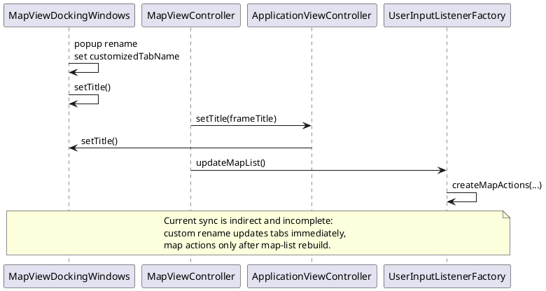
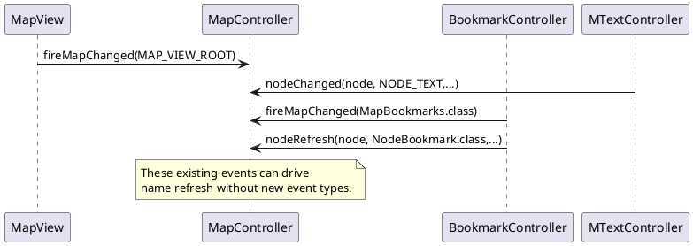
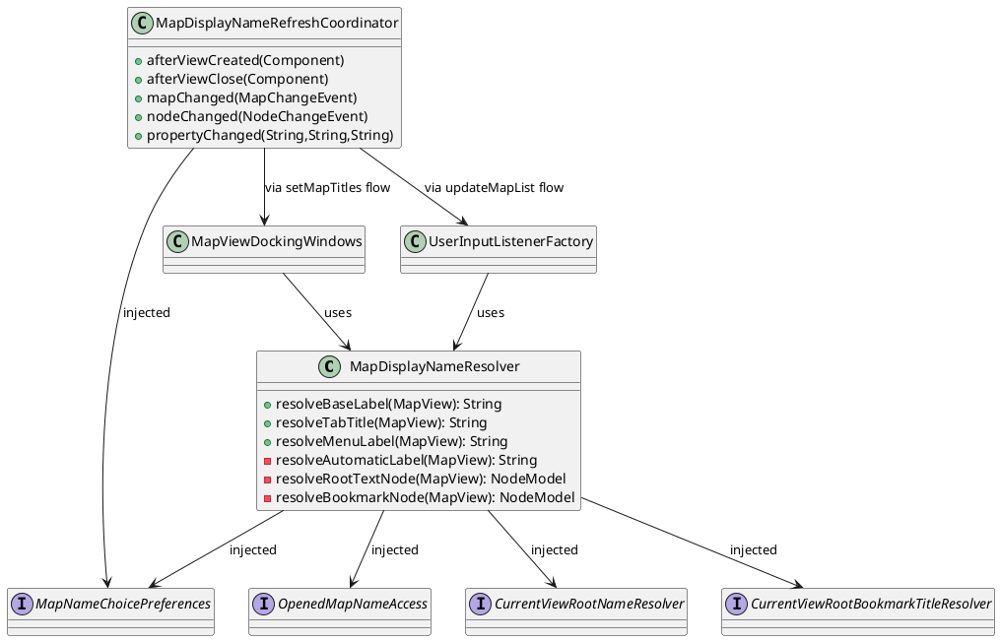
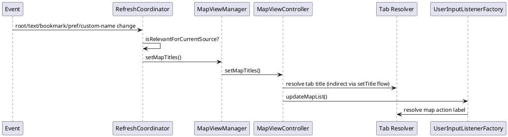

# Task: Synchronize map tab and map menu display names
- **Task Identifier:** 2026-05-02-map-names
- **Scope:** Redesign map display-name resolution so tab titles
  (`MapViewDockingWindows`) and map actions
  (`UserInputListenerFactory.createMapActions(Entry)`) use one shared
  naming logic with synchronized updates, configurable automatic source,
  and configurable maximum display length.
- **Motivation:** The current tab rename customization
  (`customizedTabName`) is not reliably reflected in map action labels,
  and automatic naming is limited to file-based names. Users need one
  consistent naming model across tabs and map actions, including dynamic
  root/bookmark-based names and bounded label length.
- **Scenario:**
  - User keeps default mode and sees map names derived from file names,
    as today.
  - User switches preference to "current view root name" and each map
    title updates dynamically when the view root changes and when the
    effective root text changes.
  - If the current view root text is a formula, the title uses the
    closest ancestor with non-formula content; if no such ancestor
    exists (map root is formula), it falls back to file name.
  - User switches preference to "bookmark title" and each map title uses
    the current view root bookmark title, or nearest ancestor bookmark
    title, with file-name fallback when no bookmark exists.
  - User sets a temporary custom tab name; both tab title and map action
    label reflect it immediately.
  - User clears custom tab name; both tab title and map action label
    return to automatic naming immediately.
  - Display names are truncated to configured max characters.
- **Constraints:**
  - Preserve map switching key stability: action command key remains tied
    to `MapView.getName()` (unique map-view identity), not display label.
  - Keep one active naming path (no parallel old/new display logic).
  - Reuse `TextController.getShortPlainText(NodeModel, int, String)` for
    node-based truncation.
  - Preference integration must follow existing option-panel patterns
    (radiobutton enum + number property).
  - Changes must be incremental/minimal around existing UI wiring
    (`MapViewController#setMapTitles`, `updateMapList`).
- **Briefing:**
  - Tab titles are currently generated in
    `MapViewDockingWindows#createTitle(Component)` from either
    `customizedTabName` client property or `MapView.getName()`, then
    dirty marker (`*`) is appended.
  - Map menu entries are currently built in
    `UserInputListenerFactory#createMapActions(Entry)` from
    `mapView.getName()` plus optional `view.getTitle()` suffix.
  - `MapViewController#setMapTitles()` is the central refresh gateway for
    frame title and map menu rebuild; frame title update triggers tab
    title refresh via `ApplicationViewController#setTitle(...)`.
  - View-root changes emit map change events with property
    `IMapViewManager.MapChangeEventProperty.MAP_VIEW_ROOT`.
  - Bookmark updates emit `MapBookmarks.class` map changes and
    `NodeBookmark.class` node changes.
- **Research:**
  - `MapViewDockingWindows` currently stores custom tab names on
    `MapView` client property `customizedTabName` and updates tabs via
    `setTitle()`. Popup rename path does not trigger
    `UserInputListenerFactory.updateMapList()` directly.
  - `UserInputListenerFactory#createMapActions(Entry)` currently uses:
    - action key from `mapView.getName()` (map-view identity),
    - display label derived from `mapView.getName()` and `view.getTitle()`.
    It does not read `customizedTabName` directly.
  - `MapViewController#setMapTitles()` calls `setFrameTitle()` and
    `updateMapList()`. `setFrameTitle()` calls
    `ViewController#setTitle(...)`, which calls
    `ApplicationViewController#setTitle(...)`, which calls
    `MapViewDockingWindows.setTitle()`. Therefore
    `setMapTitles()` is the existing synchronization choke point.
  - `MapView` emits `MAP_VIEW_ROOT` in `fireRootChanged()`, providing a
    direct trigger for dynamic root-based display names.
  - Node text edits (`MTextController#setNodeObject`) emit
    `NodeModel.NODE_TEXT` node-change events; bookmark changes emit
    `NodeBookmark.class` node-change events and `MapBookmarks.class` map
    changes.
  - `TextController` supports:
    - `isFormula(Object)` for formula detection,
    - `getShortPlainText(NodeModel, int, String)` for transformed,
      truncated plain text.
  - Preferences framework supports enum-backed radio buttons via
    `<radiobuttons ... enum="...">` and numeric controls via
    `<number .../>` in `/xml/preferences.xml`.
  - Existing persisted-layout bootstrap (`loadInitialCustomTabNames`) may
    misclassify old tab titles as custom if title != `mapView.getName()`.
    With new automatic sources this needs normalization against computed
    automatic title.

- **Design:**
  - Introduce a shared resolver/service (single source of truth)
    consumed by both:
    - `MapViewDockingWindows#createTitle(...)`
    - `UserInputListenerFactory#createMapActions(...)`
  - Introduce naming-source enum (radio-button preference):
    - `FILE_NAME`
    - `VIEW_ROOT_TEXT`
    - `VIEW_ROOT_BOOKMARK`
  - Add max-length numeric preference for map display names.
  - Keep `customizedTabName` as explicit override with immediate sync.

  Confirmed decisions from user review:
  - Keep map menu label format with display suffix
    (`mapViewName : resolvedTitle`) instead of replacing labels with
    bare tab title text.
  - Keep current dirty-marker behavior (no new marker policy changes).
  - Apply max-length truncation only to auto-generated names, not custom
    tab names.
  - Continuation mark stays `" ..."`.
  - Bookmark-title handling keeps the same resolver logic as the
    bookmark source (no additional special case for unlikely empty
    titles in this increment).
  - Ancestor search scope is from current view root upward to map root.
  - Refresh strategy may rebuild the whole list on relevant events in
    this increment; finer-grained optimization is explicitly deferred to
    a later subtask if needed.
  - Preferences placement remains under `Appearance`.

  Shared resolution pipeline:
  1. If custom name client property exists and not empty, use it.
  2. Else resolve by configured automatic source.
  3. Apply truncation to configured max length.
  4. Append dirty marker in tab/menu contexts where currently shown.

  Automatic source resolution:
  - `FILE_NAME`: existing map-view name basis (`MapView.getName()`).
  - `VIEW_ROOT_TEXT`:
    - start at current view root node (`mapView.getRoot().getNode()`),
    - if root text is formula, walk ancestors until non-formula node,
    - if none found, fallback to file-name source,
    - use `TextController.getShortPlainText(node, max, continuation)`.
  - `VIEW_ROOT_BOOKMARK`:
    - start at current view root node,
    - resolve nearest ancestor (including root) with bookmark
      descriptor,
    - use descriptor name, fallback to file-name source if none.

  Synchronization and refresh triggers:
  - Add one coordinator listener set (UI mode) that triggers
    `MapViewManager.setMapTitles()` on relevant changes.
  - Triggers:
    - `customizedTabName` property change on any open `MapView`,
    - preference change for source/max-length keys,
    - map change `MAP_VIEW_ROOT`,
    - map change `MapBookmarks.class`,
    - node change `NodeModel.NODE_TEXT` (only when source requires
      root-text dynamics),
    - node change `NodeBookmark.class` (only when bookmark source),
    - structural node events (`onNodeMoved`, `onNodeInserted`,
      `onNodeDeleted`) for ancestor-dependent source modes,
    - map URL/name refresh events already funneled through existing
      `setMapTitles()` paths.

  Persisted layout compatibility:
  - Update `loadInitialCustomTabNames()` comparison logic to treat a
    stored title as custom only if it differs from computed automatic
    title (normalized without dirty marker), not only from
    `mapView.getName()`.

  Testability refinement for automated tests (no behavior change):
  - Convert the new coordinator/resolver internals to constructor-
    injected collaborators while keeping production defaults.
  - For `MapDisplayNameRefreshCoordinator`, inject:
    - `IMapViewManager` target used for refresh (`setMapTitles()`),
    - map-name choice/max-length preference reader,
    - optional registration hooks for property listeners.
  - For `MapDisplayNameResolver`, introduce injected collaborators for
    scenario-language concerns:
    - map-name choice preferences (source + max length),
    - opened map name access (file-based name + custom tab override),
    - current view root name resolution (including formula fallback),
    - current view root bookmark-title resolution.
  - Keep existing static/default entry points for production call sites,
    but delegate to injectable implementation so tests can isolate logic
    without bootstrapping full Freeplane runtime.

- **Test specification:**
  - Automated tests:
    - Resolver injectable implementation returns custom override when
      set, and automatic source when cleared.
    - `FILE_NAME` source preserves current naming behavior for unsaved,
      saved, and duplicate map-view names.
    - `VIEW_ROOT_TEXT` source:
      - uses current view root short text,
      - updates after `MAP_VIEW_ROOT` changes,
      - uses nearest non-formula ancestor,
      - falls back to file name when map root is formula.
    - `VIEW_ROOT_BOOKMARK` source:
      - uses root bookmark title when present,
      - uses nearest ancestor bookmark when root has none,
      - falls back to file name when no bookmark on ancestry.
    - Max-length property truncates labels deterministically.
    - `customizedTabName` property changes (set/reset) trigger map-list
      refresh path and synchronized tab/menu labels.
    - Coordinator event-filter tests with injected mocks verify refresh
      happens only for relevant property/map/node events.
    - Coordinator registers and unregisters map-view custom-title
      property listeners for created/closed views.
    - Layout bootstrap classifies custom titles correctly against
      computed automatic title (prevents false custom restoration).
  - Manual tests:
    - Rename tab via popup menu and verify immediate sync in map menu.
    - Change display source in Preferences and verify live updates for
      open maps.
    - Change view root (jump in/out) and verify title/menu updates.
    - Edit root and ancestor texts (including formula/non-formula
      transitions) and verify fallback behavior.
    - Add/remove/rename bookmarks on root/ancestors and verify updates.
