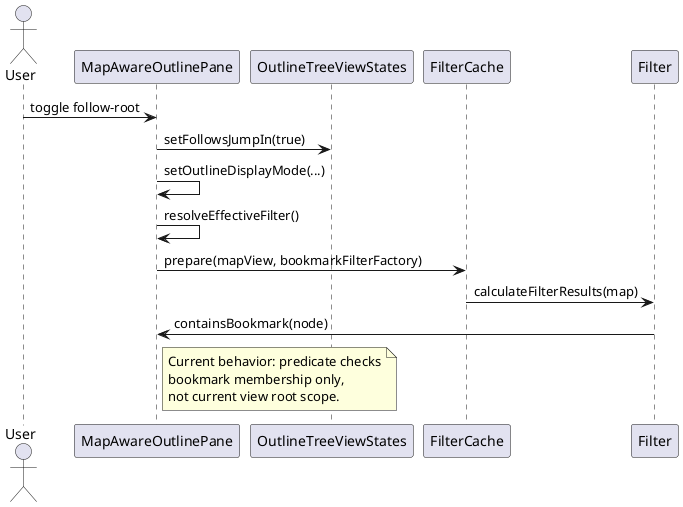
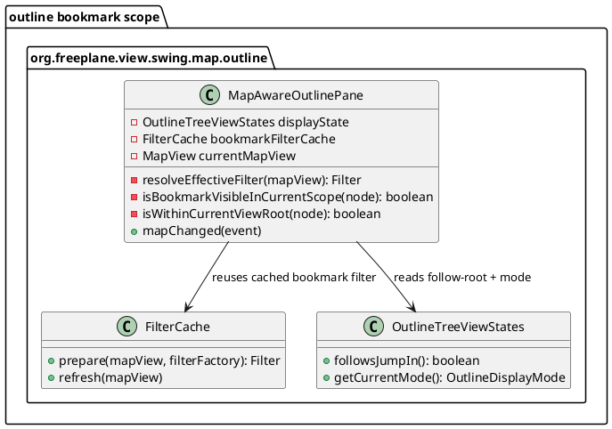
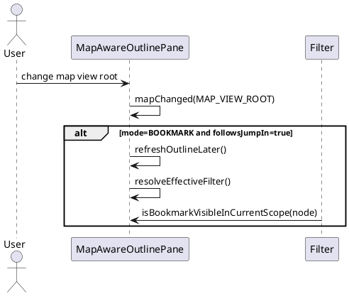
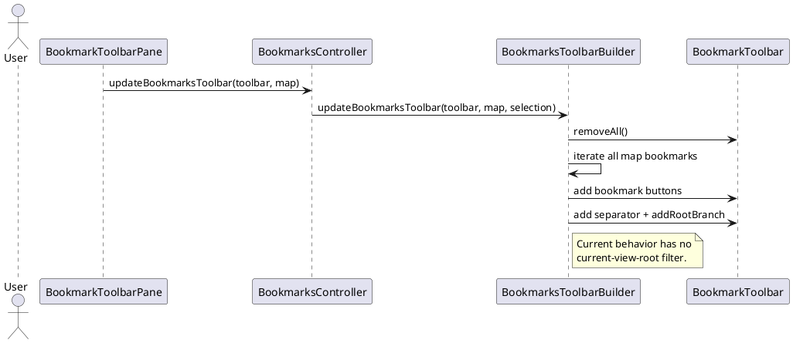
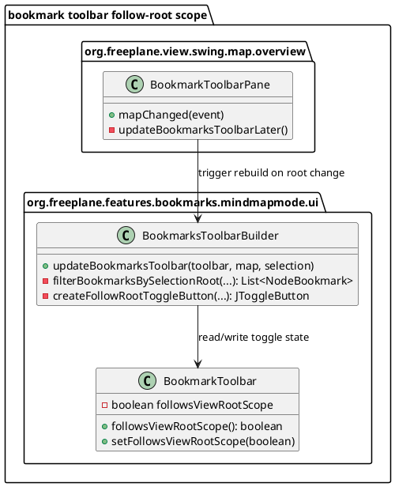
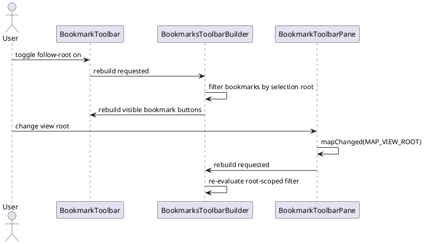

# Task: Follow-root bookmark scoping in outline and bookmark toolbar
- **Task Identifier:** 2026-05-02-bookmark-follow-root
- **Scope:** Define and prepare two coordinated UI behavior changes:
  1) make outline bookmark mode honor the follow-root toggle, and
  2) add an equivalent follow-root toggle to bookmark toolbar filtering.
- **Motivation:** Users working in narrowed map roots need bookmark views
  that match the current view root context instead of showing
  out-of-scope bookmarks.
- **Scenario:** A user switches to bookmark-focused navigation while using
  a non-root map view root. When follow-root is enabled, only bookmarks
  at or below the current view root remain visible in both the outline
  bookmark mode and bookmark toolbar.
- **Constraints:**
  - Minimal-change approach in existing classes and event flows.
  - Preserve current behavior when follow-root is disabled.
  - Keep bookmark ordering, drag/drop behavior, and bookmark actions
    unchanged.
- **Briefing:** Relevant classes are
  `MapAwareOutlinePane`, `FilterCache`, `NodeTreeBuilder`,
  `BookmarkToolbarPane`, `BookmarkToolbar`, and
  `BookmarksToolbarBuilder`.

## Subtask: Scope outline bookmark mode by current map view root
- **Status:** review
- **Scope:** Make `MapAwareOutlinePane` bookmark display mode respect the
  existing `jumpInToggleButton` (`outline.followRoot`) by hiding
  bookmarks outside the current map view root when follow-root is on.
- **Motivation:** Outline bookmark mode currently ignores follow-root and
  always displays bookmarks from the whole map.
- **Scenario:** In `OutlineDisplayMode.BOOKMARK`, user enables
  follow-root. The outline panel immediately shows only bookmarks that
  are equal to or descendants of current `MapView` root node.
- **Constraints:**
  - Reuse existing toggle/state plumbing (`displayState.followsJumpIn`).
  - Avoid changing non-bookmark display modes.
  - Refresh behavior must stay event-driven; no polling.
- **Briefing:** Current bookmark filtering is created in
  `resolveEffectiveFilter()` via `Filter.createFilter(this::containsBookmark, ...)`
  and cached in `FilterCache` per map.
- **Research:**
  - `jumpInToggleButton` already drives `displayState.followsJumpIn()`.
  - In `updateTreeFromMap()`, BOOKMARK mode always uses map root as
    builder root; bookmark visibility is determined solely by bookmark
    filter predicate (`containsBookmark`).
  - Current predicate includes every bookmarked node in the map,
    independent of current view root.
  - `mapChanged()` refreshes on `MAP_VIEW_ROOT` only for
    `OutlineDisplayMode.MAP_VIEW`; BOOKMARK mode is not refreshed on view
    root changes.
  - `FilterCache` recalculates cached filter results per map; predicate
    can safely evaluate current view root dynamically.

- **Design:**
  - In `MapAwareOutlinePane`, replace bookmark predicate usage with a
    scope-aware predicate method:
    `isBookmarkVisibleInCurrentScope(NodeModel node)`.
  - Predicate rules:
    1) node must be bookmarked,
    2) if follow-root is off, accept,
    3) if follow-root is on, accept only when node is current view root
       or descendant of current view root.
  - Keep `FilterCache` usage unchanged; predicate reads live root from
    `currentMapView.getRoot().getNode()`.
  - Extend `mapChanged()` handling for `MAP_VIEW_ROOT` to refresh outline
    also when mode is BOOKMARK and follow-root is enabled.
  - No additional persisted state is introduced.

- **Test specification:**
  - Automated tests (implementation phase):
    - Add coverage for bookmark scope predicate:
      - bookmarked node under current view root is visible,
      - bookmarked node outside current view root is hidden when
        follow-root is enabled,
      - same node is visible when follow-root is disabled.
    - Add coverage for `MAP_VIEW_ROOT` event handling in BOOKMARK mode:
      root change triggers outline refresh when follow-root is enabled.
  - Manual tests (implementation phase):
    - Enable outline BOOKMARK mode and follow-root, then open a subtree as
      view root; verify out-of-scope bookmarks disappear.
    - Disable follow-root; verify full-map bookmark list reappears.

## Subtask: Add follow-root bookmark scoping toggle to bookmark toolbar
- **Status:** review
- **Scope:** Add a toolbar toggle button to `BookmarkToolbar` that applies
  the same root-scope rule to visible bookmark buttons.
- **Motivation:** Bookmark toolbar currently always renders all bookmarks
  of the map, regardless of current view root.
- **Scenario:** User enables follow-root toggle in bookmark toolbar.
  Toolbar shows only bookmarks under current selection root (current view
  root context). Root changes update the button set accordingly.
- **Constraints:**
  - Keep existing toolbar interactions unchanged (open, rename, drag/drop,
    move/reorder, paste).
  - Preserve current button order for bookmarks that remain visible.
  - Do not introduce map serialization changes.
- **Briefing:** Bookmark buttons are rebuilt in
  `BookmarksToolbarBuilder.updateBookmarksToolbar()` from
  `MapBookmarks.getBookmarks()`. `BookmarkToolbarPane.mapChanged()`
  currently repaints (not rebuilds) on `MAP_VIEW_ROOT`.
- **Research:**
  - Rendering pipeline:
    `BookmarkToolbarPane` -> `BookmarksController.updateBookmarksToolbar()`
    -> `BookmarksToolbarBuilder.updateBookmarksToolbar()`.
  - Builder currently calls `toolbar.removeAll()`, then adds all
    `BookmarkButton`s, then two non-bookmark components
    (`separator`, `addRootBranch` button).
  - `BookmarkToolbar.paintEndDropLine()` assumes trailing non-bookmark
    controls and uses `getComponentCount() - 2` anchor.
  - `BookmarkIndexCalculator` computes bookmark indices using
    `instanceof BookmarkButton`, so index logic remains stable if extra
    non-bookmark controls are appended after bookmark buttons.
  - `MAP_VIEW_ROOT` currently triggers repaint only; scoped filtering
    requires full rebuild to add/remove buttons.

- **Design:**
  - Add follow-root state to `BookmarkToolbar`:
    `private boolean followsViewRootScope` with getter/setter.
  - In `BookmarksToolbarBuilder.updateBookmarksToolbar(...)`, filter
    bookmark list when `toolbar.followsViewRootScope()` is true:
    - obtain `selectionRoot` from `IMapSelection`,
    - keep bookmark if node == selectionRoot or node.isDescendantOf(selectionRoot),
    - if `selectionRoot` map differs from toolbar map, skip scoping
      filter (safety against transient view-switch races).
  - Add a toggle control in builder using existing icon/tooltip
    (`/images/syncJumpIn.svg?useAccentColor=true`, `outline.followRoot`).
  - Place toggle after bookmark buttons and before existing trailing
    controls so bookmark DnD index semantics stay intact.
  - Toggle action updates toolbar state and triggers
    `bookmarksController.updateBookmarksToolbar(toolbar, map)`.
  - In `BookmarkToolbarPane.mapChanged()` for `MAP_VIEW_ROOT`, call
    `updateBookmarksToolbarLater()` so root changes rebuild scoped list.

- **Test specification:**
  - Automated tests (implementation phase):
    - Add builder-level tests for root-scoped filtering:
      - includes selection root bookmark,
      - includes descendants,
      - excludes non-descendants,
      - disabled toggle returns full list.
    - Add pane-level event test:
      `MAP_VIEW_ROOT` triggers toolbar rebuild path (not repaint-only).
    - Add regression test for toolbar control ordering assumptions used by
      drop-end indicator calculations.
  - Manual tests (implementation phase):
    - Enable toolbar follow-root toggle and switch view root via bookmark
      open-as-root; verify toolbar list narrows/expands correctly.
    - Drag/drop reorder and paste bookmarks with toggle on/off; verify no
      index corruption and expected visual drop indicators.
  - Verification notes:
    - Ran `:freeplane:test --tests org.freeplane.features.bookmarks.mindmapmode.BookmarkScopeTest` successfully.
    - Running Mockito-based bookmark suites in this environment fails due
      ByteBuddy inline mock-maker self-attach restrictions on this JVM
      setup (environment/tooling issue, not caused by this change).

