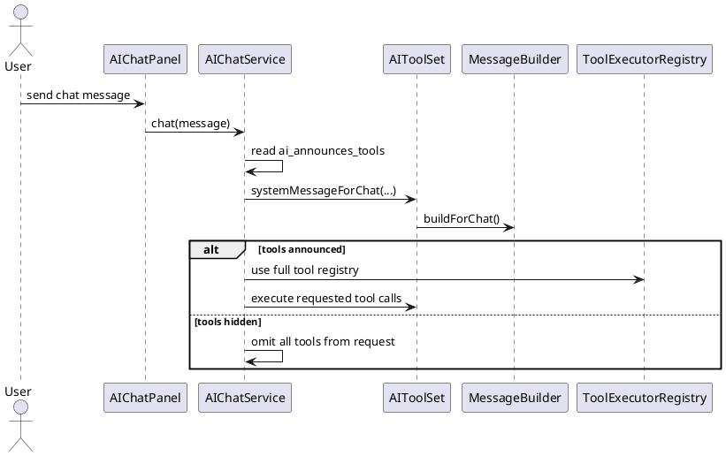
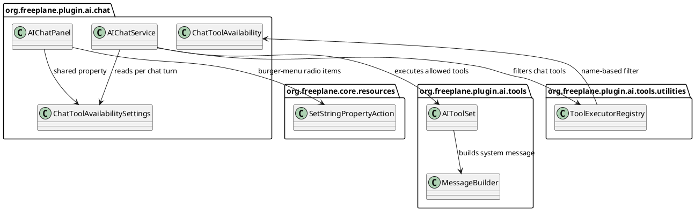
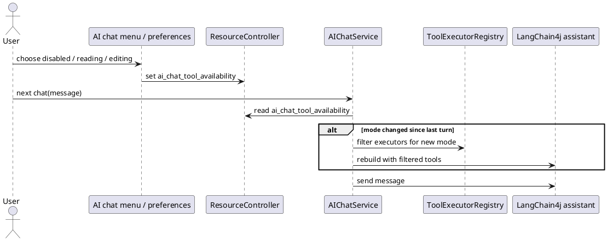
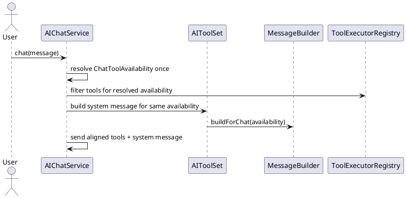
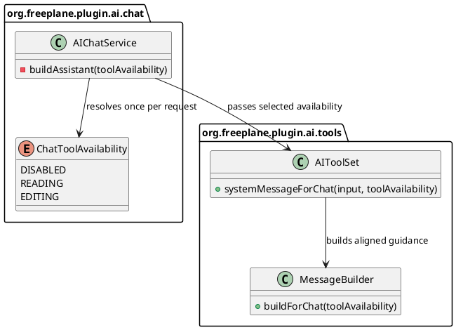

# Task: Configure AI chat tool availability levels
- **Task Identifier:** 2026-05-10-tool-availability
- **Scope:** Add one AI chat setting that controls which chat tools
  are exposed to the LLM, with the user-facing levels `disabled`,
  `reading`, and `editing`. Expose the setting both in the AI chat
  panel burger menu and in AI chat preferences, and apply changes to
  the next chat turn without reopening the panel.
- **Motivation:** The current chat either exposes all tools or none.
  Users need a smaller chat tool surface for read-only work, while
  still keeping full editing workflows available when they explicitly
  choose them.
- **Scenario:** A user opens the AI chat burger menu or the AI plugin
  preferences and selects one of three levels for tools in chat.
  `disabled` removes all tool definitions from chat requests.
  `reading` exposes read-oriented tools for map inspection and
  search, plus `selectSingleNode` for node selection without modifying
  the map. `editing` exposes the full
  editing-capable chat toolset, including read helpers that are
  required to prepare edits. The next
  message sent in the same chat uses the new level immediately.
  MCP-based tool exposure remains unchanged.
- **Constraints:**
  - The new setting is chat-only. It must not reduce or alter MCP tool
    exposure.
  - Replace the current hidden all-or-nothing gate with one canonical
    chat property. Do not keep parallel boolean and enum control paths.
  - Missing, blank, or invalid stored values must fall back to
    `editing` so existing behavior stays available by default.
  - `reading` mode must not expose map-mutating tools.
  - `selectSingleNode` is allowed in `reading` as the one UI-affecting
    exception because it changes only selection/visibility and does not
    modify map content.
  - `editing` mode must include the read helpers that are required
    before edit operations, including `fetchNodesForEditing`,
    `listMapStyles`, `listAvailableIcons`, and `getTagCategories`.
  - Keep existing tool method names and request/response contracts
    unchanged. This task changes only chat exposure and related UI.
  - The burger menu and preferences must write the same property and
    stay in sync through the existing Freeplane property mechanism.
- **Briefing:** The chat panel is assembled in
  `freeplane_plugin_ai/.../chat/AIChatPanel.java`. Chat requests go
  through `AIChatService`, which currently either includes the full
  `ToolExecutorRegistry` or omits tools completely. Tool methods live in
  `AIToolSet`, and `MessageBuilder` adds tool-usage guidance to the
  system message. AI plugin preferences already use
  `preferences.xml`, `defaults.properties`, and `Resources_en.properties`.
  Freeplane already provides `SetStringPropertyAction` and
  `JAutoRadioButtonMenuItem` for property-backed radio choices.
- **Research:**
  - `AIChatService` currently reads the hidden `ai_announces_tools`
    property and rebuilds its LangChain4j assistant when the boolean
    changes, but it supports only full tool exposure or none.
  - `MessageBuilder.buildForChat()` currently includes map-selection and
    tool-wrapper guidance only when chat tools are announced.
  - `ToolExecutorFactory.createRegistry(...)` scans all `@Tool`
    methods declared on `AIToolSet` and returns one registry with no
    chat-specific filtering support.
  - `AIChatPanel` already builds a burger-menu popup with Preferences,
    profile management, Markdown copy, and AI-edits items, but it has no
    chat tool availability controls.
  - AI plugin preferences already expose radio-button chat settings in
    `preferences.xml` and persist defaults from
    `defaults.properties`.
  - `Activator.addPluginDefaults()` secures every AI default property
    except the existing AI-edits visibility toggle, so a new defaulted
    chat setting will automatically follow the normal property handling.
  - `SetStringPropertyAction` derives its label key from
    `OptionPanel.<property>.<value>`, which matches the existing
    preference choice translation pattern and can be reused for burger-
    menu radio items.
  - `AIToolSet` currently exposes these chat-relevant tool methods:
    `readNodesWithDescendants`, `readNodesWithDescendantsAsPlainText`,
    `fetchNodesForEditing`, `getSelectedMapAndNodeIdentifiers`,
    `selectSingleNode`, `searchNodes`, `getTagCategories`,
    `editTagCategories`, `deleteNodes`, `listAvailableIcons`,
    `listMapStyles`, `editConnectors`, `edit`, `createNodes`,
    `moveNodes`, `createSummary`, and `moveNodesIntoSummary`.
  - `selectSingleNode` changes current selection and visibility in the
    UI, but it does not mutate map content, so it can be classified as
    a reading-side node-selection tool if that exception is explicit.
  - Tool names are exposed from Java method names and tool
    descriptions come from English `@Tool(...)` annotation text. They
    are not currently localized for user-facing Freeplane UI.


- **Design:**
  - Add a new chat preference property
    `ai_chat_tool_availability` with preference values:

```text
ChatToolAvailability
  DISABLED("disabled")
  READING("reading")
  EDITING("editing")
```

  - Add a small settings/parser unit in `org.freeplane.plugin.ai.chat`
    that:
    - reads `ai_chat_tool_availability` from `ResourceController`,
    - maps blank or invalid values to `EDITING`, and
    - exposes whether tools are available at all and whether a given
      tool name is allowed.
  - Replace the boolean `ai_announces_tools` chat gate in
    `AIChatService` and `MessageBuilder` with the new enum-based
    setting. After this task, chat availability must be controlled only
    by `ai_chat_tool_availability`.
  - Keep `AIToolSet` unchanged as the complete tool implementation.
    Filter only the chat-side `ToolExecutorRegistry` so MCP keeps the
    full tool surface.
  - Add a filtering helper on `ToolExecutorRegistry` or an adjacent
    chat-side helper that preserves the existing executor/specification
    mapping while retaining only allowed tool names.
  - Use this chat classification table:

| Minimum chat level | Tool methods |
| --- | --- |
| `READING` | `readNodesWithDescendants`, `readNodesWithDescendantsAsPlainText`, `getSelectedMapAndNodeIdentifiers`, `searchNodes`, `selectSingleNode` |
| `EDITING` | `fetchNodesForEditing`, `getTagCategories`, `editTagCategories`, `deleteNodes`, `listAvailableIcons`, `listMapStyles`, `editConnectors`, `edit`, `createNodes`, `moveNodes`, `createSummary`, `moveNodesIntoSummary` |

  - Filtering semantics:
    - `DISABLED`: omit the entire tools map from the LangChain4j chat
      builder.
    - `READING`: include only tools whose minimum chat level is
      `READING`.
    - `EDITING`: include both `READING` and `EDITING` tools.
  - Assistant rebuild behavior:
    - `AIChatService` must read the current tool-availability setting on
      each `chat(...)` call.
    - When the setting changes between turns, rebuild the LangChain4j
      assistant before sending the next request, reusing the same chat
      memory and listeners.
  - System-message behavior:
    - `DISABLED`: include only non-tool guidance
      (profile-control + Markdown guidance).
    - `READING` and `EDITING`: keep the current tool-wrapper and map-
      selection guidance.
  - Preferences integration:
    - Add `ai_chat_tool_availability = editing` to
      `freeplane_plugin_ai/.../defaults.properties`.
    - Add a `<radiobuttons name="ai_chat_tool_availability">` block to
      `freeplane_plugin_ai/.../preferences.xml` near the other AI chat
      settings, with `editing`, `reading`, and `disabled` choices.
    - Add English translation keys in
      `freeplane/src/viewer/resources/translations/Resources_en.properties`:
      `OptionPanel.ai_chat_tool_availability`,
      `OptionPanel.ai_chat_tool_availability.tooltip`,
      `OptionPanel.ai_chat_tool_availability.disabled`,
      `OptionPanel.ai_chat_tool_availability.disabled.tooltip`,
      `OptionPanel.ai_chat_tool_availability.reading`,
      `OptionPanel.ai_chat_tool_availability.reading.tooltip`,
      `OptionPanel.ai_chat_tool_availability.editing`, and
      `OptionPanel.ai_chat_tool_availability.editing.tooltip`.
    - Use translated group labels and help text instead of raw tool
      names or `@Tool` descriptions in the UI. The `reading` text
      should explain read/search tools plus node selection. The
      `editing` text must explicitly state that it includes reading.
  - Burger-menu integration:
    - Add a submenu or grouped radio section to `AIChatPanel`'s burger
      menu labeled from `OptionPanel.ai_chat_tool_availability`, placed
      directly below the Preferences entry.
    - Build the three items with `SetStringPropertyAction` and
      `JAutoRadioButtonMenuItem` so selection state follows the shared
      property automatically. Order them as `editing`, `reading`, then
      `disabled`.
    - Do not list raw internal tool names in the burger menu. Use the
      translated labels and per-choice tooltips to explain the groups,
      including that `editing` includes `reading`.
    - Keep the existing Preferences entry; the new radio choices are a
      live shortcut, not a replacement for the preferences dialog.




- **Test specification:**
  - Automated tests:
    - Add a `ChatToolAvailability` parsing test that verifies missing,
      blank, and invalid values fall back to `EDITING`.
    - Add a `ChatToolAvailability` classification test that verifies
      `READING` exposes only the five reading/navigation tools above
      and that `EDITING` additionally exposes every
      editing/preparation tool in the design table.
    - Add a `ToolExecutorRegistry` filtering test that keeps
      specification/executor pairs aligned and preserves insertion order
      for an allowed subset.
    - Extend `MessageBuilderTest` to verify `DISABLED` omits tool
      guidance while `READING`/`EDITING` keep it.
    - Add or extend AI chat service tests so a tool-availability change
      between turns rebuilds the assistant configuration for the next
      request instead of requiring panel recreation.
  - Manual tests:
    - Open the AI chat burger menu and verify the three tool-level radio
      choices are visible, use translated group wording instead of raw
      tool names, and stay in sync with the preferences dialog.
    - Set the level to `disabled`, send a prompt that would normally use
      tools, and verify the map stays unchanged and no tool calls are
      available to the model.
    - Set the level to `reading`, ask for map inspection/search and
      node selection, and verify reading tools remain available while
      edit actions are not.
    - Set the level to `editing`, verify the menu/preference wording
      makes clear that reading is included, then request a change that
      requires `fetchNodesForEditing` and a follow-up edit, and verify
      the full workflow is available.
    - Change the setting while the panel stays open and verify the next
      turn uses the new level without reopening the panel.
    - Verify MCP clients still see the full tool surface after the chat
      setting changes.

## Subtask: Align system message with chat tool availability
- **Status:** review
- **Scope:** Align the built-in AI chat system message with
  `ai_chat_tool_availability`, adding dedicated built-in guidance for
  `disabled` and `reading` while keeping the current tool-enabled
  guidance for `editing`.
- **Motivation:** The current implementation can misalign tools and
  system guidance because tool availability is chosen in
  `AIChatService`, while `MessageBuilder` reads the property again on
  its own. That can let the model hallucinate unavailable tools. In
  `disabled` mode the chat should behave like a general-purpose chat and
  must not mention Freeplane in built-in guidance.
- **Scenario:**
  - In `disabled`, the user opens a general-purpose chat. The built-in
    system message does not mention Freeplane, maps, nodes, or tool-call
    wrappers, and explicitly says no application tools are available.
  - In `reading`, the built-in system message says Freeplane tools are
    limited to reading, searching, and node selection, and that map
    changes are not allowed.
  - In `editing`, the built-in system message keeps the current
    tool-enabled Freeplane guidance, but it is derived from the same
    resolved availability value as the filtered tool set.
- **Constraints:**
  - The system message used for a chat request must be derived from the
    same `ChatToolAvailability` value that filtered the tools for that
    request; do not re-read the property independently inside the same
    request path.
  - `disabled` built-in guidance must not mention Freeplane, maps,
    nodes, or tool-call wrapper instructions.
  - `disabled` built-in guidance should explicitly state that no
    application tools are available and the assistant should answer as a
    general-purpose chat assistant.
  - `reading` guidance should describe capability groups, not raw tool
    names.
  - `reading` must explicitly forbid map changes.
  - `editing` may keep the current tool-enabled built-in guidance; this
    subtask must not require a new editing-specific capability text.
  - Preserve the existing user-configured `ai_system_message` prefix as
    provided; vary only the built-in appended guidance.
  - Keep profile-control and Markdown-response guidance unless a case is
    intentionally defined to omit them.
- **Briefing:** `AIChatService.buildAssistant(...)` already chooses the
  filtered tool registry per chat availability. `AIToolSet` owns
  `MessageBuilder`, and `AIChatService` currently uses
  `toolSet::systemMessageForChat`, which lets `MessageBuilder` read the
  property dynamically instead of receiving the already selected
  availability.
- **Research:**
  - `MessageBuilder.buildForChat()` currently branches only on
    `includesTools()`, so `reading` and `editing` share the same built-
    in guidance.
  - That existing tool-enabled guidance is acceptable for `editing`.
    The missing pieces are a reading-specific no-map-change variant and
    a generic disabled variant with no Freeplane mention.
  - `disabled` currently omits map-selection and tool-wrapper guidance,
    but it does not explicitly tell the model that no application tools
    are available or that the chat should behave as general-purpose.
  - Because `AIChatService` filters tools before building the assistant
    while `MessageBuilder` re-reads the property independently, tool
    exposure and system guidance can drift if the property changes at an
    unlucky point.
  - The existing guidance blocks are appended after the optional
    user-configured `ai_system_message`, so availability-specific text
    can be introduced without changing user-configured prefixes.


- **Design:**
  - Introduce availability-aware built-in guidance in
    `MessageBuilder`, with a dedicated `DISABLED` branch, a dedicated
    `READING` branch, and the existing tool-enabled guidance retained
    for `EDITING`.
  - Bind the system-message provider in `AIChatService.buildAssistant(...)`
    to the same availability instance used for tool filtering, for
    example via an `AIToolSet` overload or equivalent helper that
    accepts `ChatToolAvailability`.
  - Built-in guidance content:
    - `DISABLED`:
      - keep profile-control guidance,
      - keep Markdown-response guidance,
      - add a short generic no-tools statement such as:
        `No application tools are available in this chat. Do not call
        or invent tools. Answer as a general-purpose assistant.`
      - omit Freeplane-specific guidance entirely.
    - `READING`:
      - add a short Freeplane capability statement such as:
        `Available Freeplane tools are limited to reading, searching,
        and node selection. Do not change the map.`
      - keep map-selection guidance,
      - keep profile-control guidance,
      - keep Markdown-response guidance,
      - keep tool-call wrapper guidance.
    - `EDITING`:
      - keep the current tool-enabled built-in guidance unchanged.
  - Keep the added capability statements short and category-based so
    the system message stays clear without listing internal tool names.


- **Test specification:**
  - Automated tests:
    - Extend `MessageBuilderTest` to verify `DISABLED` includes the new
      generic no-tools statement and does not mention Freeplane or map-
      selection guidance.
    - Extend `MessageBuilderTest` to verify `READING` includes reading,
      searching, and node-selection guidance plus an explicit no-map-
      changes statement.
    - Extend `MessageBuilderTest` to verify `EDITING` keeps the current
      tool-enabled guidance unchanged.
    - Add or extend `AIChatService` tests so the assistant build path
      uses the same `ChatToolAvailability` for both filtered tools and
      the selected system-message variant.
  - Manual tests:
    - Set the chat to `disabled` and inspect/debug the request path or
      behavior to confirm the built-in system guidance is generic and
      Freeplane is not mentioned.
    - Set the chat to `reading` and confirm the assistant avoids map
      changes and frames its capabilities as read/search/node
      selection only.
    - Set the chat to `editing` and confirm the assistant still uses
      the current tool-enabled built-in guidance while staying aligned
      with the filtered tool set.
