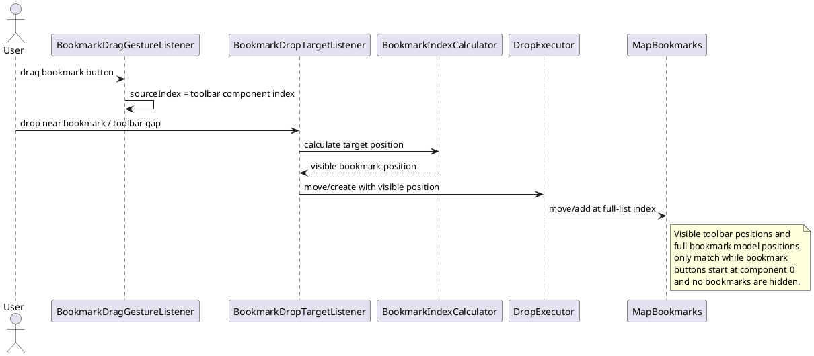
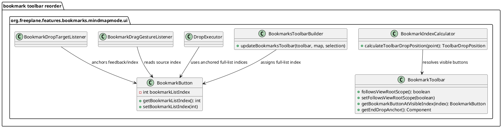
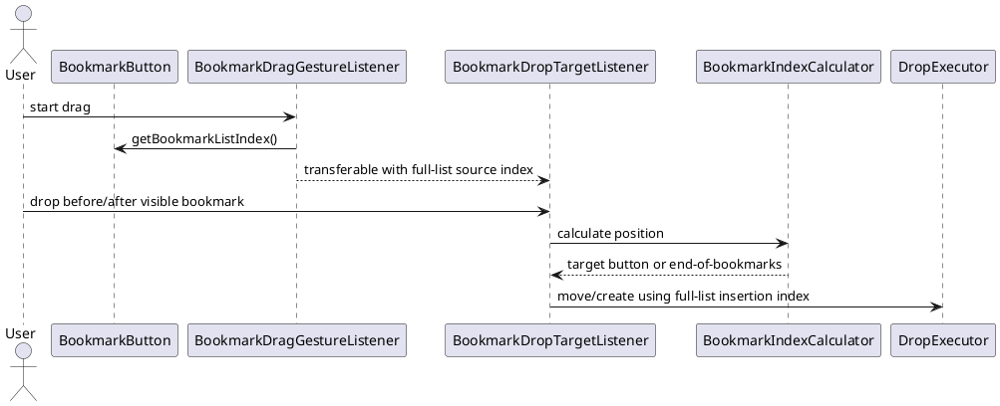

# Task: Reorder bookmark toolbar controls and stabilize drag indexing
- **Task Identifier:** 2026-05-10-bookmark-toolbar-order
- **Scope:** Reorder `BookmarkToolbar` controls so the toolbar renders
  the follow-root toggle first, then the bookmark section, and keeps
  bookmark drag-and-drop behavior correct under the new layout and under
  follow-root filtering.
- **Motivation:** The follow-root toggle should be immediately
  discoverable, but the current drag-and-drop implementation still
  relies on bookmark buttons starting at component index `0`.
- **Scenario:** A user opens the bookmark toolbar. The first button is
  the follow-root toggle, followed by a separator, the visible bookmark
  buttons, another separator, and finally the add-root-branch button.
  Reordering bookmarks and dropping nodes to create bookmarks still acts
  on the intended bookmarks, even when some bookmarks are hidden by the
  follow-root filter.
- **Constraints:**
  - Keep the change minimal and local to existing bookmark toolbar UI
    classes.
  - Do not change bookmark persistence or bookmark naming behavior.
  - Preserve bookmark button order for the visible subset.
  - Drag-and-drop must use bookmark model order, not container component
    order.
  - Avoid broad drag-and-drop refactors outside bookmark toolbar code.
- **Briefing:** Relevant classes are
  `BookmarkToolbar`, `BookmarksToolbarBuilder`,
  `BookmarkDragGestureListener`, `BookmarkIndexCalculator`,
  `BookmarkDropTargetListener`, `DropExecutor`, and `MapBookmarks`.
  Task `028-follow-root-bookmark-scoping-in-outline-and-toolbar` added
  the follow-root toolbar toggle after bookmark buttons specifically to
  avoid disturbing existing drag index assumptions.
- **Research:**
  - `BookmarksToolbarBuilder.updateBookmarksToolbar()` currently builds
    the toolbar as `[bookmarks][separator][follow-root][add-root]`.
  - The current implementation still assumes bookmark buttons begin at
    toolbar component index `0` for several paths:
    - `BookmarkDragGestureListener.dragGestureRecognized()` stores
      `toolbar.getComponentIndex(button)` as the bookmark drag source
      index.
    - `BookmarkDropTargetListener.determineNodeDropZone()` uses
      `toolbar.getComponentIndex(button)` for node insertion indices.
    - `BookmarkToolbar.getComponentToFocus()` and
      `BookmarkDropTargetListener.showToolbarDropFeedback()` treat
      bookmark indices as direct toolbar component indices.
    - `BookmarkToolbar.paintEndDropLine()` stops at the first
      non-bookmark component, which would become the leading
      follow-root toggle after the requested reorder.
  - `DropExecutor.moveBookmark()` and
    `MapBookmarks.addAtPosition()/move()` interpret indices against the
    full bookmark list of valid nodes, not against the toolbar's
    filtered visible subset.
  - Because of that mismatch, moving the follow-root toggle before the
    bookmark buttons would break drag-and-drop immediately even when the
    follow-root filter is off.
  - The same mismatch is already latent when the follow-root filter is
    on and hidden bookmarks exist before visible ones: toolbar-visible
    positions no longer match full bookmark model indices.

- **Design:**
  - Rebuild the toolbar in this order:
    `[follow-root toggle][separator][bookmarks][separator]`
    `[add-root-branch button]`.
  - When no bookmark buttons are visible, collapse the empty bookmark
    section to a single separator between follow-root and add-root to
    avoid adjacent separators.
  - Decouple drag-and-drop bookkeeping from absolute toolbar component
    positions:
    - each `BookmarkButton` carries its current full bookmark-list
      index,
    - toolbar drop positions carry the target bookmark button instead of
      a raw container index,
    - insertion calculations derive their final full-list index from the
      anchored bookmark button or from the end of the visible bookmark
      section.
  - Update bookmark drag start to store the dragged bookmark's full
    bookmark-list index instead of its toolbar component index.
  - Update button-edge node insertion so dropping before or after a
    bookmark uses that bookmark's full bookmark-list index.
  - Update toolbar-wide drop feedback and focus targeting to resolve the
    actual bookmark button component instead of assuming bookmark index
    equals toolbar component index.
  - Update the end-drop indicator to paint at the boundary after the
    last visible bookmark and before the trailing add-root section.
  - For toolbar drops when no bookmark buttons are visible, append the
    created bookmark to the end of the full bookmark list because no
    visible bookmark anchor exists.

- **Test specification:**
  - Automated tests:
    - Add toolbar builder coverage for component order with visible
      bookmarks:
      `follow-root`, separator, visible bookmark buttons, separator,
      `add-root-branch`.
    - Add toolbar builder coverage for the empty visible-bookmark case:
      `follow-root`, separator, `add-root-branch`.
    - Add regression tests for bookmark index mapping when a leading
      non-bookmark control exists:
      dragging or inserting relative to a visible bookmark must target
      that bookmark's full model position, not its toolbar component
      index.
    - Add regression tests for filtered scope with hidden bookmarks
      before visible ones:
      - reordering a visible bookmark moves the correct model bookmark,
      - dropping a node before or after a visible bookmark inserts at
        the anchored full-list position,
      - toolbar end insertion targets the position after the last
        visible bookmark.
    - Add helper-level coverage for the end-drop anchor used by toolbar
      drop feedback.
  - Manual tests:
    - Verify the visual order of controls with bookmarks present and
      with no visible bookmarks.
    - With follow-root off, drag bookmarks before and after each other;
      verify model order changes correctly.
    - With follow-root on and some bookmarks hidden outside the current
      view root, drag visible bookmarks and drop nodes before the first
      visible bookmark and after the last visible bookmark.
    - With follow-root on and no visible bookmarks, drop a node on the
      toolbar and verify a new bookmark is created and shown.
  - Verification notes:
    - Ran `gradle -Djava.net.preferIPv6Addresses=true
      -Djava.awt.headless=true :freeplane:test --tests
      org.freeplane.features.bookmarks.mindmapmode.BookmarkScopeTest
      --tests
      org.freeplane.features.bookmarks.mindmapmode.BookmarksBuilderTest
      --tests
      org.freeplane.features.bookmarks.mindmapmode.MapBookmarksTest
      --tests
      org.freeplane.features.bookmarks.mindmapmode.ui.BookmarkToolbarLayoutAndIndexingTest`.
