# Task: Add AI prompts
- **Task Identifier:** 2026-05-10-ai-prompts
- **Scope:**
  Add reusable AI prompts that are managed in a dialog like assistant
  profiles, exposed as dynamic actions in the main menu and node popup,
  support assignable hot keys, and run as independent AI chat
  conversations with selected map/node identifiers prepended to the
  prompt, always without an assistant profile and always with editing
  tools enabled. Each prompt also controls whether its conversation is
  shown in the AI chat UI or runs hidden.
- **Motivation:**
  Reusable prompts should be runnable directly from Freeplane menus
  without opening the AI chat panel first, while still using the AI chat
  infrastructure and preserving node-aware context for editing flows.
- **Scenario:**
  A user defines a prompt named "Rewrite node". Later they select a
  node, trigger Tools -> AI -> Rewrite node or the same action from the
  node popup, and Freeplane starts a fresh AI chat session whose first
  user message begins with the selected map/node identifier structure
  followed by the stored prompt text. That session does not apply any
  assistant profile, even if the regular chat currently has one
  selected, and it always exposes editing-capable AI tools.

  If the prompt is configured to be shown in chat, Freeplane opens that
  fresh prompt conversation in the AI chat UI and makes the AI tab
  visible if needed, without appending anything to the previously active
  conversation.

  If the prompt is configured to run hidden, Freeplane runs the fresh
  prompt conversation in the background without replacing the currently
  visible chat, and the hidden prompt conversation is not persisted.
- **Constraints:**
  - Keep assistant profiles and prompt definitions separate.
  - Keep the prompt dialog layout aligned with the existing assistant
    profile manager dialog instead of refactoring unrelated UI.
  - The prompt dialog must allow sending the currently edited prompt
    directly without saving it first.
  - The dialog must always include an empty reserved `New Prompt`
    placeholder row.
  - The reserved `New Prompt` placeholder name must not be persisted as
    a saved prompt name.
  - Saved prompt names must be trimmed before persistence.
  - If a saved prompt name is empty after trim, equals the reserved
    placeholder name, or conflicts case-insensitively with another
    saved prompt name, Freeplane must auto-number it by appending a
    space and the smallest available positive integer starting with 1.
  - Prompt action keys and hot key assignments are name-based, like
    styles, not UUID-based.
  - Renaming a prompt changes its action key, so any previously assigned
    hot key is not preserved across rename.
  - Prompt execution in this increment always starts a fresh live chat
    session instead of reusing the current transcript.
  - Prompt sessions must never inject the currently selected assistant
    profile.
  - Prompt sessions must always use editing-capable AI tools, regardless
    of the regular AI chat tool-availability preference.
  - Prompt actions use the currently selected AI model at execution
    time; prompt definitions do not store any model-specific
    configuration.
  - Prompt definitions store whether the prompt conversation is shown in
    chat or runs hidden.
  - A shown prompt conversation must open as a separate conversation and
    may replace the active chat view selection, but must not append to
    the previously active conversation.
  - A hidden prompt conversation must not replace the currently visible
    chat and must not be persisted.
  - Prompt runs must not start while any AI request is already active;
    instead the action must refuse to start and show a user-visible
    message.
  - Hidden prompt failures must still produce a user-visible error
    notification, but successful hidden prompt runs must stay silent.
- **Briefing:**
  The AI plugin lives in `freeplane_plugin_ai`. `Activator` registers the
  AI tab and plugin defaults. `AIChatPanel` owns request submission,
  live-chat sessions, and assistant-profile integration. Dynamic menus in
  Freeplane are defined by placeholders in
  `freeplane/src/external/resources/xml/mindmapmodemenu.xml` and filled
  by `Phase.ACTIONS` builders such as the style list in
  `MLogicalStyleController`.
- **Research:**
  - `freeplane_plugin_ai/.../Activator.java` adds `AIChatPanel` as a tab
    in `UITools.getFreeplaneTabbedPanel()` and currently does not add any
    AI main-menu or node-popup entries.
  - The AI chat panel already has its own local popup menu, but the
    prompt dialog does not need to be duplicated there if it sits in the
    same AI submenus as the prompt actions.
  - `AssistantProfileManagerDialog`, `AssistantProfileSelectionModel`,
    and `AssistantProfileStore` already provide a global name+prompt
    editor and JSON persistence in the Freeplane user directory.
  - Hot keys are stored by action key in `accelerator.properties`, so a
    UUID-based action key would surface opaque identifiers in user hot
    key files, while a name-based action key remains readable.
  - Live chats are currently managed only as visible sessions through
    `LiveChatController` and `LiveChatSessionManager`; there is no
    existing concept of a hidden, non-persisted background prompt
    conversation.
  - `AIChatPanel.sendMessage()` appends the user message to the active
    `AssistantProfileChatMemory`, ensures an `AIChatService`, and submits
    the request through `ChatRequestFlow`.
  - The currently selected model already comes from global AI model
    selection state, so prompt execution can reuse that selection rather
    than adding per-prompt model persistence.
  - The current AI chat service is built from `AIToolSetBuilder()` with
    default tool-availability behavior, so prompt execution needs an
    explicit override to force editing tools.
  - Assistant profiles are injected through
    `AssistantProfileSelectionSync` plus `AssistantProfileChatMemory`, so
    prompt execution needs a dedicated no-profile path rather than the
    standard selected-profile activation flow.
  - `LiveChatController.startNewChat()` already creates a fresh live chat
    session and activates its memory, which is the closest existing hook
    for independent prompt execution.
  - Dynamic Freeplane menus use XML placeholders plus builders.
    `mindmapmodemenu.xml` contains `styleActions` placeholders, while
    `MLogicalStyleController` registers the `style_actions` builder and
    rebuilds named menu entries through
    `userInputListenerFactory.rebuildMenus(...)`.
  - Selected map/node identifiers are already modeled by
    `SelectionIdentifiersBuilder` and
    `SelectionIdentifiersResponse`; `SelectedMapAndNodeIdentifiersTool`
    reads the current map UUID from `AvailableMaps` and the selected node
    ID from the current selection.
  - `SelectionIdentifiersBuilder` defaults to
    `SelectionCollectionMode.ORDERED`, so the existing tool response
    already includes the primary selected node plus the ordered
    `selectedNodes` list and counts.

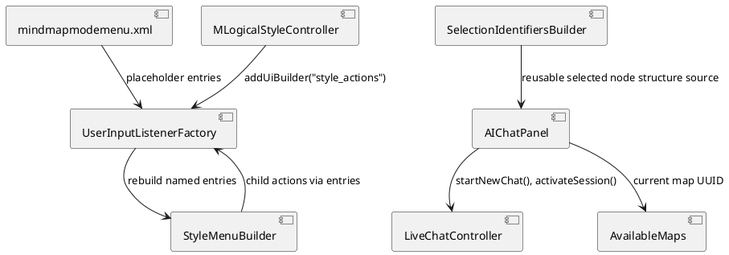
- **Design:**
  This feature should have been reviewed as a class-level contract.
  The final structure is therefore recorded explicitly here. Prompt-
  specific production types now live in
  `freeplane_plugin_ai/src/main/java/org/freeplane/plugin/ai/prompt`,
  while shared chat/session infrastructure remains in
  `freeplane_plugin_ai/src/main/java/org/freeplane/plugin/ai/chat`.

  Final structural decisions:

  1. Prompt definitions stay separate from assistant profiles.
  2. Prompt actions are keyed by trimmed saved prompt name with the
     prefix `RunAiPromptAction.` so accelerators remain readable and
     name-based.
  3. One menu builder id, `ai_prompt_actions`, populates both the
     main-menu and popup-menu AI submenus through the rebuilt
     `aiPromptMenu` parent entries so no placeholder entry is shown to
     the user.
  4. Visible prompt runs reuse live-chat sessions, but prompt sessions
     carry explicit session metadata:
     `assistantProfileEnabled=false` and
     `toolAvailabilityOverride=ChatToolAvailability.EDITING`.
  5. Hidden prompt runs do not enter `LiveChatSessionManager`; they run
     through `HiddenPromptRequestRunner` and therefore stay transient
     and non-persisted.
  6. Transcript restore recognizes visible prompt chats by the display
     name prefix from `ai_prompt_session_prefix`; this increment does
     not add a separate persisted session-kind field.
  7. Prompt request composition reuses the existing
     `SelectionIdentifiersResponse` shape and field names instead of
     introducing a prompt-specific payload schema.

  The class diagram below is the primary structural inventory for new
  and changed production types. To avoid parallel diagram-plus-table
  duplication, the remaining prose calls out only the review-critical
  collaborator chains and external identifiers.

  Review-critical collaborators and cross-class API:

  - `Activator` installs prompt menu wiring through
    `AiPromptMenuInstaller.install(...)` after creating
    `AIChatPanel`.
  - `Activator.stop(BundleContext)` is the AI plugin shutdown hook.
    It already calls `aiChatPanel.persistCurrentChatIfNeeded()` and
    stops the MCP server, so prompt-dialog state persistence on quit
    should be triggered from the same method before shutdown
    completes.
  - `AiPromptActionRegistry.savePrompts(...)` uses
    `AiPromptNameValidator.normalizeAndDeduplicate(...)`, persists
    through `AiPromptStore`, reloads prompts, and triggers
    `rebuildMenus("aiPromptMenu")`.
  - `RunAiPromptAction.actionPerformed(...)` calls
    `AIChatPanel.runPrompt(prompt.copy())`.
  - `AiPromptManagerDialog` can also call `AIChatPanel.runPrompt(...)`
    through `AiPromptActionRegistry.runPrompt(...)` so the currently
    edited prompt can be sent without being saved.
  - `AIChatPanel.runPrompt(...)` composes the request through
    `AiPromptRequestComposer`, blocks while any visible or hidden AI
    request is active, and then chooses either
    `LiveChatController.startNewPromptChat(...)` or
    `HiddenPromptRequestRunner.submit(...)`.
  - `LiveChatController.startNewPromptChat(...)` creates a session with
    `assistantProfileEnabled=false`,
    `toolAvailabilityOverride=ChatToolAvailability.EDITING`, and a
    name pre-marked as edited.
  - `AIChatPanel.activateSession(...)` reads prompt-session metadata
    through `LiveChatController.currentSessionUsesAssistantProfile()`
    and disables the assistant-profile selector through
    `AssistantProfilePaneBuilder.setSelectionEnabled(...)`.
  - `AIChatServiceFactory.createService(...)` now accepts an optional
    `Supplier<ChatToolAvailability>` used by prompt runs to force the
    editing-capable tool set.

  Externally meaningful identifiers in scope:

  | Identifier | Kind | Purpose |
  | --- | --- | --- |
  | `ai-prompts.json` | persisted file | User-defined prompt storage. |
  | `ManageAiPromptsAction` | static action key | Opens the prompts dialog. |
  | `RunAiPromptAction.<trimmedPromptName>` | dynamic action key | Name-based hotkey target for one saved prompt. |
  | `ai_prompt_actions` | menu builder id | Dynamic prompt action builder. |
  | `aiPromptMenu` | XML entry name | Shared rebuild target in main and popup menus. |
  | `showInChat` | persisted field | Visible vs hidden prompt behavior. |
  | `assistantProfileEnabled` | session field | Disables profile injection for prompt sessions. |
  | `toolAvailabilityOverride` | session field | Forces editing tools for prompt sessions. |
  | `ai_prompt_session_prefix` | translation key | Visible prompt session name prefix and transcript-restore marker. |
  | `mapIdentifier`, `nodeIdentifier`, `rootNodeIdentifier`, `selectedNodes`, `selectedNodeCount`, `selectedUniqueSubtreeCount` | serialized payload fields | Prompt request JSON fields kept identical to `SelectionIdentifiersResponse`. |

  Structural review boundary for this increment:

  Fixed by approved design and subject to prior review:

  - all top-level production types and externally meaningful
    identifiers listed above;
  - the prompt dialog always keeps one reserved empty `New Prompt`
    placeholder row out of persistence and out of action generation,
    and selecting that row shows empty editor inputs until the user
    starts a real prompt draft;
  - visible prompt runs stay inside `LiveChatSessionManager`, while
    hidden prompt runs stay outside it;
  - prompt-session semantics are represented by
    `assistantProfileEnabled=false`,
    `toolAvailabilityOverride=ChatToolAvailability.EDITING`, and the
    visible-session name prefix from `ai_prompt_session_prefix`;
  - prompt request JSON reuses `SelectionIdentifiersResponse` field
    names unchanged.

  Left intentionally implementation-local:

  - private helper methods, local variables, and private fields inside
    `AIChatPanel`, `LiveChatController`, `AiPromptManagerDialog`, and
    related prompt classes;
  - the exact live document-listener mechanics used to keep the
    reserved placeholder row empty while editing;
  - the exact internal Swing layout details used to mirror the
    assistant-profile dialog;
  - the internal asynchronous mechanism used by
    `HiddenPromptRequestRunner`;
  - contained refactorings that do not add a new top-level production
    type, new cross-class boundary, or new externally meaningful
    identifier.

  Explicitly deferred structural options:

  - This increment does not persist a dedicated prompt-session kind for
    transcript restore. It intentionally uses the
    `ai_prompt_session_prefix` display-name prefix as the restore-time
    marker. Replacing that with a persisted session-kind field remains a
    separate structural follow-up, not an implementation-local tweak.
  - The current package split is accepted as good enough for this
    increment, but a future refinement could reduce prompt/chat
    cross-package coupling through dependency inversion if the present
    dependency directions start to feel too circular.

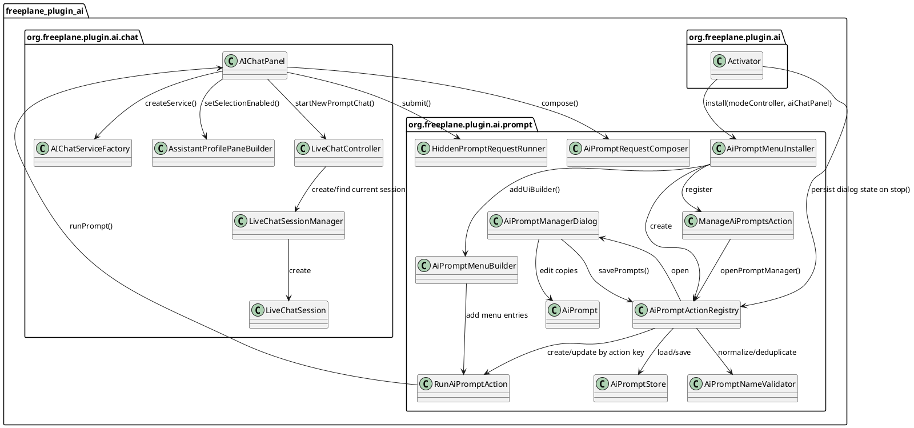

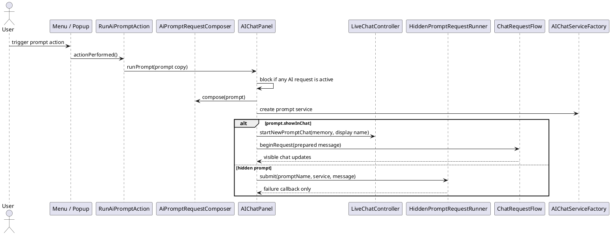

  Implementation-alignment notes for review:

  - Prompt-owned production classes and their focused tests were moved
    into `org.freeplane.plugin.ai.prompt`, while shared chat/session
    infrastructure stayed in `org.freeplane.plugin.ai.chat`.
  - `AiPromptNameValidator` was extracted so prompt-name trimming,
    reserved-name handling, and auto-numbering rules are shared by the
    dialog, store reload, and tests instead of being hidden inside one
    UI class.
  - The current package split still leaves direct prompt-to-chat and
    chat-to-prompt references; that dependency direction is accepted for
    now and may later be cleaned up with dependency inversion if it
    becomes a maintenance problem.
  - `HiddenPromptRequestRunner` became its own class so the hidden
    background lifecycle stays separate from visible chat-session state.
  - `AiPromptMenuInstaller` owns menu/action wiring that the earlier
    draft described only as `Activator` responsibility.
  - `AssistantProfilePaneBuilder` was introduced while implementing the
    prompt-session enable/disable behavior for the existing profile
    selector.
  - Visible prompt transcript restore currently infers prompt-session
    semantics from the `ai_prompt_session_prefix` display-name prefix
    instead of persisting a dedicated prompt-session marker.
- **Test specification:**
  - Automated tests:
    - add store tests for prompt persistence and empty default state;
    - add request-composer tests for prepending serialized selected
      identifier data and prompt text, including multi-selection so the
      JSON matches the existing selected-identifiers response shape;
    - add menu/controller tests for name-based action keys built from
      trimmed saved names, rebuilding prompt menu entries after prompt
      changes, keeping the reserved `New Prompt` row out of persistence
      and action generation, auto-numbering conflicting saved prompt
      names, and persisting the per-prompt shown/hidden flag;
    - add live-chat execution tests around the new prompt-run API so a
      shown prompt starts a fresh visible session, preserves
      prompt-based naming, uses the currently selected model, injects no
      assistant profile, and uses editing-capable tools even when
      regular chat tool availability is more restrictive;
    - add hidden prompt-run tests so the visible chat is unchanged, the
      hidden prompt conversation is not persisted, hidden failures are
      surfaced to the user, and prompt start is blocked while another AI
      request is active.
  - Manual tests:
    - open the prompts dialog, edit saved prompts, and send the
      currently edited prompt directly without saving it first;
    - verify Tools -> `AI prompts` and node-popup `AI prompts`
      submenus show the same prompt list, with `Edit prompts…` as the
      first item and a separator only when at least one saved prompt
      exists;
    - verify the submenu no longer shows a visible placeholder entry such
      as `[aiPromptActions]`;
    - verify the dialog always contains one empty `New Prompt`
      placeholder row and selecting it shows empty editor inputs;
    - create a prompt whose entered name has leading/trailing spaces and
      verify the saved/menu name is trimmed;
    - verify saving a prompt with the reserved `New Prompt` name stores
      it as `New Prompt 1` or the next available positive number;
    - verify saving a prompt whose name conflicts by case or whitespace
      with an existing saved prompt auto-numbers the new saved prompt
      instead of showing a duplicate-name error;
    - assign a hot key to a prompt action, restart Freeplane, and verify
      the hot key still runs that prompt while its trimmed name is
      unchanged;
    - rename that prompt and verify the old hot key no longer targets it
      until reassigned;
    - configure one prompt as hidden, run it while another chat is
      visible, and confirm the visible chat is unchanged while the map
      can still be edited during the prompt run;
    - configure another prompt as shown, run it, and confirm a fresh
      prompt conversation opens in the AI chat UI instead of appending
      to the previously active conversation;
    - start a normal AI request and verify prompt actions are blocked
      with a visible message until the running request finishes or is
      cancelled;
    - verify a selected regular assistant profile is not shown or
      injected into the prompt conversation;
    - select multiple nodes, run a prompt, and verify the prepended JSON
      includes the same `selectedNodes` list and counts as the existing
      selected-identifiers tool response;
    - set regular AI chat tools to Reading or Disabled, run a prompt,
      and verify the prompt conversation still can use editing tools;
    - change the selected global AI model, run a prompt, and verify the
      prompt uses that current model without any prompt-specific model
      setting;
    - force a hidden prompt run to fail and verify the user gets a
      lightweight error notification but no success popup exists for
      successful hidden runs;
    - restart Freeplane and verify hidden prompt runs are not restored
      as persisted chats.

## Subtask: Redesign prompt manager draft and save flow
- **Status:** done
- **Scope:**
  Replace the reserved `New Prompt` placeholder-row behavior with a
  saved-prompts-only list, an explicit `New prompt` button, persisted
  prompt-dialog draft state, and explicit dirty-draft confirmation only
  when a draft would actually be replaced.
- **Motivation:**
  The placeholder-row design is not clear to users, non-name edits such
  as `Show in chat` can trigger unexpected prompt-name changes, and the
  current unsaved draft can be lost after `Send` or dialog close.
  Prompt naming, persistence, and draft preservation must become
  explicit and predictable.
- **Scenario:**
  A user opens the prompts dialog, clicks `New prompt`, edits the name,
  prompt text, or `Show in chat`, and clicks `Send` without saving.
  Freeplane runs the prompt while leaving the dialog open and keeping
  the current draft unchanged. If the user closes the dialog or quits
  Freeplane, the dialog state is saved. When the dialog is reopened or
  Freeplane restarts, the same draft and selected saved prompt are
  restored. If the user instead selects another saved prompt, clicks
  `New prompt` again, or deletes a saved prompt while a dirty draft is
  active, Freeplane asks whether to Save, Discard, or Cancel before the
  current draft is replaced.
- **Constraints:**
  - The prompt list must contain saved prompts only; no synthetic
    placeholder row remains in the list.
  - `New prompt` must be a button, not a list element.
  - The current draft's dirty state must include changes to name,
    prompt text, and `Show in chat`.
  - Editing the name, prompt text, or `Show in chat` must affect only
    the current draft until the user explicitly saves.
  - Editing prompt text or toggling `Show in chat` must never rename a
    saved prompt by itself.
  - Prompt-name normalization must happen only on `Save` or
    `Save as new`. Saved names are trimmed, blank names are auto-named
    from `New Prompt`, and naming conflicts are resolved by appending
    the smallest available positive integer starting with 1.
  - `Save` must overwrite the currently selected saved prompt only when
    the current draft is backed by that saved prompt. If the current
    draft is a new unsaved draft, `Save` creates a new saved prompt.
  - `Save as new` must create a new saved prompt from the current draft
    and must leave any currently selected saved prompt unchanged.
  - `Send` must run the current draft without closing the dialog and
    without resetting or replacing the current draft.
  - Closing the dialog must persist prompt dialog state and must not use
    `Save` / `Discard` / `Cancel` solely because the dialog is closing.
  - Freeplane shutdown must persist the same prompt dialog state.
  - Selecting another saved prompt, clicking `New prompt`, or deleting a
    saved prompt while the editor is dirty must use a three-way `Save`
    / `Discard` / `Cancel` confirmation.
  - Prompt dialog state must be stored together with the saved prompt
    collection in `ai-prompts.json` using the new object-shaped file
    format only. No migration path from the earlier top-level array
    shape is kept.
  - `selectedPromptName` in persisted dialog state uses the empty
    string for a `New prompt` draft; `New prompt` resets this field to
    the empty string.
  - If persisted `selectedPromptName` does not match any saved prompt
    on restore, Freeplane must clear the selection to the empty string
    and keep the draft.
  - If an old array-shaped `ai-prompts.json` file is encountered, load
    must fail, log the error, and continue with empty prompt state.
  - `OptionalDontShowMeAgainDialog` must not be used for this flow.
    This decision must not be remembered because the choice is
    tri-state and a remembered discard decision would risk silent data
    loss.
- **Briefing:**
  Keep the existing prompt execution, menu, hotkey, model-selection,
  tool-override, and hidden-vs-visible execution behavior unchanged.
  This increment is localized to prompt-manager dialog behavior,
  prompt-name normalization on save, persisted prompt dialog state in
  `AiPromptStore`, and supporting close/shutdown persistence wiring
  around the prompt dialog and prompt registry. `Activator.stop`
  already persists the current chat and stops the MCP server, so it is
  the concrete plugin shutdown hook to extend for prompt-state
  persistence on quit.
- **Research:**
  - `AssistantProfileManagerDialog` already uses a saved-item list plus
    an explicit `New` button, which is a closer interaction model than
    the current prompt placeholder row.
  - The current `AiPromptManagerDialog` ties the unsaved draft to one
    dialog instance, so sending or closing can lose draft state instead
    of restoring it on the next open.
  - The current `AiPromptStore` persists only the saved prompt
    collection, so `ai-prompts.json` may not exist at all until the
    user explicitly saves a prompt.
  - `Activator.stop(BundleContext)` already calls
    `aiChatPanel.persistCurrentChatIfNeeded()` and then stops
    `modelContextProtocolServer`, so it is the existing AI plugin
    shutdown boundary where prompt-dialog state can be saved on quit.
  - `OptionalDontShowMeAgainDialog` persists only remembered binary
    outcomes through a property. It is suited to repeatable yes/no
    style confirmations, not to a `Save` / `Discard` / `Cancel`
    editor-state decision.

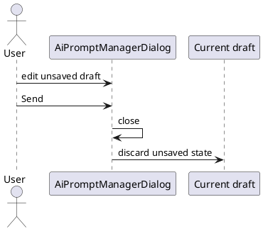
- **Design:**
  This subtask supersedes the earlier reserved-placeholder-row dialog
  plan from the main task for all prompt-manager UI behavior.

  Final structural decisions:

  1. The left-side list contains saved prompts only.
  2. `New prompt` is a button that opens a new unsaved draft in the
     editor and does not create a saved prompt-list entry until save.
  3. `AiPromptActionRegistry` owns prompt dialog state for the
     application lifetime so the current draft can survive dialog close,
     dialog reopen, and application restart.
  4. `AiPromptStore` persists one object-shaped `ai-prompts.json` file
     containing both the saved prompt collection and persisted dialog
     state.
  5. Dialog close persists the current prompt dialog state and closes
     without forcing `Save` / `Discard` / `Cancel`.
  6. `Activator.stop(BundleContext)` persists the same prompt dialog
     state on application shutdown, alongside the existing current-chat
     persistence path and before shutdown completes.
  7. Close and shutdown persistence write `ai-prompts.json` only when
     the saved prompt collection or dialog state has changed.
  8. Dirty editor transitions that replace the current draft —
     selecting another saved prompt, clicking `New prompt`, or deleting
     a saved prompt — use a normal modal `Save` / `Discard` /
     `Cancel` confirmation with no remembered preference.
  9. `Save` persists the current draft. If the draft is backed by the
     currently selected saved prompt, `Save` overwrites that saved
     prompt; otherwise `Save` creates a new saved prompt.
  10. `Save as new` persists the current draft as a new saved prompt and
     leaves any selected saved prompt unchanged. This action is used
     when the user wants a variant instead of an overwrite.
  11. Name normalization happens only on `Save` and `Save as new`.
      Edits to name, prompt text, and `Show in chat` remain draft-local
      until one of those actions is chosen.
  12. `Send` executes the current draft, does not close the dialog, and
      does not itself clear or replace the current draft.
  13. The auto-name base `New Prompt` remains valid as a saved prompt
      name generated at save time; it is no longer a reserved synthetic
      list entry identity.
  14. No backward-compatible load path is kept for the earlier
      top-level array file shape. If that obsolete shape is present,
      load logs an error and continues with empty state.

  Target persisted file shape:

  ```json
  {
    "savedPrompts": [
      {
        "name": "Rewrite",
        "prompt": "Rewrite this node",
        "showInChat": true
      }
    ],
    "dialogState": {
      "selectedPromptName": "",
      "draft": {
        "name": "Rewrite better",
        "prompt": "Rewrite this node in a calmer tone",
        "showInChat": false
      }
    }
  }
  ```

  Prompt save, send, and preservation decision table:

  | Current editor state | User action | Result |
  | --- | --- | --- |
  | Existing saved prompt selected | Edit name, prompt text, or `Show in chat` | Draft changes only; the saved prompt remains unchanged. |
  | Existing saved prompt selected | `Save` | Overwrite the same saved prompt with the draft. If the name changed, the old name is removed and replaced by the saved normalized name. |
  | Existing saved prompt selected | `Save as new` | Keep the original saved prompt unchanged and create a new saved prompt from the draft using normalized naming. |
  | New unsaved draft from `New prompt` | Edit name, prompt text, or `Show in chat` | Draft changes only; no saved prompt is created yet. |
  | New unsaved draft from `New prompt` | `Save` | Create a new saved prompt from the draft using normalized naming. |
  | New unsaved draft from `New prompt` | `Save as new` | Disabled because it would duplicate `Save` semantics for a draft that has no saved source prompt. |
  | Any draft | `Send` | Run the draft, keep the dialog open, and keep the current draft unchanged. |
  | Any draft | Close dialog | Persist saved prompts plus dialog state if changed and close without discard. |
  | Persisted dialog state exists | Reopen dialog or restart Freeplane | Restore the persisted draft and selected saved prompt; if `selectedPromptName` is missing, clear it to the empty string and keep the draft. |

  Choosing `Save` in the dirty-draft confirmation uses the same
  context-sensitive `Save` behavior from the table above.

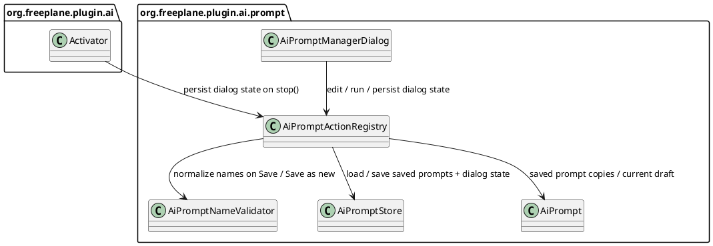

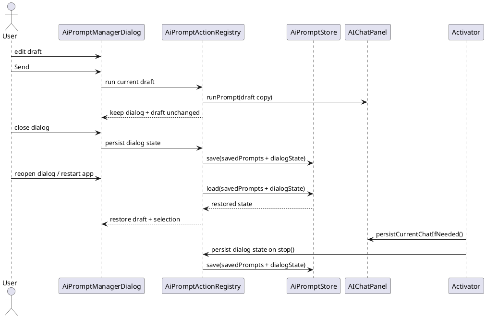

  Externally meaningful identifiers for this increment:

  | Identifier | Kind | Purpose |
  | --- | --- | --- |
  | `savedPrompts` | persisted field | Saved prompt collection in `ai-prompts.json`. |
  | `dialogState` | persisted field | Persisted prompt dialog UI state. |
  | `selectedPromptName` | persisted field | Saved-prompt selection restored for the dialog; the empty string means `New prompt` draft / no selected saved prompt. |
  | `draft` | persisted field | Unsaved or in-progress prompt draft restored for the dialog. |
  | `ai_prompt_new` | translation key | `New prompt` button label. |
  | `ai_prompt_save_as_new` | translation key | `Save as new` button label. |
  | `ai_prompt_discard` | translation key | Dirty-draft discard button label. |
  | `ai_prompt_unsaved_changes` | translation key | Dirty-draft confirmation message. |
  | `ai_prompt_unsaved_changes_explanation` | translation key | Warning that unsaved input will be lost on discard. |

  Structural review boundary for this increment:

  Fixed by approved design and subject to prior review:

  - `New prompt` is a button and not a list item;
  - the prompt list contains saved prompts only;
  - edits to name, prompt text, and `Show in chat` stay draft-local
    until `Save` or `Save as new`;
  - `Save` overwrites the selected saved prompt, while `Save as new`
    keeps the original and creates a new saved prompt;
  - prompt-name normalization happens only on `Save` or
    `Save as new`;
  - `Send` keeps the dialog open and preserves the current draft;
  - dialog close persists saved prompts plus prompt dialog state only
    when state changed;
  - `Activator.stop(BundleContext)` persists the same prompt dialog
    state on quit alongside current-chat persistence and only when
    state changed;
  - `ai-prompts.json` now stores saved prompts and `dialogState`
    together in one object-shaped file with no backward-compatible load
    path for the obsolete top-level array shape.

  Left intentionally implementation-local:

  - the exact field/listener bookkeeping used to detect dirty state;
  - whether dirty-state comparison is based on an original prompt copy,
    a local snapshot, or equivalent dialog-local mechanism;
  - the exact Swing helper APIs used to render the three-way
    confirmation dialog.
- **Test specification:**
  - Automated tests:
    - dialog tests proving the prompt list contains saved prompts only
      and `New prompt` opens an unsaved draft outside the list;
    - dialog tests proving dirty state reacts to name, prompt text, and
      `Show in chat` changes;
    - dialog/controller tests proving select/new/delete replacement
      flows use `Save` / `Discard` / `Cancel` correctly while dirty;
    - dialog/controller tests proving `Send` runs the current draft,
      does not close the dialog, and does not clear the current draft;
    - dialog/controller tests proving close persists the current dialog
      state without forcing `Save` / `Discard` / `Cancel`;
    - store tests proving `ai-prompts.json` saves and restores both
      `savedPrompts` and `dialogState` in the new object-shaped file
      format;
    - store tests proving an obsolete top-level array file shape logs an
      error and behaves as empty state with no migration;
    - dialog/controller tests proving `Save` overwrites the selected
      saved prompt while `Save as new` keeps the original and creates a
      new saved prompt;
    - name-normalization tests proving blank names are auto-named from
      `New Prompt` only on `Save` or `Save as new` and duplicate saved
      names are auto-numbered on those actions;
    - activator/registry/store tests proving
      `Activator.stop(BundleContext)` persists the last draft and
      selected saved prompt on shutdown so they are restored on the
      next dialog open, with the empty string used for `New prompt`
      drafts;
    - menu/action tests proving unsaved drafts never produce prompt
      actions or persisted saved-prompt menu entries until the user
      saves them.
  - Manual tests:
    - click `New prompt`, type only prompt text, click `Send`, and
      verify the prompt runs while the dialog stays open and the draft
      text remains visible;
    - close the dialog after editing an unsaved draft, reopen it, and
      verify the same draft is restored;
    - quit and restart Freeplane after editing an unsaved draft, reopen
      the dialog, and verify the same draft and saved-prompt selection
      are restored;
    - click `New prompt`, type only prompt text, click another saved
      prompt, choose `Discard`, and verify the draft is lost and no new
      saved prompt appears;
    - repeat the same flow but choose `Save`, and verify a saved prompt
      appears with an auto-generated `New Prompt`-based name;
    - edit only `Show in chat` in a new draft and verify no name change
      happens until `Save`;
    - rename a saved prompt, click `Save`, and verify the original
      saved prompt is renamed rather than duplicated;
    - rename or retarget `Show in chat` on a saved prompt, click
      `Save as new`, and verify the original saved prompt is kept while
      a new saved prompt is added from the draft;
    - verify `Save as new` is disabled for a brand-new unsaved draft;
    - edit a saved prompt, click `New prompt`, choose `Cancel`, and
      verify the current draft remains open unchanged;
    - open the prompts dialog at its default size and verify every
      action button, including `Close`, is visible without manually
      widening the dialog;
    - verify the main-menu and node-popup submenu label is
      `AI prompts` and the first action label is `Edit prompts…`.

## Subtask: Align chat model selector with advisory availability policy
- **Status:** review
- **Scope:**
  Keep the current AI chat model selector as a single combined
  `provider|model` choice, but stop clearing the stored global
  selection when it disappears from the currently loaded model list.
  Instead, treat the list as advisory, keep the stored value, and show
  that missing value in the selector as an explicit unavailable choice.
- **Motivation:**
  The current chat selector silently clears missing stored selections.
  That makes behavior change merely by opening chat, and it would make
  the future prompt selector inconsistent unless the policy is aligned
  first.
- **Scenario:**
  A user previously selected `OpenRouter: openai/gpt-4.1-mini` as the
  global chat model. Later the configured allowlist changes and that
  combined value is no longer in the loaded model list. When the user
  opens AI chat, Freeplane keeps the stored `ai_selected_model` value
  and shows that model through `TextUtils.format("ai_unavailable_format",
  displayName)` in the selector instead of clearing the selection.

  If the user sends a chat without changing the selector, Freeplane
  still uses the stored combined value and lets the provider decide. If
  the user selects another model, the new selection is persisted as
  usual.
- **Constraints:**
  - Keep one non-editable combined selector; do not split provider and
    model into separate controls.
  - Keep the existing chat-side model-list refresh timing for this
    increment; this subtask changes selection semantics, not provider
    discovery policy.
  - If the stored selection is absent from the loaded list, Freeplane
    must keep the stored value and show it as an unavailable selector
    item instead of clearing `ai_selected_model`.
  - Sending chat messages must not be blocked merely because the stored
    combined value is absent from the currently loaded local list.
  - Provider rejection remains the source of truth for invalid or stale
    configured model values.
- **Briefing:**
  `AIModelSelectionController` currently owns the global chat combo box,
  persists `ai_selected_model`, and loads available models through
  `AIModelCatalog`. `AIChatModelFactory` already uses the persisted
  combined value directly and does not validate it against the current
  catalog first.
- **Research:**
  - `AIModelSelectionController.applySelectionFromConfiguration(...)`
    currently clears the stored global selection when it finds no match
    in the loaded list.
  - The chat model combo box is already non-editable, which fits the
    desired `available list plus explicit unavailable item` approach.
  - `AIChatModelFactory.createChatLanguageModel(...)` already uses the
    combined stored selection value directly, so preserving an
    unavailable stored value is behaviorally consistent with current
    send-time logic.
  - `AIModelDescriptor` already carries the combined selection value and
    display name, so it is the natural place to represent an explicit
    unavailable selector item.

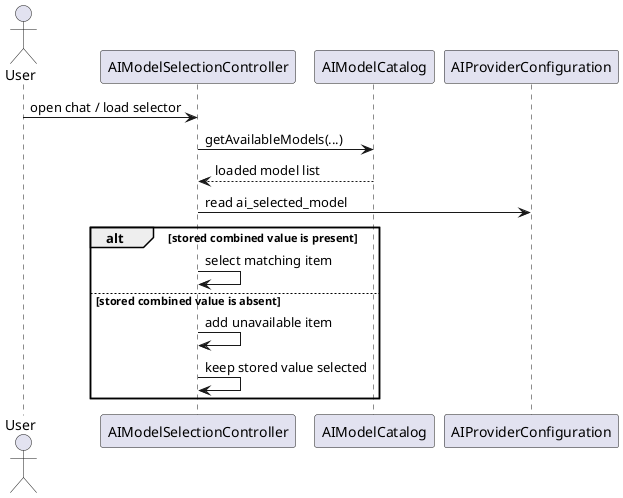
- **Design:**
  Final structural decisions:

  1. The global chat selector remains one non-editable combined
     `provider|model` selector.
  2. `AIModelSelectionController` keeps the stored
     `ai_selected_model` value when it is absent from the currently
     loaded list.
  3. The selector represents that case as an explicit unavailable item
     whose display name is built with
     `TextUtils.format("ai_unavailable_format", displayName)` so
     translations can place the unavailable marker anywhere.
  4. Choosing another available model still persists the new combined
     value immediately, like today.
  5. Chat send-time behavior stays provider-driven; this subtask does
     not add local request blocking based on the current catalog.
  6. Package moves are intentionally deferred to the later prompt-model
     subtask. This increment keeps the existing chat-owned package
     placement and only aligns behavior.

  Externally meaningful identifiers for this increment:

  | Identifier | Kind | Purpose |
  | --- | --- | --- |
  | `ai_selected_model` | persisted property | Global combined chat model selection, now preserved even when unavailable. |
  | `ai_unavailable_format` | translation key | Format string used with `TextUtils.format(...)` to render unavailable selector items; English default: `{0} unavailable`. |

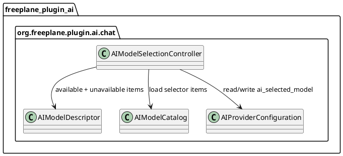

  Structural review boundary for this increment:

  Fixed by approved design and subject to prior review:

  - the global chat selector remains a single non-editable combined
    `provider|model` choice;
  - missing stored selections are preserved instead of cleared;
  - missing stored selections are shown as explicit unavailable items;
  - chat send-time behavior remains provider-driven rather than locally
    blocked by the current selector list.

  Left intentionally implementation-local:

  - whether unavailable state is carried by a descriptor flag or by a
    dedicated factory/helper method;
  - the exact combo-box renderer details beyond using
    `ai_unavailable_format`.
- **Test specification:**
  - Automated tests:
    - extend `AIModelSelectionControllerTest` so a stored combined value
      that is absent from the loaded list remains selected instead of
      being cleared;
    - add controller tests for unavailable display formatting via
      `ai_unavailable_format` and for switching from an unavailable
      stored item to an available one;
    - add controller/configuration tests proving the stored value is not
      overwritten during selector load when the current list lacks it.
  - Manual tests:
    - configure a global chat model, remove it from the currently loaded
      selector list, open AI chat, and verify the selector shows that
      value with unavailable formatting instead of clearing it;
    - send a chat without changing that unavailable selection and verify
      Freeplane attempts the provider request instead of forcing a local
      fallback;
    - choose another available model and verify the selector and stored
      setting update normally.

## Subtask: Persist optional per-prompt model selection
- **Status:** review
- **Scope:**
  Add optional per-prompt model selection to saved prompts and prompt
  drafts, keep it aligned with the advisory selector policy from the
  chat-selector subtask, and use that optional combined selection as a
  prompt-specific override when a prompt is run.
- **Motivation:**
  Some reusable prompts should stay pinned to a specific model even when
  the regular chat model changes, but prompt model selection should
  behave like the aligned chat selector instead of introducing a second
  policy.
- **Scenario:**
  A user saves prompt `Rewrite branch` with
  `OpenRouter: openai/gpt-4.1-mini` selected in the prompt manager.
  Later they switch the regular AI chat to Gemini. Running
  `Rewrite branch` still uses the saved OpenRouter model.

  If the prompt manager is opened later and that saved combined value is
  not in the refreshed list, the selector still shows that model
  through `TextUtils.format("ai_unavailable_format", displayName)`. If
  the user sends the prompt without changing that selector, Freeplane
  still uses the saved value and lets the provider decide. If the
  provider rejects the request, shown prompts keep that returned error
  visible in the shown prompt chat, while hidden prompts show it via
  `UITools.errorMessage(...)`, instead of inventing a local missing-
  model classification.
- **Constraints:**
  - This subtask supersedes the earlier main-task rule that prompt
    actions always use the current selected AI model and that prompt
    definitions do not store model-specific configuration.
  - Prompt model selection is optional. An empty prompt-model selection
    means `use the current global AI model at execution time`.
  - Saved prompt data and persisted prompt-dialog draft state must both
    preserve the optional prompt-model selection.
  - Dirty-draft detection, `Save`, `Save as new`, close persistence,
    and restore must all treat model selection as part of the draft.
  - The prompt selector remains non-editable and uses the same combined
    `provider|model` architecture as chat.
  - Opening the prompt manager refreshes the available model list.
  - If a saved prompt model is absent from the refreshed list, the
    prompt dialog must keep it selected as an explicit unavailable item
    instead of clearing it to `Use current model`.
  - Sending a prompt must not be blocked merely because its saved model
    is absent from the refreshed local list.
  - If a provider rejects a prompt-triggered request, Freeplane must
    surface the returned error to the user rather than replacing it with
    a locally inferred missing-model message. Hidden prompt failures use
    `UITools.errorMessage(...)`; shown prompt failures stay visible in
    the shown prompt chat and do not require an extra popup.
  - Existing provider-key and service-address validation stays in place
    after the effective prompt model has been resolved.
- **Briefing:**
  This increment depends on the chat-selector alignment subtask for the
  advisory selector policy. It is localized to prompt domain and
  persistence classes in `org.freeplane.plugin.ai.prompt`, prompt UI
  classes in `org.freeplane.plugin.ai.prompt.ui`, prompt execution in
  `AIChatPanel`, and shared provider/model infrastructure that should
  move out of `org.freeplane.plugin.ai.chat` into a neutral package both
  chat and prompts can reuse.
- **Research:**
  - `AiPrompt` currently persists only `name`, `prompt`, and
    `showInChat`.
  - `AiPromptStore` copies prompt objects into both `savedPrompts` and
    persisted `dialogState.draft`, so any prompt-owned persisted field
    must be preserved in both places.
  - `AiPromptManagerDialog.EditorState` dirty-state comparison, save,
    restore, and persistence currently compare only name, prompt text,
    and `showInChat`.
  - `AIChatPanel.runPrompt(...)` currently creates prompt services
    through `AIChatServiceFactory.createService(...)`, which constructs
    a fresh `AIProviderConfiguration` and therefore always uses the
    current global model selection.
  - The existing model infrastructure is shared in practice:
    `AIModelSelection`, `AIModelDescriptor`, `AIModelCatalog`,
    `AIProviderConfiguration`, and `AIChatModelFactory` are needed by
    both chat and prompt selection flows.
  - `AIModelSelectionController` remains chat-specific because it owns
    global `ai_selected_model` persistence and chat-top-bar rendering.
    Prompt drafts need their own controller even though they follow the
    same advisory selector policy.
  - Hidden prompt failures already surface a user-visible notification,
    while shown prompt failures remain visible in the prompt chat
    transcript. This subtask should keep provider-returned failure text
    on those existing surfaces rather than adding provider-specific
    model parsing or duplicate shown-prompt popups.

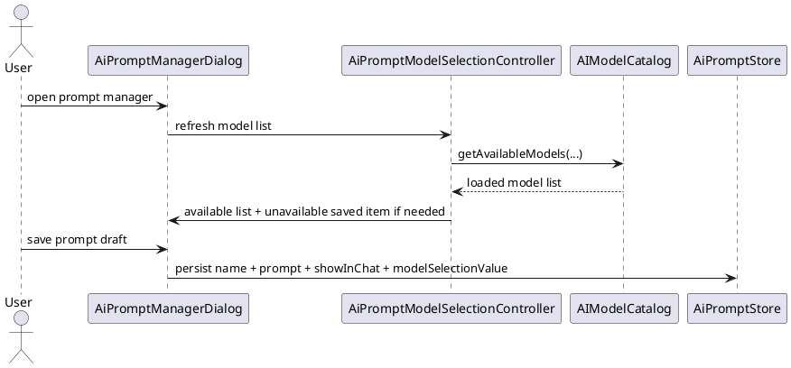
- **Design:**
  This subtask intentionally revisits the earlier package split.
  Prompt-specific UI should not depend on chat-owned model internals,
  and prompt UI should be grouped separately from prompt persistence,
  actions, and execution helpers.

  Final structural decisions:

  1. `AiPrompt` gains the optional persisted field
     `modelSelectionValue`. The stored value is the existing combined
     `provider|model` selection string. The empty string means `use the
     current global model`.
  2. Shared provider/model infrastructure moves from
     `org.freeplane.plugin.ai.chat` to
     `org.freeplane.plugin.ai.model`:
     `AIModelSelection`, `AIModelDescriptor`, `AIModelCatalog`,
     `AIProviderConfiguration`, and `AIChatModelFactory`.
  3. `AIModelDescriptor` becomes the shared model-selector value type
     for both chat and prompt selectors, including the ability to
     represent an explicit unavailable combined value rendered via
     `TextUtils.format("ai_unavailable_format", displayName)`.
  4. `AIModelSelectionController` stays in
     `org.freeplane.plugin.ai.chat` because it owns global
     `ai_selected_model` persistence and chat-top-bar rendering.
  5. Prompt UI classes move under `org.freeplane.plugin.ai.prompt.ui`.
     This increment places `AiPromptManagerDialog` and
     `AiPromptModelSelectionController` there. The later hidden-prompt
     progress-dialog subtask should place `AiPromptProgressDialog`
     there as well.
  6. `org.freeplane.plugin.ai.prompt` keeps non-UI prompt classes:
     prompt data, persistence, validation, registry/menu wiring,
     request composition, and hidden prompt execution helpers.
  7. `AiPromptManagerDialog` adds a model selector through the new
     `AiPromptModelSelectionController`, which refreshes the current
     model list when the dialog opens, prepends a `Use current model`
     option, and keeps a saved missing selection visible as an explicit
     unavailable item instead of clearing it.
  8. `AiPromptManagerDialog.EditorState`, `AiPromptStore`, and
     `AiPromptActionRegistry` all treat `modelSelectionValue` as part of
     the prompt identity for dirty detection, save/restore, and
     persistence.
  9. `AIChatPanel.runPrompt(...)` resolves an effective model selection
     without local existence gating:
     - if `prompt.modelSelectionValue` is empty, use the current global
       model selection;
     - if it is present, pass that combined value unchanged as a
       selected-model override;
     - if the provider rejects the request, hidden prompts surface the
       provider's returned error via `UITools.errorMessage(...)`, while
       shown prompts keep that returned error in the shown prompt chat,
       instead of replacing it with a local `model missing`
       inference.
  10. `AIChatServiceFactory.createService(...)` gains an overload with
      an optional selected-model override so prompt runs can use a
      saved prompt model without mutating the globally selected chat
      model.

  Externally meaningful identifiers for this increment:

  | Identifier | Kind | Purpose |
  | --- | --- | --- |
  | `modelSelectionValue` | persisted field | Optional combined `provider|model` selection stored per saved prompt and draft. |
  | `ai_prompt_model_label` | translation key | Prompt-manager label for the optional model selector. |
  | `ai_prompt_use_current_model` | translation key | Blank prompt-model option that delegates to the current global model. |
  | `ai_unavailable_format` | translation key | Format string used with `TextUtils.format(...)` to render unavailable selector items in chat and prompt UIs; English default: `{0} unavailable`. |
  | `org.freeplane.plugin.ai.model` | package name | Shared provider/model infrastructure used by both chat and prompts. |
  | `org.freeplane.plugin.ai.prompt.ui` | package name | Prompt-owned Swing UI classes, separate from prompt persistence and execution. |

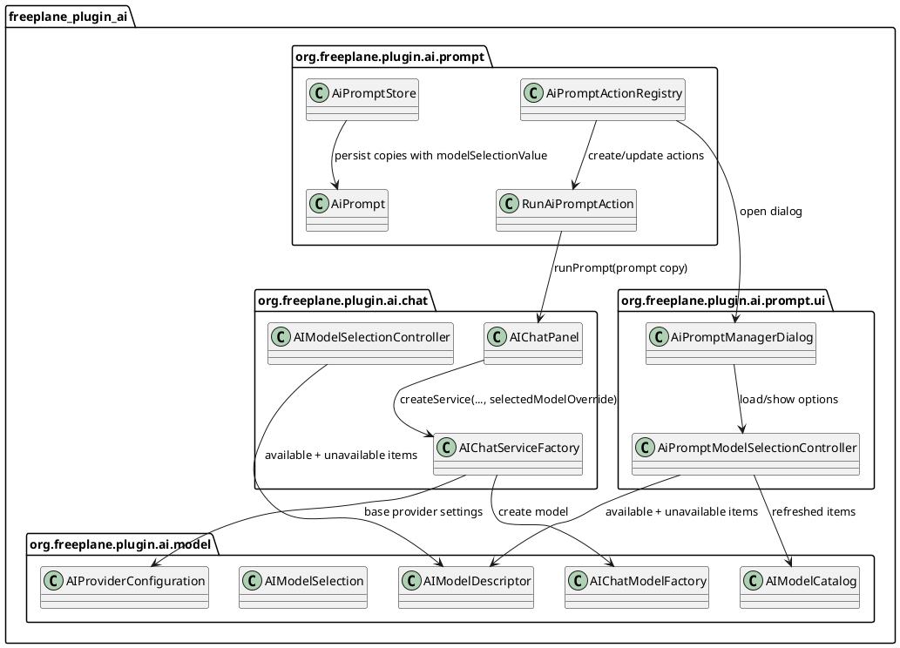

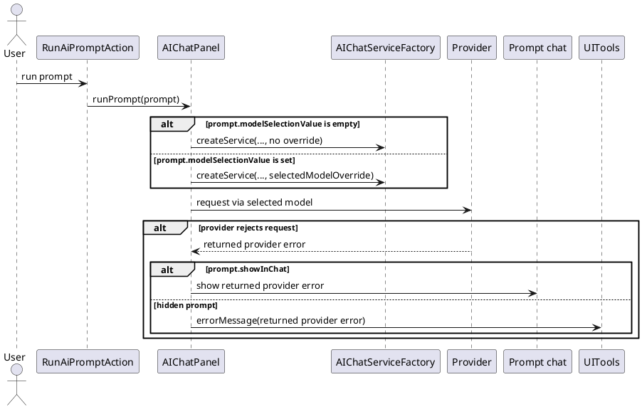

  Structural review boundary for this increment:

  Fixed by approved design and subject to prior review:

  - prompt definitions and drafts persist optional
    `modelSelectionValue`;
  - provider/model infrastructure stops being chat-owned and moves to
    `org.freeplane.plugin.ai.model`;
  - chat keeps its own `AIModelSelectionController`, while prompt-owned
    Swing UI moves under `org.freeplane.plugin.ai.prompt.ui`;
  - opening the prompt dialog refreshes model choices but does not clear
    missing saved prompt-model selections;
  - prompt execution uses a saved prompt-model override without local
    catalog-based request blocking;
  - provider-returned prompt failures stay user-visible on the existing
    request surface: hidden prompts use `UITools.errorMessage(...)`,
    while shown prompts keep the failure in the shown prompt chat,
    instead of being replaced with a local missing-model heuristic;
  - the current global selected model remains unchanged when a prompt
    uses its own saved model override.

  Left intentionally implementation-local:

  - the exact combo-box renderer used for unavailable or current-model
    options beyond applying `ai_unavailable_format`;
  - whether model-list loading in `AiPromptModelSelectionController`
    uses a `SwingWorker` or another contained async helper;
  - the exact helper used inside `AIChatServiceFactory` to apply a
    selected-model override.
- **Test specification:**
  - Automated tests:
    - extend `AiPromptStoreTest` so saved prompts and persisted dialog
      drafts preserve `modelSelectionValue`;
    - extend `AiPromptManagerDialogTest` so dirty-state comparison,
      `Save`, `Save as new`, restore, and persisted draft state all
      include `modelSelectionValue`;
    - add `AiPromptModelSelectionController` tests for the `Use current
      model` option, refreshed list loading on dialog open, and stable
      display of a restored unavailable model;
    - add prompt-run coordination tests so a prompt-specific
      `modelSelectionValue` overrides the current global model while an
      empty prompt value still delegates to the global model;
    - add prompt-run tests proving an unavailable locally listed model
      is still sent to the provider rather than blocked locally;
    - add prompt-failure notification tests so provider rejection keeps
      the returned error visible to the user, uses
      `UITools.errorMessage(...)` for hidden prompts, keeps shown-prompt
      failures in chat without an extra popup, and does not depend on a
      local `missing model` classification;
    - add `AIChatServiceFactory` tests for the selected-model override
      path to prove prompt-specific model use does not mutate the global
      model selection property.
  - Manual tests:
    - open the prompt manager, assign a specific model to a prompt,
      save it, reopen the dialog, and verify the same model is still
      selected for that prompt;
    - clear the prompt-model selector to `Use current model`, save,
      change the global chat model, run the prompt, and verify the
      prompt follows the new global model;
    - save a prompt with a specific model, change the global chat model,
      run the prompt, and verify the prompt still uses its saved model;
    - save a prompt with a specific model, remove it from the refreshed
      prompt-dialog list, reopen the dialog, and verify it is still
      shown with unavailable formatting rather than being cleared;
    - run that prompt without changing the unavailable selection and
      verify Freeplane attempts the provider request instead of forcing a
      local fallback;
    - force provider rejection for a hidden prompt and verify
      `UITools.errorMessage(...)` shows the returned error;
    - force provider rejection for a shown prompt and verify the
      returned error is visible in the shown prompt chat without an
      extra popup.

## Subtask: Show cancellable progress dialog for hidden prompt runs
- **Status:** review
- **Scope:**
  Show a small non-modal progress dialog for hidden prompt runs
  (`showInChat = false`), display the prompt name together with the AI
  chat icon, and route the dialog's cancel control through the same
  cancellation semantics used by chat message cancellation.
- **Motivation:**
  Hidden prompt runs currently provide no running-state feedback and no
  cancel affordance outside the chat UI.
- **Scenario:**
  A user triggers a hidden prompt from the map popup. Freeplane shows a
  small modeless dialog containing the prompt name, the AI icon used by
  the chat tab, and a cancel control styled like the chat's active-
  request stop button.

  The user can keep editing the map while the dialog stays open. If the
  hidden prompt finishes successfully, the dialog closes silently. If
  the user presses cancel, the request stops using the same
  cancellation behavior as cancelling a chat message, and the dialog
  closes without reporting a prompt failure.
- **Constraints:**
  - Keep the existing prompt rule that successful hidden runs stay
    silent while failures remain user-visible.
  - The dialog must be modeless and must not block map editing.
  - The cancel control should reuse the same stop-icon styling and
    cancel tooltip language as the active-request button in the AI chat
    for UI consistency.
  - Cancelling must propagate both SwingWorker cancellation and tool-
    level cancellation so in-flight tool execution aborts like visible
    chat-message cancellation.
  - User-triggered cancellation must not be reported as a prompt
    failure.
  - Shown prompt runs (`showInChat = true`) must not show this extra
    dialog.
  - Prompt concurrency stays unchanged: if any AI request is already
    active, the prompt still refuses to start.
- **Briefing:**
  The existing hidden prompt path is split between `AIChatPanel` and
  `HiddenPromptRequestRunner`. Visible chat cancellation already flows
  through `ChatRequestFlow` plus `ChatRequestCancellation`, while hidden
  prompts currently pass no cancellation supplier into
  `AIChatServiceFactory` and expose no UI outside failure reporting.
- **Research:**
  - `HiddenPromptRequestRunner` currently supports only
    `submit(...)`, `isRequestActive()`, and start/finish/failure
    callbacks.
  - Hidden prompt services are currently created with a `null`
    cancellation supplier, so tool executors do not see user
    cancellation for those runs.
  - `ChatRequestFlow.cancelActiveRequest()` already defines the expected
    visible-chat behavior: set `ChatRequestCancellation`, cancel the
    worker, restore visible state, and suppress normal completion.
  - `AIChatPanel` already owns the stop icon
    `/images/ai_stop.svg?useAccentColor=true`, the AI tab icon
    `/images/panelTabs/aiTab.svg?useAccentColor=true`, and the
    translated cancel tooltip used by the visible chat send button.
  - `UITools.createCancelDialog(...)` creates a modeless cancel dialog,
    but it does not provide the prompt-name + AI-icon layout or the
    stop-style cancel button required here.

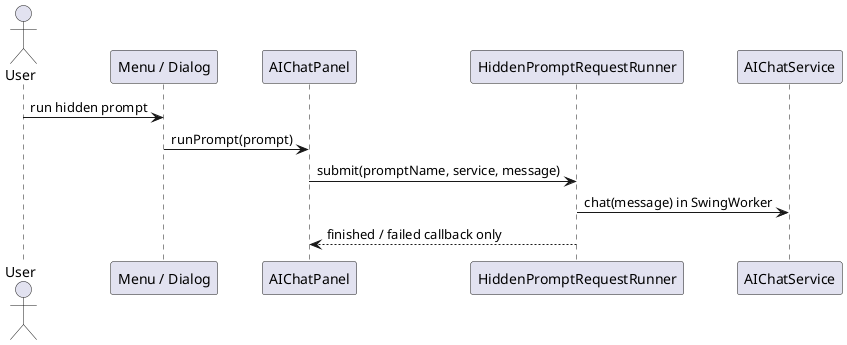
- **Design:**
  Final structural decisions:

  1. `HiddenPromptRequestRunner` gains `cancelActiveRequest()`, its own
     `ChatRequestCancellation`, and request-state handling that can
     distinguish `finished`, `failed`, and `cancelled` outcomes.
  2. Hidden prompt services receive the runner's cancellation supplier
     so tool executors and long-running AI work stop on user
     cancellation just like visible chat requests.
  3. Hidden prompt progress is surfaced through the new
     `org.freeplane.plugin.ai.prompt.ui.AiPromptProgressDialog`, a
     small modeless Swing dialog that shows the effective prompt name,
     the AI tab icon, and a cancel control using the same stop icon and
     cancel tooltip as the active AI chat send button.
  4. `AIChatPanel` owns the dialog lifecycle for hidden prompts: it
     shows the dialog when a hidden prompt starts, closes it on finish,
     failure, or cancellation, and routes cancel actions to
     `HiddenPromptRequestRunner.cancelActiveRequest()`.
  5. Only real failures keep the existing hidden-prompt error path.
     User-triggered cancellation closes the dialog and leaves no failure
     notification.

  Externally meaningful identifiers for this increment:

  | Identifier | Kind | Purpose |
  | --- | --- | --- |
  | `AiPromptProgressDialog` | top-level type | Modeless prompt-run progress UI for hidden prompts. |
  | `ai_prompt_running_title` | translation key | Title or heading for the prompt-run progress dialog. |

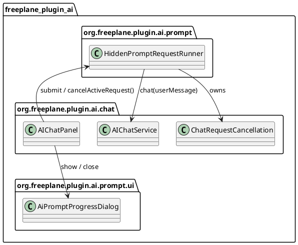

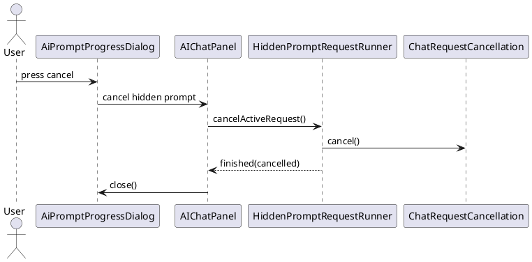

  Structural review boundary for this increment:

  Fixed by approved design and subject to prior review:

  - hidden prompt runs get a dedicated modeless progress dialog;
  - prompt-run UI lives under `org.freeplane.plugin.ai.prompt.ui`,
    while hidden execution stays outside that UI package;
  - the dialog shows the prompt name plus the same AI-branding and
    stop-style cancellation affordance used by the chat UI;
  - hidden prompt cancellation now reaches both the worker and the
    tool-cancellation path;
  - user cancellation closes the dialog silently and is not surfaced as
    a prompt failure;
  - shown prompt runs do not show the extra dialog.

  Left intentionally implementation-local:

  - the exact dialog layout manager and component spacing;
  - whether dialog close-box or Escape handling also routes through the
    same cancel path;
  - the exact callback shape used between `AIChatPanel` and
    `AiPromptProgressDialog`.
- **Test specification:**
  - Automated tests:
    - extend `HiddenPromptRequestRunnerTest` so cancellation clears the
      active flag, suppresses failure reporting, and still triggers the
      completion callback path needed for dialog cleanup;
    - add hidden prompt coordination tests so hidden prompt runs show
      `AiPromptProgressDialog`, successful completion closes it, and
      real failures still surface the existing prompt error message;
    - add cancellation-path tests so pressing the dialog cancel control
      calls `HiddenPromptRequestRunner.cancelActiveRequest()` and passes
      cancellation through to the hidden prompt service;
    - add `AiPromptProgressDialog` tests for modeless behavior, prompt-
      name display, AI icon display, and reuse of the chat stop-icon
      cancel styling.
  - Manual tests:
    - run a hidden prompt and verify a small modeless dialog appears
      with the prompt name and AI icon;
    - verify the dialog's cancel control looks like the active-request
      stop button in the AI chat;
    - keep editing the map while the dialog is open and verify the
      dialog does not block interaction;
    - cancel the hidden prompt from the dialog and verify the dialog
      closes, the prompt stops, and no hidden-prompt failure
      notification is shown;
    - force the hidden prompt to fail and verify the dialog closes and
      the existing user-visible failure notification still appears;
    - run a shown prompt and verify no extra progress dialog is shown.
