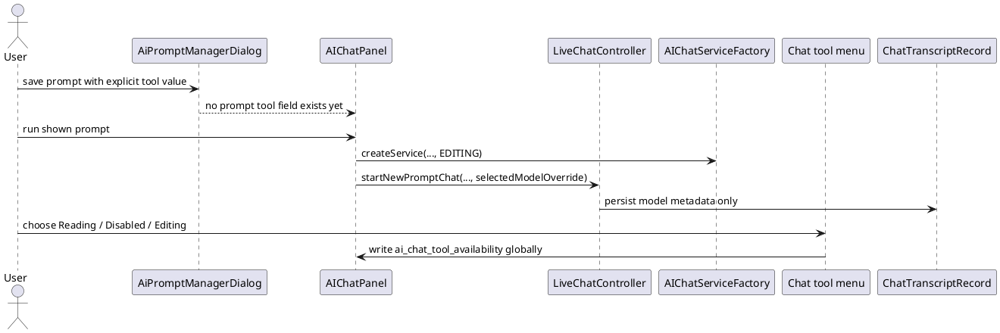
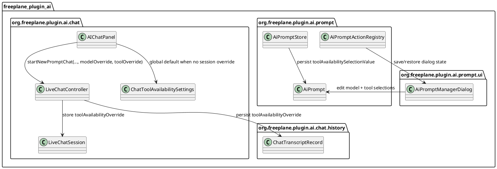
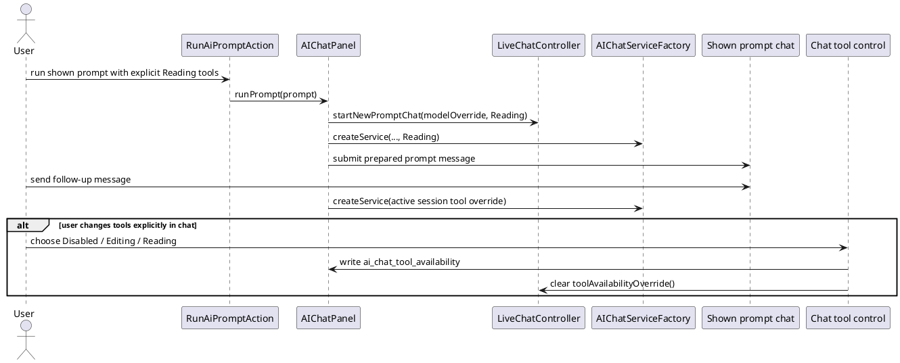
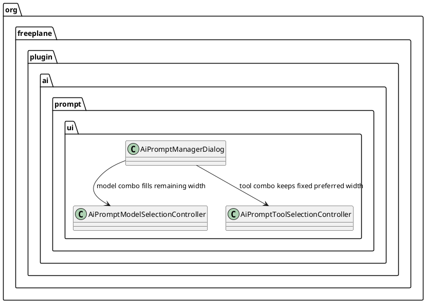

# Task: Align prompt chat model and tool session overrides
- **Task Identifier:** 2026-05-17-prompt-overrides
- **Scope:**
  Track the follow-up work from `031-add-ai-prompts.md` in a separate
  task file. First align shown prompt chats with prompt-specific model
  selection so model overrides survive follow-up messages and transcript
  restore. Then add prompt-specific tool selection using the same
  session-override pattern.
- **Motivation:**
  The prompt model path originally existed only for the first shown-
  prompt request, while prompt tools were still fixed to editing.
  Landing the model session lifecycle first reduced risk, validated the
  visible-chat override pattern, and now gives the tool increment a
  concrete implementation to mirror instead of a parallel design.
- **Scenario:**
  A user runs a shown prompt with an explicit model. The chat model
  selector shows that prompt-applied value, and follow-up messages in
  the same chat keep using it.

  If the user changes the model in the chat UI, that explicit user
  action becomes the new global default for future chats and clears the
  model session override for the current chat.

  In the follow-up increment, prompt tool selection follows the same
  lifecycle: prompt launch can show a chat-specific value without
  changing defaults automatically, while an explicit tool change in the
  chat UI updates the global default and clears that session override
  for that dimension.
- **Constraints:**
  - Keep `031-add-ai-prompts.md` as the historical record of the
    finished prompt feature; this task owns the follow-up increments.
  - Prompt launch must not change global defaults automatically.
  - When the user explicitly changes model or tool in the chat UI of a
    shown prompt chat, that explicit user action must update the
    corresponding global default and clear the session override for that
    dimension.
  - When a dimension has no session override, it follows the current
    global default.
  - If persisted transcripts lack the new session-metadata fields,
    restore defaults to regular-chat semantics.
  - Keep the current chat-side control placement for this task.
- **Briefing:**
  The prompt manager and prompt persistence live under
  `org.freeplane.plugin.ai.prompt` and
  `org.freeplane.plugin.ai.prompt.ui`. `AIChatPanel` owns prompt launch,
  visible-chat activation, the chat model selector, and the popup-menu
  tool control. Live session state lives in `LiveChatSession` and
  `LiveChatController`, while transcript persistence uses
  `ChatTranscriptRecord` and `ChatTranscriptStore`.

## Subtask: Align shown prompt chats with model session overrides
- **Status:** done
- **Scope:**
  Make shown prompt chats keep prompt-specific model selection as a live
  session override for follow-up messages and transcript restore, show
  that effective model in the chat selector, and treat an explicit
  model change in the chat UI as a switch back to the normal global
  model path for that chat. Hidden prompts keep using the prompt model
  only for the launched request. Prompt tool behavior stays unchanged in
  this increment.
- **Motivation:**
  The original prompt model selection affected only the first shown-
  prompt request. Follow-up messages recreated the chat service from the
  global model selection, so the shown chat no longer matched the
  prompt that opened it. Fixing the model path first gave one clear
  session-override pattern that the later tool subtask can reuse.
- **Scenario:**
  A user saves prompt `Rewrite branch` with
  `OpenRouter: openai/gpt-4.1-mini` and `Show in chat` enabled. Running
  it opens a fresh prompt chat whose first request and follow-up
  messages keep using that model. The chat model selector shows that
  model while the prompt chat is active.

  If the user then changes the selector to Gemini in that chat, the
  current chat switches to Gemini through the normal global model path,
  the model session override is cleared, and future normal chats use the
  same Gemini selection.

  If the shown prompt chat is restored from transcript before that user
  change, it restores the prompt-chat assistant-profile-disabled
  semantics together with the explicit model override.
- **Constraints:**
  - Keep the current prompt-tool behavior unchanged in this increment.
    Shown and hidden prompts continue to use the existing editing-tool
    behavior until the tool subtask becomes current.
  - Applying a prompt's model override to a shown chat must not write
    `ai_selected_model` automatically on prompt launch.
  - A shown prompt chat must display its effective model in the
    existing chat model selector.
  - If the user explicitly changes the model from the chat selector,
    that explicit chat-side change must update `ai_selected_model`,
    clear the current chat's `selectedModelOverride`, and move that chat
    to the normal global-model path from then on.
  - If `selectedModelOverride` is absent, the active chat uses the
    current global model selection.
  - Transcript restore must use explicit metadata when present. Missing
    metadata defaults to regular-chat semantics with assistant profiles
    enabled and no model override.
  - No display-name-based prompt fallback is retained for the new
    model-restore behavior.
- **Completion:**
  Implemented in commit `9ad0826bec`.

  Delivered behavior:
  - shown prompt chats persist `selectedModelOverride` in live-session
    state and transcript metadata;
  - visible prompt follow-up requests reuse that model override;
  - activating a shown prompt chat updates the chat model selector to
    show the effective session value without persisting a new global
    default;
  - explicit user model changes in the selector clear the session
    override and keep using the global model path;
  - transcript restore now uses explicit `assistantProfileEnabled` and
    `selectedModelOverride` metadata instead of
    `ai_prompt_session_prefix` inference.
- **Verification:**
  - Automated tests added/updated:
    - `AIModelSelectionControllerTest`
    - `LiveChatControllerTest`
  - Full module suite passed:
    - `gradle -Djava.net.preferIPv6Addresses=true -Djava.awt.headless=true :freeplane_plugin_ai:test`

## Subtask: Add prompt tool selection using the model override pattern
- **Status:** done
- **Scope:**
  Add optional per-prompt tool selection in the prompt manager via a
  non-editable dropdown beside the existing model selector, and make
  shown prompt chats keep the prompt's explicit tool choice as a live
  session override for follow-up messages and transcript restore,
  without changing the global default used by new chats or prompts that
  still choose current/default tools.
- **Motivation:**
  Prompt tools are still hardcoded to editing behavior even after the
  model-session work. The visible-chat override lifecycle now exists for
  model selection, so tool selection should follow the same pattern
  instead of inventing a second semantics for prompt-created chats.
- **Scenario:**
  A user saves prompt `Summarize branch` with `Use current model`,
  `Reading` tools, and `Show in chat` enabled. Running it opens a fresh
  prompt chat whose first request and follow-up messages use the current
  global model together with reading-only tools. Starting a normal new
  chat afterward still uses the unchanged global tool default.

  Another prompt is saved with `OpenRouter: openai/gpt-4.1-mini`,
  `Disabled` tools, and `Show in chat` enabled. Running it opens a
  fresh prompt chat that uses that explicit tool value for the visible
  conversation. The existing chat tool control shows `Disabled` while
  that chat is active.

  If the user changes that tool control back to `Editing`, the current
  chat clears its tool session override, starts using the normal global
  tool path with `Editing` as the now-updated global default, and a
  later normal new chat also starts with `Editing`.

  If the user restarts Freeplane and restores that visible prompt chat
  from transcript before changing the tool control, the restored chat
  keeps assistant profiles disabled and restores the explicit tool
  override. Older transcripts written during the completed model-only
  increment still restore prompt chats with editing tools for backward
  compatibility.
- **Constraints:**
  - This subtask must reuse the session-override pattern already landed
    for model selection instead of creating a separate lifecycle for the
    tool dimension.
  - In the prompt manager, tool selection uses a non-editable dropdown
    placed beside the existing model selector; do not use horizontally
    placed radio buttons.
  - Prompt tool selection is optional. The empty value means `use the
    current global AI chat tool availability at execution time`.
  - Applying a prompt's explicit tool selection to a shown chat must
    not write `ai_chat_tool_availability` automatically on prompt
    launch.
  - A shown prompt chat must display its effective tool value in the
    existing chat tool control.
  - If the user explicitly changes tools from that control, that
    explicit chat-side change must update
    `ai_chat_tool_availability`, clear the current chat's
    `toolAvailabilityOverride`, and move that chat to the normal global-
    tool path from then on.
  - Prompts that use current/default tools must keep delegating to the
    active global tool setting for shown-chat follow-ups; they do not
    capture a session override for that dimension.
  - Hidden prompt runs must use the resolved tool selection for that
    request without mutating visible-chat defaults or creating a live
    session.
  - Transcript restore must use explicit `toolAvailabilityOverride`
    metadata when present.
  - If a transcript lacks `assistantProfileEnabled`, it predates the
    model-session increment and restore must keep the existing fallback
    to regular-chat semantics with no tool override.
  - If a transcript has `assistantProfileEnabled` but lacks the new
    `toolAvailabilityOverride` field, it comes from the model-only
    increment and restore must keep backward-compatible prompt tool
    behavior: `editing` when `assistantProfileEnabled=false`, otherwise
    no tool override.
  - Keep the existing `editing`, `reading`, and `disabled` preference
    values and the current chat-side control placement for this
    increment.
  - The model-session behavior delivered by commit `9ad0826bec` is
    fixed input to this subtask and must remain unchanged.
- **Briefing:**
  `AiPromptManagerDialog` already has the prompt-specific model
  selector, draft persistence hooks, and dirty-state logic needed for a
  second dropdown. `AIChatPanel` still builds the chat tool menu from
  `SetStringPropertyAction` instances that directly mutate the global
  property. `LiveChatController` now persists
  `assistantProfileEnabled` and `selectedModelOverride`, but prompt
  tools are still represented only as an editing override in live
  session creation and restore.
- **Research:**
  - `AiPrompt` currently persists `name`, `prompt`, `showInChat`, and
    `modelSelectionValue`; there is no persisted prompt-owned tool
    field.
  - `AiPromptManagerDialog` already renders a non-editable model
    dropdown and wires it through `EditorState.updateDraft(...)`,
    `AiPromptStore.PersistedDialogState`, and
    `AiPromptActionRegistry.samePrompt(...)`. There is no adjacent tool
    selector yet.
  - `AIChatPanel.runPrompt(...)` now normalizes the prompt model value
    and passes it into both visible prompt session creation and hidden
    prompt service creation. Tool handling is still hardcoded through
    `createPromptChatService(...)`, which always supplies
    `ChatToolAvailability.EDITING`.
  - `AIChatPanel.ensureChatService()` now uses
    `liveChatController.currentSessionSelectedModelOverride()` and the
    session tool override when present. For tools, visible chats still
    only support the existing live-session editing override path.
  - `AIChatPanel.addChatToolAvailabilityMenu(...)` still builds the
    popup menu from `SetStringPropertyAction` on
    `ai_chat_tool_availability`, so explicit menu use always writes the
    global default and there is no session-aware checked-state layer.
  - `LiveChatSession` now stores mutable `selectedModelOverride`, but
    `toolAvailabilityOverride` is still constructor-owned session state.
    There is no analogous clear-on-user-change helper yet.
  - `LiveChatController.startNewPromptChat(...)` now accepts a model
    override but still creates shown prompt chats with
    `toolAvailabilityOverride=ChatToolAvailability.EDITING`.
  - `ChatTranscriptRecord` now persists `assistantProfileEnabled` and
    `selectedModelOverride`, but not tool metadata.
  - `LiveChatController.startChatFromTranscript(...)` currently derives
    editing-tool behavior from `assistantProfileEnabled=false`. That is
    correct for model-only transcripts but insufficient once prompt tool
    selection becomes configurable.
  - `ChatToolAvailabilitySettings` already owns the global property name
    `ai_chat_tool_availability` and the conversion from stored property
    value to `ChatToolAvailability`.

- **Design:**
  This subtask mirrors the delivered model-session override pattern for
  the tool dimension while preserving the already-approved prompt model
  behavior.

  Final structural decisions:

  1. `AiPrompt` gains an optional persisted field
     `toolAvailabilitySelectionValue`. Stored values are the existing
     preference values `editing`, `reading`, and `disabled`. The empty
     string means `use current global tools`.
  2. `AiPromptManagerDialog` adds a second non-editable dropdown beside
     the existing model selector. The options are `Use current tools`,
     `Editing`, `Reading`, and `Disabled`.
  3. `AiPromptManagerDialog.EditorState`, `AiPromptStore`, and
     `AiPromptActionRegistry` treat
     `toolAvailabilitySelectionValue` as part of draft identity,
     dirty-state detection, save/restore, persisted dialog state, and
     prompt list comparisons.
  4. `LiveChatSession.toolAvailabilityOverride` becomes mutable session
     state, matching the delivered model-override lifecycle closely
     enough that an explicit chat-side tool change can clear it.
  5. `AIChatPanel.runPrompt(...)` resolves the prompt tool selection per
     launch:
     - hidden prompts always get an explicit resolved tool value for the
       request, even when the prompt chooses `Use current tools`, so the
       hidden request does not drift if the global default changes mid-
       run;
     - shown prompts store a session override only when the prompt
       explicitly selected `editing`, `reading`, or `disabled`;
     - shown prompts with `Use current tools` store no tool session
       override and continue to follow the global tool property.
  6. `AIChatPanel.createPromptChatService(...)` stops hardcoding
     `ChatToolAvailability.EDITING` and accepts the resolved tool value
     for that prompt launch. For shown prompts, the first request uses
     the explicit tool override when present and the normal global tool
     path otherwise.
  7. `LiveChatController.startNewPromptChat(...)` accepts an optional
     tool override in addition to the already-delivered model override
     and stores only explicit prompt tool overrides in the shown prompt
     session.
  8. `AIChatPanel.ensureChatService()` continues using the active
     session's `toolAvailabilityOverride` when present. When absent, the
     active chat follows the current global tool setting exactly as a
     regular chat does.
  9. The existing chat tool menu becomes session-aware for displayed
     checked state and user-intent handling. It must be able to show the
     active chat's effective tool value without writing
     `ai_chat_tool_availability` during session activation, and it must
     surface explicit user tool changes so the current session's
     `toolAvailabilityOverride` can be cleared immediately after the new
     global value is written.
  10. Activating a shown prompt chat updates the existing chat tool
      control to show that chat's effective tool value.
  11. If the user explicitly changes tools from that control while a
      shown prompt chat is active, the UI action updates
      `ai_chat_tool_availability` as usual, clears the current chat's
      `toolAvailabilityOverride`, and leaves the chat on the normal
      global-tool path from then on.
  12. `ChatTranscriptRecord` gains explicit
      `toolAvailabilityOverride` metadata. Persist explicit prompt tool
      overrides there and restore them directly when present.
  13. Backward compatibility for restore becomes versioned by available
      metadata:
      - no `assistantProfileEnabled` field: restore as regular chat,
        matching the completed model increment;
      - `assistantProfileEnabled` present but no
        `toolAvailabilityOverride`: restore `editing` when
        `assistantProfileEnabled=false`, because those transcripts were
        produced by the model-only increment;
      - `toolAvailabilityOverride` present: restore that explicit tool
        value exactly.
  14. `ai_prompt_session_prefix` remains only a display-name prefix for
      prompt-created visible chats; it still has no restore-time role.

  Externally meaningful identifiers for this increment:

  | Identifier | Kind | Purpose |
  | --- | --- | --- |
  | `toolAvailabilitySelectionValue` | persisted prompt field | Optional prompt-owned tool availability selection; empty means use current global tools. |
  | `toolAvailabilityOverride` | live-session + transcript field | Optional visible-chat session tool override applied by shown prompts. |
  | `ai_prompt_tool_label` | translation key | Prompt-manager label for the tool-selection dropdown. |
  | `ai_prompt_use_current_tools` | translation key | Blank tool-selection option that delegates to current global tool defaults. |
  | `ai_chat_tool_availability` | persisted property | Global chat tool default updated only by explicit user tool changes. |

  Structural review boundary for this increment:

  Fixed by approved design and subject to prior review:

  - the prompt manager uses a dropdown for tool selection, not radio
    buttons;
  - prompts persist optional `toolAvailabilitySelectionValue` alongside
    `modelSelectionValue`;
  - shown prompt chats keep explicit prompt tool overrides for follow-
    up messages without rewriting global defaults on prompt launch;
  - shown prompt chats display their effective tool value in the
    existing chat control, and an explicit user change there becomes the
    new global default for that dimension;
  - transcript persistence records explicit tool metadata and keeps
    compatibility with transcripts written before this subtask;
  - hidden prompt runs use the resolved tool selection without creating
    a live session.

  Left intentionally implementation-local:

  - whether the chat-side tool control keeps `SetStringPropertyAction`
    under a contained wrapper or is replaced by a custom action layer;
  - the exact helper methods that translate empty prompt selections into
    `null` / global-default behavior for shown chats versus fully
    resolved values for hidden requests;
  - the exact Swing layout manager and spacing used for the new prompt-
    manager tool dropdown beside the model selector.
- **Test specification:**
  - Automated tests:
    - extend `AiPromptStoreTest`, `AiPromptManagerDialogTest`, and
      `AiPromptActionRegistryTest` so prompt tool selection persists,
      participates in dirty-state comparison, and round-trips through
      persisted dialog state;
    - add prompt-dialog tests proving the tool dropdown is non-editable,
      appears beside model selection in the editor flow, and offers
      `Use current tools`, `Editing`, `Reading`, and `Disabled`;
    - add shown-prompt coordination tests proving explicit tool
      selections apply to the first request and to follow-up messages in
      the same visible chat session;
    - add chat tool-control tests proving prompt-session tool values can
      be shown without writing `ai_chat_tool_availability` on
      activation, and that an explicit user tool change clears
      `toolAvailabilityOverride`, updates the global property, and keeps
      the active chat on the normal global-tool path;
    - add transcript persistence tests proving
      `toolAvailabilityOverride` round-trips for visible prompt chats,
      that model-only transcripts without the new field restore editing
      tools when `assistantProfileEnabled=false`, and that transcripts
      with no session metadata still default to regular-chat semantics;
    - add hidden-prompt tests proving explicit and current/default tool
      selections resolve correctly for the request without affecting
      visible-chat defaults.
  - Manual tests:
    - open the prompt manager and verify a tool dropdown appears beside
      the model dropdown with `Use current tools`, `Editing`,
      `Reading`, and `Disabled`;
    - save a shown prompt with an explicit tool setting, run it, open
      the chat tool control, and verify the chat reflects that tool
      value;
    - send a follow-up message in that shown prompt chat and verify the
      same tool setting remains in effect;
    - start a normal new chat afterward and verify it still uses the
      prior global tool default;
    - save another prompt with `Use current tools`, change the global
      tool default, run the prompt, and verify it follows the changed
      global tool default;
    - while an explicit shown prompt chat is active, change the tool in
      chat intentionally and verify that explicit user action clears the
      session override, updates the global tool default, and becomes the
      value used by a subsequently started normal new chat;
    - restart Freeplane, reopen a visible prompt chat from history, and
      verify explicit tool overrides are restored;
    - reopen a transcript created during the model-only increment and
      verify prompt chats still restore with editing tools;
    - run a hidden prompt with an explicit tool setting and verify the
      visible chat defaults remain unchanged.

## Subtask: Refine prompt manager selector widths and sizing stability
- **Status:** done
- **Scope:**
  Refine `AiPromptManagerDialog` so the tools selector keeps a fixed
  width based on a stable preferred width, and the model selector
  expands to use the remaining horizontal space while still respecting
  its own preferred width.
- **Motivation:**
  The current dialog uses a two-column `GridLayout` for model and tool
  selection, so both selectors consume the same width even though the
  model selector benefits from extra space while the tool selector does
  not. The selector row should allocate horizontal space according to
  those different needs.
- **Scenario:**
  A user opens the prompt manager on a narrow but still usable window.
  In the selection row, the tools combo box keeps a stable fixed width
  that still fits its preferred content size, while the model combo box
  takes the remaining width and shows as much model text as the
  available space allows.
- **Constraints:**
  - This subtask is UI-only. It must not change prompt persistence,
    prompt execution, session overrides, or transcript behavior.
  - The tools selector width is fixed within the selection row for a
    given dialog instance and must still honor a stable preferred
    width.
  - The model selector must receive all remaining horizontal space in
    that row, but not be compressed below its preferred width sooner
    than required by the overall dialog width.
  - Visual presentation details such as labels versus titled borders are
    intentionally not fixed by this task.
- **Briefing:**
  `AiPromptManagerDialog.buildUi()` owns the prompt editor layout. The
  model/tool selector row previously used `GridLayout(1, 2, 5, 0)`,
  which forced equal widths. Review feedback also showed that the tools
  combo box can report a preferred width that is too small on the
  current macOS look and feel.
- **Research:**
  - `AiPromptManagerDialog.buildUi()` currently arranges the prompt
    editor sections and the model/tool selector row.
  - The selector row was originally assembled as a two-column
    `GridLayout`, so model and tool panels always got equal width.
  - Review feedback after the first layout pass showed that the tools
    combo box can still truncate its selected text on the current macOS
    look and feel even when the containing panel uses the combo's
    preferred width. That points to the combo preferred-width
    calculation itself as the likely source of the remaining defect,
    not to the asymmetric row layout alone.
- **Design:**
  1. Keep the existing visible dialog flow: prompt list on the left,
     prompt fields on the right, selector row above the prompt body,
     and the button row unchanged.
  2. Replace the equal-width selector-row layout with an asymmetric
     layout in which the tools selector container uses a fixed preferred
     width and the model selector container receives the remaining row
     width.
  3. Apply a local combo-box sizing workaround for the tools selector so
     its fixed width is based on a stable preferred width that fits the
     rendered option text on the current look and feel. Determine the
     widest option by rendered width and add a small extra suffix width
     budget to the prototype value.
  4. Consider `JComboBoxFactory.create(ComboBoxModel<T>)` for the prompt
     dialog controllers and use it where it improves consistency or size
     behavior without changing prompt semantics.
  5. The implementation may introduce lightweight wrapper panels for
     sizing control, but it must not change prompt state wiring or
     controller responsibilities.

  Structural review boundary for this increment:

  Fixed by approved design and subject to prior review:

  - the tool selector keeps fixed preferred width;
  - the tool selector uses a local preferred-size workaround if needed
    for the current look and feel, based on the widest rendered option
    plus a small extra width budget;
  - the model selector uses the remaining width in the row.

  Left intentionally implementation-local:

  - the exact Swing layout manager used for the asymmetric selector row;
  - non-behavioral visual presentation details such as labels versus
    titled borders.
- **Test specification:**
  - Automated tests:
    - no new automated tests are planned for this layout-only increment
      per User direction, unless the implementation forces an adjustment
      to an existing test.
  - Manual tests:
    - verify the tools selector shows its full selected text without
      truncating `Use current tools` on the current macOS look and feel;
    - resize the dialog wider and verify the model selector grows while
      the tools selector stays fixed;
    - resize the dialog narrower and verify both selectors still honor
      usable preferred widths as far as the dialog size allows.
