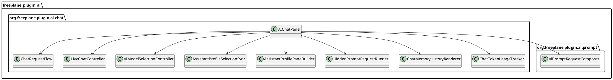
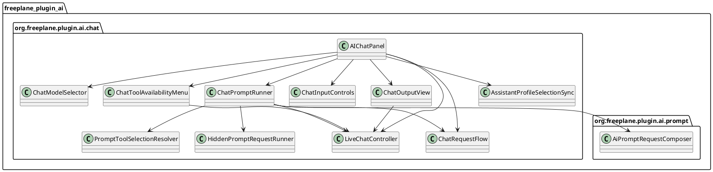

# Task: Refactor AIChatPanel into focused chat UI classes
- **Task Identifier:** 2026-05-17-ai-chat-panel-refactor
- **Scope:**
  Reduce the size and responsibility concentration of
  `org.freeplane.plugin.ai.chat.AIChatPanel` by extracting cohesive,
  package-local chat UI classes while preserving current chat
  behavior, prompt behavior, session override behavior, and transcript
  behavior.
- **Motivation:**
  `AIChatPanel.java` is currently 1337 lines long and mixes Swing view
  construction, input/send state, popup-menu behavior, prompt
  execution, prompt-progress UI, session activation, undo/redo,
  history rendering, and token-counter refresh. That concentration
  makes review, local reasoning, and safe change isolation harder than
  necessary.
- **Scenario:**
  A user sends a normal chat message, runs a shown prompt, runs a hidden
  prompt, restores a chat from history, changes the model or tools from
  chat UI controls, and switches assistant profiles. All of those user-
  visible behaviors remain the same after the refactor; only the
  internal class boundaries change.
- **Constraints:**
  - This task is a refactor. It must not intentionally change user-
    visible behavior unless a later approved follow-up task says so.
  - Preserve the prompt-session model/tool override behavior now
    recorded in `ai-specs/tasks/done/032-align-prompt-chat-model-and-tool-session-overrides.md`.
  - Preserve assistant-profile injection and compaction semantics.
  - Preserve existing persisted transcript fields and restore behavior.
  - Preserve existing keyboard shortcuts, hidden-prompt progress/cancel
    behavior, and chat tool-menu behavior.
  - Prefer package-local extractions in `org.freeplane.plugin.ai.chat`
    over broader API reshaping.
  - Avoid cross-module moves and avoid introducing new public API unless
    a narrower package-local boundary is insufficient.
  - For AI-plugin-owned classes, do not introduce new generic
    `*Controller` names as the default. Use responsibility-specific
    names instead, unless `Controller` is part of an external framework
    abstraction or adapter boundary that the class explicitly models.
- **Briefing:**
  `AIChatPanel` is the main Swing chat view in
  `freeplane_plugin_ai/src/main/java/org/freeplane/plugin/ai/chat/`.
  It already delegates core chat/session logic to classes such as
  `ChatRequestFlow`, `LiveChatController`,
  `AIModelSelectionController`, `AssistantProfileSelectionSync`,
  `AssistantProfilePaneBuilder`, `HiddenPromptRequestRunner`, and
  `ChatMemoryHistoryRenderer`, but it still owns too many orchestration
  details itself.
- **Research:**
  - `AIChatPanel.java` is 1337 lines long.
  - The constructor alone performs all of the following:
    - creates and styles Swing components;
    - wires `ChatRequestFlow` callbacks;
    - wires prompt-progress callbacks;
    - builds input panels and top-bar/menu UI;
    - installs keyboard shortcuts; and
    - registers multiple property listeners.
  - The class currently contains several distinct method clusters:
    - top-bar and popup-menu construction;
    - tool-availability menu state and prompt tool resolution;
    - input/send/provider UI state;
    - prompt execution and hidden-prompt progress handling;
    - history rendering and transient/failure/profile message display;
    - session activation, undo/redo, and token-counter refresh.
  - Existing classes already hold important business behavior:
    - `ChatRequestFlow` owns request lifecycle and response callbacks;
    - `LiveChatController` owns session/transcript coordination;
    - `AssistantProfileSelectionSync` owns profile-switch injection;
    - `AIModelSelectionController` owns chat model selector behavior;
    - `HiddenPromptRequestRunner` owns background hidden-prompt
      execution.
  - AI-plugin naming is currently mixed: domain-specific suffixes such
    as `Store`, `Runner`, `Builder`, `Dialog`, and `SelectionSync`
    already coexist with generic `*Controller` names that do not state
    a domain role precisely.
  - `AIModelSelectionController` is package-local to the chat package
    and directly owned by `AIChatPanel`, so this refactor can absorb a
    local rename to `ChatModelSelector` without cross-module API
    fallout.
  - The highest-risk methods for accidental behavior drift are:
    - `runPrompt(...)` and `createPromptChatService(...)`;
    - `ensureChatService()`;
    - `activateSession(...)`;
    - `applyUserSelectedToolAvailability(...)`; and
    - `updateInputState()`.

- **Design:**
  1. Keep `AIChatPanel` as the composition root for Swing widget
     ownership and high-level assembly, but reduce it to orchestration
     over narrower chat UI classes.
  2. Rename `AIModelSelectionController` to `ChatModelSelector`.
     Preserve its existing behavior: loading available models,
     displaying session overrides, persisting explicit user selections,
     and notifying `AIChatPanel` about effective and explicit changes.
  3. Extract `ChatToolAvailabilityMenu` to own:
     - tool popup-menu construction;
     - session-aware checked-state refresh;
     - explicit user tool changes.
  4. Extract `PromptToolSelectionResolver` to own:
     - conversion of prompt tool selection strings into effective tool
       availability for hidden prompt runs; and
     - derivation of shown-chat `toolAvailabilityOverride` values.
  5. Extract `ChatPromptRunner` to own:
     - `runPrompt(...)` behavior;
     - prompt chat-service creation;
     - shown vs hidden prompt branching;
     - hidden-prompt progress dialog lifecycle; and
     - prompt failure message formatting.
     `ChatPromptRunner` uses `PromptToolSelectionResolver` instead of
     embedding prompt tool-selection rules directly.
  6. Extract `ChatInputControls` to own:
     - send-button icon/tooltip state transitions;
     - provider-ready / no-provider / hidden-prompt-run input states;
     - the widget-state refresh logic now centered in
       `updateInputState()`.
  7. Extract `ChatOutputView` to own:
     - history rebuild/append operations;
     - transient, failure, and profile-message rendering helpers; and
     - token-usage label refresh.
  8. Preserve existing business owners:
     - `ChatRequestFlow` remains the request lifecycle owner;
     - `LiveChatController` remains the session/transcript owner for
       this increment;
     - `AssistantProfileSelectionSync` remains the profile-injection
       owner; and
     - `AIChatPanel` still decides how those classes are wired
       together.
  9. Refactor in low-risk order:
     - first rename `AIModelSelectionController` to
       `ChatModelSelector` without behavior change;
     - then extract `ChatToolAvailabilityMenu` and
       `PromptToolSelectionResolver`;
     - then extract `ChatPromptRunner`;
     - then extract `ChatInputControls`;
     - finally extract `ChatOutputView`.
  10. Keep new extracted types package-local unless implementation
      proves a wider visibility boundary is required.

- **Test specification:**
  - Automated tests:
    - run `gradle -Djava.net.preferIPv6Addresses=true -Djava.awt.headless=true :freeplane_plugin_ai:test` as the minimum regression suite for each implementation increment;
    - add focused unit tests only for extracted classes whose
      behavior is not already adequately covered through existing panel,
      class-level, or transcript tests;
    - keep prompt model/tool override behavior covered during the
      refactor so structural extraction cannot silently regress it.
  - Manual tests:
    - send a normal chat message and verify request/response behavior is
      unchanged;
    - run a shown prompt with explicit model/tools and verify the chat
      still reflects the same session-effective values;
    - run a hidden prompt and verify the progress dialog and cancel path
      still behave the same;
    - change tools and model from chat UI controls and verify the same
      global-default/session-override behavior as before;
    - switch assistant profiles and verify injected profile behavior and
      transcript restore still match current semantics;
    - use undo/redo and restore a transcript from history to verify
      history rendering and token counters still refresh correctly.

## Subtask: Move request snapshot memory ownership out of AIChatPanel
- **Status:** done
- **Scope:**
  Remove `AIChatPanel` ownership of request snapshot-size and memory
  truncation logic. Route that behavior through the existing
  `SingleTurnChatMemory` / `SingleTurnChatMemoryFactory` adapter path
  while preserving current request cancel/restore behavior.
- **Motivation:**
  `AIChatPanel.truncateMemoryToSize(...)` and `AIChatPanel.getMemorySize()`
  are not UI responsibilities. They duplicate the same memory-adapter
  branching already present in `SingleTurnChatMemoryFactory`, so the
  current refactor still leaves memory ownership split across the panel
  and the adapter layer.
- **Constraints:**
  - Preserve request snapshot/restore semantics for both
    `AssistantProfileChatMemory` and generic `ChatMemory` instances.
  - Preserve post-response assistant-profile compaction behavior in
    `ChatRequestFlow`.
  - Remove dead callback paths when they no longer serve any runtime
    behavior.
- **Briefing:**
  `ChatRequestFlow` currently restores failed/cancelled requests by
  calling `snapshotMemorySize()` and `truncateMemoryToSize(...)`
  callbacks implemented by `AIChatPanel`. The chat package already has
  `SingleTurnChatMemoryFactory` adapters that know how to snapshot and
  truncate both `AssistantProfileChatMemory` and generic `ChatMemory`.
- **Research:**
  - `AIChatPanel.getMemorySize()` and
    `AIChatPanel.truncateMemoryToSize(...)` duplicate the branching
    between `AssistantProfileChatMemory` and generic `ChatMemory`.
  - `SingleTurnChatMemoryFactory` already provides:
    - `snapshotSize()`;
    - `truncateTo(int size)`; and
    - `evictOldestTurn()`.
  - `ChatRequestFlow.RequestCallbacks.evictOldestTurn()` is currently
    declared and implemented but not used.
- **Design:**
  1. Change `ChatRequestFlow` to own a `SingleTurnChatMemory` adapter
     derived from the current `ChatMemory`.
  2. Update `ChatRequestFlow.updateChatMemory(...)` so it accepts the
     active `ChatMemory`, derives the `SingleTurnChatMemory` via
     `SingleTurnChatMemoryFactory`, and separately keeps the optional
     `AssistantProfileChatMemory` reference needed for tool-summary and
     post-response compaction behavior.
  3. Remove `snapshotMemorySize()` and `truncateMemoryToSize(...)`
     from `ChatRequestFlow.RequestCallbacks`.
  4. Remove the dead `evictOldestTurn()` callback from
     `ChatRequestFlow.RequestCallbacks`.
  5. Remove `AIChatPanel.getMemorySize()` and
     `AIChatPanel.truncateMemoryToSize(...)` after `ChatRequestFlow`
     owns snapshot/truncate behavior.
- **Test specification:**
  - Automated tests:
    - run `gradle -Djava.net.preferIPv6Addresses=true -Djava.awt.headless=true :freeplane_plugin_ai:test`;
    - update `ChatRequestFlowTest` for the reduced callback surface;
    - add focused coverage for the `SingleTurnChatMemoryFactory`
      snapshot/truncate behavior now relied on directly by
      `ChatRequestFlow`.
  - Manual tests:
    - cancel an in-flight visible request and verify chat history and
      input restore exactly as before;
    - trigger a visible-request failure and verify the same failure
      recovery behavior as before.
