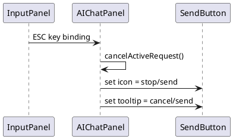

# Task: Add escape cancel shortcut and dynamic tooltips for AI chat send button
- **Task Identifier:** 2026-01-31-ai-chat
- **Scope:** Add an ESC binding on the chat input panel to cancel an active
  request, and update the send/stop button tooltip when its icon changes.
- **Motivation:** The send button doubles as a cancel button while a request is
  active; exposing ESC to cancel and reflecting the current action in the
  tooltip improves discoverability and feedback.
- **Developer Briefing:** The send button currently shows a translated tooltip
  for the send shortcut (menu shortcut + Enter). When a request is active,
  the button icon switches to the stop icon. Add an ESC key binding on the
  input panel to cancel active requests and update tooltips when the button
  switches between send and stop. Preserve the existing send tooltip and
  add a new cancel tooltip.
- **Research:**
  - AIChatPanel configures the send shortcut as menu shortcut + Enter and
    sets a tooltip using key ai_chat_send.tooltip in
    `freeplane/src/viewer/resources/translations/Resources_en.properties`.
  - The send button toggles icons via setSendButtonStopState() and
    setSendButtonSendState(), but tooltips are not updated there.
  - There is no ESC binding in AIChatPanel; cancelActiveRequest() exists
    and already restores the send state.
- **Design:**

- **Test specification:**
  - **Automated tests:** None.
  - **Manual tests:**
    - While a chat request is active, pressing ESC in the input panel cancels
      the request and restores the send icon.
    - The send button tooltip shows the send shortcut when idle and a cancel
      tooltip (with ESC) while a request is active.
