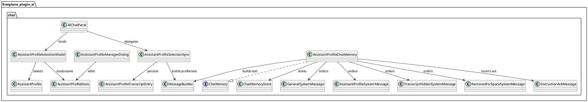
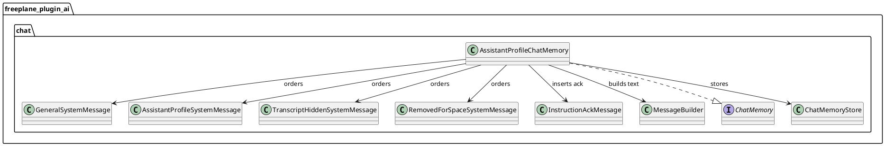
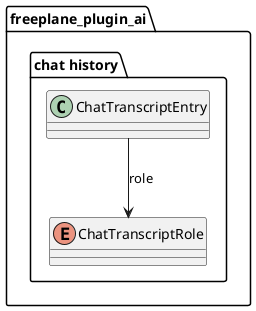
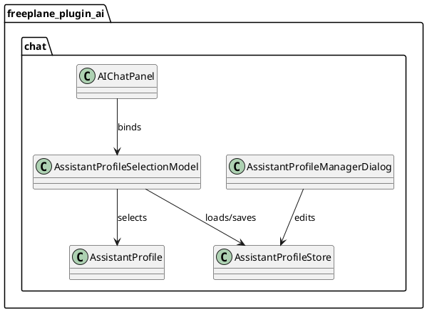

# Task: Chat memory system messages and assistant profiles
- **Task Identifier:** 2026-02-03-assistant-profiles
- **Scope:**
  - Support multiple instruction slots in chat memory while preserving
    strict chronological order for all non-general messages.
  - Keep only the general instruction as a SystemMessage; send all
    other instruction slots as UserMessages prefixed with
    `control instruction, please confirm with "ok":`.
  - Inject an assistant acknowledgement message `"ok"` immediately
    after each prefixed instruction message to keep
    user/assistant turn alternation consistent.
  - Allow the user to define, save, and select assistant profiles.
  - Add an assistant profile selector UI (drop-down near the chat input).
  - Preserve tool request/result eviction invariants.
  - Insert a removed-for-space marker when user/assistant/tool
    messages are evicted for capacity.
  - Ensure transcript hidden and removed-for-space markers are excluded
    from capacity counting.
  - Persist transcript entries for assistant profile and
    removed-for-space system messages; do not persist general or
    transcript hidden system messages.
- **Motivation:**
  - Allow assistant profile updates and transcript framing without
    losing earlier guidance, while remaining compatible with models
    that do not reliably honor injected system messages.
  - Provide a stable user-facing hint when context is trimmed.
- **Developer Briefing:**
  - Replace LC4J MessageWindowChatMemory usage with a custom
    ChatMemory implementation that supports ordered instruction slots.
  - Rename `SystemMessageBuilder` to `MessageBuilder` and make it the
    central builder for all message kinds used by chat memory and
    profile-change injection.
  - Introduce message tagging (subclasses of SystemMessage) for
    general, assistant profile, transcript hidden, and removed-for-space,
    but convert all non-general slots to prefixed UserMessages when
    building the final message list for the model.
  - Add protocol guidance to the general system message so the model
    interprets control-instruction UserMessages and profile updates
    consistently.
  - Add a persisted assistant profile catalog and UI to manage
    assistant profiles (create/edit/delete) and select the active
    assistant profile per chat.
  - Enforce chronological order and capacity rules on add and read.
  - Keep LC4J tool handling unchanged; tools are passed via
    ChatRequestParameters, not system messages.
- **Research:**
  - LC4J 1.10.0 MessageWindowChatMemory keeps a single SystemMessage
    and replaces it on add; it also evicts orphan tool results when the
    corresponding AiMessage is evicted.
  - LC4J SystemMessage type is determined by ChatMessage.type().
    Subclasses of SystemMessage still return SYSTEM, but equals uses
    getClass(), so subclasses do not compare equal to base class.
  - Chat transcripts are serialized via Jackson ObjectMapper in
    ChatTranscriptStore as ChatTranscriptRecord JSON gzip files.
    Transcript entries store role + text (ChatTranscriptEntry); LC4J
    ChatMessage objects are not serialized.
  - Current transcript roles are user/assistant only; system messages
    are injected separately and are not persisted.
  - Current general system message text is configured via Freeplane
    preferences property `ai_system_message` and is combined with
    additional guidance in `SystemMessageBuilder`; this builder is the
    target of the `MessageBuilder` rename.
- **Design:**

  - Ordering:
    - General system message remains a single pinned SystemMessage.
    - Every other message is preserved in strict append chronology.
    - Transcript hidden, removed-for-space, profile-change control
      messages, acknowledgements, user, assistant, and tool messages
      are emitted in stored order without read-time reordering.
    - Each control instruction is followed by an assistant `"ok"`
      acknowledgement stored at insertion time.
  - Transcript persistence:
    - Extend `ChatTranscriptRole` to include system entries for
      assistant profile updates and removed-for-space markers.
    - Use Jackson subtype deserialization by `role`:
      - Base entry: `ChatTranscriptEntry`
      - Profile subtype:
        - `AssistantProfileTranscriptEntry`
      - `ASSISTANT_PROFILE_SYSTEM` resolves to profile subtype.
    - Store profile-specific data as fields in subtype:
      - `profileId`
      - `profileName`
      - `containsProfileDefinition`
    - Persist `role` for assistant profile and removed-for-space
      entries; do not store general or transcript hidden system
      messages.
    - Do not persist general or transcript hidden system messages in
      transcripts.
  - Eviction removes from the beginning of the counted portion.
    - If an assistant profile message has no remaining
      user/assistant/tool messages after it, remove that profile
      message too.
    - Preserve LC4J tool result eviction behavior for orphan
      ToolExecutionResultMessage entries.
  - Insert removed-for-space marker once when any
    user/assistant/tool message is evicted; insert it immediately
    before the first retained counted message so chronology remains
    coherent after truncation.
  - Assistant profile catalog and selection:
    - Provide a user-managed catalog of named assistant profiles.
    - Persist assistant profiles in the Freeplane user directory as JSON
      (separate from transcripts), using Jackson:
      - Each assistant profile has a stable id, a display name, and a
        system message prompt text.
      - Proposed location:
        - `<freeplaneUserDir>/ai-assistant-profiles.json`
      - Seed the initial JSON from a bundled resource if missing.
      - Include an empty Default profile plus a Freeplane Default
        profile that contains the previous system message text.
    - UI:
      - Add a drop-down selector near the chat input to choose the
        active assistant profile for the current live chat session.
      - Add a small "manage profiles" button next to the drop-down,
        using `freeplane/src/editor/resources/images/EggheadCB.svg`,
        to open a dialog for create/edit/delete of assistant profiles.
  - Applying an assistant profile:
    - Changing the assistant profile marks it as pending.
    - When the user sends the next message, inject a
      `ChatTranscriptEntry(role=ASSISTANT_PROFILE_SYSTEM, text=<prompt>)`
      and add the corresponding AssistantProfileSystemMessage to chat
      memory immediately before the user message.
    - Profile instruction formats:
      - Historical marker:
        - `Now you have the profile <Name>.`
      - Latest full instruction:
        - `Now you have the profile <Name>.`
        - `Profile definition: <Definition>`
    - Keep only one full profile definition in memory and downgrade
      older profile-change entries to historical markers.
    - `AssistantProfileSystemMessage` stores profile fields
      (`profileId`, `profileName`, `profileDefinition`,
      `containsProfileDefinition`) and derives instruction text via
      `MessageBuilder`.
    - `AssistantProfileSystemMessage` uses structured construction only.
    - Re-selecting the last-injected profile id does not inject again.
    - Pending selection and duplicate suppression are compared by
      normalized `profileId`.
    - General and transcript hidden system messages remain injected
      separately (not persisted in transcripts).
    - Default selection:
      - New chat sessions start with the last-used assistant profile.
    - Transcript behavior:
      - Transcripts store only assistant profile id/name marker data
        and `containsProfileDefinition`; profile definitions are not
        persisted in transcript entries.
      - On restore, if transcript `profileId` exists in the current
        profile catalog, select that current profile definition.
      - If transcript `profileId` does not exist in the current
        profile catalog, keep the current chat selection unchanged and
        do not create a custom fallback profile.
      - Activation modes:
        - Transcript restore activation always schedules one pending
          profile instruction with `containsProfileDefinition=true`
          before the first new user message.
        - Live session switch does not schedule reinjection when
          transcript profile id still exists.
        - Live session switch schedules reinjection only when the last
          transcript profile id no longer exists in the current profile
          catalog.
    - Chat pane behavior:
      - Do not render profile-control instruction text in the chat pane.
      - Do not render the profile-control acknowledgement `"ok"` in the
        chat pane.
      - Render a UI-only profile event message instead:
        - `<translated "AI profile"> <ProfileName>`
      - Keep memory and transcript protocol messages unchanged.
      - Apply the same rendering rule when restoring snapshots from
        transcript entries:
        - profile system entries render as profile event messages,
        - immediate assistant acknowledgement `"ok"` entries that belong
          to a profile system entry are not rendered.
  - Message construction ownership:
    - `MessageBuilder` composes all chat instruction text:
      - general system message,
      - control-instruction protocol preface embedded in the general
        system message,
      - profile-change instruction,
      - transcript-hidden instruction,
      - removed-for-space instruction,
      - optional instruction acknowledgement.
    - Chat UI and memory classes consume built strings and do not
      duplicate message-format logic.
- **Test specification:**
  - Automated tests:
    - Verify ordering of instruction slots with and without transcript
      hidden and removed-for-space messages, and that non-general slots
      are emitted as prefixed UserMessages.
    - Verify non-general slots are prefixed with
      `control instruction, please confirm with "ok":`.
    - Verify capacity counts exclude transcript hidden and
      removed-for-space messages.
    - Verify assistant profile messages are dropped when all following
      user/assistant/tool messages are evicted.
    - Verify only the latest profile-change instruction keeps full
      definition and older ones are emitted as historical markers.
    - Verify removed-for-space marker is inserted once when
      user/assistant/tool eviction occurs.
    - Verify orphan tool result eviction still occurs.
    - Verify transcript save/load preserves assistant profile and
      removed-for-space system entries, while general and transcript
      hidden messages are not stored.
    - Verify profile transcript entries deserialize as
      `AssistantProfileTranscriptEntry` and preserve structured marker
      fields.
    - Verify persisted assistant profile catalog loads/saves correctly
      and selection appends an `ASSISTANT_PROFILE_SYSTEM` transcript
      entry with `profileId`/`profileName`.
    - Verify profile selection appends exactly one profile event message
      to chat pane and does not append visible control instruction or
      visible `"ok"` acknowledgement.
    - Verify transcript snapshot rendering maps
      `ASSISTANT_PROFILE_SYSTEM` entries to profile event messages and
      suppresses adjacent profile acknowledgement `"ok"` entries.
  - Manual tests:
    - Start a chat, overflow capacity, and verify UI transcript shows
      a removed-for-space marker once.
    - Load a transcript and confirm transcript hidden marker appears
      in the correct order.
    - Save and reload a transcript with assistant profile updates and
      removed-for-space markers and confirm they are restored.
    - Define a new assistant profile, select it, send a message, close
      and reopen Freeplane, and confirm the profile is still available
      and selectable.

## Subtask: Chat Memory Slots And Eviction
- **Status:** done
- **Scope:**
  - Implement a custom chat memory with ordered instruction slots
    and eviction rules.
- **Motivation:**
  - Support multiple instruction slots and deterministic ordering while
    preserving tool request/result invariants.
- **Developer Briefing:**
  - Replace MessageWindowChatMemory with a custom implementation that
    supports ordered slots and pinned general system messages, while
    converting other instruction slots to prefixed UserMessages.
  - Rename `SystemMessageBuilder` to `MessageBuilder` and centralize
    instruction text composition in that class.
  - Emit profile-change instructions using one full latest definition
    plus historical name-only markers for older profile switches.
  - Enforce eviction from the beginning of the counted portion and
    preserve tool request/result eviction behavior.
- **Research:**
  - LC4J MessageWindowChatMemory enforces a single SystemMessage and
    removes orphan ToolExecutionResultMessage entries when their
    AiMessage is evicted.
- **Design:**

  - Ordering:
    - General system message remains a single pinned SystemMessage.
    - All non-general messages are emitted in strict chronological
      order.
    - Control instructions are never repositioned on read.
    - Each control instruction stores an adjacent assistant `"ok"`
      acknowledgement at insertion time.
  - Profile compaction:
    - Preserve profile switch history in chronological order.
    - Keep only the latest profile-change instruction with full
      definition.
    - Mutate older stored profile-change instructions to:
      - `Now you have the profile <Name>.`
  - Eviction removes from the beginning of the counted portion.
    - If an assistant profile message has no remaining
      user/assistant/tool messages after it, remove that profile
      message too.
    - Preserve LC4J tool result eviction behavior for orphan
      ToolExecutionResultMessage entries.
  - Insert removed-for-space marker once when any
    user/assistant/tool message is evicted; place it before the first
    retained counted message.
- **Test specification:**
  - Automated tests:
    - Verify ordering of system messages with and without transcript
      hidden and removed-for-space messages.
    - Verify non-general instructions use prefix
      `control instruction, please confirm with "ok":`.
    - Verify capacity counts exclude transcript hidden and
      removed-for-space messages.
    - Verify assistant profile messages are dropped when all following
      user/assistant/tool messages are evicted.
    - Verify latest profile instruction keeps full definition while
      older entries are rewritten to name-only markers.
    - Verify removed-for-space marker is inserted once when
      user/assistant/tool eviction occurs.
    - Verify orphan tool result eviction still occurs.

## Subtask: Transcript Roles And Persistence
- **Status:** done
- **Scope:**
  - Persist assistant profile and removed-for-space system entries in
    chat transcripts.
- **Motivation:**
  - Ensure assistant profile changes and context trimming are preserved
    when saving and restoring chats.
- **Developer Briefing:**
  - Extend ChatTranscriptRole with system roles for assistant profile
    and removed-for-space entries.
  - Update transcript save/load flow to store those roles while
    using the current structured subtype format.
- **Research:**
  - Chat transcripts are serialized via Jackson ObjectMapper in
    ChatTranscriptStore as ChatTranscriptRecord JSON gzip files.
  - Current transcript roles are user/assistant only; system messages
    are injected separately and are not persisted.
- **Design:**

  - Extend `ChatTranscriptRole`:
    - `ASSISTANT_PROFILE_SYSTEM`
    - `REMOVED_FOR_SPACE_SYSTEM`
  - Persist `role` for assistant profile and removed-for-space entries;
    do
    not store general or transcript hidden system messages.
  - Persist assistant profile transcript subtype fields:
    - `profileId`
    - `profileName`
    - `containsProfileDefinition`
  - Do not persist assistant profile definition text in transcript
    entries.
- **Test specification:**
  - Automated tests:
    - Verify transcript save/load preserves assistant profile and
      removed-for-space system entries, while general and transcript
      hidden messages are not stored.
  - Manual tests:
    - Save and reload a transcript with assistant profile updates and
      removed-for-space markers and confirm they are restored.

## Subtask: Assistant Profile Catalog And UI
- **Status:** done
- **Scope:**
  - Provide a user-defined assistant profile catalog and a selector in
    the chat panel.
- **Motivation:**
  - Let users define and switch assistant profiles across chats.
- **Developer Briefing:**
  - Persist assistant profiles as JSON in the Freeplane user directory.
  - Add an assistant profile selector near the chat input and a manage
    dialog for create/edit/delete.
  - New chats start with the last-used assistant profile.
  - Transcripts store assistant profile id/name markers only; restore
    selects by current profile catalog id.
  - If transcript profile id is missing from the current profile
    catalog, keep current chat selection unchanged.
  - Profile-change text formatting must be delegated to `MessageBuilder`
    and follow the latest-full plus historical-marker rule.
- **Research:**
  - The current general system message is configured via
    `ai_system_message` and combined with guidance in
    `SystemMessageBuilder`; this class is planned to be renamed to
    `MessageBuilder`.
- **Design:**

  - Assistant profile catalog:
    - Persist as JSON at `<freeplaneUserDir>/ai-assistant-profiles.json`.
    - Each assistant profile has a stable id, a display name, and a
      prompt.
  - UI:
    - Drop-down selector near the chat input.
    - Manage dialog with create/edit/delete.
  - Applying an assistant profile:
    - Changing the profile marks it as pending; injection happens only
      when the next user message is sent.
    - Injection appends an `AssistantProfileTranscriptEntry` with
      `role=ASSISTANT_PROFILE_SYSTEM` and fields
      `profileId`/`profileName`/`containsProfileDefinition`, and adds the
      corresponding AssistantProfileSystemMessage to memory immediately
      before the user message.
    - Render older profile changes as:
      - `Now you have the profile <Name>.`
    - Render the latest profile change as:
      - `Now you have the profile <Name>.`
      - `Profile definition: <Definition>`
- **Test specification:**
  - Automated tests:
    - Verify persisted assistant profile catalog loads/saves correctly
      and selection appends an `ASSISTANT_PROFILE_SYSTEM` transcript
      entry.
    - Verify transcript restore selects profile by `profileId` from the
      current catalog and keeps current selection when the id is
      missing.
    - Verify transcript-restore activation always schedules one profile
      definition reinjection before first new user message.
    - Verify live-session switch does not schedule reinjection when
      stored profile id is still available.
    - Verify live-session switch schedules reinjection when stored
      profile id is missing.
    - Verify UI and transcript restore display one full latest profile
      instruction and historical markers for previous switches.
  - Manual tests:
    - Define a new assistant profile, select it, send a message, close
      and reopen Freeplane, and confirm the profile is still available
      and selectable.
