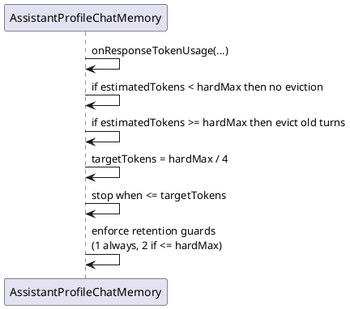
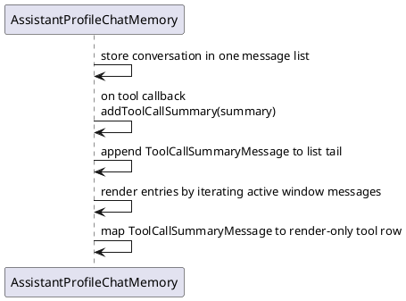

# Task: Token-based chat memory window
- **Task Identifier:** 2026-02-06-token-memory
- **Scope:** Replace chat memory truncation by message count with a
  token-based sliding window as the only active memory policy for AI
  chat sessions, while preserving current assistant profile/system
  instruction semantics, turn grouping/undo-redo behavior, and
  tool-message consistency. Use cursor-based eviction (move window
  start) instead of destructive message deletion.
- **Motivation:** Message-count windows are coarse and can overflow real
  model context when messages are long. Token-based limits align memory
  with model constraints and reduce context overflow risk.
- **Developer Briefing:** The current memory implementation is custom
  because it injects and compacts profile/system instruction messages.
  The migration should keep these behaviors while replacing
  message-count eviction entirely with token-count eviction. LLM tool
  messages are memory-backed; MCP tool messages are UI-transient and are
  not part of memory eviction math.
- **Research:**
  - `freeplane_plugin_ai/src/main/java/org/freeplane/plugin/ai/chat/AssistantProfileChatMemory.java`
    in the baseline implementation evicts by message count
    (`maxMessagesProvider`), not by token totals.
  - `AssistantProfileChatMemory` already contains custom rules for:
    `AssistantProfileSystemMessage` compaction, single
    `RemovedForSpaceSystemMessage`, `TranscriptHiddenSystemMessage`,
    `InstructionAckMessage`, and orphan tool result eviction when a tool
    request message is removed.
  - `freeplane_plugin_ai/src/main/java/org/freeplane/plugin/ai/chat/ChatMemorySettings.java`
    in baseline exposes message-count settings; token-count settings are
    part of the in-progress branch changes.
  - `freeplane_plugin_ai/src/main/resources/org/freeplane/plugin/ai/preferences.xml`
    does not currently expose chat memory mode/limits in UI settings.
  - `freeplane_plugin_ai/src/main/resources/org/freeplane/plugin/ai/defaults.properties`
    baseline did not provide a committed token-memory default; token
    defaults are currently part of uncommitted in-progress changes.
  - `freeplane_plugin_ai/src/main/resources/org/freeplane/plugin/ai/preferences.xml`
    currently has no chat-memory mode/size controls; this task should
    keep that unchanged unless requested separately.
  - `freeplane_plugin_ai/src/main/java/org/freeplane/plugin/ai/chat/AIChatPanel.java`
    and `LiveChatController` currently instantiate memory through
    `AssistantProfileChatMemory.withMaxTokens(...)` and
    `ChatMemorySettings`, so adding token mode should be localized to
    settings + memory construction.
  - Plugin memory continues using custom profile/system/tool behavior
    with message-based eviction in the committed baseline.
  - LangChain4j provides local token estimators that can be used to
    approximate token counts for chat messages.
  - `AIChatService` records provider token usage only when
    `AiServiceResponseReceivedEvent` arrives; provider totals are
    incomplete for per-message eviction decisions.
  - Current working tree contains uncommitted token-memory changes; this
    task design describes the target state, not yet-committed baseline.
  - `AIChatService` records `TokenUsage` only when
    `AiServiceResponseReceivedEvent` arrives, so provider token usage is
    available after a successful response.
  - Transcript-restored messages do not have provider token-usage
    deltas; local estimation is needed for consistent eviction when
    transcript messages are part of the active window.
  - `ChatTokenUsageTracker` currently stores cumulative chat totals only
    and has no per-turn/per-block token attribution.
  - Provider token usage includes system instructions, tool metadata,
    and other model-specific overhead that is not directly attributable
    to individual removable chat messages.
  - Accurate per-message token usage is not available from providers,
    so local estimation is the only consistent way to measure removable
    blocks for eviction or counter displays.
  - `AIChatPanel` currently appends an error message on request failure
    and always calls `finishRequest()`. Restoring pending user input and
    truncating memory is currently done only on cancellation via
    `restoreCancelledRequest()`.
  - Current in-progress structure introduces request orchestration in
    `ChatRequestFlow` and a turn-scoped memory bridge
    (`SingleTurnChatMemory` via `SingleTurnChatMemoryFactory`) so
    rollback/eviction paths can work with `AssistantProfileChatMemory`
    and generic `ChatMemory` uniformly.
  - `AssistantProfileChatMemory` remains the conversation single source
    of truth. Turn rollback/truncation must operate on that memory
    directly (message-count cursor/truncate), not snapshot copies.
  - Current regressions showed that UI-only tool-call rendering can be
    lost on panel rebuild; tool-call visibility rules must be explicit
    in design:
    - LLM tool calls are memory-backed and must rebuild from memory.
    - MCP tool calls are transient panel entries and not transcript data.
  - Existing tests in
    `freeplane_plugin_ai/src/test/java/org/freeplane/plugin/ai/chat/AssistantProfileChatMemoryTest.java`
    verify current custom semantics for message-window behavior.
  - There are no existing unit tests for `ChatMemorySettings`; those
    tests need to be introduced in this task.
- **Design:**

  ```plantuml
  @startuml
  actor User
  participant "AIChatPanel" as ChatPanel
  participant "ChatRequestFlow" as RequestFlow
  participant "AssistantProfileChatMemory" as Memory
  participant "ChatTokenUsageTracker" as UsageTracker
  participant "AIChatService" as ChatService
  participant "MCP transient panel log" as McpLog

  User -> ChatPanel : send message
  ChatPanel -> Memory : add(user/assistant/tool/system)
  ChatPanel -> McpLog : append MCP tool call (transient)
  ChatPanel -> RequestFlow : start request
  RequestFlow -> ChatService : chat(request)
  ChatService --> RequestFlow : response token usage (optional)
  RequestFlow -> Memory : post-response eviction (cursor move)
  RequestFlow -> UsageTracker : update counters
  Memory --> ChatPanel : active window messages
  UsageTracker --> ChatPanel : counters (or hidden)
  McpLog --> ChatPanel : shown until undo/redo or chat switch
  @enduml
  ```

  ```plantuml
  @startuml
  set separator none
  package "org.freeplane.plugin.ai.chat" {
    class AssistantProfileChatMemory
    class ChatMemorySettings
    class ChatTokenUsageTracker
    class ChatTokenEstimator
    class ChatTokenCounterMode
    class ChatRequestFlow
    class AIChatPanel
  }

  AssistantProfileChatMemory --> ChatMemorySettings : reads token limit
  AIChatPanel --> AssistantProfileChatMemory : active window messages
  ChatRequestFlow --> ChatTokenUsageTracker : updates counters
  ChatTokenUsageTracker --> ChatTokenCounterMode : mode selection
  ChatTokenUsageTracker --> AssistantProfileChatMemory : request estimates
  AssistantProfileChatMemory --> ChatTokenEstimator : estimate tokens
  @enduml
  ```

  - Make token-window eviction the single active memory policy.
  - Extend `ChatMemorySettings` with token-limit configuration:
    `ai_chat_memory_maximum_token_count` with a safe default and no
    hardcoded minimum clamp (accept any positive value).
  - Remove message-count-based eviction logic from
    `AssistantProfileChatMemory`.
  - Keep profile/system/tool eviction semantics unchanged; only the
    capacity metric changes.
  - Eviction must move a conversation window-start cursor instead of
    deleting historical messages from the underlying list.
  - Token counting for eviction is based on local estimation of
    removable blocks (user, assistant, tool call, tool result) only.
  - Always-present system and tool instructions are treated as constant
    overhead and are not included in the removable-token tally.
  - Profile control instructions may be compacted or removed by other
    logic; they are excluded from the removable-token tally.
  - LLM tool-call messages are included in token accounting and must be
    rebuilt from memory after panel refresh.
  - MCP tool-call messages are not memory-backed and not included in
    token accounting; they are transient panel entries shown until
    undo/redo or chat switch.
  - Keep turn-level rollback logic cursor-based (sizes/indexes) over the
    same memory instance; do not introduce snapshot-based message copies.
  - Token usage display uses estimates provided by
    `AssistantProfileChatMemory`, keeping estimator details internal.
  - Provider usage callbacks record usage only; token counters refresh
    after assistant responses are appended to memory so estimates are
    consistent with the rendered conversation.
  - `ChatTokenEstimator` is a private helper owned by
    `AssistantProfileChatMemory` and is not accessed by the panel.
  - Token counter display is configurable via preferences with four
    modes (default: hidden):
    - Hidden: no counters are shown.
    - Context window estimates: input/output counters use the estimator
      on removable blocks in the active window.
    - Total chat estimates: input/output counters use the estimator on
      removable blocks across the full chat history.
    - Model response: input/output counters show the last response's
      provider usage only (no accumulation, no estimator).
  - Counter labels use the selected preference text (for example
    "Context window estimates") and avoid the literal word "tokens" to
    keep localization flexible; the label is omitted if no mode label
    is available.
  - Implement the counter mode preference as a `radiobuttons` group
    with four `choice` values and translation keys.
  - Provide explicit English translations for the counter mode choices
    to avoid placeholder labels in preferences.
  - Eviction runs after successful responses (post-response eviction)
    and moves the window cursor by completed turns until estimated
    removable tokens are within the configured limit.
  - Always keep at least one user message in the active window. If the
    earliest user message alone exceeds the token budget, keep it and
    stop evicting (do not advance past that first user message).
  - Refactor `AssistantProfileChatMemory` to make eviction decisions
    fully testable and remove opaque flags:
    - Eviction is triggered only from the post-response usage callback.
    - Keep eviction logic in a single method that returns whether the
      window advanced so callers can rebuild UI immediately.
    - Avoid introducing new classes unless needed for test isolation;
      prefer extracting private helpers that return deterministic
      results.
  - On provider `context too large` error, run eviction and retry the
    pending request with retry limits to avoid infinite loops.
  - Keep provider hard context limits and plugin memory limits separate:
    provider limits gate request success, plugin limits govern retained
    history after each turn.
  - Do not keep message-window compatibility path.
  - Keep transcript seeding and conversation-cursor behavior unchanged
    under token mode.
  - Expose `ai_chat_memory_maximum_token_count` in preferences and add a
    tooltip explaining approximate token counting semantics.
- **Test specification:**
  - Automated tests:
    - Add `AssistantProfileChatMemory` tests for token-window eviction:
      oldest turns are evicted after a response pushes provider totals
      beyond the configured limit.
    - Verify profile/system instruction semantics stay unchanged in
      token mode (compaction, hidden/system instruction presence, single
      removed-for-space marker).
    - Verify tool-request eviction in token mode also removes following
      tool-result messages.
    - Add `ChatMemorySettings` parsing tests for token count property
      defaults and invalid values.
    - Add runtime integration tests to verify panel/session flows use
      token mode without changing undo/redo and transcript semantics.
    - Add tests for post-response eviction and context-too-large retry
      flow with bounded retries.
    - Add tests for local-estimator token accounting for removable
      blocks and eviction based on estimated totals.
    - Add tests for counter display modes:
    - Hidden shows no counters.
    - Context window estimates reflect removable blocks inside the
      active window.
    - Total chat estimates reflect removable blocks across the full
      conversation list.
    - Model response shows last provider usage only and does not
      accumulate across turns.
    - Counter labels use the selected preference text and omit the
      literal word "tokens".
    - Add tests that eviction never removes the last remaining user
      message in the active window, even when it exceeds the token
      limit.
    - Expand `AssistantProfileChatMemory` coverage to include:
      - Eviction does not run while a request is in flight and runs only
        after the post-response usage callback.
      - Eviction advances the active window by exactly one completed
        turn per usage callback and never moves backwards.
      - Context-boundary marker appears immediately after eviction when
        rebuilding the render entries.
      - Undo/redo boundaries interact correctly with a non-zero window
        start index.
      - Tool call summaries render once and tool results are excluded
        when summaries are present.
      - Control instruction and transcript-hidden messages remain
        system-rendered and excluded from transcript entries.
  - Manual tests:
    - Run a long multi-turn chat with large messages and verify old
      turns are removed as token budget is exceeded while recent turns
      remain coherent.
    - Verify runtime stability for OpenRouter, Gemini, and Ollama
      selections with token-window memory.

## Subtask: Reset active window to quarter on overflow
- **Status:** done
- **Scope:**
  Update overflow eviction behavior so memory is trimmed only after
  reaching the absolute maximum token limit, and then reset to a
  quarter of the configured maximum while preserving minimum turn-block
  safety rules.
- **Motivation:**
  Current behavior tries to stay close to the maximum after each
  eviction cycle. The requested behavior is burst-friendly: allow growth
  up to max, then aggressively reset to 25% to reduce repeated
  near-limit pressure.
- **Developer Briefing:**
  This subtask changes only the overflow eviction target and turn-block
  retention guards. Keep existing transcript/profile/tool semantics and
  keep removing only older turn-blocks from the beginning of history.
- **Research:**
  Overflow handling currently calls eviction in
  `AssistantProfileChatMemory.evictIfNeededAfterResponse()` and in the
  context-too-large retry path via `evictOldestTurn()`.

  Existing logic already preserves at least one user turn-block in edge
  cases and evicts old turns first.

  In this task, retention/eviction unit is a turn-block (full
  conversation turn), not a single low-level `ChatMessage`.
  A turn-block includes the user/assistant turn content and the related tool
  call/result messages handled by current memory rules.

  Assistant-profile control messages continue to follow existing
  compaction/instruction semantics and must remain consistent with block
  eviction behavior, as in current trimming logic.

  New rules required by user clarification:
  - Do not evict while below hard max token limit.
  - On overflow, trim to 25% of configured max.
  - Keep one turn-block always, regardless of limits.
  - Keep two turn-blocks when their total token estimate is within hard
    max; otherwise keep one.
- **Design:**



  Add explicit thresholds:
  - `hardMaxTokens = configured maximum token count`
  - `resetTargetTokens = floor(hardMaxTokens / 4)`

  Eviction trigger:
  - Start eviction only when estimated removable-token usage reaches or
    exceeds `hardMaxTokens`.

  Eviction stop condition:
  - Continue evicting oldest completed turns until estimated removable
    tokens are at or below `resetTargetTokens`, subject to retention
    guards.

  Retention guards:
  - Never evict the last remaining turn-block.
  - Allow keeping two turn-blocks only if their estimated token sum is
    `<= hardMaxTokens`; otherwise keep one.
- **Test specification:**
  Automated tests:
  - Overflow trigger test: no eviction below hard max; eviction starts
    at/above hard max.
  - Reset-target test: overflow eviction reduces active window to around
    25% target rather than near hard max.
  - Retention guard tests:
    - one-turn-block conversation is always preserved;
    - two-turn-block preservation happens only when both fit hard max;
    - fallback to one turn-block when two exceed hard max.

  Manual tests:
  - Run a long chat and verify context grows to max before eviction.
  - After overflow, verify old turn-blocks are removed and active window is
    much smaller (about quarter of max), not near full.

## Subtask: Preserve turn-block chronological order (including tool summaries)
- **Status:** done
- **Scope:**
  Fix the same chronology bug by strengthening how tool summaries are
  bound to turn-block rendering. A turn-block means one user turn plus
  all associated tool activity and the assistant response. Rendering
  must keep this block order stable after context eviction.
- **Motivation:**
  Current UI can show tool-call summaries before the related user
  request, which makes conversation chronology confusing.
- **Developer Briefing:**
  This remains the same bug scope (chronology around the context
  marker). It should be solved by stronger summary placement logic, not
  by adding a separate workaround rule or separate subtask.
- **Research:**
  `AssistantProfileChatMemory.activeConversationRenderEntries()` mixes
  context-boundary marker insertion with summary-row insertion by
  `conversationIndex`, which can surface summary rows before the visible
  user message of the same turn-block.

  The root cause is split storage: messages and summaries are managed in
  separate collections and merged later. This allows order drift and
  requires cleanup glue when truncation/redo modifies only one side.
- **Design:**



  Design decisions:
  - Keep one canonical storage collection for conversation state:
    `conversationMessages`.
  - Represent tool summaries with a dedicated internal message type
    (`ToolCallSummaryMessage`) in that same collection.
  - Keep `addToolCallSummary` as the public-to-package boundary for
    summary insertion to hide summary-message implementation details.
  - Make `addToolCallSummary` append-only under runtime contract:
    callback order is authoritative, no index-search placement logic.
  - Exclude `ToolCallSummaryMessage` from model-context `messages()` and
    transcript export; include it only in render entries.
  - Remove split-storage synchronization helpers tied to a second
    summary collection.

  Render-order rules:
  - Render order follows `conversationMessages` order in the active
    window.
  - Tool summary rows appear where `ToolCallSummaryMessage` is stored.
  - Context-boundary marker remains inserted once at the active-window
    boundary when eviction occurred.
- **Test specification:**
  Automated tests:
  - truncation and redo-branch removal remove summary rows together with
    conversation tail (no orphan summaries);
  - tool-call summary ordering follows append-only callback sequence;
  - after context-marker insertion, visible summaries remain in stable
    chronological order with adjacent messages;
  - marker is inserted only at a turn-block boundary.
  - implementation has no second summary collection and no global merge
    pass by `conversationIndex`.

  Manual tests:
  - In a chat with tool calls and overflow, verify chronological
    readability: user request appears before related tool summaries.
