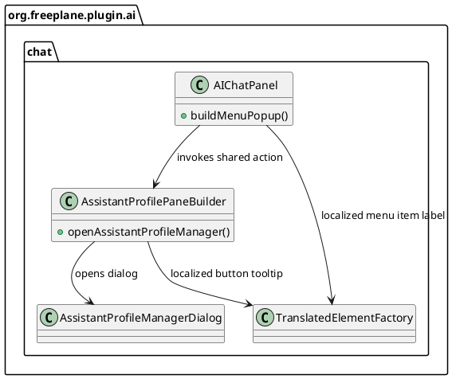

# Task: Add AI profile manager menu item in chat panel

- **Task Identifier:** 2026-02-08-profile-menu
- **Scope:**
  Add a menu item to the AI Chat Panel popup menu that opens the
  existing AI profile manager dialog using the same action path as the
  current profile-management button.
- **Motivation:**
  The AI profile manager dialog is currently reachable from a button in
  the chat panel profile section. Adding the same entry to the popup
  menu improves discoverability and gives users an alternative access
  point without introducing a separate behavior.
- **Developer Briefing:**
  Keep changes minimal and localized to the chat panel/profile UI
  classes. Reuse the existing dialog-opening behavior so both entry
  points remain consistent.
- **Research:**
  The existing profile manager dialog is opened by
  `AssistantProfilePaneBuilder.openAssistantProfileManager()` from the
  profile-management button listener.

  The AI chat popup menu is constructed in
  `AIChatPanel.buildMenuPopup()` and currently includes Preferences and
  optional AI edits actions.

  Menu entries in this panel are typically created with
  `TranslatedElementFactory.createMenuItem(...)`, which binds a text key
  to localized label/tooltip handling.

  The current profile-management button tooltip is hardcoded as
  `"Manage profiles"` in `AssistantProfilePaneBuilder`, so there is no
  existing translation key behind that tooltip yet.

  A consistent i18n path is to introduce one text key and use it for
  both the button tooltip and the new menu item caption via
  `TranslatedElementFactory`.

  There is no existing menu item in the popup that opens the assistant
  profile manager dialog.
- **Design:**

  Expose a shared method on `AssistantProfilePaneBuilder` for opening
  the manager dialog, and call that method from both the existing button
  listener and a new popup menu item added in `AIChatPanel`.

  Use one shared translation key for the button tooltip and popup menu
  item caption via `TranslatedElementFactory`, and set the popup menu
  item icon to the same assistant-profile icon used by the button for
  recognizability.

  No behavior changes are expected in profile reload/selection logic;
  the existing post-dialog synchronization path is reused.
- **Test specification:**
  Automated tests:
  Add or update a focused unit test around popup menu construction or
  action wiring (if a suitable UI test seam exists in this module) to
  verify the menu contains the new item and that it calls the shared
  profile manager action path.

  Manual tests:
  1. Open AI Chat Panel and click the profile-management button.
  Verify the AI profile manager dialog opens as before.
  2. Open the AI Chat Panel popup menu and click the new menu item.
  Verify the same AI profile manager dialog opens.
  3. Modify profiles in the dialog, close it from both entry points,
  and verify profile selection/list updates remain consistent.
