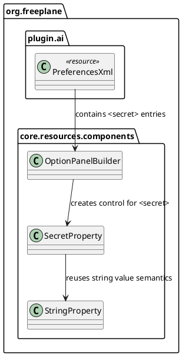

# Task: Add secret field type for settings
- **Task Identifier:** 2026-02-05-secret-settings
- **Scope:** Add a new settings field type `secret` in addition to
  `string`. Secret fields are masked by default in the UI and include a
  show/hide toggle.
- **Motivation:** Secrets such as API keys should not be visible by
  default in the settings UI, while still allowing the user to reveal
  them when needed.
- **Developer Briefing:** Extend the settings schema to support a new
  `secret` field type alongside `string`. Update the settings UI to
  render `secret` fields as masked inputs with a show/hide toggle. No
  special handling for logging or redaction is required.
- **Research:**
  The AI plugin preferences are declared in
  `freeplane_plugin_ai/src/main/resources/org/freeplane/plugin/ai/preferences.xml`
  and currently use `<string>` for provider API key fields
  `ai_openrouter_key` and `ai_gemini_key`.

  Option UI controls for preference XML tags are created centrally in
  `freeplane/src/main/java/org/freeplane/core/resources/components/OptionPanelBuilder.java`.
  The parser currently maps known tags such as `string`, `textbox`,
  `boolean`, `number`, and `radiobuttons` to property control creators.

  The current `string` type is backed by
  `freeplane/src/main/java/org/freeplane/core/resources/components/StringProperty.java`,
  which uses `JTextField` and displays plain text by default.

  The option panel value model is string-based (`PropertyBean#getValue()`
  and `setValue(String)`), so a masked UI control can store unchanged
  values without additional persistence changes.
- **Design:**

  Add a new preference XML field type `<secret>` in
  `OptionPanelBuilder` by registering a dedicated element handler and
  creator.

  Implement `SecretProperty` as a dedicated property control in
  `org.freeplane.core.resources.components` that:
  - masks text by default,
  - provides a show/hide toggle in the same row,
  - keeps `getValue()` and `setValue(String)` string-compatible with
    existing option persistence.

  Update AI plugin preferences XML to use `<secret>` for
  `ai_openrouter_key` and `ai_gemini_key`, keeping all other fields
  unchanged.
- **Test specification:**
  Automated tests:
  1. Add focused unit tests for `SecretProperty` in
     `freeplane/src/test/java/org/freeplane/core/resources/components/`
     covering:
     - masked-by-default state,
     - show/hide toggle behavior,
     - value roundtrip via `setValue()` and `getValue()`.

  2. Add focused unit tests for `OptionPanelBuilder` handling of
     `<secret>` by loading a minimal preferences fragment and asserting
     the resulting property control type for that node.

  Manual tests:
  1. Open Preferences -> Plugins -> AI and verify OpenRouter/Gemini key
     fields are masked by default.
  2. Toggle visibility for each secret field and verify the value becomes
     visible and can be hidden again.
  3. Save preferences, reopen dialog, and verify secret values are still
     persisted and masked by default.
