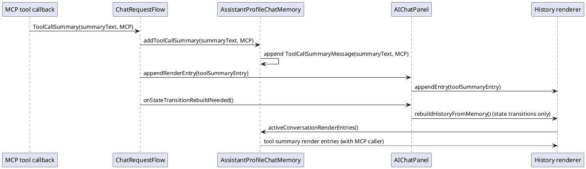

# Task: Add Model Context Protocol Tool Call Summaries To Current Chat
- **Task Identifier:** 2026-02-08-protocol-summaries
- **Scope:**
  Add support for rendering Model Context Protocol tool call summaries
  in the current chat history, aligned with the unified summary-message
  storage model.
- **Motivation:**
  Chat users currently see chat-tool summaries but may miss Model Context
  Protocol tool activity in the same conversational flow.
- **Developer Briefing:**
  Keep behavior consistent with the existing summary-message approach:
  summaries are render-visible but excluded from model-context messages
  and transcript entries.
- **Research:**
  Current handling distinguishes caller type (`ToolCaller.CHAT` versus
  `ToolCaller.MCP`) in the UI path. Storage and rendering now use a
  single message collection with `ToolCallSummaryMessage` for summary
  rows.

  `AIChatPanel.handleToolCallSummary(...)` currently stores only chat
  tool summaries in memory and renders MCP summaries directly to panel.
  This bypasses `AssistantProfileChatMemory` for MCP history rows.

  Summary handling in panel now influences memory state and ordering.
  This mixes presentation and request-flow responsibilities and can
  desynchronize direct panel appends from memory-based history rebuild.
- **Design:**

  API decisions:
  - Keep a single summary insertion method that includes `ToolCaller` as
    a parameter.
  - Keep summary handling in request flow (`ChatRequestFlow`) rather
    than in panel, because it mutates memory state.
  - Keep `addToolCallSummary` non-public and reachable through existing
    chat package flow integration.
  - Unify append and rebuild rendering through `ChatMemoryHistoryRenderer`:
    add `appendEntry(ChatMemoryRenderEntry)` and keep
    `rebuildFromMessages(List<ChatMemoryRenderEntry>)`.
  - Use append-at-end from flow for normal summary events (hot path)
    through renderer append API, while preserving memory as the single
    source of truth.
  - Keep full history rebuild for structural transitions: undo/redo,
    eviction, transcript/session restore, cancellation restore,
    memory truncation.
  - Preserve summary exclusion from `messages()` and transcript export.
  - If summary messages can appear outside normal completed turn shape,
    active-window start and removed-context marker must align to the
    beginning of the next real turn (not to a summary-only tail).
- **Test specification:**
  Automated tests:
  - Model Context Protocol summary is stored and rendered in the current
    chat history.
  - Model Context Protocol summary keeps caller metadata and renders with
    Model Context Protocol styling/category.
  - Model Context Protocol summary is excluded from model-context
    `messages()`.
  - Model Context Protocol summary is excluded from transcript entries.
  - Normal MCP summary event appends a row without immediate full
    rebuild, and row order matches memory insertion order.
  - Renderer append path and rebuild path produce equivalent HTML/style
    mapping for MCP and chat summaries.
  - Structural transitions trigger full rebuild from memory and preserve
    equivalence with append path result.
  - When window compaction starts after summary-only rows, marker and
    visible start align to the next turn start boundary.

  Manual tests:
  - Trigger a Model Context Protocol tool call and confirm a summary row
    appears in current chat history with expected style.
  - Verify chat request payload does not include Model Context Protocol
    summary rows.
