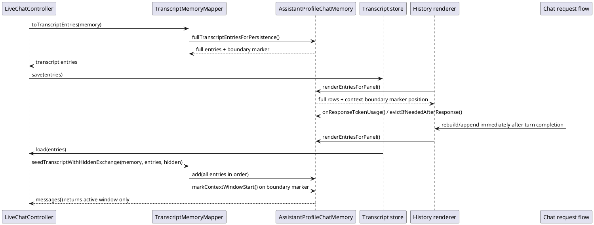
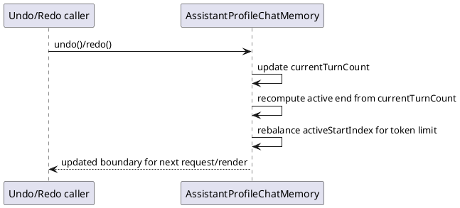
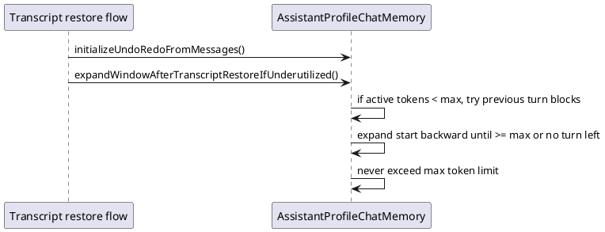

# Task: Preserve Full Transcript Outside Context Window
- **Task Identifier:** 2026-02-08-transcript-window
- **Scope:**
  Ensure transcript persistence stores the full chat history, including
  messages that are outside the active context window due to compaction.
  On transcript restore, only the active window must be sent to LLM
  context. The chat panel must still show full history, including
  messages before the active context boundary. Compaction boundary must
  be applied immediately after turn completion so the marker reflects the
  boundary for the next request.
- **Motivation:**
  Current behavior can drop pre-window conversation from saved transcript
  data, which breaks long-term traceability across chat restarts.
  Also, hiding pre-window messages in the panel makes conversation audit
  and user navigation difficult.
- **Developer Briefing:**
  Keep context-window compaction semantics unchanged for
  `ChatMemory.messages()`. Change only transcript persistence/export
  contract to include full history + boundary marker. Profile
  description retention and profile-context pinning are out of scope for
  this task and will be handled in a separate task.
- **Research:**
  Transcript persistence path is:
  `LiveChatController.synchronizeTranscriptWithMemory()` ->
  `TranscriptMemoryMapper.toTranscriptEntries(...)` ->
  `AssistantProfileChatMemory.transcriptEntriesForPersistence()`.

  Active-window model and transcript model are currently coupled through
  one method. That coupling makes transcript export behavior sensitive to
  context-window representation details.

  Restore path already supports full-history import with boundary marker:
  `TranscriptMemoryMapper.seedTranscriptWithHiddenExchange(...)` reads
  `REMOVED_FOR_SPACE_SYSTEM`, calls `markContextWindowStart()`, and keeps
  subsequent entries in the same conversation list.

  Current panel rendering uses active-window start and therefore hides
  messages that were compacted out of LLM context. The removed-context
  marker is shown, but earlier rows are not rendered.

  Current compaction/marker timing can lag behind turn completion.
  Marker should be visible as soon as compaction is decided for the
  just-finished turn.

  This task intentionally excludes profile-description retention logic.
- **Design:**

  API decisions:
  - Split transcript-export concern from active-window rendering concern:
    use a dedicated memory method for transcript persistence (full
    history).
  - Split panel rendering from active-context filtering:
    panel render entries must include full conversation history.
  - Keep removed-context marker semantics:
    marker indicates where active LLM context begins, not where panel
    history begins.
  - Apply compaction and marker update immediately at turn completion
    (response finished), so UI shows boundary before next user input.
  - Keep summary rows excluded from transcript entries.
  - Keep restored context-window behavior marker-driven: all messages are
    restored, only post-marker active window goes to LLM context.
  - Keep profile-control logic untouched in this task.
- **Test specification:**
  Automated tests:
  - Transcript export after compaction includes messages before the
    removed-context marker and includes the marker itself.
  - Restoring such transcript preserves full transcript entries and
    rebuilds active window so `messages()` excludes pre-marker messages.
  - Panel render entries after compaction still include pre-marker chat
    rows and place marker at the active-context boundary.
  - After a turn that triggers compaction, marker appears immediately in
    panel (without waiting for next request/send action).
  - Tool summary entries remain excluded from transcript export in the
    same flow.

  Manual tests:
  - Create a long chat that triggers context compaction, save/switch,
    reopen from transcript, and verify:
    1) transcript history still contains pre-window turns,
    2) active request context starts after marker,
    3) panel marker appears at turn boundary.

## Subtask: Recalculate Active Boundary On Undo And Redo
- **Status:** done
- **Scope:**
  Recalculate the active context-window start after each undo/redo so
  boundary placement matches the currently selected turn range.
- **Motivation:**
  Undo/redo changes active conversation end. Keeping a stale boundary can
  exclude turns that now fit or include turns that no longer fit.
- **Developer Briefing:**
  Preserve existing turn semantics and token-limit rules. Add boundary
  recomputation as an undo/redo post-step.
- **Research:**
  `AssistantProfileChatMemory.undo()` and `redo()` currently adjust only
  `currentTurnCount`. `activeStartIndex` is not rebalanced for the new
  end index.

  Active context end for undo/redo states depends on `currentTurnCount`
  and should be evaluated independently from prior `activeStartIndex`
  when recalculating boundary.
- **Design:**

  API decisions:
  - Keep boundary state in existing `activeStartIndex`.
  - Add one internal rebalance method reused by undo and redo.
  - Use completed turn boundaries only; no partial-turn inclusion.
- **Test specification:**
  Automated tests:
  - Undo can move boundary backward when earlier turns now fit token
    limit for the reduced active range.
  - Redo can move boundary forward again when expanded active range no
    longer fits.

## Subtask: Expand Boundary Backward After Transcript Restore
- **Status:** done
- **Scope:**
  After transcript restore only, move the active boundary backward when
  restored context is underutilized, up to full max token limit.
- **Motivation:**
  Restored transcripts do not include raw tool request/result messages.
  Token usage of restored active window can be lower than at runtime, so
  prior boundary may be unnecessarily narrow.
- **Developer Briefing:**
  Apply this adjustment only in transcript-restore flow. Keep normal
  runtime compaction unchanged.
- **Research:**
  Restore flow calls `seedTranscriptWithHiddenExchange(...)`, then
  `initializeUndoRedoFromMessages()`. At this point turn boundaries and
  marker-derived `activeStartIndex` are known.

  Window can be expanded safely by full turn blocks while honoring max
  tokens.
- **Design:**

  API decisions:
  - Add a restore-specific memory method; keep it package-private.
  - Expand by whole turn blocks only.
  - Respect hard max token limit while expanding.
- **Test specification:**
  Automated tests:
  - Restore underutilized window expands boundary backward while previous
    turn blocks fit max token limit.
  - Restore window at or above max token threshold keeps boundary
    unchanged.
