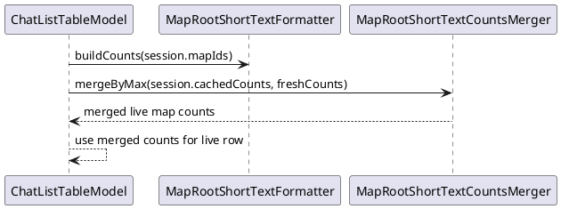

# Task: Refresh Live Chat Map List From Session Map Identifiers
- **Task Identifier:** 2026-02-08-chat-list-maps
- **Scope:**
  Ensure live chat list map column reflects newly accessed maps in the
  current session, including second and subsequent maps.
- **Motivation:**
  Live chat list can show stale map set when cached
  `mapRootShortTextCounts` exists and new map identifiers are added.
- **Developer Briefing:**
  Keep transcript entries and session persistence logic unchanged.
  Fix only live-list item map aggregation behavior.
- **Research:**
  In `ChatListDialog.ChatListTableModel.buildItems()`, live sessions use
  `session.getMapRootShortTextCounts()` directly when non-empty.
  `mapRootShortTextFormatter.buildCounts(session.getMapIds())` is only
  used when counts are empty, so newly added map IDs can be skipped in
  UI.
- **Design:**

  API decisions:
  - Merge cached and fresh map counts for every live session row.
  - Reuse existing `MapRootShortTextCountsMerger`.
- **Test specification:**
  Automated tests:
  - Live row includes map from `session.mapIds` even when cached counts
    already exist.
  - Existing cached map counts remain present after merge.
