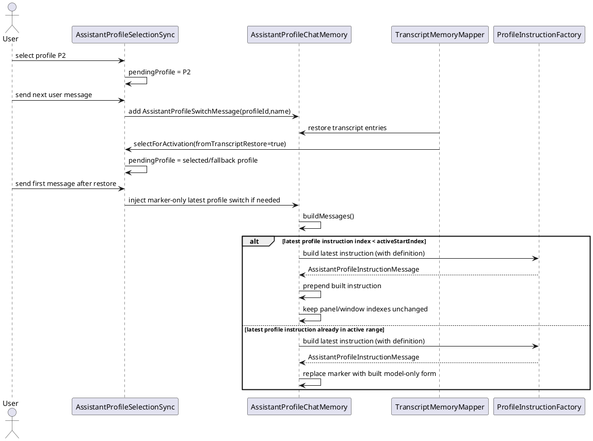

# Task: Keep Latest Profile Description In Active Context Window
- **Task Identifier:** 2026-02-08-profile-context
- **Scope:**
  Ensure the active profile context stays deterministic for the model:
  profile-switch events are stored as marker-only entries, while
  profile definition is attached only during model-context assembly.
  Transcript restore re-injects current profile definition before next
  request.
  When context window compaction moves latest profile-switch instruction
  outside active window bounds, model message assembly must still
  include that latest profile instruction.
- **Motivation:**
  Without strict profile-instruction invariants, compaction and restore
  can desynchronize role marker and role definition, so the model may
  respond with behavior that does not match currently selected profile.
  Rebuilding latest profile definition at send time is expected and
  affects only subsequent model requests; it does not alter already
  produced historical assistant responses.
- **Developer Briefing:**
  Keep turn-based eviction and transcript-window behavior unchanged for
  normal turn content. Focus only on profile-instruction lifecycle and
  restore behavior. Keep profile definition hidden from visible chat
  history; panel must continue showing only profile label/name.
  Responsibility for forced inclusion of latest profile-switch
  instruction belongs only to model-context assembly (`messages()`),
  not to panel rendering and not to active window pointer mutation.
- **Research:**
  `AssistantProfileChatMemory.add(...)` currently calls
  `shortenStoredProfileInstructions()` before appending a new
  `AssistantProfileControlInstructionMessage`. This means stored profile
  messages currently include mixed payload states (older marker-only,
  latest includes definition), which couples storage with send-time
  prompt formatting.

  `AssistantProfileSelectionSync` injects profile control message in
  `maybeInjectBeforeUserMessage()`, so profile definition reaches LLM
  only when next user turn is sent.

  `AssistantProfileChatMemory.buildMessages(...)` currently iterates
  from `activeStartIndex` to end and therefore can skip latest
  profile-switch instruction if compaction pushed it before
  `activeStartIndex`.

  Transcript persistence stores profile metadata as
  `AssistantProfileTranscriptEntry(profileId, profileName,
  containsProfileDefinition)` but does not store profile definition
  text. On restore, `selectForActivation(true)` sets pending profile for
  reinjection before next user message.

  If transcript profile id is missing or no longer exists,
  `selectForActivation(true)` falls back to currently selected profile
  (default profile path is already part of selection model behavior).
  On chat open/restore, selection sync attempts to switch currently
  selected profile to the last profile used in that chat when that
  profile is still defined.

  `ChatMemoryHistoryRenderer` renders profile rows as visible profile
  label/name only and keeps hidden-system internals out of normal panel
  output.

  Current `AssistantProfileControlInstructionMessage` conflates two
  concerns: persisted profile-switch event in chat memory and
  definition-bearing model instruction payload. With marker-only storage
  and send-time enrichment, this coupling becomes unnecessary and makes
  invariants harder to reason about.
- **Design:**

  API decisions:
  - Keep a single `conversationMessages` collection and keep append-only
    profile insertion flow.
  - Split profile message model into two classes:
    `AssistantProfileSwitchMessage` for persisted memory events and
    `AssistantProfileInstructionMessage` for model payload assembly.
  - Store only `AssistantProfileSwitchMessage` in memory/transcript
    flows (profile identity, no embedded definition payload).
  - Remove stored mixed state where only latest profile message carries
    definition text.
  - Keep profile-definition text out of transcript entries.
  - Keep reinjection point as "before next user message" after restore.
  - Keep fallback on restore: if transcript profile id does not resolve,
    use currently selected profile (default if needed).
  - On chat open/restore, switch selected profile to the last profile
    from chat transcript when it still exists; otherwise keep currently
    selected profile unchanged.
  - On chat restore, do not inject duplicate profile-switch message when
    restored chat already contains the active profile switch; rely on
    `messages()` window logic to include the latest profile instruction
    for model context.
  - Keep panel rendering independent from profile-definition content:
    panel shows profile label/name only.
  - Keep UI panel out of model-context composition decisions.
    `AIChatPanel` must not own profile instruction assembly rules.
  - Keep context-window compaction logic unchanged; enforce latest
    profile instruction inclusion only in `messages()` output path for
    LLM requests.
  - If latest profile instruction is outside active window, inject its
    definition-bearing form at the beginning of model context window
    (right after general system message, if present).
  - Build definition-bearing profile instruction only at model-send
    assembly time from latest available profile data
    ("latest-definition-at-send-time").
  - `AssistantProfileInstructionMessage` is ephemeral and must not be
    persisted to `conversationMessages` or transcript entries.
  - `AssistantProfileChatMemory` is the single owner of deciding what
    profile instruction is included in model context.
  - Profile instruction resolution dependency must be supplied from
    non-UI layer (controller/sync/resolver service), not from panel.
  - If the profile referenced by latest marker is missing, replace it at
    send time with a valid existing profile marker+definition
    (selected profile or default profile).
  - This runtime enrichment applies only to future requests and never
    rewrites historical assistant outputs.
- **Test specification:**
  Automated tests:
  - `conversationMessages` never stores
    `AssistantProfileInstructionMessage`; it stores only
    `AssistantProfileSwitchMessage` for profile events.
  - After profile switches P1 -> P2 -> P3, stored conversation keeps
    all profile-switch entries marker-only (no stored definition text).
  - After transcript restore, first user message reinjects selected
    profile definition before user text.
  - After transcript restore with missing transcript profile id,
    fallback profile is reinjected (selected/default).
  - On chat open/restore with resolvable last transcript profile id,
    selected profile is updated to that profile before next send.
  - On chat open/restore with non-resolvable last transcript profile id,
    selected profile remains unchanged and is applied on next send.
  - On chat restore with resolvable last transcript profile id, first
    post-restore send does not append redundant profile-switch message.
  - Transcript entries never contain profile definition text.
  - Panel rendering shows profile label/name and never renders profile
    definition payload.
  - If latest profile instruction lies before `activeStartIndex`,
    `messages()` still includes it exactly once for model context and
    places it at the beginning of active model window content.
  - If latest marker references missing profile, `messages()` uses
    fallback existing profile marker+definition.
  - No tests require `AIChatPanel` to construct or configure profile
    instruction payload logic directly.
  - Editing profile definition between two user requests affects only
    the next request payload and does not mutate previously persisted
    assistant answers.

  Manual tests:
  - Select profile A, send request, switch to profile B, send request,
    and verify model behavior follows latest selected profile.
  - Save and restore chat, then send first post-restore request and
    verify model behavior follows selected/restored profile.
