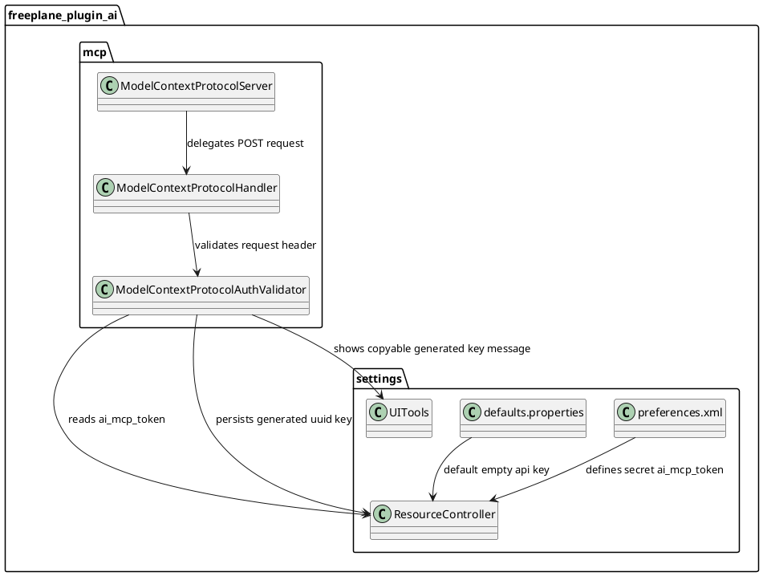

# Task: Add MCP server API key authentication
- **Task Identifier:** 2026-02-05-mcp-authentication
- **Scope:** Add API key authentication for the Freeplane MCP server,
  configured in the existing AI plugin settings. The server must
  validate the key on incoming requests and reject unauthorized access.
- **Motivation:** MCP server exposure should be controllable with a simple
  shared secret that can be configured by the user.
- **Developer Briefing:** Introduce an API key setting in the AI plugin
  settings and enforce it on MCP server requests. The key is preserved
  across restarts. If missing when authentication is needed, generate a
  UUID key, persist it, notify the user with a copyable message, and
  reject the current request. Requests validate a single header value
  and return an authorization error on mismatch. No changes are required
  for logging or secret redaction.
- **Research:**
  - The MCP server is part of the Freeplane AI plugin and relies on the
    existing plugin settings storage.
  - The settings UI supports secret fields for sensitive values.
  - MCP request handling already has a centralized entry point that can
    apply authentication checks before dispatching tools.
  - `UITools.showMessage(String, int)` displays a scrollable `JTextArea`
    and is suitable for showing generated key text that the user can
    copy.
- **Design:**

The API key is stored in a new secret property named
`ai_mcp_token` and appears in the AI plugin preferences as a
`<secret>` field.

Authentication is checked before JSON parsing and request dispatch in
the MCP HTTP handler for every incoming `POST /` request.

If `ai_mcp_token` is blank after trimming when the server
expects authentication, the server generates a random UUID key,
persists it into `ai_mcp_token`, and immediately rejects the
current request.

At the same moment, the plugin shows an information dialog using
`UITools.showMessage(...)` with the generated key value so the user can
copy it and configure MCP clients.

The header name requirement must be explicitly duplicated in user-facing
texts:
- tooltip for the API key setting field;
- generated-key information dialog text.

Both texts must be translation keys and must state that clients should
send header `X-Freeplane-MCP-Token`.

Suggested translation keys:
- `OptionPanel.ai_mcp_token.tooltip`:
  `MCP clients must send this key in header X-Freeplane-MCP-Token.`
- `ai_mcp_token_generated_message`:
  `A new MCP API key was generated.\nUse it in header X-Freeplane-MCP-Token:\n{0}`

If `ai_mcp_token` is set, the client must send
`X-Freeplane-MCP-Token` with an exact value match. Missing or
mismatched key returns `401 Unauthorized` and a JSON-RPC error payload
with code `-32001` and message `Unauthorized`. In this case, tool and
resource methods are not executed.
- **Test specification:**
  - Automated tests:
    - `ModelContextProtocolAuthValidatorTest`:
      verifies UUID generation/persist+notify on blank key, accepts
      matching header, and rejects missing header.
    - `ModelContextProtocolServerIntegrationTest`:
      verifies `401 Unauthorized` when `X-Freeplane-MCP-Token`
      is missing.
