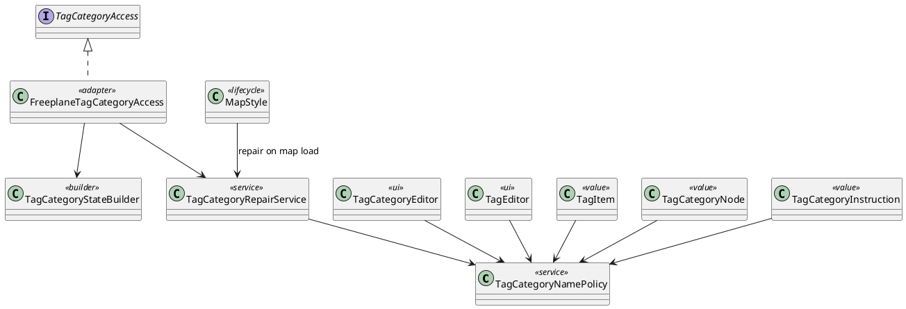

# Task: Make tag category whitespace validation consistent and backward compatible
- **Task Identifier:** 2026-04-09-tag-category-whitespace-compatibility
- **Scope:** Fix tag category management crashes caused by legacy tag or
  category names that become blank after trimming, and make whitespace
  validation consistent across the tag model, editors, category state
  contract, and persistence behavior.
- **Motivation:** `Manage Tag Categories` can currently crash on
  existing maps because the category state contract rejects
  blank-after-trim tag path segments while the tag model and both tag
  editors still allow tags consisting only of whitespace.
- **Scenario:** A user opens tag category management on a map that
  contains uncategorized or categorized tags whose names become blank
  after trimming. Freeplane must not throw from `TagCategoryStateBuilder`.
  Going forward, every UI and API path that creates or renames tags must
  apply the same validity rule, and legacy invalid data must have a
  defined repair or migration path instead of crashing the editor. If a
  persisted map contains invalid tags, the user must get a defined
  normalization outcome rather than an unrecoverable dialog failure.
- **Constraints:**
  - Do not allow `Manage Tag Categories` to crash on legacy maps.
  - Apply one validity rule consistently to `TagEditor`,
    `TagCategoryEditor`, `TagCategoryInstruction`,
    `TagCategoryStateBuilder`, and related tag creation paths.
  - Decide explicitly whether leading or trailing whitespace is
    significant. Current category parsing already trims serialized
    category lines.
  - Do not weaken only the category state objects if instruction
    validation or serialization would still reject the same content.
  - Persisted invalid tags must not stay in a limbo state where the map
    can be opened but tag category management still cannot normalize and
    save them consistently.
  - If legacy invalid data remains unsupported, provide a repair or
    migration path instead of a raw exception.
- **Briefing:** Two user-reported stack traces show
  `ManageTagCategoriesAction` crashing while `TagCategoryStateBuilder`
  constructs uncategorized `TagItem` or categorized `TagCategoryNode`
  instances and hits `IllegalArgumentException: path contains blank segment`.
- **Research:**
  - `TagItem` rejects blank-after-trim `path`, `name`, and
    `qualifiedName`.
  - `TagCategoryNode` rejects blank-after-trim `path`, `name`, and
    `qualifiedName`.
  - `TagCategoryInstruction` already uses the same blank-after-trim rule
    for instruction `path`, `newName`, and `newSeparator`, so the edit
    contract already forbids whitespace-only values.
  - `TagCategoryEditor` still creates `new Tag(text)` or
    `new Tag(text, color)` and rejects only the empty string, not
    blank-after-trim input.
  - `TagEditor` likewise creates `new Tag(spec)` without trim-blank
    validation.
  - `Tag` and `TagCategories` still allow whitespace-only content.
  - `TagCategories.readTagCategories(...)` trims each serialized line
    before parsing, so category serialization already loses leading and
    trailing whitespace.
  - The node tag editor currently normalizes newly typed blank tags to
    `Tag.EMPTY_TAG`, but `TagEditor.submit()` still persists that empty
    placeholder through `MIconController.setTags(...)`, so blank tags
    remain on the node until another repair path rewrites them.
  - The current category parser trims the whole serialized line before
    splitting the tag spec. For a legacy category entry whose content is
    only whitespace plus a color suffix, that turns the stored content
    into a bare `#RRGGBBAA` token and reinterprets the color suffix as a
    literal tag name instead of preserving the blank content for repair.
  - The tag insertion submenu in the node tag editor currently builds
    menu actions from `tagWithoutCategories(...)`, so navigating through
    nested category menus still inserts the leaf tag as an uncategorized
    tag instead of the qualified categorized path.
  - For categorized tags, the current indentation-based text format does
    not distinguish leading spaces used for hierarchy from leading
    spaces that would belong to the tag name itself.
  - The blank-after-trim validation in `TagCategoryNode` and the former
    `TagDescriptor` was introduced with the tag category access contract
    on 2026-02-20. The crash became user-visible when the category
    editor started building and consuming that contract state.
  - Weakening only `TagItem` and `TagCategoryNode` would stop the
    immediate crash but would still leave `TagCategoryInstruction` and
    category serialization inconsistent with whitespace-only values.
  - Current recommendation: treat whitespace-only tag and category
    segments as invalid going forward, harden all editors consistently,
    and add legacy repair or migration instead of weakening only the
    state contract.
  - Current recommendation for persisted maps:
    - detect invalid stored tags or category segments instead of
      crashing,
    - trim uncategorized tag content and categorized path segments as
      the normalization step,
    - remove uncategorized tags whose content becomes empty after trim,
    - remove categorized path segments that become empty after trim,
    - remove categorized tags that become empty after that
      normalization,
    - merge tags whose normalized paths collide,
    - rewrite node tag references to the normalized surviving paths,
    - normalize the in-memory tag/category model during map load so the
      rest of the UI only sees repaired state,
    - persist the normalized state on the next save instead of waiting
      for tag category management to be opened.
- **Design:**
  - Introduce `TagCategoryNamePolicy` as the single source of truth for
    blank-after-trim validation and persisted-segment normalization.
  - Make `TagItem`, `TagCategoryNode`, and `TagCategoryInstruction`
    delegate whitespace validation to `TagCategoryNamePolicy` so the
    contract objects cannot drift.
  - Use `TagCategoryNamePolicy` in `TagEditor` and
    `TagCategoryEditor` before creating or renaming tags.
  - Add `TagCategoryRepairService` for the persisted-map repair flow.
    It must detect invalid stored data, apply deterministic repair, and
    report the performed changes:
    - trim uncategorized tag content and categorized path segments,
    - remove uncategorized tags that become empty after trim,
    - remove categorized path segments that become empty after trim,
    - drop categorized tags that become empty after normalization,
    - merge colliding normalized paths,
    - rewrite existing node tag references to the surviving normalized
      tags.
  - Keep `TagCategoryStateBuilder` pure: it builds `TagCategoryState`
    only from already-valid `TagCategories` and must not own repair
    logic.
  - Keep `FreeplaneTagCategoryAccess` as the application coordinator
    for revision checks, instruction application, and persistence
    through `MIconController`.
  - Run the persisted-map repair flow from the map load path after tag
    categories and tag colors are read, so the loaded map state is
    normalized before editors and other consumers access it, while
    still surfacing the repair report to the user once the map view is
    visible.
  - Remove the editor-open repair trigger from `TagCategoryEditor`; it
    should operate only on already-normalized `TagCategories`.
  - Preserve serialized category tag content after indentation removal
    instead of trimming the whole line before parsing. This keeps legacy
    whitespace-only category names available for deterministic repair
    instead of misparsing their color suffix as the tag name.
  - Normalize and filter node tag editor output before
    `MIconController.setTags(...)` persists it so blank-after-trim tags
    are removed immediately and trim-only names are rewritten without
    needing the category repair dialog.
  - Build the node tag editor insert submenu from categorized tag
    values for the action payload while keeping the displayed leaf label
    for the nested menu UI.
  - Review category serialization and reload behavior and align it with
    the chosen whitespace policy, especially for values that differ only
    by leading or trailing whitespace.

`TagCategoryNamePolicy` owns the canonical whitespace rule and the
shared validation or normalization helpers used by contract objects and
editors. `TagCategoryRepairService` detects invalid persisted tag data,
applies deterministic normalization, and reports trim-based renames,
removals, normalized path rewrites, merges, and rewritten tag
references. `MapStyle` invokes that repair service from the map load
lifecycle so the rest of the UI only sees normalized `TagCategories`.
`TagCategoryStateBuilder` stays pure and builds `TagCategoryState` only
from already-valid `TagCategories`.
- **Test specification:**
  - Automated tests:
    - Verify tag category state building no longer throws a raw
      exception on legacy invalid tag data; assert the chosen repair or
      rejection behavior instead.
    - Verify `TagEditor` rejects or repairs blank-after-trim tag names
      consistently with the chosen rule.
    - Verify `TagCategoryEditor` rejects or repairs blank-after-trim
      category names consistently with the chosen rule.
    - Verify `TagCategoryInstruction`, editor submission, and category
      state building all enforce the same validity rule.
    - Verify category serialization and reload behavior is deterministic
      for the chosen whitespace policy.
    - Verify persisted uncategorized tags are trimmed and tags that
      become empty are removed by the defined repair path.
    - Verify persisted categorized paths with blank-after-trim segments
      are trimmed and normalized, and tags that become empty are
      removed.
    - Verify legacy categorized lines whose stored content is only
      whitespace plus a color suffix are loaded as blank-content tags
      and repaired instead of being misread as literal `#RRGGBBAA`
      names.
    - Verify trim-only renames are reported and rewrite node tag
      references accordingly.
    - Verify normalization rewrites node tag references to surviving
      merged paths when collisions occur.
    - Verify legacy maps with invalid tag or category names have a
      defined migration or repair outcome instead of a stack trace.
    - Verify loading a map with invalid persisted category data repairs
      the in-memory tag/category model before the tag category editor is
      opened.
    - Verify node tag editor submission removes blank-after-trim tags
      instead of persisting them until category management is opened.
    - Verify selecting a tag from a nested insert submenu in the node
      tag editor inserts the qualified categorized tag path, not the
      uncategorized leaf tag name.
  - Manual tests:
    - Open a map containing uncategorized whitespace-only tags and
      confirm the category UI no longer crashes.
    - Open a map containing categorized blank-after-trim path segments
      and confirm the category UI no longer crashes.
    - Confirm the repair flow reports what invalid tags were trimmed,
      removed, normalized, or merged after repair.
    - Try to create or rename tags to whitespace-only values in both
      editors and confirm consistent behavior.
