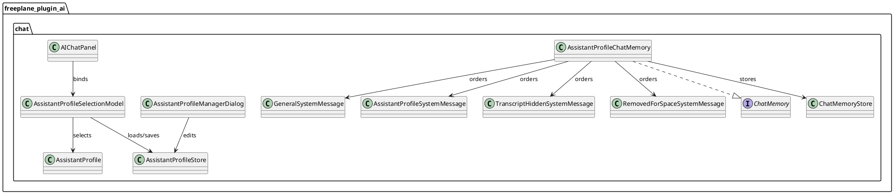
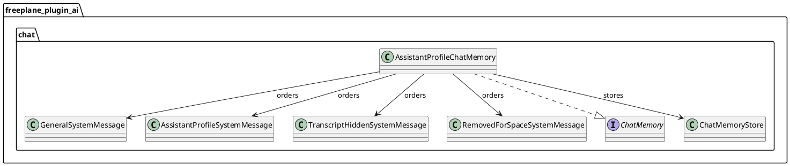
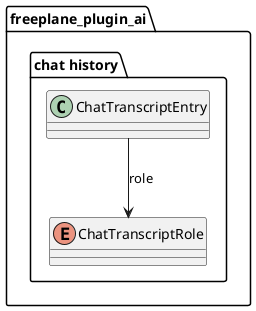
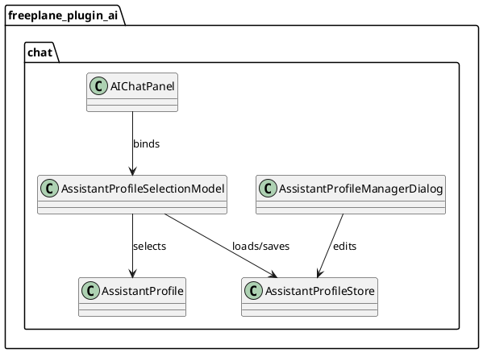

# Task: Chat memory system messages and assistant profiles
- **Task Identifier:** 2026-02-03-assistant-profiles
- **Scope:**
  - Support multiple system messages in chat memory with ordered slots
    (general, assistant profile, transcript hidden, removed-for-space).
  - Allow the user to define, save, and select assistant profiles.
  - Add an assistant profile selector UI (drop-down near the chat input).
  - Preserve tool request/result eviction invariants.
  - Insert a removed-for-space marker when user/assistant/tool
    messages are evicted for capacity.
  - Ensure transcript hidden and removed-for-space markers are excluded
    from capacity counting.
  - Persist transcript entries for assistant profile and
    removed-for-space system messages; do not persist general or
    transcript hidden system messages.
- **Motivation:**
  - Allow assistant profile updates and transcript framing without
    losing earlier system guidance.
  - Provide a stable user-facing hint when context is trimmed.
- **Developer Briefing:**
  - Replace LC4J MessageWindowChatMemory usage with a custom
    ChatMemory implementation that supports multiple system messages.
  - Introduce message tagging (likely subclasses of SystemMessage) for
    general, assistant profile, transcript hidden, and removed-for-space.
  - Add a persisted assistant profile catalog and UI to manage
    assistant profiles (create/edit/delete) and select the active
    assistant profile per chat.
  - Enforce message ordering and capacity rules on add and read.
  - Keep LC4J tool handling unchanged; tools are passed via
    ChatRequestParameters, not system messages.
- **Research:**
  - LC4J 1.10.0 MessageWindowChatMemory keeps a single SystemMessage
    and replaces it on add; it also evicts orphan tool results when the
    corresponding AiMessage is evicted.
  - LC4J SystemMessage type is determined by ChatMessage.type().
    Subclasses of SystemMessage still return SYSTEM, but equals uses
    getClass(), so subclasses do not compare equal to base class.
  - Chat transcripts are serialized via Jackson ObjectMapper in
    ChatTranscriptStore as ChatTranscriptRecord JSON gzip files.
    Transcript entries store role + text (ChatTranscriptEntry); LC4J
    ChatMessage objects are not serialized.
  - Current transcript roles are user/assistant only; system messages
    are injected separately and are not persisted.
  - Current general system message text is configured via Freeplane
    preferences property `ai_system_message` and is combined with
    additional guidance in SystemMessageBuilder.
- **Design:**

  - Ordered slots:
    - General system message always first, counts toward capacity.
    - Assistant profile system messages follow, count toward capacity.
    - Transcript hidden message follows (optional, excluded).
    - Removed-for-space message follows (optional, excluded).
    - User/assistant/tool messages follow, count toward capacity.
  - Transcript persistence:
    - Extend `ChatTranscriptRole` to include system entries for
      assistant profile updates and removed-for-space markers.
    - Proposed shape:
      - Add enum values to `ChatTranscriptRole`:
        - `ASSISTANT_PROFILE_SYSTEM`
        - `REMOVED_FOR_SPACE_SYSTEM`
      - Keep the `role` field on `ChatTranscriptEntry` and store these
        new values when persisting transcripts.
      - Avoid introducing a boolean like `isAssistantMessage`; use the
        enum for clarity and future extension.
      - Ensure Jackson load defaults preserve backward compatibility
        when older transcripts contain only `USER`/`ASSISTANT`.
    - Persist `role` for assistant profile and removed-for-space
      entries; do not store general or transcript hidden system
      messages.
    - Do not persist general or transcript hidden system messages in
      transcripts.
    - Ensure load defaults preserve backward compatibility when
      system entry fields are missing.
  - Eviction removes from the beginning of the counted portion.
    - If an assistant profile message has no remaining
      user/assistant/tool messages after it, remove that profile
      message too.
    - Preserve LC4J tool result eviction behavior for orphan
      ToolExecutionResultMessage entries.
  - Insert removed-for-space marker once when any user/assistant/tool
    messages are evicted; keep it pinned in its ordered slot.
  - Assistant profile catalog and selection:
    - Provide a user-managed catalog of named assistant profiles.
    - Persist assistant profiles in the Freeplane user directory as JSON
      (separate from transcripts), using Jackson:
      - Each assistant profile has a stable id, a display name, and a
        system message prompt text.
      - Proposed location:
        - `<freeplaneUserDir>/ai-assistant-profiles.json`
    - UI:
      - Add a drop-down selector near the chat input to choose the
        active assistant profile for the current live chat session.
      - Add a small "manage profiles" button next to the drop-down,
        using `freeplane/src/editor/resources/images/EggheadCB.svg`,
        to open a dialog for create/edit/delete of assistant profiles.
    - Applying an assistant profile:
      - Selecting a new assistant profile appends a
        `ChatTranscriptEntry(role=ASSISTANT_PROFILE_SYSTEM, text=<prompt>)`
        to the live transcript and adds the corresponding
        AssistantProfileSystemMessage to chat memory, so future turns see
        the update.
      - General and transcript hidden system messages remain injected
        separately (not persisted in transcripts).
    - Default selection:
      - New chat sessions start with the last-used assistant profile.
    - Transcript behavior:
      - Transcripts store the assistant profile prompt text at the time
        of selection; later edits to a saved assistant profile do not
        rewrite prior transcript entries.
- **Test specification:**
  - Automated tests:
    - Verify ordering of system messages with and without transcript
      hidden and removed-for-space messages.
    - Verify capacity counts exclude transcript hidden and
      removed-for-space messages.
    - Verify assistant profile messages are dropped when all following
      user/assistant/tool messages are evicted.
    - Verify removed-for-space marker is inserted once when
      user/assistant/tool eviction occurs.
    - Verify orphan tool result eviction still occurs.
    - Verify transcript save/load preserves assistant profile and
      removed-for-space system entries, while general and transcript
      hidden messages are not stored.
    - Verify persisted assistant profile catalog loads/saves correctly
      and selection appends an `ASSISTANT_PROFILE_SYSTEM` transcript
      entry.
  - Manual tests:
    - Start a chat, overflow capacity, and verify UI transcript shows
      a removed-for-space marker once.
    - Load a transcript and confirm transcript hidden marker appears
      in the correct order.
    - Save and reload a transcript with assistant profile updates and
      removed-for-space markers and confirm they are restored.
    - Define a new assistant profile, select it, send a message, close
      and reopen Freeplane, and confirm the profile is still available
      and selectable.

## Subtask: Chat Memory Slots And Eviction
- **Status:** Implementation Review
- **Scope:**
  - Implement a custom chat memory with ordered system message slots
    and eviction rules.
- **Motivation:**
  - Support multiple system messages and deterministic ordering while
    preserving tool request/result invariants.
- **Developer Briefing:**
  - Replace MessageWindowChatMemory with a custom implementation that
    supports ordered slots and pinned system messages.
  - Enforce eviction from the beginning of the counted portion and
    preserve tool request/result eviction behavior.
- **Research:**
  - LC4J MessageWindowChatMemory enforces a single SystemMessage and
    removes orphan ToolExecutionResultMessage entries when their
    AiMessage is evicted.
- **Design:**

  - Ordered slots:
    - General system message always first, counts toward capacity.
    - Assistant profile system messages follow, count toward capacity.
    - Transcript hidden message follows (optional, excluded).
    - Removed-for-space message follows (optional, excluded).
    - User/assistant/tool messages follow, count toward capacity.
  - Eviction removes from the beginning of the counted portion.
    - If an assistant profile message has no remaining
      user/assistant/tool messages after it, remove that profile
      message too.
    - Preserve LC4J tool result eviction behavior for orphan
      ToolExecutionResultMessage entries.
  - Insert removed-for-space marker once when any user/assistant/tool
    messages are evicted; keep it pinned in its ordered slot.
- **Test specification:**
  - Automated tests:
    - Verify ordering of system messages with and without transcript
      hidden and removed-for-space messages.
    - Verify capacity counts exclude transcript hidden and
      removed-for-space messages.
    - Verify assistant profile messages are dropped when all following
      user/assistant/tool messages are evicted.
    - Verify removed-for-space marker is inserted once when
      user/assistant/tool eviction occurs.
    - Verify orphan tool result eviction still occurs.

## Subtask: Transcript Roles And Persistence
- **Status:** Implementation Review
- **Scope:**
  - Persist assistant profile and removed-for-space system entries in
    chat transcripts.
- **Motivation:**
  - Ensure assistant profile changes and context trimming are preserved
    when saving and restoring chats.
- **Developer Briefing:**
  - Extend ChatTranscriptRole with system roles for assistant profile
    and removed-for-space entries.
  - Update transcript save/load flow to store those roles while
    keeping backward compatibility.
- **Research:**
  - Chat transcripts are serialized via Jackson ObjectMapper in
    ChatTranscriptStore as ChatTranscriptRecord JSON gzip files.
  - Current transcript roles are user/assistant only; system messages
    are injected separately and are not persisted.
- **Design:**

  - Extend `ChatTranscriptRole`:
    - `ASSISTANT_PROFILE_SYSTEM`
    - `REMOVED_FOR_SPACE_SYSTEM`
  - Persist `role` for assistant profile and removed-for-space entries;
    do
    not store general or transcript hidden system messages.
  - Ensure Jackson load defaults preserve backward compatibility when
    older transcripts contain only `USER`/`ASSISTANT`.
- **Test specification:**
  - Automated tests:
    - Verify transcript save/load preserves assistant profile and
      removed-for-space system entries, while general and transcript
      hidden messages are not stored.
  - Manual tests:
    - Save and reload a transcript with assistant profile updates and
      removed-for-space markers and confirm they are restored.

## Subtask: Assistant Profile Catalog And UI
- **Status:** Planning
- **Scope:**
  - Provide a user-defined assistant profile catalog and a selector in
    the chat panel.
- **Motivation:**
  - Let users define and switch assistant profiles across chats.
- **Developer Briefing:**
  - Persist assistant profiles as JSON in the Freeplane user directory.
  - Add an assistant profile selector near the chat input and a manage
    dialog for create/edit/delete.
  - New chats start with the last-used assistant profile.
  - Transcripts store the assistant profile prompt text at the time of
    selection; edits do not rewrite prior transcripts.
- **Research:**
  - The current general system message is configured via
    `ai_system_message` and combined with guidance in
    SystemMessageBuilder.
- **Design:**

  - Assistant profile catalog:
    - Persist as JSON at `<freeplaneUserDir>/ai-assistant-profiles.json`.
    - Each assistant profile has a stable id, a display name, and a
      prompt.
  - UI:
    - Drop-down selector near the chat input.
    - Manage dialog with create/edit/delete.
  - Applying an assistant profile:
    - Selecting a new assistant profile appends a
      `ChatTranscriptEntry(role=ASSISTANT_PROFILE_SYSTEM, text=<prompt>)`
      and adds the corresponding AssistantProfileSystemMessage to
      memory.
- **Test specification:**
  - Automated tests:
    - Verify persisted assistant profile catalog loads/saves correctly
      and selection appends an `ASSISTANT_PROFILE_SYSTEM` transcript
      entry.
  - Manual tests:
    - Define a new assistant profile, select it, send a message, close
      and reopen Freeplane, and confirm the profile is still available
      and selectable.
