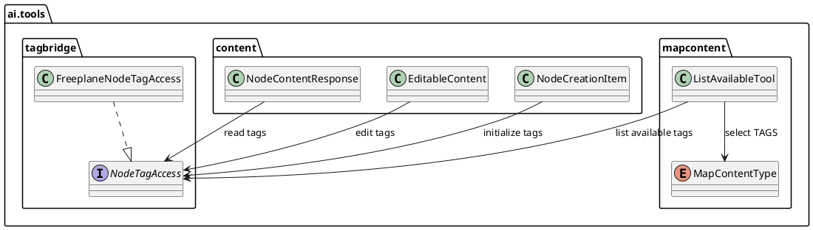

# Task: Expose node tags to AI tools
- **Task Identifier:** 2026-02-20-expose-tags-ai-tools
- **Scope:** Enable AI-facing map tools to read and write node tags as
  semantic metadata. Add tag fields to node read/edit/create payloads
  and extend content availability listing so tags can be discovered as
  valid string values.
- **Motivation:** AI should reason with user-defined tagging semantics,
  not formatting details. The model needs to read current node tags,
  update tags on existing nodes, set tags during node creation, and list
  available tags in the current map.
- **Scenario:** A user asks AI to classify action items. AI reads a node
  and sees current tags, updates them to match team taxonomy, and then
  creates a new node with requested tags. Before applying changes, AI
  can request available map content values for `TAGS` and choose valid
  strings.
- **Developer Briefing:** Keep behavior backward-compatible for existing
  node payload consumers. Tag handling should remain deterministic
  (stable order and de-duplication policy) and should not affect style
  resolution logic.
- **Research:**
  - Node script API already exposes tag access through `node.tags`,
    providing existing read/write behavior that can be adapted for AI
    tool payloads.
  - The current style-focused task introduces a generic
    `listAvailable(MapContentType)` mechanism; tags should be added as a
    dedicated `MapContentType` branch (`TAGS`) rather than a separate
    endpoint.
  - Node payload contracts (`NodeContentResponse`, `EditableContent`,
    `NodeCreationItem`) are the expected integration points for adding
    semantic tag fields.
- **Design:**

Add `tags: List<String>` fields to relevant AI node payload contracts.
Read tags from node state for response payloads and support explicit tag
updates for edit/create flows. Extend `listAvailable(MapContentType)` to
handle `TAGS` and return map-available tag strings. Preserve a defined
ordering contract for returned tags and document replacement vs merge
semantics for writes.
- **Test specification:**
  - Automated tests:
    - Tool test: node read returns current tags with stable order.
    - Tool test: edit applies tag updates and removes tags when empty
      input is provided according to defined semantics.
    - Tool test: create applies requested tags to newly created nodes.
    - Tool test: `listAvailable(TAGS)` returns map-available tag names.
    - Regression test: tag operations do not change style fields
      (`mainStyle`, `activeStyles`) in payload responses.
  - Manual tests:
    - In a sample map, ask AI to retag a node and verify visible tags in
      UI and persistence after save/reload.
    - Ask AI to list available tags and reuse one in a follow-up node
      creation request.
