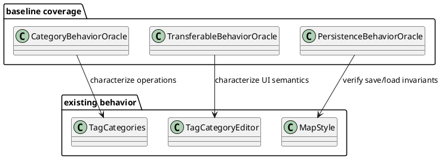
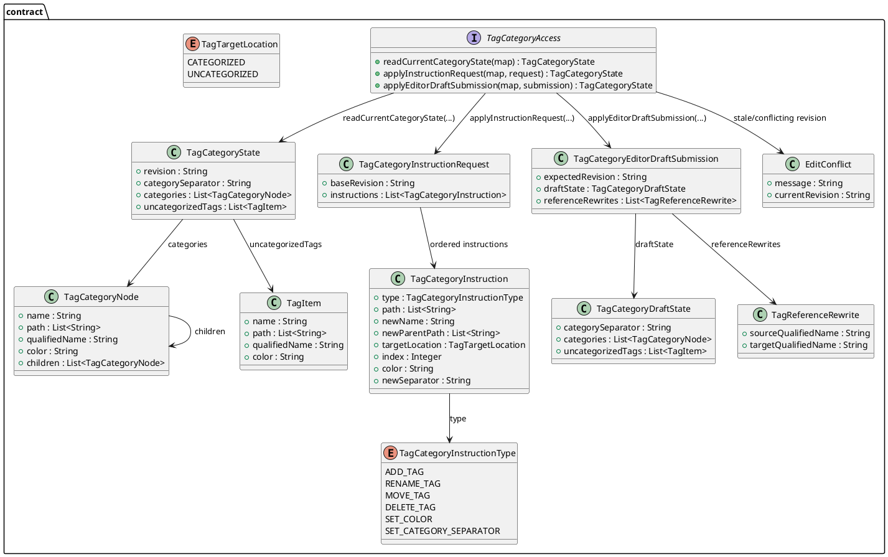
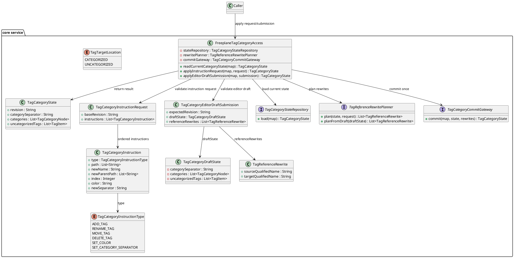
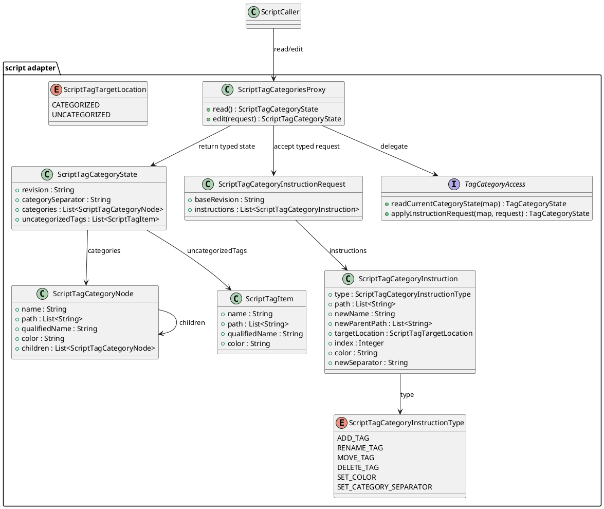
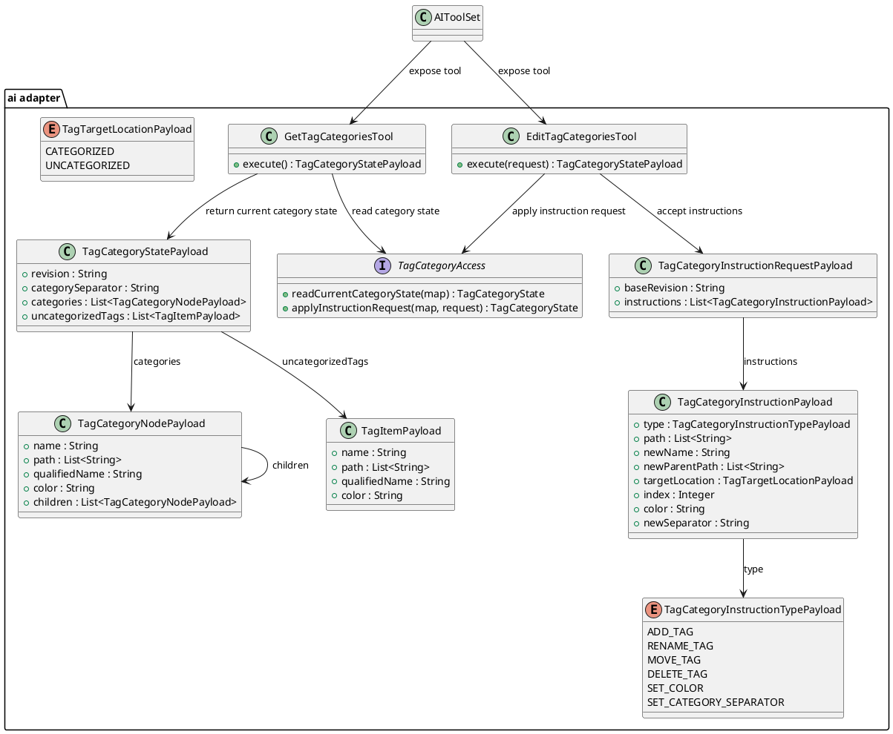
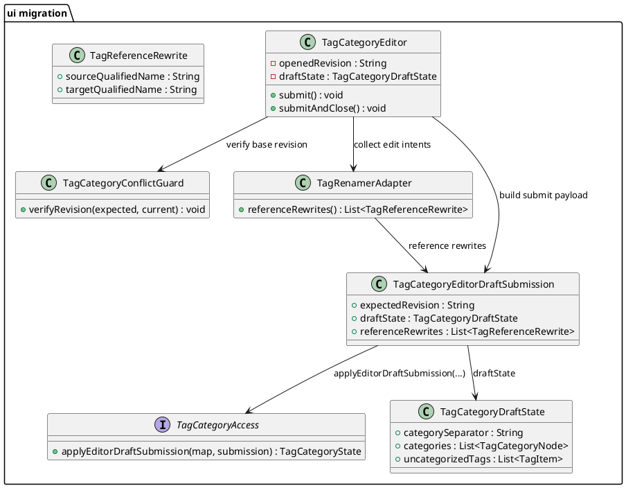

# Task: Expose tags and tag categories to AI tools and scripting
- **Task Identifier:** 2026-02-20-expose-tags-ai-tools
- **Scope:** Enable map-level and node-level access for both tag values and
  tag categories. Cover read and write operations needed by AI tools and
  scripting so category trees, category separator, and tag values can be
  managed without UI-only flows.
- **Motivation:** Tag categories are currently editable through UI flows,
  while script and AI paths mostly operate on node tag values. This blocks
  automation and makes category maintenance hard to integrate into AI and
  script workflows.
- **Scenario:** A user asks AI to normalize map tag categories. AI reads the
  current category state, updates category names and hierarchy, and then
  updates node tags to the new category structure. A script can perform the
  same map-level category operations without opening tag editor dialogs.
- **Constraints:**
  - Keep one shared read model and one shared commit/conflict boundary for
    UI, AI, and scripting.
  - Do not force UI and AI/script to share the same external write model if
    that would erase existing UI semantics.
  - Preserve indirect reference-update behavior and node-traversal-free
    steady-state category updates.
  - Public AI/script contracts must be explicit and typed; generic
    map-shaped payloads are not acceptable as the primary public surface.
  - Design must describe only the target system; current/as-is structures
    belong in Research.
- **Briefing:** Keep
  category and tag behavior deterministic, preserve undo semantics, and avoid
  bypassing existing reference-update logic in `TagCategories`.
  Category edit operations must remain node-traversal-free in steady state
  (no full map-node scan), except optional validation/debug-only modes.
- **Research:**
  - `TagCategoryEditor` is the main category editing entry point and is
    opened through `ManageTagCategoriesAction`. It clones map categories,
    mutates the copy through `JTree` operations, then commits once via
    `MIconController.setTagCategories(...)` on submit.
  - Category editing is strongly UI-coupled. `TagCategoryEditor` relies on
    Swing tree editing, drag/drop `TransferHandler`, custom data flavors,
    internal selection bookkeeping (`lastSelectionParentsNodes`), and async
    merge scheduling (`Invoker.invokeLater`).
  - `TagRenamer` derives rename/move/delete effects indirectly from tree
    events and accumulates string replacement pairs that are later applied to
    references. The logic depends on mutable editor state and selection
    context, not on explicit domain commands.
  - `TagCategories` owns multiple mutable structures at once:
    `DefaultTreeModel` category tree, `SortedComboBoxModel<Tag>` (`mapTags`),
    `TreeMap<String, List<TagReference>>` (`tagReferences`), and a lazy
    inverse index (`TreeInverseMap`). These are kept in sync by side effects
    across many methods.
  - Category hierarchy uses a mixed representation:
    tree nodes store short tags (`tagWithoutCategories`), while map/global
    references use fully qualified tag content built with
    `categorySeparator`.
  - Categorized tree nodes do not have a stable semantic split between
    "category" and "tag" kinds. Any leaf can become non-leaf by adding a
    child, and any non-leaf can become a leaf again. The real structural
    split is between categorized tree nodes and `uncategorizedTags`.
  - The uncategorized bucket is modeled as a special tree node appended as
    the last root child (`UNCATEGORIZED_NODE` sentinel value is also used in
    rename replacement logic). Many operations depend on this positional
    invariant.
  - Separator changes are global rewrites. `updateTagCategorySeparator(...)`
    rewrites `mapTags`, remaps `tagReferences`, and may migrate/remove
    uncategorized nodes when content collides with the new separator.
  - Category operations eventually depend on
    `TagCategories.replaceReferencedTags(...)` plus
    `TagCategories.updateTagReferences()` to retarget all `TagReference`
    objects used by node `Tags` extensions.
  - Data structure initialization and mutation share parsing paths:
    `TagCategories.readTagCategories(...)` is used for both initial load and
    transferable insert/paste (`TagCategories.insert(...)`), so copy/move
    flows and initialization behavior are tightly coupled.
  - Persistence is split by scope:
    node tags are serialized as newline-separated `TAGS` attributes in
    `TagBuilder`, while map-level category structures and separator are
    persisted in map style `<tags ...>` attributes (`categories`,
    `category_separator`, plus `tagcolorN` for uncategorized tags).
  - Script access exists for node tags through `NodeProxy.getTags()` /
    `TagsProxy` (`getTags`, `setTags`, add/remove, category checks computed
    from node tags). There is no script API for map-level category tree,
    category separator updates, or category color/category structure edits.
  - AI access exists for node tags via `TagsContentReader`,
    `EditableContentReader` (`EditableContentField.TAGS`), and
    `TagsContentEditor` (`EditedElement.TAGS`). There is no AI DTO or tool
    for reading/updating map-level category hierarchy or separator.
  - Node tag assignment is string-based today. Assigning a tag string through
    node editing resolves it with `TagCategories.createTagReference(...)`,
    which may create missing categorized or uncategorized tag entries.
    Because category-state revision is derived from category tree and
    uncategorized tags, node tag assignment can invalidate a previously read
    category revision even when no explicit category edit was submitted.
  - AI list APIs currently expose icons and map styles (`ListTool`) but not
    map tag categories or map-available tag values.
  - Current tests are uneven by scope: core/UI category mutation behavior is
    heavily tested in `TagCategoryEditorTest`, while AI tests cover node tag
    read/edit only and do not cover category tree operations.
  - Generic `Map<String, Object>` scripting/AI payloads are too implicit for
    public API use: they hide required fields, fail to document identity and
    ordering semantics, and expose transport shape instead of domain intent.
- **Design:**



```plantuml
@startuml
set separator none
package "shared category access" {
  package "shared state" {
    interface TagCategoryAccess {
      + readCurrentCategoryState(map) : TagCategoryState
      + applyInstructionRequest(map, request) : TagCategoryState
      + applyEditorDraftSubmission(map, submission) : TagCategoryState
    }
    class TagCategoryState {
      + revision : String
      + categorySeparator : String
      + categories : List<TagCategoryNode>
      + uncategorizedTags : List<TagItem>
    }
    class TagCategoryNode {
      + name : String
      + path : List<String>
      + qualifiedName : String
      + color : String
      + children : List<TagCategoryNode>
    }
    class TagItem {
      + name : String
      + path : List<String>
      + qualifiedName : String
      + color : String
    }
    class TagCategoryInstructionRequest {
      + baseRevision : String
      + instructions : List<TagCategoryInstruction>
    }
    class TagCategoryInstruction {
      + type : TagCategoryInstructionType
      + path : List<String>
      + newName : String
      + newParentPath : List<String>
      + targetLocation : TagTargetLocation
      + index : Integer
      + color : String
      + newSeparator : String
    }
    enum TagCategoryInstructionType {
      ADD_TAG
      RENAME_TAG
      MOVE_TAG
      DELETE_TAG
      SET_COLOR
      SET_CATEGORY_SEPARATOR
    }
    enum TagTargetLocation {
      CATEGORIZED
      UNCATEGORIZED
    }
    class TagCategoryEditorDraftSubmission {
      + expectedRevision : String
      + draftState : TagCategoryDraftState
      + referenceRewrites : List<TagReferenceRewrite>
    }
    class TagCategoryDraftState {
      + categorySeparator : String
      + categories : List<TagCategoryNode>
      + uncategorizedTags : List<TagItem>
    }
    class TagReferenceRewrite {
      + sourceQualifiedName : String
      + targetQualifiedName : String
    }
  }
  package "service" {
    class FreeplaneTagCategoryAccess {
      + readCurrentCategoryState(map) : TagCategoryState
      + applyInstructionRequest(map, request) : TagCategoryState
      + applyEditorDraftSubmission(map, submission) : TagCategoryState
    }
  }
  package "callers" {
    class ScriptTagCategoriesProxy {
      + read() : ScriptTagCategoryState
      + edit(request) : ScriptTagCategoryState
    }
    class ScriptTagCategoryState {
      + revision : String
      + categorySeparator : String
      + categories : List<ScriptTagCategoryNode>
      + uncategorizedTags : List<ScriptTagItem>
    }
    class ScriptTagCategoryNode {
      + name : String
      + path : List<String>
      + qualifiedName : String
      + color : String
      + children : List<ScriptTagCategoryNode>
    }
    class ScriptTagItem {
      + name : String
      + path : List<String>
      + qualifiedName : String
      + color : String
    }
    class ScriptTagCategoryInstructionRequest {
      + baseRevision : String
      + instructions : List<ScriptTagCategoryInstruction>
    }
    class ScriptTagCategoryInstruction {
      + type : ScriptTagCategoryInstructionType
      + path : List<String>
      + newName : String
      + newParentPath : List<String>
      + targetLocation : ScriptTagTargetLocation
      + index : Integer
      + color : String
      + newSeparator : String
    }
    enum ScriptTagCategoryInstructionType {
      ADD_TAG
      RENAME_TAG
      MOVE_TAG
      DELETE_TAG
      SET_COLOR
      SET_CATEGORY_SEPARATOR
    }
    enum ScriptTagTargetLocation {
      CATEGORIZED
      UNCATEGORIZED
    }
    class GetTagCategoriesTool {
      + execute() : TagCategoryStatePayload
    }
    class EditTagCategoriesTool {
      + execute(request) : TagCategoryStatePayload
    }
    class TagCategoryStatePayload {
      + revision : String
      + categorySeparator : String
      + categories : List<TagCategoryNodePayload>
      + uncategorizedTags : List<TagItemPayload>
    }
    class TagCategoryNodePayload {
      + name : String
      + path : List<String>
      + qualifiedName : String
      + color : String
      + children : List<TagCategoryNodePayload>
    }
    class TagItemPayload {
      + name : String
      + path : List<String>
      + qualifiedName : String
      + color : String
    }
    class TagCategoryInstructionRequestPayload {
      + baseRevision : String
      + instructions : List<TagCategoryInstructionPayload>
    }
    class TagCategoryInstructionPayload {
      + type : TagCategoryInstructionTypePayload
      + path : List<String>
      + newName : String
      + newParentPath : List<String>
      + targetLocation : TagTargetLocationPayload
      + index : Integer
      + color : String
      + newSeparator : String
    }
    enum TagCategoryInstructionTypePayload {
      ADD_TAG
      RENAME_TAG
      MOVE_TAG
      DELETE_TAG
      SET_COLOR
      SET_CATEGORY_SEPARATOR
    }
    enum TagTargetLocationPayload {
      CATEGORIZED
      UNCATEGORIZED
    }
    class TagCategoryEditor {
      + submit() : void
      + submitAndClose() : void
    }
  }
}

FreeplaneTagCategoryAccess ..|> TagCategoryAccess
FreeplaneTagCategoryAccess --> TagCategoryState : return current state
FreeplaneTagCategoryAccess --> TagCategoryInstructionRequest : apply explicit edits
FreeplaneTagCategoryAccess --> TagCategoryEditorDraftSubmission : apply editor draft
TagCategoryState --> TagCategoryNode : categories
TagCategoryState --> TagItem : uncategorizedTags
TagCategoryNode --> TagCategoryNode : children
TagCategoryInstructionRequest --> TagCategoryInstruction : instructions
TagCategoryInstruction --> TagCategoryInstructionType : type
TagCategoryEditorDraftSubmission --> TagCategoryDraftState : draftState
TagCategoryEditorDraftSubmission --> TagReferenceRewrite : referenceRewrites
TagCategoryDraftState --> TagCategoryNode : categories
TagCategoryDraftState --> TagItem : uncategorizedTags
ScriptTagCategoriesProxy --> TagCategoryAccess : delegate instruction request
ScriptTagCategoriesProxy --> ScriptTagCategoryState : return state
ScriptTagCategoriesProxy --> ScriptTagCategoryInstructionRequest : accept request
ScriptTagCategoryState --> ScriptTagCategoryNode : categories
ScriptTagCategoryState --> ScriptTagItem : uncategorizedTags
ScriptTagCategoryNode --> ScriptTagCategoryNode : children
ScriptTagCategoryInstructionRequest --> ScriptTagCategoryInstruction : instructions
ScriptTagCategoryInstruction --> ScriptTagCategoryInstructionType : type
GetTagCategoriesTool --> TagCategoryAccess : read category state
EditTagCategoriesTool --> TagCategoryAccess : apply instruction request
GetTagCategoriesTool --> TagCategoryStatePayload : return payload
EditTagCategoriesTool --> TagCategoryInstructionRequestPayload : accept request
TagCategoryStatePayload --> TagCategoryNodePayload : categories
TagCategoryStatePayload --> TagItemPayload : uncategorizedTags
TagCategoryNodePayload --> TagCategoryNodePayload : children
TagCategoryInstructionRequestPayload --> TagCategoryInstructionPayload : instructions
TagCategoryInstructionPayload --> TagCategoryInstructionTypePayload : type
TagCategoryEditor --> TagCategoryAccess : submit editor draft
@enduml
```

The final design shares one read model and one commit/conflict boundary, but
it does not force UI and AI/script to use the same write request model.
Public API should use category language:
`tag categories`, `category state`, `instructions`, `baseRevision`.
AI/script use explicit instruction requests. UI keeps its draft-submit model
and delegates through the same service boundary at commit time.
The categorized tree models one node shape only: a categorized tag that may
have zero or more children. Leaf/non-leaf is structural, not semantic.
`uncategorizedTags` remains the separate bucket outside that tree.
When `TagCategoryEditor` is open and an external category update happens,
conflict handling is strict: stale local drafts are rejected and the editor is
hard-reloaded to the latest category state (local unsaved edits are
discarded).
- **Test specification:**
  - Automated tests:
    - Category-state read baseline:
      read current tag category state on empty map returns deterministic empty
      structure, separator, and revision/hash.
    - Category-state read hierarchy:
      read current tag category state preserves ordered hierarchy for mixed
      depths
      and duplicate
      short tag names under different parents.
    - Category-state read colors:
      read current tag category state distinguishes default-derived and
      explicit
      colors.
    - Load/serialize roundtrip:
      category tree and uncategorized colors survive parse and serialize
      roundtrip without structural drift.
    - Rename leaf category:
      renaming a leaf updates category tree and referenced node tag content.
    - Rename category with subtree:
      renaming a non-leaf rewrites all descendant qualified tag contents.
    - Rename to existing sibling:
      conflicting rename triggers merge behavior equivalent to current UI
      semantics and keeps deterministic surviving colors.
    - Move category across parents:
      moving a subtree rewrites qualified content prefixes for descendants and
      references.
    - Move categorized to uncategorized:
      moving category/tag into uncategorized strips prefix and keeps stable
      short-tag semantics.
    - Move uncategorized to categorized:
      moving uncategorized tag into category adds prefix and updates
      references.
    - Delete leaf category:
      removing leaf category updates references according to existing
      `replaceReferencedTags`/`updateTagReferences` behavior.
    - Delete non-leaf category:
      removing category with descendants applies deterministic replacement
      semantics for all affected references.
    - Create category path:
      creating missing multi-level paths yields expected hierarchy and
      reference registration.
    - Separator update basic:
      changing separator rewrites category tree qualified content and
      `tagReferences` consistently.
    - Separator update collision:
      separator change with collisions in uncategorized/category content
      applies deterministic conflict handling.
    - Color edit:
      changing category/tag color updates map-level registry and reflected tag
      references.
    - Multi-edit transaction:
      applying ordered edit batch is atomic and deterministic.
    - Performance guard:
      category edit apply path performs no full traversal over all map nodes
      in steady-state execution.
    - Stale revision protection:
      apply request with outdated revision/hash fails with conflict and
      performs no partial writes.
    - Open-editor external update:
      if editor base revision becomes stale, local draft submit is rejected and
      editor state hard-reloads to latest category state.
    - Undo/redo:
      map-level category edit apply path is fully undoable/redoable through
      controller actor flow.
    - Persistence map style:
      `<tags>` map-style attributes (`categories`, `category_separator`,
      `tagcolorN`) are written and reloaded with no data loss.
    - Persistence node tags:
      node `TAGS` attributes remain correct after category edits and
      save/reload.
    - Script API read:
      script can read full tag category state without UI dialogs.
    - Script API write:
      script can apply rename/move/delete/create/separator updates with
      correct reference rewrites.
    - AI tool read:
      AI tool can read current tag category state deterministically.
    - AI tool write:
      AI tool category edit roundtrip updates map state and references.
    - Cross-caller parity:
      equivalent edit set via UI, script, and AI yields identical resulting
      category state for overlapping supported scenarios.
    - Transferable compatibility:
      existing UI copy/cut/paste transferable flows remain behaviorally
      unchanged.
    - Node-tag regression:
      node-level tag edit behavior (`EditedElement.TAGS`) and
      `TagsContentReader` semantics remain unchanged.
    - Style regression:
      category/tag edits do not modify `mainStyle` or `activeStyles`.
  - Manual tests:
    - Use AI to rename and move a category subtree; verify category tree,
      node tags, and persistence after save/reload.
    - Use script API to update separator and resolve one intentional
      collision; verify rendered tags, filters, and category panel behavior.
    - Perform same edit sequence via UI and compare resulting category state with AI
      and script outputs for parity.

## Subtask: Characterization Coverage for Existing Category Behavior
- **Status:** review
- **Scope:** Expand automated tests that characterize current
  `TagCategories` and `TagCategoryEditor` behavior, including transferable
  copy/cut/paste, merge semantics, separator rewrites, and persistence.
- **Motivation:** Replacement work is high risk without a baseline that
  captures existing behavior as executable specifications.
- **Scenario:** A developer changes category-update internals and runs tests.
  If a rename/move/merge behavior differs from current semantics, tests fail
  before integration work continues.
- **Constraints:**
  - This subtask must not change behavior; it only captures the current
    oracle.
  - Characterization must cover externally relevant semantics, including odd
    UI-driven and placeholder-based rewrite cases.
  - Performance expectations belong in the baseline as observable
    constraints, not only as implementation assumptions.
- **Briefing:** Add
  tests first, avoid behavior changes, and keep baseline assertions explicit.
- **Research:**
  - Existing tests already cover several rename and merge paths but do not
    fully cover transferable paths, separator collisions, and cross-layer
    parity checks.
  - Current behavior intentionally relies on indirect `TagReference` updates
    instead of node-wise tag rewrites.
- **Design:**



Characterization tests define the behavior oracle used by subsequent
subtasks. They intentionally capture current semantics, including edge-case
merge outcomes.
- **Test specification:**
  - Automated tests:
    - TDD test list (Red -> Green):
      - [C1] Transferable copy/cut/paste preserves current internal move
        detection semantics.
      - [C2] Separator rewrite collisions and uncategorized migration match
        current behavior.
      - [C3] Map `<tags>` and node `TAGS` persistence roundtrip keeps
        equivalent state.
      - [C4] Category updates remain node-traversal-free in steady state.
    - Add tests for transferable copy/cut/paste paths with internal move
      detection.
    - Add tests for separator rewrite collisions and uncategorized migration.
    - Add tests for persistence roundtrip of `<tags>` category data and node
      `TAGS` data.
    - Add tests that verify no node-wise map traversal is required in steady
      state category updates.
  - Manual tests:
    - Open category editor, run representative rename/move/cut/paste actions,
      and verify visible behavior matches automated baseline outcomes.

## Subtask: Define Tag Category Access Contract
- **Status:** review
- **Scope:** Define the shared map-level category state, revision token,
  conflict signaling, deterministic ordering rules, and the two write input
  models:
  explicit instruction requests for AI/script and draft submission for UI.
  Define shared data structures consumable from script and serializable as
  JSON for AI tools.
- **Motivation:** Script and AI adapters need a stable non-UI mutation
  contract before implementation and wiring.
- **Scenario:** A script or AI caller reads current tag category state,
  prepares an ordered instruction list, and submits it with a base revision.
  The editor submits its local draft with the revision it was opened on.
  Contract validation decides whether to apply or reject atomically.
- **Constraints:**
  - Keep the contract independent from Swing classes, transferable payloads,
    and editor-local data structures.
  - One shared read model and one shared service boundary are required, but
    UI draft submit and AI/script instruction submit remain distinct write
    inputs.
  - Payloads and enums must be fully specified and self-describing; examples
    alone are insufficient.
  - Public contract naming must use category-state language rather than
    storage-oriented or transport-oriented terminology.
- **Briefing:** Keep the
  contract independent from Swing classes and transferable formats.
- **Research:**
  - Existing behavior can be mapped to explicit operations:
    create/rename/move/delete/setColor/setSeparator.
  - Current editor behavior implies batch-oriented apply semantics and
    conflict-sensitive merges.
  - AI tools already exchange JSON payloads; tag category state should be
    returned as tree-shaped JSON with explicit paths and domain-specific instruction
    names.
  - Script API should expose the same contract through typed proxy/value
    objects rather than a generic map surface.
- **Design:**



Contract artifacts define one shared read model and one shared service
boundary, but two write inputs:
instruction requests for AI/script and draft submission for UI.

AI/script external contract should expose one ordered instruction list over a
typed category-state model, not a generic `Map<String, Object>`.
Transport may still serialize to JSON, but the JSON must come from explicit
payload classes and domain names.
UI draft submission remains internal to the editor path and is not part of
the public scripting/AI contract.
The categorized tree does not distinguish semantic "category" and "tag"
node kinds. A categorized node may have zero or more children, and that
structure may change over time. `uncategorizedTags` is the separate
map-level bucket outside the categorized tree.
`ADD_TAG` and `MOVE_TAG` use `targetLocation` to choose categorized-tree or
uncategorized placement explicitly.
For `ADD_TAG` with `targetLocation = CATEGORIZED`, `path` is the full target
path to create, not the parent path. Missing parent categorized tags on that
path are created automatically during the same edit call.
For `MOVE_TAG` with `targetLocation = CATEGORIZED`, `newParentPath` is the
target parent path, and missing parent categorized tags on that path are
created automatically during the same edit call.
For `ADD_TAG` with `targetLocation = UNCATEGORIZED`, `path` must contain
exactly one segment.
`newParentPath` is only for `MOVE_TAG` with `targetLocation = CATEGORIZED`,
and tool callers should omit it for uncategorized moves. Java API callers
should pass `[]`. `newName` is only for rename operations.

AI edit request shape should be:

```json
{
  "baseRevision": "sha256:...",
  "instructions": [
    {
      "type": "ADD_TAG",
      "path": ["Project", "Status"]
      "targetLocation": "CATEGORIZED"
    },
    {
      "type": "ADD_TAG",
      "path": ["urgent"],
      "targetLocation": "UNCATEGORIZED"
    },
    {
      "type": "RENAME_TAG",
      "path": ["Project", "Status"],
      "newName": "State"
    },
    {
      "type": "MOVE_TAG",
      "path": ["Project", "State"],
      "targetLocation": "CATEGORIZED",
      "newParentPath": ["Meta"],
      "index": 0
    },
    {
      "type": "SET_CATEGORY_SEPARATOR",
      "newSeparator": "/"
    }
  ]
}
```

AI read response should be a category-state structure, for example:

```json
{
  "revision": "sha256:...",
  "categorySeparator": "::",
  "categories": [
    {
      "name": "Project",
      "path": ["Project"],
      "children": [
        {
          "name": "Status",
          "path": ["Project", "Status"],
          "children": []
        }
      ]
    }
  ],
  "uncategorizedTags": [
    {
      "name": "urgent",
      "path": ["urgent"]
    }
  ]
}
```

Script-facing API should wrap the same domain contract through typed proxies,
`map.tagCategories.read()` and `map.tagCategories.edit(request)`,
rather than exposing `Map<String, Object>` as the primary public surface.
Category revision invalidation must be documented clearly: node tag
assignment may change category revision indirectly when it creates missing
categorized or uncategorized tag references.
- **Test specification:**
  - Automated tests:
    - TDD test list (Red -> Green):
      - [K1] Contract rejects missing required fields for category-state
        read/edit
        DTOs.
      - [K2] Category-state ordering is deterministic for identical category
        state.
      - [K3] Revision token is stable for unchanged state and changes after
        successful mutation.
      - [K4] Stale `expectedRevision` yields conflict without writes.
      - [K5] AI JSON category-state/instruction payloads serialize and
        deserialize
        losslessly.
      - [K6] Node tag assignment that creates missing categorized or
        uncategorized entries changes the category revision.
    - Validate DTO required fields and operation constraints.
    - Validate deterministic category-state ordering and stable revision token
      generation.
    - Validate conflict signaling for stale revision token.
    - Validate JSON serialization/deserialization for AI category-state and
      edit
      batch payloads.
    - Validate script wrapper delegates to the same core contract behavior.
  - Manual tests:
    - N/A

## Subtask: Implement Core Tag Category Access Service
- **Status:** review
- **Scope:** Implement the contract-backed service behind one map-level commit
  boundary, preserving undo/redo and node-traversal-free category update
  behavior.
- **Motivation:** Centralizing category mutation logic removes UI coupling
  while keeping current performance and reference semantics.
- **Scenario:** An AI/script caller submits an ordered category instruction
  request, or the editor submits its current draft. The service applies the
  selected write model atomically, updates references indirectly, and commits
  once through undo-aware map controller flow.
- **Constraints:**
  - Preserve one atomic map-level commit boundary with optimistic revision
    checks before mutation.
  - Keep reference rewrites indirect and map-level; do not introduce
    node-wise rewrite passes in steady state.
  - Preserve undo/redo semantics and existing move-to-uncategorized
    flattening behavior unless explicitly redesigned later.
  - Support both approved write models without forcing a fake unification
    layer into the public API.
- **Briefing:** Keep reference rewrites indirect and map-level
  rather than node-wise.
- **Research:**
  - The target service still needs one map-level commit point with undo-aware
    apply semantics.
  - Reference rewrites remain indirect and map-level rather than node-wise.
  - Moving a non-leaf category subtree into uncategorized keeps the current
    flattening outcome as an intentional domain rule.
- **Design:**



Service applies edits to a working category state and performs one final
commit to maintain undo and map-change notification behavior.
`MOVE` into uncategorized remains an explicit domain rule: moving a non-leaf
subtree flattens moved paths to uncategorized tags while keeping reference
rewrites deterministic.
Service exposes both write models:
`applyInstructionRequest(...)` for AI/script and
`applyEditorDraftSubmission(...)` for UI draft commit.
- **Test specification:**
  - Automated tests:
    - TDD test list (Red -> Green):
      - [S1] Core service applies `ADD`, `DELETE`, `RENAME`, `MOVE`,
        `SET_COLOR`, and `SET_SEPARATOR` correctly.
      - [S1a] `MOVE` of non-leaf subtree to uncategorized flattens moved
        paths and rewrites references with UI-equivalent outcomes.
      - [S1b] Core `applyEditorDraftSubmission(...)` preserves current submit
        behavior: single commit, reference rewrites, and stale-revision
        reject.
      - [S2] Mixed batch apply is atomic when one operation fails.
      - [S3] Stale revision conflict performs zero writes.
      - [S4] Undo/redo restores exact pre/post states.
      - [S5] Apply path performs no full map-node traversal in steady state.
      - [S6] Core results match characterization oracle scenarios.
    - Apply create/rename/move/delete/setColor/setSeparator operations.
    - Verify atomicity when one operation in the batch fails.
    - Verify stale revision conflict path performs no writes.
    - Verify undo/redo parity with current category commit semantics.
    - Verify no full map-node traversal in steady-state apply flow.
  - Manual tests:
    - Run one mixed edit batch and verify map refresh and undo/redo behavior.

## Subtask: Expose Map-Level Tag Categories to Scripting
- **Status:** review
- **Scope:** Add script API surface for reading and applying map-level
  category edits through the shared access service.
- **Motivation:** Scripts currently can edit node tags only; map category
  management needs parity with UI capabilities.
- **Scenario:** A script reads current tag category state, renames a category
  subtree, and applies edits without opening dialogs.
- **Constraints:**
  - Script API must be typed and domain-facing, not generic-map-based.
  - Scripting exposes category-state read and explicit instruction apply
    only; editor draft semantics stay internal.
  - Existing node-tag scripting behavior must remain unchanged.
- **Briefing:** Keep
  script API thin and delegate behavior to the shared service.
- **Research:**
  - `TagsProxy` currently exposes only node-level tags.
  - Map-level category APIs are absent in script proxies.
  - Generic map-shaped payloads are too implicit for the scripting public API;
    script callers need named methods and typed proxy/value objects.
- **Design:**



Script adapter introduces no mutation logic of its own; it forwards validated
requests to the core service. Public scripting API should use named methods
and typed proxy/value objects such as `map.tagCategories.read()` and
`map.tagCategories.edit(request)`, not `Map<String, Object>` as the primary
surface. The script-facing tree should mirror the shared contract:
categorized nodes have one node shape, leaf/non-leaf is structural only, and
`uncategorizedTags` is the separate bucket outside the tree.
- **Test specification:**
  - Automated tests:
    - TDD test list (Red -> Green):
      - [P1] Script `read()` returns deterministic category-state payload.
      - [P2] Script `edit(...)` executes ordered instruction semantics.
      - [P3] Script surfaces stale revision conflicts from shared service.
      - [P4] Script outcomes match characterization parity scenarios.
    - Script read returns deterministic category state.
    - Script write applies edit batches and updates references.
    - Script results match baseline category-state oracle for equivalent
      edits.
  - Manual tests:
    - Execute sample script on a map and verify category tree and node tags.

## Subtask: Expose Map-Level Tag Categories to AI Tools
- **Status:** review
- **Scope:** Add AI tool requests/responses for reading current tag category
  state and applying ordered edit instructions, using the same shared access
  service.
- **Motivation:** AI currently edits node tag values but cannot manage map
  categories directly.
- **Scenario:** AI reads the current map tag category state, proposes
  category edits, and applies them atomically with revision conflict
  handling.
- **Constraints:**
  - AI tools must expose explicit request/response payloads with full
    schema, including enums and revision token.
  - Tool descriptions must describe category editing semantics, not
    internal storage details.
  - AI writes go through explicit instruction requests, never through UI
    draft payloads.
  - Existing node-tag AI tools must remain behaviorally unchanged.
- **Briefing:** Keep AI
  DTOs explicit and avoid leaking UI-centric transferable formats.
- **Research:**
  - Current AI tools include node tag read/edit but no map category tool.
  - Existing list tools do not expose map category structures.
  - AI tool descriptions should explain category editing as a domain action;
    revision handling is a protocol detail, not the user-facing purpose of
    the tool.
- **Design:**



AI tool layer stays declarative; all mutation semantics are centralized in
the shared service. Tool names and descriptions should be phrased as:
`get_tag_categories` and `edit_tag_categories`. `revision`/`baseRevision`
remain part of the payload for conflict handling, but the primary API story
is reading and editing current map tag categories. Tool descriptions must make
three rules explicit:
1. `ADD_TAG` and `MOVE_TAG` use `targetLocation` to choose categorized or uncategorized placement.
2. For categorized `ADD_TAG`, `path` is the full target path to create; for categorized `MOVE_TAG`, `newParentPath` is the target parent path.
3. Missing parent categorized tags on categorized add and move paths are created automatically.
4. For uncategorized `MOVE_TAG`, tool callers should omit `newParentPath`; Java API callers should pass `[]`.
- **Test specification:**
  - Automated tests:
    - TDD test list (Red -> Green):
      - [A1] AI read tool returns JSON category state with revision.
      - [A2] AI edit tool applies ordered instructions and returns updated
        category state.
      - [A3] AI edit tool returns conflict on stale revision without writes.
      - [A4] AI payload ordering and identity fields remain deterministic.
      - [A5] AI outcomes match script/core parity scenarios.
      - [A6] AI tool descriptions steer add and move operations to explicit
        `targetLocation` semantics and away from parent-path misuse.
    - Tool read returns category state with deterministic order and revision
      token.
    - Tool write applies batch edits and returns updated category state.
    - Stale revision requests return conflict errors without writes.
    - AI results match baseline parity scenarios.
  - Manual tests:
    - Ask AI to rename and move categories, then verify map state and undo.

## Subtask: Clean Up Script Naming in Task Contract
- **Status:** backlog
- **Scope:** Remove the temporary `Script*` pseudo-type names from the task
  diagrams and descriptions where the script layer actually reuses the public
  `MapTag*` API types.
- **Motivation:** The current task text suggests a separate script-only type
  hierarchy that the implementation does not need.
- **Constraints:**
  - Keep the distinction between shared/core internals and the script adapter
    clear without introducing duplicate script-specific DTO names.
  - Align task naming with the actual public scripting surface.

## Subtask: Eliminate User-Facing `removed tag` Tombstones
- **Status:** in-progress
- **Scope:** Remove the leak of internal removed-tag tombstones into
  user-facing UI, AI, and scripting flows when categorized tags are deleted
  or rewritten.
- **Motivation:** Category deletion currently leaves stale `TagReference`
  slots behind on nodes and represents them with the internal sentinel
  `" removed tag "`. Some read paths filter these tombstones, but other
  paths expose them directly. This is inconsistent, confusing for users, and
  can break follow-up edits by leaving hidden internal state in node tag
  lists.
- **Constraints:**
  - Preserve current category rewrite and reference retargeting semantics.
  - Preserve undo correctness for category edits and node tag edits.
  - Do not reintroduce node-wide scans on steady-state category edits.
  - Keep node-tag ordering stable where possible, but do not prefer index
    stability over leaking internal tombstones into user-visible state.
  - Avoid parallel old/new behaviors; choose one consistent tombstone
    handling strategy.
- **Research:**
  - `FreeplaneTagCategoryAccess.applyDelete(...)` deletes a categorized node
    and rewrites references through `TagCategories.replaceReferencedTags(...)`
    using an empty replacement target.
  - `TagCategories.replaceReferencedTags(...)` moves deleted references into
    the empty-string bucket rather than removing the underlying
    `TagReference` objects immediately.
  - `TagCategories.updateTagReferences()` then converts references in the
    empty-string bucket to `Tag.REMOVED_TAG`, whose visible content is
    `" removed tag "`.
  - Normal node-tag reads already treat this sentinel as internal-only:
    `Tags.getTags()` filters out `Tag.REMOVED_TAG`, and
    `IconController.getTags(...)` delegates to that filtered view.
  - Persistence also uses the filtered view: `TagBuilder.writeAttributes(...)`
    writes `tagsExtension.getTags()`, so removed tombstones are not intended
    to persist as serialized node tags.
  - UI tag editing also starts from the filtered view in `TagEditor`, which
    indicates the sentinel is not part of the intended user-facing tag model.
  - AI editable-tag reads were previously inconsistent because
    `EditableContentReader.buildEditableTags(...)` iterated raw
    `Tags.getTagReferences(nodeModel)` and therefore exposed tombstones until
    filtered.
  - AI tag editing still operates on raw `TagReference` slots by index in
    `TagsContentEditor.editExistingTagsContent(...)`. This suggests the raw
    slot model was kept mainly for index-based mutation and internal
    bookkeeping, not because the tombstone is intended to be user-visible.
  - Live MCP testing confirmed the underlying inconsistency:
    deleting a parent tag removed the visible editable tags, but re-adding a
    tag later appended the new tag after a stale removed-tag slot, making the
    `" removed tag "` tombstone reappear in the UI until explicitly deleted.
- **Design:**
  - Treat `Tag.REMOVED_TAG` as a private internal transition state only.
    User-facing surfaces must never expose it.
  - Keep the internal tombstone/reference model unchanged. Do not mutate node
    tag storage during reads and do not eagerly remove tombstones from
    persistent `Tags` extensions.
  - Introduce a filtered "existing tag references" view for user-facing and
    user-driven editing paths. That view excludes `!reference.exists()` while
    leaving the raw `TagReference` list intact for internal rewrite logic.
  - Use the filtered view in:
    - AI editable-tag reads
    - AI tag edits that operate on visible tags
    - UI/controller add/remove tag operations that are initiated from the
      visible user tag list
  - Resulting invariants:
    - tombstones may still exist internally in raw `TagReference` storage
    - AI/script/UI read results never include `" removed tag "`
    - user-driven add/remove/edit flows do not carry tombstones forward into
      newly written node tag lists
  - AI editable tag indexes should be recalculated over the visible filtered
    tag list. Tag edit operations using indexes should interpret them against
    that same visible list rather than hidden raw tombstone slots.
  - Raw `TagReference` access remains an internal contract. Any code that
    intentionally needs tombstones must continue to use the raw list
    explicitly.
- **Test specification:**
  - Automated tests:
    - filtered existing-tag view excludes removed-tag tombstones while leaving
      raw references unchanged
    - re-adding a replacement tag after category deletion yields only the new
      visible tag in AI/UI-facing outputs, with no tombstone entry before it
    - AI editable-tag reads never include `" removed tag "`
    - AI editable-tag indexes are recalculated over visible tags
    - AI tag add/replace/delete operations use visible-tag indexes and do not
      preserve hidden tombstones in rewritten node tag lists
    - script/API node-tag reads never include tombstones
  - Manual tests:
    - delete a parent categorized tag that is used by nodes, then open the UI
      tag editor and verify no `removed tag` entries appear
    - restore or add a replacement tag afterward and verify the UI shows only
      the live tags
    - undo/redo the category delete and verify node tags remain consistent
      and tombstone-free in user-facing views

## Subtask: Migrate Tag Category Editor to Shared Service
- **Status:** review
- **Scope:** Rewire `TagCategoryEditor` to call shared category access
  operations while preserving existing UI interactions, transferable support,
  and visible behavior.
- **Motivation:** UI should become a caller of the same domain API used by
  script and AI to eliminate duplicated mutation orchestration.
- **Scenario:** User edits categories in the current dialog; submission
  stays draft-based and is applied through shared service with identical
  observable outcomes.
- **Constraints:**
  - Preserve the existing editor interaction model and trial-and-error
    semantics while changing the submit boundary.
  - Editor remains a draft-based caller; do not force it to emit the
    AI/script instruction model.
  - Stale external updates discard local draft state and hard-reload the
    editor to the latest map category state.
  - Legacy replacement-pair placeholder behavior must stay compatible with
    the shared submit path.
- **Briefing:** Preserve
  existing keyboard, drag/drop, and transferable interaction UX.
- **Research:**
  - Current editor contains non-local mutation bookkeeping (`TagRenamer`,
    `lastSelectionParentsNodes`) tightly coupled to tree events.
  - Shared service migration is required for true parity across callers.
- **Design:**



UI keeps interaction patterns but delegates final mutation semantics to the
shared service for parity and maintainability.
On stale revision conflicts, UI policy is to discard the local unsaved draft
and reload from latest state immediately, rather than attempting in-dialog
merge of transient tree-event state.
Migration is incremental:
1. Add revision conflict guard in `submit()` and reject stale apply without
   writing map categories.
2. Keep current transferable/copy tree behavior unchanged while switching final
   apply path to shared access operations.
3. Delegate `submit()` to `TagCategoryAccess.applyEditorDraftSubmission(...)`
   using explicit editor draft submission payload (opened revision +
   category draft state + reference rewrites), keeping conflict reload policy
   unchanged.
- **Test specification:**
  - Automated tests:
    - TDD test list (Red -> Green):
      - [U1] Existing `TagCategoryEditorTest` scenarios pass unchanged.
      - [U2] Transferable copy/cut/paste UX behavior stays equivalent.
      - [U3] External update conflict rejects stale submit and hard-reloads
        latest category state.
      - [U4] UI results remain parity-equivalent to script/AI outputs.
      - [U3a] `submit()` rejects stale revision and does not call
        the commit gateway.
      - [U3b] Conflict path discards local draft and reopens editor on latest
        category state.
      - [U3c] `submit()` delegates draft payload to shared access service,
        including opened revision and reference rewrites.
    - Existing `TagCategoryEditorTest` scenarios continue to pass.
    - Transferable copy/cut/paste behavior remains unchanged.
    - UI results match script/AI category states for equivalent edit
      sequences.
    - External update conflict path rejects stale submit and reloads editor
      state to latest category state.
  - Manual tests:
    - Execute representative category-edit workflows in dialog and verify no
      UX regressions.
    - While editor is open, apply an external category change and verify
      immediate editor reload with stale-draft discard notice.
