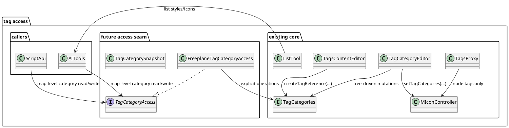
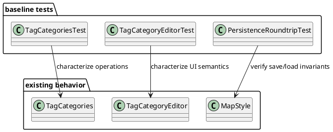
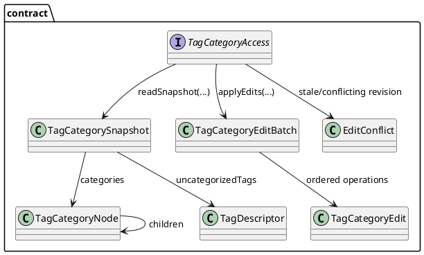
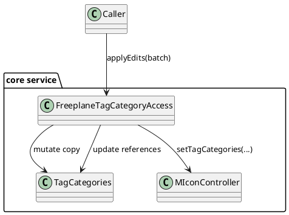
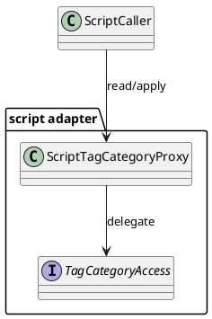
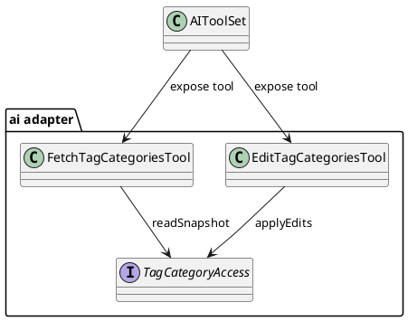
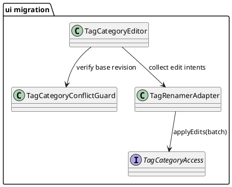

# Task: Expose tags and tag categories to AI tools and scripting
- **Task Identifier:** 2026-02-20-expose-tags-ai-tools
- **Scope:** Enable map-level and node-level access for both tag values and
  tag categories. Cover read and write operations needed by AI tools and
  scripting so category trees, category separator, and tag values can be
  managed without UI-only flows.
- **Motivation:** Tag categories are currently editable through UI flows,
  while script and AI paths mostly operate on node tag values. This blocks
  automation and makes category maintenance hard to integrate into AI and
  script workflows.
- **Scenario:** A user asks AI to normalize a map taxonomy. AI reads the
  current tag category tree, updates category names and hierarchy, and then
  updates node tags to the new taxonomy. A script can perform the same map-
  level category operations without opening tag editor dialogs.
- **Developer Briefing:** No code until design suggestions approved. Keep
  category and tag behavior deterministic, preserve undo semantics, and avoid
  bypassing existing reference-update logic in `TagCategories`.
  Category edit operations must remain node-traversal-free in steady state
  (no full map-node scan), except optional validation/debug-only modes.
- **Research:**
  - `TagCategoryEditor` is the main category editing entry point and is
    opened through `ManageTagCategoriesAction`. It clones map categories,
    mutates the copy through `JTree` operations, then commits once via
    `MIconController.setTagCategories(...)` on submit.
  - Category editing is strongly UI-coupled. `TagCategoryEditor` relies on
    Swing tree editing, drag/drop `TransferHandler`, custom data flavors,
    internal selection bookkeeping (`lastSelectionParentsNodes`), and async
    merge scheduling (`Invoker.invokeLater`).
  - `TagRenamer` derives rename/move/delete effects indirectly from tree
    events and accumulates string replacement pairs that are later applied to
    references. The logic depends on mutable editor state and selection
    context, not on explicit domain commands.
  - `TagCategories` owns multiple mutable structures at once:
    `DefaultTreeModel` category tree, `SortedComboBoxModel<Tag>` (`mapTags`),
    `TreeMap<String, List<TagReference>>` (`tagReferences`), and a lazy
    inverse index (`TreeInverseMap`). These are kept in sync by side effects
    across many methods.
  - Category hierarchy uses a mixed representation:
    tree nodes store short tags (`tagWithoutCategories`), while map/global
    references use fully qualified tag content built with
    `categorySeparator`.
  - The uncategorized bucket is modeled as a special tree node appended as
    the last root child (`UNCATEGORIZED_NODE` sentinel value is also used in
    rename replacement logic). Many operations depend on this positional
    invariant.
  - Separator changes are global rewrites. `updateTagCategorySeparator(...)`
    rewrites `mapTags`, remaps `tagReferences`, and may migrate/remove
    uncategorized nodes when content collides with the new separator.
  - Category operations eventually depend on
    `TagCategories.replaceReferencedTags(...)` plus
    `TagCategories.updateTagReferences()` to retarget all `TagReference`
    objects used by node `Tags` extensions.
  - Data structure initialization and mutation share parsing paths:
    `TagCategories.readTagCategories(...)` is used for both initial load and
    transferable insert/paste (`TagCategories.insert(...)`), so copy/move
    flows and initialization behavior are tightly coupled.
  - Persistence is split by scope:
    node tags are serialized as newline-separated `TAGS` attributes in
    `TagBuilder`, while map-level category structures and separator are
    persisted in map style `<tags ...>` attributes (`categories`,
    `category_separator`, plus `tagcolorN` for uncategorized tags).
  - Script access exists for node tags through `NodeProxy.getTags()` /
    `TagsProxy` (`getTags`, `setTags`, add/remove, category checks computed
    from node tags). There is no script API for map-level category tree,
    category separator updates, or category color/category structure edits.
  - AI access exists for node tags via `TagsContentReader`,
    `EditableContentReader` (`EditableContentField.TAGS`), and
    `TagsContentEditor` (`EditedElement.TAGS`). There is no AI DTO or tool
    for reading/updating map-level category hierarchy or separator.
  - AI list APIs currently expose icons and map styles (`ListTool`) but not
    map tag categories or map-available tag values.
  - Current tests are uneven by scope: core/UI category mutation behavior is
    heavily tested in `TagCategoryEditorTest`, while AI tests cover node tag
    read/edit only and do not cover category tree operations.
- **Design:**



Introduce a non-UI access seam around `TagCategories` so category reads and
writes become explicit commands instead of tree-event side effects. Keep
`TagCategoryEditor` using the same seam to preserve behavior and undo path,
then expose the seam to script and AI layers for map-level category
operations.
When `TagCategoryEditor` is open and an external category update happens,
conflict handling is strict: stale local drafts are rejected and the editor is
hard-reloaded to the latest snapshot (local unsaved edits are discarded).
- **Test specification:**
  - Automated tests:
    - Snapshot-read baseline:
      read category snapshot on empty map returns deterministic empty
      structure, separator, and revision/hash.
    - Snapshot-read hierarchy:
      read snapshot preserves ordered hierarchy for mixed depths and duplicate
      short tag names under different parents.
    - Snapshot-read colors:
      read snapshot distinguishes default-derived and explicit colors.
    - Load/serialize roundtrip:
      category tree and uncategorized colors survive parse and serialize
      roundtrip without structural drift.
    - Rename leaf category:
      renaming a leaf updates category tree and referenced node tag content.
    - Rename category with subtree:
      renaming a non-leaf rewrites all descendant qualified tag contents.
    - Rename to existing sibling:
      conflicting rename triggers merge behavior equivalent to current UI
      semantics and keeps deterministic surviving colors.
    - Move category across parents:
      moving a subtree rewrites qualified content prefixes for descendants and
      references.
    - Move categorized to uncategorized:
      moving category/tag into uncategorized strips prefix and keeps stable
      short-tag semantics.
    - Move uncategorized to categorized:
      moving uncategorized tag into category adds prefix and updates
      references.
    - Delete leaf category:
      removing leaf category updates references according to existing
      `replaceReferencedTags`/`updateTagReferences` behavior.
    - Delete non-leaf category:
      removing category with descendants applies deterministic replacement
      semantics for all affected references.
    - Create category path:
      creating missing multi-level paths yields expected hierarchy and
      reference registration.
    - Separator update basic:
      changing separator rewrites category tree qualified content and
      `tagReferences` consistently.
    - Separator update collision:
      separator change with collisions in uncategorized/category content
      applies deterministic conflict handling.
    - Color edit:
      changing category/tag color updates map-level registry and reflected tag
      references.
    - Multi-edit transaction:
      applying ordered edit batch is atomic and deterministic.
    - Performance guard:
      category edit apply path performs no full traversal over all map nodes
      in steady-state execution.
    - Stale revision protection:
      apply request with outdated revision/hash fails with conflict and
      performs no partial writes.
    - Open-editor external update:
      if editor base revision becomes stale, local draft submit is rejected and
      editor state hard-reloads to latest snapshot.
    - Undo/redo:
      map-level category edit apply path is fully undoable/redoable through
      controller actor flow.
    - Persistence map style:
      `<tags>` map-style attributes (`categories`, `category_separator`,
      `tagcolorN`) are written and reloaded with no data loss.
    - Persistence node tags:
      node `TAGS` attributes remain correct after category edits and
      save/reload.
    - Script API read:
      script can read full category snapshot without UI dialogs.
    - Script API write:
      script can apply rename/move/delete/create/separator updates with
      correct reference rewrites.
    - AI tool read:
      AI tool can fetch category snapshot deterministically.
    - AI tool write:
      AI tool category edit roundtrip updates map state and references.
    - Cross-caller parity:
      equivalent edit set via UI, script, and AI yields identical resulting
      snapshot.
    - Transferable compatibility:
      existing UI copy/cut/paste transferable flows remain behaviorally
      unchanged.
    - Node-tag regression:
      node-level tag edit behavior (`EditedElement.TAGS`) and
      `TagsContentReader` semantics remain unchanged.
    - Style regression:
      category/tag edits do not modify `mainStyle` or `activeStyles`.
  - Manual tests:
    - Use AI to rename and move a category subtree; verify category tree,
      node tags, and persistence after save/reload.
    - Use script API to update separator and resolve one intentional
      collision; verify rendered tags, filters, and category panel behavior.
    - Perform same edit sequence via UI and compare resulting snapshot with AI
      and script outputs for parity.

## Subtask: Characterization Coverage for Existing Category Behavior
- **Status:** completed
- **Scope:** Expand automated tests that characterize current
  `TagCategories` and `TagCategoryEditor` behavior, including transferable
  copy/cut/paste, merge semantics, separator rewrites, and persistence.
- **Motivation:** Replacement work is high risk without a baseline that
  captures existing behavior as executable specifications.
- **Scenario:** A developer changes category-update internals and runs tests.
  If a rename/move/merge behavior differs from current semantics, tests fail
  before integration work continues.
- **Developer Briefing:** No code until design suggestions approved. Add
  tests first, avoid behavior changes, and keep baseline assertions explicit.
- **Research:**
  - Existing tests already cover several rename and merge paths but do not
    fully cover transferable paths, separator collisions, and cross-layer
    parity checks.
  - Current behavior intentionally relies on indirect `TagReference` updates
    instead of node-wise tag rewrites.
- **Design:**



Characterization tests define the behavior oracle used by subsequent
subtasks. They intentionally capture current semantics, including edge-case
merge outcomes.
- **Test specification:**
  - Automated tests:
    - TDD test list (Red -> Green):
      - [C1] Transferable copy/cut/paste preserves current internal move
        detection semantics.
      - [C2] Separator rewrite collisions and uncategorized migration match
        current behavior.
      - [C3] Map `<tags>` and node `TAGS` persistence roundtrip keeps
        equivalent state.
      - [C4] Category updates remain node-traversal-free in steady state.
    - Add tests for transferable copy/cut/paste paths with internal move
      detection.
    - Add tests for separator rewrite collisions and uncategorized migration.
    - Add tests for persistence roundtrip of `<tags>` category data and node
      `TAGS` data.
    - Add tests that verify no node-wise map traversal is required in steady
      state category updates.
  - Manual tests:
    - Open category editor, run representative rename/move/cut/paste actions,
      and verify visible behavior matches automated baseline outcomes.

## Subtask: Define Tag Category Access Contract
- **Status:** completed
- **Scope:** Define map-level domain contract for category read/write:
  snapshot DTO, edit operations, revision token, conflict signaling, and
  deterministic ordering rules. Define shared data structures consumable from
  script and serializable as JSON for AI tools.
- **Motivation:** Script and AI adapters need a stable non-UI mutation
  contract before implementation and wiring.
- **Scenario:** A caller fetches a category snapshot, prepares an edit batch,
  and submits it with a revision token. Contract validation decides whether
  to apply or reject atomically.
- **Developer Briefing:** No code until design suggestions approved. Keep the
  contract independent from Swing classes and transferable formats.
- **Research:**
  - Existing behavior can be mapped to explicit operations:
    create/rename/move/delete/setColor/setSeparator.
  - Current editor behavior implies batch-oriented apply semantics and
    conflict-sensitive merges.
  - AI tools already exchange JSON payloads; category snapshots should be a
    tree-shaped JSON response with explicit paths.
  - Script API can expose the same structure as plain objects while delegating
    all behavior to one core contract implementation.
- **Design:**



Contract artifacts are caller-neutral and define one canonical operation
model reused by UI, script, and AI adapters.
AI snapshot shape should be JSON tree data:

```json
{
  "mapIdentifier": "uuid",
  "revision": "sha256:...",
  "separator": "::",
  "categories": [
    {
      "path": ["Project"],
      "name": "Project",
      "qualifiedName": "Project",
      "color": "#11223344",
      "children": [
        {
          "path": ["Project", "Status"],
          "name": "Status",
          "qualifiedName": "Project::Status",
          "color": "#22334455",
          "children": []
        }
      ]
    }
  ],
  "uncategorizedTags": [
    {
      "path": ["urgent"],
      "name": "urgent",
      "qualifiedName": "urgent",
      "color": "#ff0000ff"
    }
  ]
}
```

AI/script edit batch shape should be one ordered operation list:

```json
{
  "mapIdentifier": "uuid",
  "expectedRevision": "sha256:...",
  "operations": [
    {
      "type": "RENAME",
      "path": ["Project", "Status"],
      "newName": "State"
    },
    {
      "type": "MOVE",
      "path": ["Project", "State"],
      "newParentPath": ["Meta"],
      "index": 0
    },
    {
      "type": "SET_SEPARATOR",
      "newSeparator": "/"
    }
  ]
}
```

Script-facing API should wrap the same contract, for example:
`map.tagCategories.snapshot()` and `map.tagCategories.apply(editBatch)`.
- **Test specification:**
  - Automated tests:
    - TDD test list (Red -> Green):
      - [K1] Contract rejects missing required fields for snapshot/edit DTOs.
      - [K2] Snapshot ordering is deterministic for identical category state.
      - [K3] Revision token is stable for unchanged state and changes after
        successful mutation.
      - [K4] Stale `expectedRevision` yields conflict without writes.
      - [K5] AI JSON snapshot/edit payloads serialize and deserialize
        losslessly.
    - Validate DTO required fields and operation constraints.
    - Validate deterministic snapshot ordering and stable revision token
      generation.
    - Validate conflict signaling for stale revision token.
    - Validate JSON serialization/deserialization for AI snapshot and edit
      batch payloads.
    - Validate script wrapper delegates to the same core contract behavior.
  - Manual tests:
    - N/A

## Subtask: Implement Core Tag Category Access Service
- **Status:** in-progress
- **Scope:** Implement the contract-backed service on top of
  `TagCategories` and `MIconController.setTagCategories(...)`, preserving
  undo/redo and node-traversal-free category update behavior.
- **Motivation:** Centralizing category mutation logic removes UI coupling
  while keeping current performance and reference semantics.
- **Scenario:** Caller submits a mixed edit batch (rename, move, separator
  update). Service applies changes atomically, updates references indirectly,
  and commits once through undo-aware map controller flow.
- **Developer Briefing:** No code until design suggestions approved. Reuse
  existing `TagCategories` reference-update paths instead of reimplementing
  node updates.
- **Research:**
  - Current commit point is map-level and undo-aware via
    `MIconController.setTagCategories(...)`.
  - Existing replacement and reference sync logic lives in
    `TagCategories.replaceReferencedTags(...)` and `updateTagReferences()`.
  - UI transferable flows allow moving a non-leaf category subtree into
    uncategorized; this flattens moved paths to uncategorized tags through
    `UNCATEGORIZED_NODE` replacement semantics.
- **Design:**



Service applies edits to a working copy and performs one final commit to
maintain undo and map-change notification behavior.
`MOVE` into uncategorized preserves current UI parity: moving a non-leaf
subtree flattens moved paths to uncategorized tags while keeping reference
rewrites deterministic via `UNCATEGORIZED_NODE` semantics.
- **Test specification:**
  - Automated tests:
    - TDD test list (Red -> Green):
      - [S1] Core service applies `ADD`, `DELETE`, `RENAME`, `MOVE`,
        `SET_COLOR`, and `SET_SEPARATOR` correctly.
      - [S1a] `MOVE` of non-leaf subtree to uncategorized flattens moved
        paths and rewrites references with UI-equivalent outcomes.
      - [S2] Mixed batch apply is atomic when one operation fails.
      - [S3] Stale revision conflict performs zero writes.
      - [S4] Undo/redo restores exact pre/post states.
      - [S5] Apply path performs no full map-node traversal in steady state.
      - [S6] Core results match characterization oracle scenarios.
    - Apply create/rename/move/delete/setColor/setSeparator operations.
    - Verify atomicity when one operation in the batch fails.
    - Verify stale revision conflict path performs no writes.
    - Verify undo/redo parity with current category commit semantics.
    - Verify no full map-node traversal in steady-state apply flow.
  - Manual tests:
    - Run one mixed edit batch and verify map refresh and undo/redo behavior.

## Subtask: Expose Map-Level Tag Categories to Scripting
- **Status:** in-progress
- **Scope:** Add script API surface for reading and applying map-level
  category edits through the shared access service.
- **Motivation:** Scripts currently can edit node tags only; map taxonomy
  management needs parity with UI capabilities.
- **Scenario:** A script reads snapshot, renames a category subtree, and
  applies edits without opening dialogs.
- **Developer Briefing:** No code until design suggestions approved. Keep
  script API thin and delegate behavior to the shared service.
- **Research:**
  - `TagsProxy` currently exposes only node-level tags.
  - Map-level category APIs are absent in script proxies.
- **Design:**



Script adapter introduces no mutation logic of its own; it forwards validated
requests to the core service.
- **Test specification:**
  - Automated tests:
    - TDD test list (Red -> Green):
      - [P1] Script `snapshot()` returns deterministic category tree payload.
      - [P2] Script `apply(...)` executes ordered edit batch semantics.
      - [P3] Script surfaces stale revision conflicts from shared service.
      - [P4] Script outcomes match characterization parity scenarios.
    - Script read returns deterministic snapshot.
    - Script write applies edit batches and updates references.
    - Script results match baseline snapshot oracle for equivalent edits.
  - Manual tests:
    - Execute sample script on a map and verify category tree and node tags.

## Subtask: Expose Map-Level Tag Categories to AI Tools
- **Status:** in-progress
- **Scope:** Add AI tool requests/responses for category snapshot read and
  edit batch apply, using the same shared access service.
- **Motivation:** AI currently edits node tag values but cannot manage map
  category taxonomy directly.
- **Scenario:** AI fetches map category snapshot, proposes taxonomy edits, and
  applies them atomically with revision conflict handling.
- **Developer Briefing:** No code until design suggestions approved. Keep AI
  DTOs explicit and avoid leaking UI-centric transferable formats.
- **Research:**
  - Current AI tools include node tag read/edit but no map category tool.
  - Existing list tools do not expose map category structures.
- **Design:**



AI tool layer stays declarative; all mutation semantics are centralized in
the shared service.
- **Test specification:**
  - Automated tests:
    - TDD test list (Red -> Green):
      - [A1] AI fetch tool returns JSON tree snapshot with revision.
      - [A2] AI edit tool applies ordered instructions and returns updated
        snapshot.
      - [A3] AI edit tool returns conflict on stale revision without writes.
      - [A4] AI payload ordering and identity fields remain deterministic.
      - [A5] AI outcomes match script/core parity scenarios.
    - Tool read returns snapshot with deterministic order and revision token.
    - Tool write applies batch edits and returns updated snapshot.
    - Stale revision requests return conflict errors without writes.
    - AI results match baseline parity scenarios.
  - Manual tests:
    - Ask AI to rename and move categories, then verify map state and undo.

## Subtask: Migrate Tag Category Editor to Shared Service
- **Status:** in-progress
- **Scope:** Rewire `TagCategoryEditor` to call shared category access
  operations while preserving existing UI interactions, transferable support,
  and visible behavior.
- **Motivation:** UI should become a caller of the same domain API used by
  script and AI to eliminate duplicated mutation orchestration.
- **Scenario:** User edits categories in the current dialog; submission is
  translated into explicit edit operations and applied through shared service
  with identical observable outcomes.
- **Developer Briefing:** No code until design suggestions approved. Preserve
  existing keyboard, drag/drop, and transferable interaction UX.
- **Research:**
  - Current editor contains non-local mutation bookkeeping (`TagRenamer`,
    `lastSelectionParentsNodes`) tightly coupled to tree events.
  - Shared service migration is required for true parity across callers.
- **Design:**



UI keeps interaction patterns but delegates final mutation semantics to the
shared service for parity and maintainability.
On stale revision conflicts, UI policy is to discard the local unsaved draft
and reload from latest state immediately, rather than attempting in-dialog
merge of transient tree-event state.
Migration is incremental:
1. Add revision conflict guard in `submit()` and reject stale apply without
   writing map categories.
2. Keep current transferable/copy tree behavior unchanged while switching final
   apply path to shared access operations.
- **Test specification:**
  - Automated tests:
    - TDD test list (Red -> Green):
      - [U1] Existing `TagCategoryEditorTest` scenarios pass unchanged.
      - [U2] Transferable copy/cut/paste UX behavior stays equivalent.
      - [U3] External update conflict rejects stale submit and hard-reloads
        latest snapshot.
      - [U4] UI results remain parity-equivalent to script/AI outputs.
      - [U3a] `submit()` rejects stale revision and does not call
        `setTagCategories`.
      - [U3b] Conflict path discards local draft and reopens editor on latest
        categories.
    - Existing `TagCategoryEditorTest` scenarios continue to pass.
    - Transferable copy/cut/paste behavior remains unchanged.
    - UI results match script/AI snapshots for equivalent edit sequences.
    - External update conflict path rejects stale submit and reloads editor
      state to latest snapshot.
  - Manual tests:
    - Execute representative category-edit workflows in dialog and verify no
      UX regressions.
    - While editor is open, apply an external category change and verify
      immediate editor reload with stale-draft discard notice.
