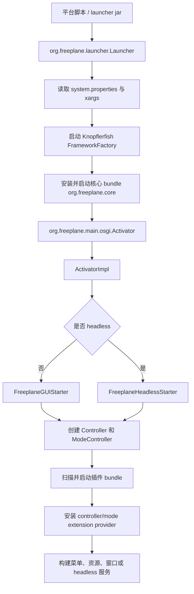

# 启动流程与 OSGi 生命周期

Nexordia/Freeplane 的启动链由外部启动器、Knopflerfish OSGi 框架、核心 bundle Activator、GUI/headless starter 和插件服务提供者组成。理解这条链路对排查“启动失败、插件未加载、菜单缺失、模式未创建、资源找不到”很关键。

## 高层启动链



## `freeplane_framework` 启动器

入口类：

```text
freeplane_framework/src/main/java/org/freeplane/launcher/Launcher.java
```

职责：

- 检查 Java 版本。
- 设置启动相关系统属性。
- 读取 `system.properties`。
- 读取 `props.xargs` 与 `init.xargs`。
- 设置 `org.freeplane.basedirectory`。
- 设置 `org.knopflerfish.gosg.jars`。
- 设置 `org.freeplane.globalresourcedir`。
- 设置 policy 和 framework storage。
- 创建 Knopflerfish `Framework`。
- 在 GUI 模式下等待 Swing EDT 完成初始化。
- 在 headless 模式下设置 `java.awt.headless=true`。
- 可从 OSGi service registry 获取核心 `Controller` 服务。

启动器本身不创建地图、菜单和插件业务对象。它的主要边界是“把 OSGi 框架跑起来”。

## 核心 bundle Activator

入口类：

```text
freeplane/src/main/java/org/freeplane/main/osgi/Activator.java
freeplane/src/main/java/org/freeplane/main/osgi/ActivatorImpl.java
```

`Activator` 是薄包装，主要把 OSGi 生命周期委托给 `ActivatorImpl`。

`ActivatorImpl` 的关键职责：

- 恢复启动前的 `user.dir`。
- 注册 `freeplaneresource` 与 `data` URL handler。
- 解析命令行参数。
- 根据交互模式选择 GUI 或 headless starter。
- 初始化 single instance 管理。
- 创建全局 `Controller`。
- 通过 view controller 调度 mode controller 初始化。
- 扫描安装目录和用户目录下的插件。
- 安装、启动 OSGi bundle。
- 查找并调用扩展 provider。
- 构建菜单、快捷键、主窗口或 headless 环境。

## GUI 与 headless starter

GUI 模式入口：

```text
freeplane/src/main/java/org/freeplane/main/application/FreeplaneGUIStarter.java
```

headless 模式入口：

```text
freeplane/src/main/java/org/freeplane/main/headlessmode/FreeplaneHeadlessStarter.java
```

两者都会创建核心控制器，但目标不同。

### GUI 模式

`FreeplaneGUIStarter` 负责完整桌面应用初始化：

- 创建 `Controller`。
- 使用 `ApplicationResourceController` 初始化资源、属性和日志。
- 设置当前 controller。
- 设置 Look & Feel。
- 创建 `MMapViewController`。
- 安装全局控制器，例如 highlight、filter、print、format、scanner、attribute、text、time、link、icon、help、node history 等。
- 创建 `MModeController` 和 `FModeController`。
- 加载 `/xml/mindmapmodemenu.xml`、`/xml/filemodemenu.xml`。
- 处理最近文件和启动地图。
- 创建主窗口，标题使用 Nexordia 相关名称。

### headless 模式

`FreeplaneHeadlessStarter` 创建更小的运行环境：

- `HeadlessMapViewController`
- `HeadlessUIController`
- headless mind map mode
- 必要的模型、IO 和控制器

headless 模式适合命令行导入导出、自动化和测试，不创建 Swing frame。

## 插件扫描和加载

`ActivatorImpl` 会扫描：

- 安装目录下的 `plugins`
- 用户目录下的插件位置
- 递归查找包含 `META-INF/MANIFEST.MF` 的目录

发现插件后以 `reference:file:...` 方式安装 bundle，再启动 bundle。

插件启动成功后，核心会通过 OSGi service 查找扩展 provider：

```text
org.freeplane.core.extension.IControllerExtensionProvider
org.freeplane.core.extension.IModeControllerExtensionProvider
```

controller provider 面向全局 `Controller`，mode provider 面向特定 `ModeController`。

mode provider 使用服务属性区分模式，例如：

```text
(mode=MindMap)
```

## 扩展 provider 接口

全局扩展：

```text
IControllerExtensionProvider.installExtension(
    Controller controller,
    CommandLineOptions options,
    ExtensionInstaller.Context context
)
```

模式扩展：

```text
IModeControllerExtensionProvider.installExtension(
    ModeController modeController,
    CommandLineOptions options
)
```

常见用途：

- 注册动作。
- 注册菜单项和偏好项。
- 安装节点/地图扩展读写器。
- 安装文本 transformer。
- 注册新控制器。
- 初始化插件服务。
- 向 mode controller 添加 listener。

## 菜单和插件的关系

菜单 XML 中的动作不一定全部来自核心。很多动作由插件 Activator 在 mode provider 安装阶段注册。如果菜单项显示但动作不可用，常见原因包括：

- 插件 bundle 未启动。
- Activator 抛异常。
- mode provider 未匹配当前模式。
- action key 与 XML entry key 不一致。
- 动作注册发生在菜单构建之后。

排查时建议按顺序看：

1. 插件 `build.gradle` 的 bundle id 和 activator。
2. 插件 `Activator` 是否注册了 provider。
3. provider 是否匹配 `MindMap`、`CodeExplorer` 或其他模式。
4. action key 是否存在于 `AController` registry。
5. 菜单 XML entry 是否引用同一个 key。

## 退出和清理

核心生命周期结束时，`Controller.shutdown()` 会处理：

- 保存属性。
- 通知 view controller 退出。
- 释放 map。
- 清理 mode controller。
- 清空扩展。

插件如果启动了线程、HTTP server、watcher 或缓存，应在 bundle `stop()` 中释放。AI 插件的 MCP server 就属于这种资源。

## 启动问题定位入口

| 症状 | 优先检查 |
| --- | --- |
| 应用无法启动 | `Launcher`、xargs、Java 版本、framework storage |
| OSGi bundle 不加载 | 插件 manifest、`Bundle-ClassPath`、缺失依赖、Java 版本 |
| GUI 空白或主窗口异常 | `FreeplaneGUIStarter`、Look & Feel、`MapViewController` |
| 菜单项缺失 | XML 菜单、action 注册、插件 provider |
| 插件功能无效 | 插件 Activator、OSGi service、mode 过滤 |
| headless 行为与 GUI 不一致 | `FreeplaneHeadlessStarter` 是否安装同等控制器 |

