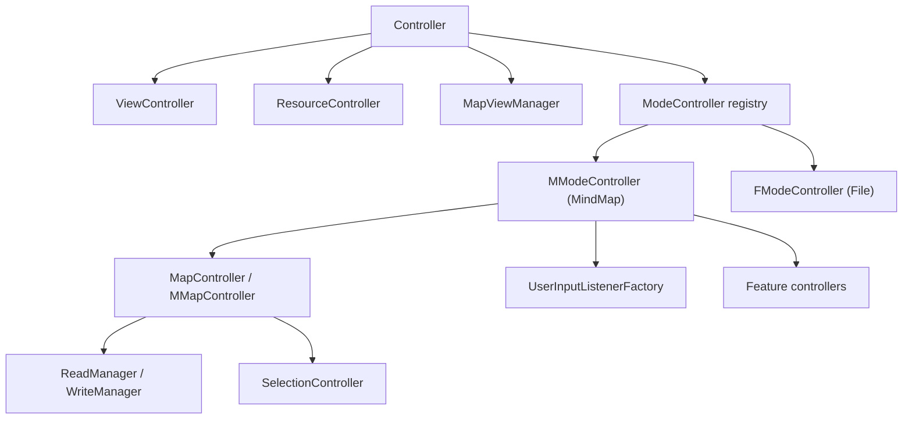

# 核心控制器与模式体系

Freeplane 的核心不是单一 MVC 类，而是一组分层控制器。全局 `Controller` 持有应用级服务和当前模式；每个 `ModeController` 持有模式内行为；MindMap 模式再通过大量 feature controller 承载编辑、样式、文本、链接、属性、导出等能力。

## 控制器层级



## 全局 `Controller`

主要路径：

```text
freeplane/src/main/java/org/freeplane/core/ui/Controller.java
```

职责：

- 维护当前全局 controller。
- 持有所有 `ModeController`。
- 持有 `ViewController`、`ResourceController`、`IMapViewManager`。
- 管理当前选择和当前 map view。
- 管理 option validators 和 option panel controller。
- 注册全局 action。
- 管理应用生命周期。
- 在模式切换时调用旧模式 shutdown 和新模式 startup。
- 在退出时保存属性、释放地图和清理扩展。

重要行为：

- `selectMode` 是模式切换入口。
- `getModeController` 获取当前模式控制器。
- `getSelection` 通常从当前 map view/controller 取得。
- `shutdown` 是退出清理主入口。

开发提醒：

- 不要把具体功能逻辑塞进全局 `Controller`。
- 全局行为只适合放跨模式、跨地图、跨视图的协调逻辑。
- 某个模式独有的动作应注册到对应 `ModeController`。

## `ModeController`

主要路径：

```text
freeplane/src/main/java/org/freeplane/features/mode/ModeController.java
```

职责：

- 表示一个运行模式，例如 MindMap 或 File。
- 保存模式内扩展。
- 管理 extension copier。
- 持有模式内 `MapController`。
- 持有 `UserInputListenerFactory`。
- 管理 tooltip provider、node view lifecycle listener。
- 注册模式动作。
- 将 action 与 map change listener 关联。
- 提供 mode startup/shutdown 钩子。

默认动作包括：

- `SelectBranchAction`
- `SelectAllAction`
- `CommandSearchAction`

默认 `execute(IActor, map)` 直接执行 actor。可编辑模式会覆盖该行为，以便接入撤销/重做。

## MindMap 模式：`MModeController`

主要路径：

```text
freeplane/src/main/java/org/freeplane/main/mindmapmode/MModeController.java
```

特征：

- `MODENAME = "MindMap"`
- 可编辑。
- 集成 undo/redo。
- 通过 `IUndoHandler` 和 `IActor` 管理事务。
- 使用 `MFileManager` 保存地图。
- 加载 `/xml/preferences.xml` 构建偏好面板。
- 注册 `ShowPreferencesAction`。
- 将 action 执行调度到 UI 线程。

关键点：

- 可撤销业务改动应实现或复用 `IActor`。
- 修改 map/model 时优先使用已有 controller 方法，让 dirty flag、事件、undo 正常工作。
- 不要绕过 `MModeController.execute` 直接改模型，除非该路径明确不需要撤销。

## File 模式：`FModeController`

主要路径：

```text
freeplane/src/main/java/org/freeplane/main/filemode/FModeController.java
```

File 模式用于文件/根节点视图，不是主要编辑模式。它通常不承担复杂编辑能力。

开发时如果功能只服务思维导图编辑，优先进入 MindMap 模式，不要误加到 File 模式。

## `MModeControllerFactory`

主要路径：

```text
freeplane/src/main/java/org/freeplane/main/mindmapmode/MModeControllerFactory.java
```

这是 MindMap 模式的集中装配点。它负责创建和连接大量 feature controller。

典型装配内容：

- `MMapController`
- `MFileManager`
- `UrlManager`
- `MMapIO`
- 剪贴板控制器
- icon 控制器
- progress 控制器
- edge/cloud/note/text/link/style 控制器
- node location/layout/style 控制器
- attribute 控制器
- spellchecker
- export 控制器
- map style 控制器
- hidden node/folding 控制器
- 工具栏、F-buttons、UI factory

还会注册大量动作和 add-in：

- 新建节点、删除、移动、排序、拆分
- 外部图片
- fit page
- 加密
- presentation
- summary node
- always unfolded
- free node
- bookmark
- update check
- XML/MindManager 导入

新增核心编辑功能时，通常需要在这里找同类功能的注册方式。

## Action 体系

基础类：

```text
freeplane/src/main/java/org/freeplane/core/ui/AFreeplaneAction.java
freeplane/src/main/java/org/freeplane/core/ui/AController.java
```

特点：

- action 使用 key 注册。
- 显示文本来自 `<key>.text`。
- icon 来自 `<key>.icon`。
- tooltip 来自 `<key>.tooltip`。
- 可使用 `EnabledAction`、`SelectableAction` 注解。
- 支持 `UserRoleConstraint`。
- selectable action 会通过 property change 同步状态。

常见开发步骤：

1. 创建 action 类。
2. 在对应 controller/factory/Activator 注册。
3. 添加资源文本。
4. 如需菜单或工具栏，修改 XML。
5. 如需快捷键，添加 accelerator 配置。
6. 编写业务逻辑测试，UI wiring 保持薄。

## Undo/Redo 与 `IActor`

编辑模式中，可撤销改动由 actor 描述。典型原则：

- actor 执行时做实际修改。
- actor 能提供反向操作或被 undo handler 管理。
- 修改节点、属性、样式、结构时要触发合适事件。
- 使用 controller 层已有方法通常比直接操作模型更安全。

风险点：

- 直接改 `NodeModel` 字段可能绕过 dirty flag。
- 直接改 child list 可能绕过克隆节点同步。
- 直接触发 Swing repaint 不能替代模型事件。
- 把复杂逻辑写进 actionPerformed 会导致不可测试。

## 扩展容器

基础路径：

```text
freeplane/src/main/java/org/freeplane/core/extension/ExtensionContainer.java
```

`Controller`、`ModeController`、`MapModel`、`NodeModel` 等对象都可能携带扩展。

特征：

- 以 class 为 key 保存 `IExtension`。
- 同一类型通常只能有一个扩展实例。
- 如果已有不同实例，再添加会抛异常。

用途：

- 插件为节点或地图附加数据。
- 核心 feature 保存状态。
- 持久化扩展通过 read/write manager 接入。

## 模式相关开发判断

| 问题 | 建议放置位置 |
| --- | --- |
| 全局启动、资源、应用生命周期 | `Controller` 或 starter |
| 只在 MindMap 编辑可用 | `MModeController`、`MModeControllerFactory` 或 feature controller |
| 地图结构修改 | `MMapController` 或专门业务 controller |
| 普通 map 读取/写入 | `MapController`、`ReadManager`、`WriteManager` |
| 视图绘制、选择、缩放 | `MapViewController`、`MapView`、`NodeView` |
| 插件功能 | 插件 Activator + provider |
| 菜单/偏好 | XML + action/resource registration |

