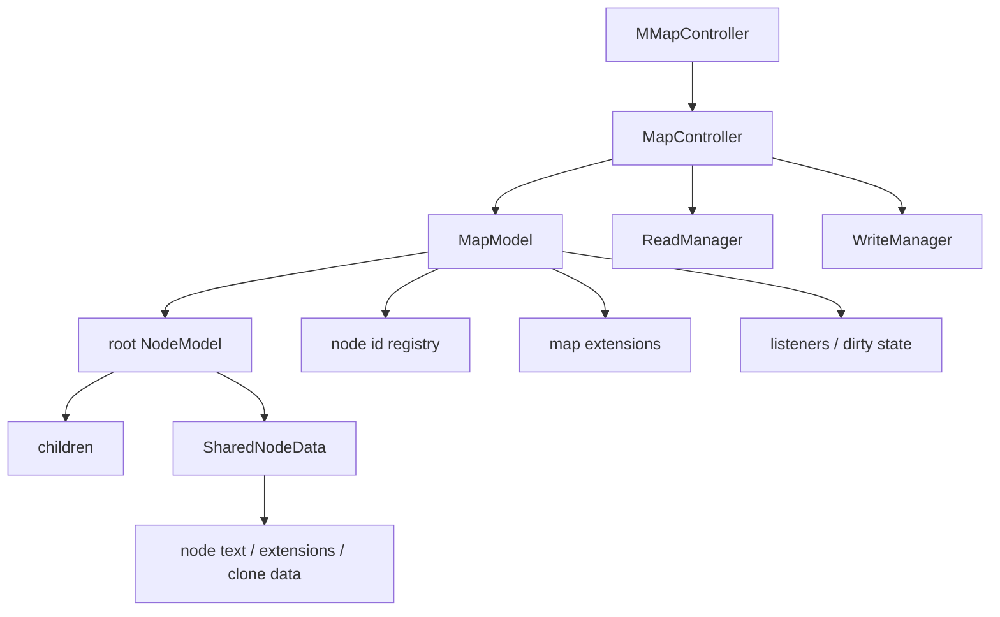

# 思维导图模型与读写流程

地图数据层以 `MapModel` 和 `NodeModel` 为核心。`MapController` 管理选择、生命周期、折叠和读写，`MMapController` 添加可编辑操作与撤销。`.mm` 文件读写由 `ReadManager`、`WriteManager`、`MapReader`、`MapWriter` 和节点读写器协作完成。

## 模型层概览



## `MapModel`

主要路径：

```text
freeplane/src/main/java/org/freeplane/features/map/MapModel.java
```

职责：

- 保存根节点。
- 保存 URL、只读状态、保存状态和 dirty 计数。
- 管理节点 ID 注册表。
- 生成新节点 ID。
- 持有 map-level extensions。
- 持有 icon registry。
- 持有 map listeners 和 node change announcer。
- 提供 map lifecycle event。

ID 特征：

- 新 ID 使用 `ID_` 前缀。
- 随机数范围到约 20 亿。
- `MapModel` 维护 `Map<String, NodeModel>` 作为节点 registry。

dirty state：

- 地图修改会更新 dirty/modified 状态。
- 保存后调用相关方法标记为 saved。
- UI 标题、最近文件、保存提示等依赖此状态。

开发提醒：

- 添加/删除节点时必须维护 registry。
- 修改 map 扩展时要考虑读写器。
- 不要只改模型字段而不触发生命周期/节点变化事件。

## `NodeModel`

主要路径：

```text
freeplane/src/main/java/org/freeplane/features/map/NodeModel.java
```

职责：

- 表示一个思维导图节点。
- 保存 parent、children、map、id、folded、side 等结构信息。
- 保存当前关联的 node view。
- 通过 `SharedNodeData` 保存共享内容。
- 支持 tree clone 和 content clone。
- 支持节点扩展。
- 触发节点变化事件。

常见内容类型常量：

- `NODE_TEXT`
- `NOTE_TEXT`
- `NODE_ICON`

### `SharedNodeData`

节点内容和扩展有共享语义。内容克隆节点共享 `SharedNodeData`，因此修改文本、部分扩展或共享内容可能影响多个克隆。

开发时必须先判断：

- 当前操作应只影响一个节点实例。
- 当前操作应影响同一内容克隆组。
- 当前操作应影响整棵克隆子树。

## 克隆节点

`NodeModel` 支持多种克隆关系：

- content clone：多个节点共享内容。
- tree clone：子树克隆。
- clone group：克隆组由内部 detached node list 等结构维护。

相关方法包括：

- `convertToClone`
- `subtreeClones`
- `allClones`
- `isCloneTreeRootOrContentClone`

风险点：

- 移动节点可能影响克隆树关系。
- 删除节点可能需要处理 clone group。
- 修改 side 可能在 clone tree 中传播。
- 展开/折叠受 always-unfolded 扩展影响。

开发规则：

- 结构性编辑优先使用 `MMapController` 已有方法。
- 新增结构编辑前先读同类操作，例如新建、删除、移动、summary node。
- 为 clone 行为写单元测试，避免只在 UI 里手动验证。

## `MapController`

主要路径：

```text
freeplane/src/main/java/org/freeplane/features/map/MapController.java
```

继承和职责：

- 继承 `SelectionController`。
- 实现 `IExtension`。
- 实现 `NodeChangeAnnouncer`。
- 创建和持有 `ReadManager`、`WriteManager`。
- 创建 `MapReader`、`MapWriter`。
- 管理 folding/unfolding。
- 管理 map lifecycle。
- 管理节点 refresh、dirty flag、修改时间。
- 创建和打开 map view。
- 处理 delayed node refresh。

折叠相关：

- `setFolded(node, boolean, filter)` 需要 filter。
- `unfoldAndScroll(node, filter)` 需要 filter。
- `toggleFoldedAndScroll(node)` 内部处理 filter。

获取 filter 的局部模式：

- 从 `MapView` 上取 `map.getFilter()`。
- `map.select()` 之后可使用 `controller.getSelection().getFilter()`。

## `MMapController`

主要路径：

```text
freeplane/src/main/java/org/freeplane/features/map/mindmapmode/MMapController.java
```

`MMapController` 在 `MapController` 基础上添加可编辑行为：

- 新建子节点、兄弟节点、summary node、free node。
- 删除节点。
- 移动节点。
- 修改 side。
- 转换克隆。
- 处理 summary group。
- 检查可写性和加密状态。
- 把当前格式复制到新节点。
- 处理克隆场景下的插入、删除、移动。

可编辑操作要经过 undo actor 和 controller，避免直接改 child list。

## 读管理：`ReadManager`

主要路径：

```text
freeplane/src/main/java/org/freeplane/features/mapio/ReadManager.java
```

职责：

- 注册 XML tag 到 element handler。
- 注册 tag/attribute 到 attribute handler。
- 管理 read completion listener。
- 支持核心和插件向读流程注册自己的扩展。

适用场景：

- 添加新的节点属性。
- 添加新的 map/node 扩展元素。
- 插件需要读取自己的 XML 内容。

## 写管理：`WriteManager`

主要路径：

```text
freeplane/src/main/java/org/freeplane/features/mapio/WriteManager.java
```

职责：

- 注册 tag 的 attribute writer。
- 注册 tag 的 element writer。
- 注册 extension attribute writer。
- 注册 extension element writer。

适用场景：

- 将 map extension 写入文件。
- 将 node extension 写入文件。
- 将插件数据持久化到 `.mm`。

## `MapReader` 和节点构建

主要路径：

```text
freeplane/src/main/java/org/freeplane/features/mapio/MapReader.java
freeplane/src/main/java/org/freeplane/features/mapio/NodeBuilder.java
```

`MapReader` 创建：

- `NodeTreeCreator`
- `TreeXmlReader`
- `NodeBuilder`

它维护：

- read hints
- ID substitution
- root 设置
- unknown element 支持

`NodeBuilder` 处理：

- `node`
- `stylenode`
- `FOLDED`
- `ID`
- `POSITION`
- encrypted content
- history
- clone refs，例如 `REFERENCE_ID`、`TREE_ID`、`CONTENT_ID`
- 加载后的折叠状态，受 resource properties 影响

## `MapWriter` 和节点写出

主要路径：

```text
freeplane/src/main/java/org/freeplane/features/mapio/MapWriter.java
freeplane/src/main/java/org/freeplane/features/mapio/NodeWriter.java
```

`MapWriter` 写出：

- `<map version=...>`
- usage comment
- map extensions
- root node

写出模式：

- `CLIPBOARD`
- `FILE`
- `EXPORT`
- `STYLE`

`NodeWriter` 写出：

- 节点属性和内容。
- 加密内容。
- 折叠状态。
- side。
- ID 和 clone reference ID。
- history 时间。
- icon size。
- link attributes/content。
- shared extension attributes/elements。
- individual extension attributes/elements。
- 经过 `CopiedNodeSet` 过滤后的 children。

## Unknown elements

读写层支持 unknown elements，用于保留无法识别的 XML 内容。这对兼容旧版/新版文件和插件数据很重要。

开发新读写逻辑时需要确认：

- 未识别内容是否应保留。
- 写出时是否会丢失插件扩展。
- 导出模式是否应该排除某些内部扩展。

## 持久化新数据的推荐路线

新增节点或地图持久化数据时：

1. 判断数据属于节点、地图、样式还是插件。
2. 定义清晰的 extension 或已有模型字段。
3. 注册 read handler。
4. 注册 write handler。
5. 添加模型层单元测试。
6. 添加读写 round-trip 测试。
7. 如有 UI，最后接入 action 或面板。

不要先从 UI 控件直接拼 XML。读写层已经提供扩展注册机制，应复用它。

