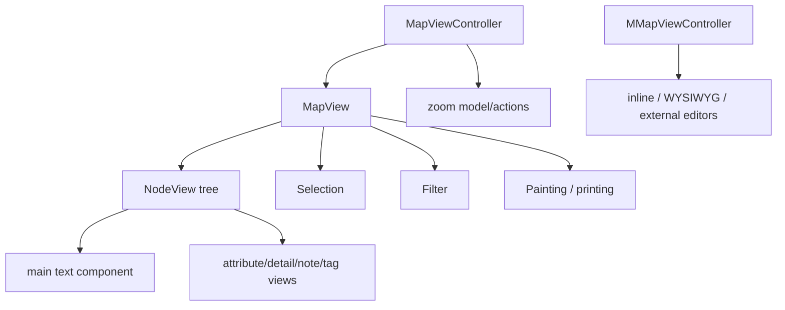

# Swing 视图与交互层

视图层集中在 `freeplane/src/main/java/org/freeplane/view/swing` 和部分 `features/*/mindmapmode` 包中。它负责把 `MapModel`、`NodeModel` 和各类 feature controller 显示为可交互的 Swing 思维导图。

## 视图层主要对象



## `MapViewController`

主要路径：

```text
freeplane/src/main/java/org/freeplane/view/swing/map/MapViewController.java
```

职责：

- 实现 `IMapViewManager`。
- 管理所有打开的 `MapView`。
- 管理 selected map view。
- 管理 window-focused map view。
- 管理 zoom combo 和 zoom model。
- 注册 selection listener。
- 创建 zoom action。
- 在 map view/mode 变化时协调 UI。

开发关注点：

- 需要获取当前 map view 时优先通过 controller/map view manager。
- 缩放改动要走 zoom model/action，避免直接改组件比例。
- 当前选择和当前窗口焦点不总是同一个概念。

## `MMapViewController`

主要路径：

```text
freeplane/src/main/java/org/freeplane/view/swing/map/mindmapmode/MMapViewController.java
```

职责：

- 创建 inline editor。
- 创建 WYSIWYG editor。
- 创建 external editor。
- 保存 modified maps 时提示用户。
- 处理 MindMap 编辑模式下的视图能力。

编辑器相关改动通常从这里或 text/note controller 进入，而不是直接操作 `NodeView`。

## `MapView`

主要路径：

```text
freeplane/src/main/java/org/freeplane/view/swing/map/MapView.java
```

`MapView` 是核心 Swing 面板，承担很多职责：

- 显示当前 `MapModel`。
- 保存 root node view 和 current root。
- 管理 selection。
- 管理 filter。
- 管理 zoom。
- 管理背景图片/背景视频。
- 绘制连接线、连接器、概览。
- 支持 printing。
- 支持 autoscroll。
- 支持 map change listener。
- 协调节点可见性、展开折叠、选择同步。
- 处理 repaint、validate 和布局刷新。

风险点：

- `MapView` 已经很大，新增业务逻辑前应优先抽取。
- 绘制逻辑、滚动逻辑、选择逻辑互相影响，改动要配合视觉验证。
- 缩放下坐标转换很容易出错，测试应覆盖低缩放和高缩放。
- 背景图、背景视频、连接器和节点层绘制顺序需要保持一致。

## `NodeView`

主要路径：

```text
freeplane/src/main/java/org/freeplane/view/swing/map/NodeView.java
```

职责：

- 将 `NodeModel` 映射为 Swing 组件。
- 管理主文本、属性、detail、note、tag 等子组件。
- 管理 child node view layout。
- 处理左右布局、对齐、方向。
- 绘制 edge、cloud。
- 管理 folding 状态显示。
- 插入/删除/更新 child views。
- 响应节点更新并触发布局重置。

`NodeView` 是 UI 表示，不应成为业务模型真相。模型变化应从 `NodeModel`/controller 发起，再让 view 更新。

## 鼠标事件与选择/折叠

仓库中已有较明确的鼠标事件分工：

- `NodeSelector` 处理节点选择时机和行为。
- `NodeFolder` 处理节点折叠时机和行为。
- `DefaultNodeMouseMotionListener` 协调鼠标事件。
- 事件根据区域路由，例如 folding control 区域和 selection 区域。

开发规则：

- 选择逻辑和折叠逻辑不要混在一起。
- 判断是否在折叠控件内时使用已有区域方法。
- 涉及 delayed/immediate 行为时查现有 selection/folding 配置。

## Filter 与可见性

视图中节点可见性受 filter、folded、hidden summaries 等因素影响。

常见模式：

- 从 `MapView` 获取 filter。
- `map.select()` 之后可以从 selection 获取 filter。
- 展开、滚动、查找 visible children 时需要带 filter。

开发时要避免：

- 只看 `NodeModel.children` 判断 UI 上是否可见。
- 对隐藏节点直接滚动。
- 绕过 filter 展开导致 UI 和模型状态不一致。

## 缩放、滚动和绘制

缩放相关职责分散在：

- `MapViewController` 的 zoom model/action。
- `MapView` 的 zoom、坐标转换、绘制和滚动逻辑。
- 节点/边/连接器/背景的绘制实现。

改动缩放时应覆盖：

- 100%。
- 低缩放。
- 高缩放。
- 有背景图或背景视频。
- 有 cloud、connector、HTML image、长节点文本。
- 打印或导出路径，如果改动影响绘制。

## 背景图片和背景视频

本仓库已有背景图/背景视频相关尝试记录在 `doc/`。源码中相关逻辑主要落在 `MapView` 和样式/资源控制器周边。

开发关注点：

- 背景资源加载和释放。
- 缩放时背景尺寸和坐标。
- repaint 时机。
- map 切换后的生命周期。
- 与节点、连接器、overview 的绘制层级。

## UI 开发原则

对于 Swing UI 功能：

1. 先判断是否有可抽取的业务逻辑。
2. 把计算、选择、格式应用、状态迁移放入可测试类。
3. 为抽取类写单元测试。
4. UI action/listener 只负责取上下文、调用业务对象、刷新 UI。
5. 最后做手动视觉验证。

尤其避免在这些位置塞复杂逻辑：

- `actionPerformed`
- mouse listener
- paint 方法
- Swing component getter/setter
- editor callback

复杂逻辑一旦进入 UI 回调，后续定位和回归测试都会变困难。

