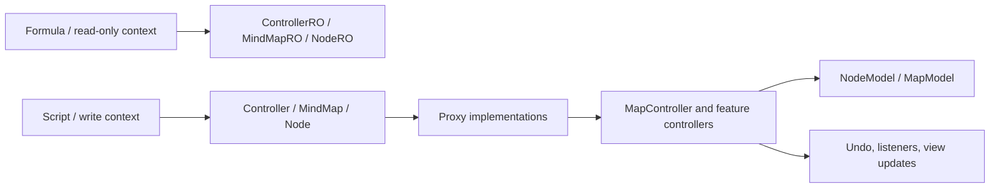
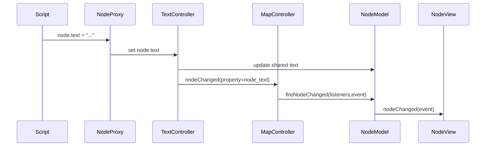
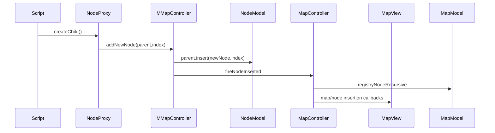
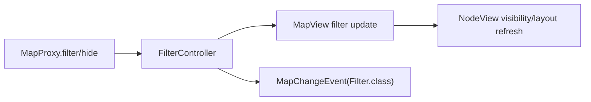
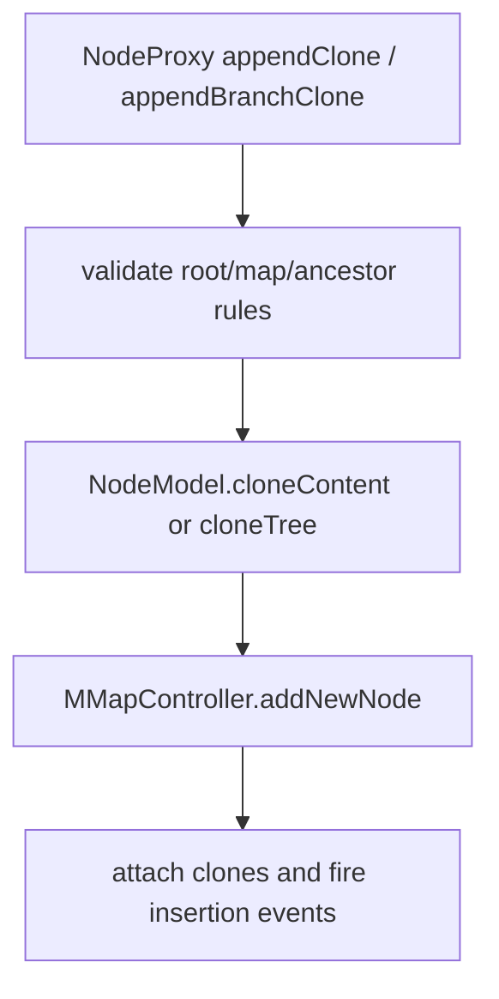

# API 模块深度研究

本文聚焦 `freeplane_api` 公共 API、核心模块对 API 包的导出、脚本插件中的 proxy 实现，以及 API 调用最终如何落到 `MapController`、`MMapController`、`TextController` 等内部控制器。

## 结论摘要

`freeplane_api` 不是核心模型的直接暴露层，而是一套稳定的插件/脚本契约。API 接口位于 `freeplane_api/src/main/java/org/freeplane/api`，真正执行逻辑主要在 `freeplane_plugin_script/src/main/java/org/freeplane/plugin/script/proxy`，proxy 把 API 对象映射到内部 `NodeModel`、`MapModel` 和各类 controller。

关键设计：

- `ControllerRO`/`Controller`、`MindMapRO`/`MindMap`、`NodeRO`/`Node` 明确区分只读和可写 API。
- `Map`/`MapRO` 仍存在，但已经是 deprecated alias，应优先使用 `MindMap`/`MindMapRO`。
- 公式环境只允许只读能力，脚本环境可使用可写 API。
- API 层大量返回接口对象，实际对象多为 `ControllerProxy`、`MapProxy`、`NodeProxy` 等。
- API 写操作通常不直接改模型字段，而是委托到内部 controller，以触发撤销、监听器、视图刷新和脏标记。

## 模块构建与导出

主模块：

```text
freeplane_api/
```

构建文件：

```text
freeplane_api/build.gradle
```

特点：

- Java source/target 以 Java 8 为基准。
- 主 jar 暴露完整 API 包。
- `viewerApiJar` 生成 `freeplaneapi_viewer.jar`，只包含少量 viewer 也需要的值对象和枚举。

`viewerApiJar` 当前包含：

```text
LengthUnit
PhysicalUnit
Quantity
EdgeStyle
FreeplaneVersion
LayoutOrientation
ChildNodesLayout
ChildrenSides
ChildNodesAlignment
```

这些类型也被核心视图层直接使用，例如 `MapView` 依赖布局相关枚举。

核心 bundle 仍导出大量 `org.freeplane.*` 包给插件使用，但长期开发应优先使用 `freeplane_api` 中的公开契约，只有确实需要内部能力时才依赖核心内部包。

## API 包结构

主要路径：

```text
freeplane_api/src/main/java/org/freeplane/api
```

常见类型可以分为几类。

### 控制器 API

```text
ControllerRO
Controller
```

`ControllerRO` 关注读取当前状态：

- 当前 map、root、view root、selected node。
- ordered/sorted selection。
- Freeplane 版本、用户目录。
- 查找节点 `find`/`findAll`。
- 当前 zoom。
- 是否 interactive。
- 导出格式描述。

`Controller` 增加可写能力：

- 居中、编辑、选择节点。
- 选择 branch。
- undo/redo。
- 打开、新建 map。
- 设置 zoom/status。
- 主线程 executor。
- 批量移动节点。

开发注意：

- `Controller` 操作通常依赖当前 UI 上下文和当前 map view。
- 对 selected node 的读取来自 `Controller.getCurrentController().getSelection()`。
- 跨 map 选择或编辑时，proxy 会先切换 map view 或显示节点。

### 地图 API

```text
MindMapRO
MindMap
MapRO    deprecated
Map      deprecated
```

`MindMapRO` 读取：

- root node。
- 根据 ID 获取 node。
- 文件、标题、保存状态。
- 背景色。
- map-level conditional styles/user styles。
- followed map、template。
- bookmarks。
- tag categories。

`MindMap` 写入：

- close/save/saveAs。
- 设置 saved/name/background。
- filter/hide/filter undo/redo。
- storage/formula 相关能力。
- `addListener`/`removeListener`/`getListeners`。
- copy styles。
- 管理 templates、bookmarks、tag categories。

开发注意：

- `MapProxy` 会在 close/save 前确保当前 map view 切到目标 map，headless 模式除外。
- filter 操作走 `FilterController`，不是直接改 `MapView.filter`。
- API listener 是 map 级扩展，详见下文“API 监听器桥接”。

### 节点 API

```text
NodeRO
Node
```

`NodeRO` 读取能力很广：

- 路径导航：`at`、`allAt`。
- attributes/cloud/connectors/edge/font/icons/link/reminder/style/tags。
- details/note/text 及 raw/plain/html/transformed/displayed/short text。
- object/format/date/binary conversion。
- children/parent/mindmap/id/level/side。
- folded/free/leaf/visible/minimized。
- clone count、all clones、subtree clones。
- dependency lookup。
- bookmark、text outline。

`Node` 写入能力：

- 创建 child。
- append child/branch/outline。
- append clone、append subtree clone、paste clone。
- 删除、移动、排序 children。
- 设置 details/note/text/object/date/binary/format/timestamps。
- 操作 attributes、style、geometry、tags、bookmarks。
- 设置 side、encryption、shifts/gaps/layout。
- 添加/删除 connector。

开发注意：

- 节点 API 的写操作不应该绕过 proxy 调内部模型字段。
- `NodeProxy` 对 clone 操作有多重保护：不能 clone root，不能跨 map 错误插入，不能制造祖先/后代循环。
- folding 操作需要当前 view 的 filter 语境，例如 `setFolded(node, folded, FilterController.getFilter(node.getMap()))`。

### 样式和值对象 API

常见类型：

```text
Attributes
Border
Cloud
ConditionalStyles
Connector
Edge
ExternalObject
Font
Icons
Link
NodeStyle
NodeGeometry
Reminder
Tags
Quantity
LengthUnit
PhysicalUnit
Side
ChildNodesLayout
ChildrenSides
ChildNodesAlignment
LayoutOrientation
```

这些接口和值对象把内部 style、layout、icon、tag、edge 等功能切成可脚本化的小对象。内部实现大多是 proxy，最终委托到对应 feature controller 或 node extension。

## 只读与可写边界

API 的 RO/RW 设计不是形式主义，公式、筛选、脚本安全都依赖这层边界。



`freeplane_plugin_script/src/main/java/org/freeplane/plugin/script/proxy/Proxy.java` 是脚本 API 的关键说明点。它明确强调：

- API 契约由这个 proxy 接口族定义。
- RO 方法可用于公式。
- RW 方法只适合完整脚本执行上下文。
- Groovy 额外获得 Closure overload，例如 find/sort。

开发原则：

- 新增 API 方法时先判断是否应该进入 RO。
- 任何能改变 map/node 的方法都应落在 RW 接口。
- 公式可调用的方法必须不触发模型修改、不依赖交互 UI 状态。

## Proxy 实现地图

主要路径：

```text
freeplane_plugin_script/src/main/java/org/freeplane/plugin/script/proxy
```

核心类：

| 类 | 职责 |
| --- | --- |
| `AbstractProxy<T>` | 保存 delegate 和 `ScriptContext`，提供 mode/controller 访问入口 |
| `ProxyFactory` | 创建 controller/node/map proxy，提供 lazy node list |
| `ProxyUtils` | 查找、过滤、closure 适配、对象转换、lazy list 支持 |
| `ControllerProxy` | 实现 `Controller` |
| `MapProxy` | 实现 `MindMap` |
| `NodeProxy` | 实现 `Node` |
| `NodeChangeListeners` | 将 API `NodeChangeListener` 桥接到内部 `INodeChangeListener` |
| `NodeChangeListenerForScript` | 恢复脚本 classloader 并回调用户 listener |

还有大量 feature proxy：

```text
AttributesProxy
CloudProxy
ConnectorProxy
EdgeProxy
FontProxy
IconsProxy
LinkProxy
NodeStyleProxy
NodeGeometryProxy
ReminderProxy
TagsProxy
ConditionalStylesProxy
PropertiesProxy
```

## `AbstractProxy`

`AbstractProxy<T>` 是所有 proxy 的共同底座：

- 持有内部 delegate，例如 `NodeModel`、`MapModel`。
- 持有 `ScriptContext`，用于脚本访问控制和上下文记录。
- 提供常用 controller 入口：
  - `MModeController`
  - encryption controller
  - location controller
  - explorer controller
  - layout controller
  - note/text/clipboard controller
- `equals`/`hashCode` 同时考虑 delegate 和 proxy class。

这意味着同一个内部节点在不同 proxy 类型下不一定等价；开发测试时不要只按 delegate 推断 equality。

## `ProxyFactory` 与 lazy list

`ProxyFactory` 负责把内部模型对象包装成 API 对象。

常见转换：

```text
NodeModel -> NodeProxy
MapModel  -> MapProxy
Controller state -> ControllerProxy
List<NodeModel> -> lazy API node list
```

lazy list 价值：

- 避免一次性包装大量节点。
- 保留脚本上下文访问记录。
- 在 find/filter 这类 API 中降低不必要对象创建。

## `ProxyUtils`

`ProxyUtils` 是脚本 API 中容易被低估的核心类，主要处理：

- `NodeStream.of(node)` 和 `NodeStream.bottomUpOf(node)` 遍历。
- Groovy closure 到内部 condition 的适配。
- `NodeCondition` 到 `DelegateCondition` 的适配。
- 带 ancestor/descendant 语义的 filter。
- API object 到内部类型的转换。
- 内部值到 `Convertible` 的转换。

与查找相关的 API 多经过这里，所以修改查找语义时应同步看 `ProxyUtils`、`NodeStream` 和 filter condition。

## `ControllerProxy`

`ControllerProxy` 将全局 API 操作接到当前应用状态：

- selection 来自 `Controller.getCurrentController().getSelection()`。
- `select` 先调用 `MapController.displayNode`，再调用 selection API。
- undo/redo 走 map 的 `IUndoHandler`。
- 新建 mind map 走 `MMapIO.newMapFromDefaultTemplate`。
- zoom 走 `IMapViewManager`。
- export 走 `ExportController`、export filter/engine。
- open maps 来自 `getMapViewManager().getMaps().values()`。
- `moveNodes` 把 API node 转回 `NodeModel` 后调用 `MMapController.moveNodes`。

开发注意：

- Controller API 经常隐含“当前 UI map view”。
- headless 环境与 interactive 环境行为不同，新增 API 时需要确认是否能在 headless loader 下工作。
- UI 选择类 API 应该经过 `displayNode`，否则 filter/folding/view root 可能导致目标节点不可见。

## `MapProxy`

`MapProxy` 将 API map 操作接到 `MapModel` 和 map 级 controller：

- `node(id)` 使用 `MapModel.getNodeForID`。
- 背景色读取 `MapStyle` 或默认属性。
- close/save/saveAs 通常需要先切到目标 map view。
- filter/hide/undo/redo 走 `FilterController`。
- formula 走 `FormulaUtils`。
- listener 走 `NodeChangeListeners.of(modeController, map)`。
- copy styles 走 `MapStyle`、`MLogicalStyleController`。
- bookmarks 走 `BookmarksController`。
- templates 走 `TemplateManager`。

开发注意：

- map extension 是 API listener 的存储点之一。
- 新增 map 级 API 时先查是否已有 feature controller 管理同一状态。
- 保存类 API 需要保留 headless 特判。

## `NodeProxy`

`NodeProxy` 是 API 最重的 proxy，它把节点读写接入内部模型和 feature controller。

主要模式：

| API 语义 | 内部入口 |
| --- | --- |
| create/append/delete/move | `MMapController`、`MMapClipboardController` |
| text/details/note | `MTextController`、`MNoteController` |
| style/format | `MNodeStyleController` |
| shift/gap/free node position | `MLocationController` |
| layout | `MLayoutController` |
| fold | `MapController.setFolded` + map filter |
| path lookup | `MMapExplorerController` |
| encryption | `MEncryptionController` |
| clones | `NodeModel.allClones()`、`NodeModel.subtreeClones()` |

`NodeProxy` 还会向 `ScriptContext` 报告访问：

- access node
- access value
- access branch
- access clones

这对脚本权限、依赖跟踪和公式缓存都重要。

## API 写操作示例链路

### 修改节点文本



重点：

- 文本属于 `SharedNodeData`，content clone 会共享。
- `NodeChangeEvent` 会广播到所有 content clone。
- 视图刷新由 `NodeView.nodeChanged` 处理，不应手动 repaint 单个 Swing 组件。

### 创建子节点



重点：

- `MMapController` 包装 undo actor。
- 如果 parent 有 subtree clones，新节点也会 clone 到对应 clone parent。
- 插入会注册 node ID，触发 map/listener/view 三类通知。

### 过滤地图



重点：

- filter 是 view 语境相关状态。
- API 不应绕过 `FilterController` 直接改 `MapView.filter`。

### 克隆节点



重点：

- `cloneContent` 共享 `SharedNodeData`。
- `cloneTree` 复制结构并建立 `TREE` clone 关系。
- 加密节点不能 clone。
- 不能把节点 clone 进自己的子树或 clone 子树中。

## API 监听器桥接

API 类型：

```text
NodeChangeListener
NodeChanged
```

脚本层入口：

```text
MindMap.addListener(NodeChangeListener listener)
```

内部桥接：

```text
MapProxy.addListener
  -> NodeChangeListeners.of(modeController, map).add(context, listener)
  -> ModeController extension installs NodeChangeListenersListener
  -> MapController.addNodeChangeListener(listener)
  -> every NodeChangeEvent checks event.getNode().getMap().getExtension(NodeChangeListeners.class)
  -> NodeChangeListenerForScript.fire(...)
```

`NodeChanged.ChangedElement` 映射：

| 内部 property | API changed element |
| --- | --- |
| `NodeModel.NODE_TEXT` | `TEXT` |
| `DetailModel.class` | `DETAILS` |
| `NodeModel.NOTE_TEXT` | `NOTE` |
| `NodeAttributeTableModel.class` | `ATTRIBUTE` |
| `NodeModel.NODE_ICON` | `ICON` |
| `Tags.class` | `TAGS` |
| `FormulaCache.class` | `FORMULA_RESULT` |
| 其他 | `UNKNOWN` |

开发注意：

- API listener 是 map 级别存储，但底层监听器安装在 mode controller。
- 回调时会恢复脚本 classloader。
- 新增节点属性如果希望 API listener 识别，需要同步扩展 `NodeChangeListeners.elements` 映射。

## Headless 与 interactive

API 中有 loader/headless 相关类型：

```text
Loader
HeadlessLoader
HeadlessMapCreator
```

开发判断：

- 只读遍历、节点属性读取、文件加载通常可以 headless。
- UI 选择、编辑、显示、滚动、zoom、导出部分能力可能需要 interactive。
- `MapProxy` 的 close/save 有 headless 分支。
- `ControllerRO.isInteractive()` 可用于脚本侧判断。

新增 API 时需要明确：

- 是否依赖当前 `MapView`。
- 是否依赖 Swing dispatch thread。
- 是否依赖当前 selection。
- 是否在 headless map loader 下可用。

## 与数据结构的接口

API 表面看像对象模型，内部真相是：

```text
ControllerProxy -> current Controller/ModeController/IMapViewManager
MapProxy        -> MapModel
NodeProxy       -> NodeModel
Feature proxy   -> NodeModel extension or feature controller
```

`NodeModel` 的重要约束会透过 API 体现：

- node text、icons、history、extensions 由 `SharedNodeData` 承载。
- content clone 共享 `SharedNodeData`。
- subtree clone 共享 clone tree 关系。
- node ID 由 `MapModel` 注册表维护。
- viewer 列表由 `NodeViewFactory` 注册，API 不直接操作。

## 开发修改建议

新增 API 时按这个顺序做：

1. 在 `freeplane_api` 中确认 RO/RW 接口位置。
2. 在 `freeplane_plugin_script` proxy 中实现。
3. 尽量委托已有 controller，而不是直接修改 `NodeModel` 字段。
4. 确认 undo、dirty flag、listener、view refresh 是否自动发生。
5. 确认 headless 行为。
6. 为 proxy 行为写聚焦测试，尤其是 clone、filter、selection、listener。
7. 如果新增 public API，检查 viewer API jar 是否需要包含对应值对象。

高风险点：

- 直接写 `NodeModel` 会绕过 undo/listener/view。
- 混淆 `allClones()` 与 `subtreeClones()` 会导致 clone 行为错误。
- 在公式只读上下文暴露写 API 会破坏公式安全和缓存。
- API listener 新属性未映射时，脚本只能收到 `UNKNOWN`。
- 当前 selection 与当前 map view 可能为空或不匹配。

