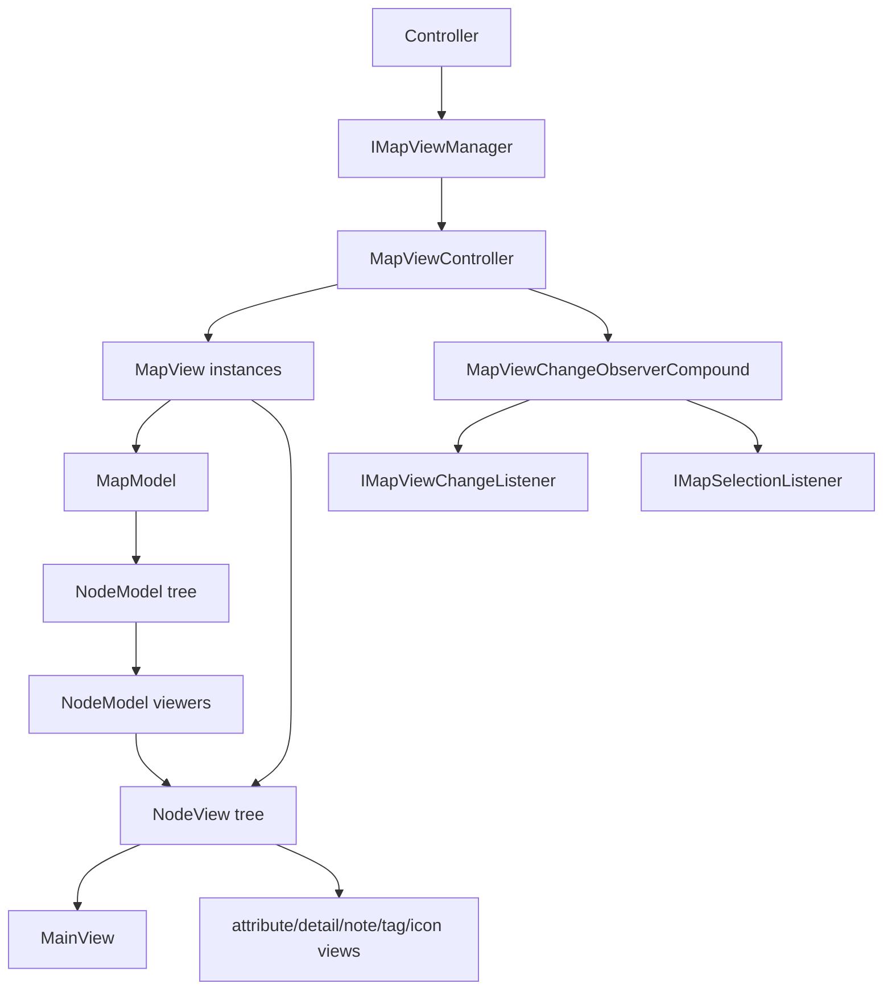
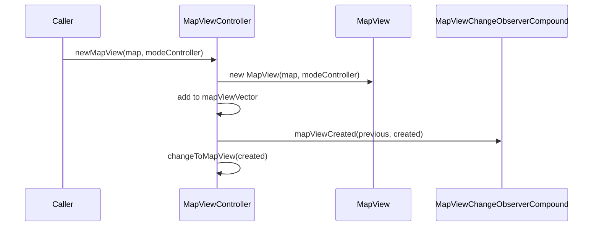
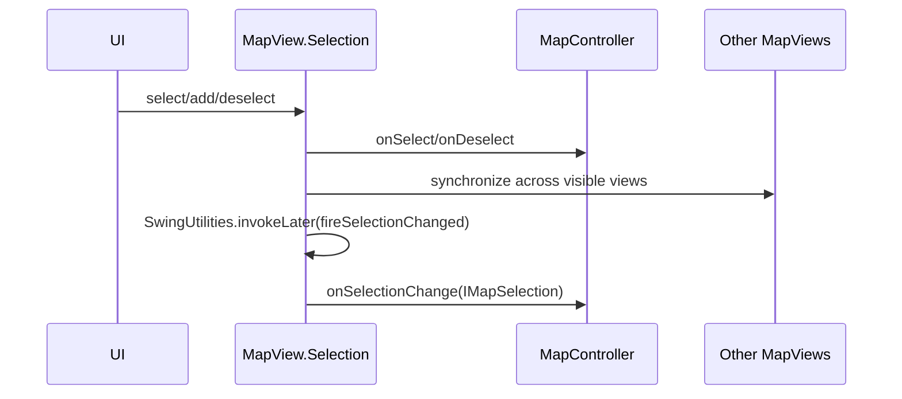

# 视图层深度研究

本文聚焦 Swing map view 体系：`MapViewController`、`MMapViewController`、`MapView`、`NodeView`、`NodeViewFactory`、`MainView`、layout/scroller，以及视图如何接收模型和监听器事件。

## 结论摘要

视图层不是单纯的 Swing 展示树，而是一个带状态的交互系统：

- `MapViewController` 管理打开的 `MapView`、当前 view、窗口最近选中 view、zoom、view change 事件。
- `MapView` 是一张 map 的主画布，保存当前 root、selection、filter、zoom、背景、绘制状态。
- `NodeView` 是 `NodeModel` 的 Swing 表示，同时实现 `INodeView`，直接接收 node change/insert/delete 回调。
- `NodeViewFactory` 创建 `NodeView` 并把它注册到 `NodeModel.addViewer`。
- `MainView` 是节点主要文本/形状组件，鼠标、键盘、拖放和输入法事件多挂在这里。
- layout、filter、folding、selection、painting 互相耦合，改视图层必须先确认事件入口和刷新路径。

## 总体拓扑



核心关系：

- `MapViewController` 是外部访问视图层的门面。
- `MapView` 持有当前 `MapModel` 和 `NodeView` 根。
- `NodeModel` 持有 viewer 列表，`NodeView` 被注册进去后直接接收模型事件。
- selection 是 `MapView` 内部状态，对外通过 `IMapSelection` 暴露。

## `IMapViewManager`

接口路径：

```text
freeplane/src/main/java/org/freeplane/features/ui/IMapViewManager.java
```

`MapViewController` 实现它。它定义了视图层对 controller 的公开能力：

- 添加/移除 map selection listener。
- 添加/移除 map view change listener。
- change map、change mode、change map view。
- close view、close all maps。
- 创建 HTML/image。
- 获取当前 component、node component、font、background、displayed text。
- 获取 map keys/maps/views。
- 获取 selection。
- 获取/设置 zoom。
- 创建新 map view。
- 滚动 selected node。
- hidden children、spotlight、view root。
- layout 设置。
- 保存 modified maps。
- filter changed 通知。

开发判断：

- 其他模块需要视图能力时，优先走 `IMapViewManager`。
- 不要从 feature 代码随意强转当前 component，除非局部代码已有这个模式。
- selection、filter、view root 都是 view 语境，不应只看 `MapModel`。

## `MapViewController`

路径：

```text
freeplane/src/main/java/org/freeplane/view/swing/map/MapViewController.java
```

实现/监听：

```text
IMapViewManager
IMapViewChangeListener
IFreeplanePropertyListener
IMapLifeCycleListener
```

关键字段：

| 字段 | 含义 |
| --- | --- |
| `selectedMapView` | 当前选中的 `MapView` |
| `mapViewVector` | 打开的 `MapView` 集合 |
| `mapViewChangeListeners` | `MapViewChangeObserverCompound` |
| `currentViewByWindow` | 每个窗口最近当前 view |
| `dispatchedViewByWindow` | 派发中的窗口 view 状态 |
| zoom model/actions | 缩放 UI 和行为 |

构造阶段会：

- 把自己注册为 `IMapViewManager`。
- 注册 map lifecycle listener。
- 注册自身为 view change listener。
- 创建 zoom in/out action。
- 注册 property listener。
- 注册 focused window listener，用于恢复 selected node 焦点。

### 创建 view

典型链路：



`MapViewChangeObserverCompound` 会区分：

- view created。
- view displayed。
- layout 完成之后再 displayed。
- view change 前后。

这解释了为什么某些 UI 初始化不能只监听 created，还要等 displayed/layout。

### 切换 view

`changeToMapView` 关键动作：

- fire `beforeMapViewChange`。
- 更新 selected map view。
- 同步 zoom。
- 调用 `controller.selectMode`。
- repaint。
- fire `afterMapViewChange`。

注意：

- view change 和 map change 不完全等价。两个 view 可能显示同一 map。
- `MapViewChangeObserverCompound` 会在 old/new map model 不同时额外发 map selection listener。

### 设置 layout

`setLayout` 做的不只是改属性：

- 设置 `MapViewLayout`。
- 通过 `MapStyle` 持久化。
- preserve node location on screen。
- 触发 `MapChangeEvent`，property 为 `MAP_LAYOUT`。
- invalidate root view。

layout 修改必须考虑：

- root 屏幕位置保持。
- child layout cache 重置。
- selection 可见性。
- repaint/revalidate。

## `MMapViewController`

路径：

```text
freeplane/src/main/java/org/freeplane/view/swing/map/mindmapmode/MMapViewController.java
```

这是 MindMap 编辑模式下的视图 controller，主要负责：

- inline editor。
- WYSIWYG editor。
- external editor。
- edit base 创建。
- save modified maps 提示。

编辑器相关重要依赖：

- node `MainView`。
- node style font/color/background/css。
- detail/note map style。
- `TextController`、`MTextController`、`NoteController`、`MNoteController`。

开发建议：

- 节点编辑功能不要直接写 `MainView` 文本。
- 先找 `MTextController`/`MNoteController` 是否已有抽象。
- UI 事件处理器中复杂逻辑应抽到可测试类。

## `MapView`

路径：

```text
freeplane/src/main/java/org/freeplane/view/swing/map/MapView.java
```

声明：

```text
class MapView extends JPanel
    implements Printable, Autoscroll, IMapChangeListener,
               IFreeplanePropertyListener, Configurable
```

关键状态：

| 状态 | 含义 |
| --- | --- |
| `modeController` | 当前模式 controller |
| `viewedMap` | 当前显示的 `MapModel` |
| `mapRootView` | map 原始根节点 view |
| `currentRootView` | 当前 view root，可 jump in/out |
| `rootsHistory` | view root 历史 |
| `filter` | 当前 view filter |
| `selection` | 内部 `Selection` 对象 |
| `mapScroller` | 滚动和定位 |
| `zoom` | 当前 zoom |
| `layoutType` | 当前 map view layout |
| background fields | 背景图片、fit、opacity、视频等 |
| painter fields | clouds、connectors、coordinate axis、spotlight |

### 构造与初始化

构造中会：

- 设置 `MindMapLayout`。
- 添加 map mouse/motion/wheel listener。
- 添加 magnification listener。
- 添加 viewport resize listener。
- 添加 connector change listener。
- 注册 property listeners。
- 初始化 `NodeViewFolder`。
- 调用 `setMap(viewedMap)`。
- 创建 `MapScroller`。

### `setMap`

`setMap` 是 `MapView` 的核心重置入口：

1. 从旧 map 移除 map change listener。
2. 如果正在显示，记录 root 屏幕位置。
3. 更新 `viewedMap`。
4. 对旧 map 发 `MapChangeEvent(MapView.class, this, null)`。
5. 更新 content style、背景、zoom、layout、tag/icon location。
6. `initRoot()` 创建新的 root `NodeView`。
7. filter 重置为 transparent。
8. 选择 root。
9. 对新 map 发 `MapChangeEvent(MapView.class, null, this)`。
10. 将自己注册到 `viewedMap.addMapChangeListener(this)`。
11. 尝试恢复 root 屏幕位置。

开发注意：

- `MapView` 和 `MapModel` 的关系可以被切换，不要假设一个 view 生命周期只绑定一个 map。
- map change event 会在 view 切换 map 时被用作 UI 同步信号。
- root view 创建会递归建立 node view tree。

### `initRoot`

`initRoot` 使用：

```text
NodeViewFactory.getInstance().newNodeView(root, this, this, ROOT_NODE_COMPONENT_INDEX)
```

并重置：

- `mapRootView`
- `currentRootView`
- selection

`NodeViewFactory` 会负责把 `NodeView` 注册为 `NodeModel` viewer。

## `MapView.Selection`

`MapView` 内部 `Selection` 保存的是 `NodeView`，对外 `IMapSelection` 暴露的是 `NodeModel`。

内部结构：

| 字段 | 含义 |
| --- | --- |
| `selectedSet` | selected `NodeView` set |
| `selectedList` | 保持选择顺序 |
| `selectedNode` | 当前 focused selected node view |
| `selectionChanged` | 延迟 fire 标记 |

选择变更流程：



重点：

- `onSelect`/`onDeselect` 是立即随 selected focused node 改变触发。
- `onSelectionChange` 被延迟到 EDT，表示 selection set 变化。
- 如果开启 folding follows selection，还会驱动 `NodeViewFolder`。
- 同一 map 的多个可见 view 可以同步 selection。

## `IMapSelection`

路径：

```text
freeplane/src/main/java/org/freeplane/features/map/IMapSelection.java
```

这是外部模块访问选择状态的接口：

- selected、selection root、search root。
- ordered/sorted selection。
- select/toggle/replace/branch/continuous。
- scroll selected/tree。
- preserve node/root location on screen。
- 获取当前 filter。
- 判断当前 view 下 folded/visible。

开发注意：

- `NodeModel.isFolded()` 是模型折叠状态。
- `IMapSelection.isFolded(node)` 是当前 view 语境下的折叠状态。
- filter 应优先从当前 selection 或 `MapView` 获取。

## `MapView.mapChanged`

`MapView` 实现 `IMapChangeListener`，接收 map 级事件。典型处理包括：

- 背景色变化。
- follow theme。
- styles/filter/url/tag/icons/notes。
- 背景图片和 fit。
- compact layout。
- show connectors。
- edge color configuration。

常见动作：

- `updateAllNodeViews`
- `updateIconsRecursively`
- revalidate/repaint
- load background image
- adjust background scale

开发注意：

- map change event 的 property 类型可能是 class、enum 或字符串。
- 新增 map property 时应检查 `MapView.mapChanged` 是否需要处理。
- 如果只发 node change，map 级 UI 未必更新。

## 绘制顺序

`MapView.paint`/`paintComponent`/`paintChildren` 分工：

- `paint`：配置 connector 可见性，包裹性能监控。
- `paintComponent`：绘制背景、外部背景/fitted component。
- `paintChildren`：按 `PaintingMode` 分层绘制。

主要绘制层：

1. clouds。
2. normal nodes。
3. selected nodes。
4. links/connectors。
5. cloud texts。
6. spotlight dimmer。
7. selection rectangle。
8. coordinate axis。

connector 绘制会遍历可见 node view，并通过 `LinkController` 取 links in/out，创建 `EdgeLinkView` 或 `ConnectorView`。

开发注意：

- 节点、cloud、connector 的绘制顺序不能随意调整。
- selected nodes 可能有二次绘制。
- 背景图片/视频和节点层之间的 repaint 边界要单独验证。

## Zoom 与滚动

`MapViewController.setZoom` 与 `MapView.setZoom` 配合：

- 更新 map style zoom。
- 更新状态栏。
- 保持 selected node 或鼠标附近点的位置。
- `updateAllNodeViews(UpdateCause.ZOOM)`。
- revalidate/repaint。
- 调整背景 scale。

`MapScroller` 负责：

- scroll selected node visible/center。
- scroll node tree visible。
- preserve root/selected/node location。
- 处理 viewport 边距、慢速滚动和 zoom anchor。

开发注意：

- 坐标问题不要在业务代码里临时修补，应看 `MapScroller`。
- zoom 后如果节点位置漂移，先检查 preserve location 调用。

## View Root

`MapView` 支持将任意节点作为当前 root：

- jump in。
- jump out。
- open selection as new view root。
- use previous view root。

`setRootNode` 会：

- preserve 进入/退出节点屏幕位置。
- 更新 `currentRootView`。
- 更新 roots history。
- reset layout properties。
- 更新 selection。
- fire root changed event。
- 同步其他 visible views。

root changed event：

```text
MapChangeEvent(..., IMapViewManager.MapChangeEventProperty.MAP_VIEW_ROOT, ...)
```

## `NodeView`

路径：

```text
freeplane/src/main/java/org/freeplane/view/swing/map/NodeView.java
```

声明：

```text
class NodeView extends JComponent implements INodeView, EdgeColorContext
```

关键字段：

| 字段 | 含义 |
| --- | --- |
| `viewedNode` | 对应 `NodeModel` |
| `map` | 所属 `MapView` |
| `mainView` | 主文本/形状组件 |
| `contentPane` | 包含 detail/note/tag/attribute 的内容面板 |
| `attributeView` | 属性视图 |
| layout helper/cache | 子节点布局和 side/alignment cache |
| cached edge/cloud/background | 绘制缓存 |
| `folded` | view 层折叠状态 |
| `lastSelectedChild` | selection/folding 相关 |

### 子节点 view

`addChildViews`：

- 如果 folded，不添加子 view。
- 遍历 model children。
- 遇到 hidden child 可能停止。
- 缺失的 child view 通过 `NodeViewFactory` 创建。

这表示 `NodeModel.children` 与 Swing component children 不是永远一一对应；filter/folding/hidden children 会改变 view tree。

### `nodeChanged`

`NodeView` 对不同 property 做不同刷新：

| property 类型 | 处理方向 |
| --- | --- |
| folding/hidden/encryption | 同步 folded，`setFolded`，调整子 view |
| layout orientation/alignment/layout | reset layout recursively，revalidate/repaint |
| node visibility configuration | update all，必要时修正 selection |
| side | reset layout，revalidate |
| icons/hierarchical icons/icon size | update icons，revalidate |
| history information | 通常忽略 |
| 默认 | `update()`、numbering、cloud repaint |

开发注意：

- 新增 node property 后要判断 `NodeView.nodeChanged` 是否需要特殊处理。
- 只改 model extension 但不发正确 property，UI 可能刷新不完整。
- filter result 更新可能导致 selected node 被隐藏，需要选择可见祖先。

### 插入/删除

删除相关：

- `onPreNodeDeleted` 调整 last selected child。
- `onNodeDeleted` 如果删除当前 root/root descendant，恢复 root。
- 移除 child view。
- 更新 filter/selection。
- 选择可见 child 或 ancestor。

插入相关：

- folded 时不添加 child view。
- 非当前 selected map 且 filter transparent 时，可能标记 folded。
- 添加 child view。
- 更新 numbering 和 last selected child。
- revalidate。

## `NodeViewFactory`

路径：

```text
freeplane/src/main/java/org/freeplane/view/swing/map/NodeViewFactory.java
```

职责：

- 创建 `ContentPane`。
- 创建 `MainView`。
- 根据 `NodeGeometryModel` 和选中状态创建 shape painter。
- 创建并注册 `NodeView`。
- displayable 时立即 update，否则等 hierarchy event。
- 调用 `modeController.onViewCreated`。
- 添加 child views。
- 更新 details/note viewers。

关键动作：

```text
node.addViewer(newView)
newView.update(...)
modeController.onViewCreated(newView)
newView.addChildViews()
```

开发注意：

- `NodeView` 的模型回调依赖 `node.addViewer`。
- 如果自建 `NodeView` 不走 factory，很容易漏掉 viewer 注册和 mode hook。

## `MainView`

路径：

```text
freeplane/src/main/java/org/freeplane/view/swing/map/MainView.java
```

`MainView` 是节点主体视觉组件：

- 继承 zoomable label。
- 处理节点形状、边框、背景。
- 处理 icon/text 渲染。
- 处理 drag-over relation/direction。
- 处理 input method。
- 计算 drop relation。
- 接收 mouse/motion/wheel/key/drag/drop listener。

开发注意：

- 大部分用户直接点击的是 `MainView`，不是 `NodeView`。
- 鼠标/键盘交互入口常由 `setMainView` 挂接。
- 节点文本的源头仍是 model/controller，不是 label 文本。

## Layout 与滚动

相关类：

```text
NodeViewLayout
MindMapLayout
MapScroller
```

`NodeViewLayout`：

- 委托给 `VerticalNodeViewLayoutStrategy`。
- 负责单个 node view 的内部布局。

`MindMapLayout`：

- 布局整张 map。
- 验证 root。
- 根据 viewport 尺寸和 border 放置 root。

`MapScroller`：

- 处理滚动、居中、可见区域、preserve location。
- 与 zoom、selection、view root 强相关。

## 视图层开发规则

修改视图层前先回答：

1. 这是 map 级状态、node 级状态，还是当前 view 状态？
2. 变化源头应该是 controller、model extension，还是 Swing 组件？
3. 是否需要 undo？
4. 是否需要 dirty flag？
5. 是否需要 node change、map change、view change 或 selection change？
6. 是否要在多 view、filter、folding、view root 下工作？
7. 是否会影响 printing/export image？

常见安全路径：

- 节点内容变化：feature controller -> `MapController.nodeChanged` -> `NodeView.nodeChanged`。
- 节点插入删除移动：`MMapController` -> `MapController.fireNodeInserted/Deleted/Moved` -> `NodeView`/listeners。
- map 属性变化：feature controller -> `MapController.fireMapChanged` -> `MapView.mapChanged`。
- view 状态变化：`IMapViewManager`/`MapViewController` -> `MapView`。
- selection 变化：`MapView.Selection` -> `SelectionController` listeners。

高风险点：

- 直接操作 Swing component children，绕过 `NodeViewFactory`。
- 直接改 `NodeModel.children`，绕过 `MMapController`。
- 只 repaint 不 revalidate，或只 revalidate 不更新 layout cache。
- 忽略 filter/view root，导致节点明明存在但当前 view 找不到组件。
- 在非 EDT 改 Swing 状态。

