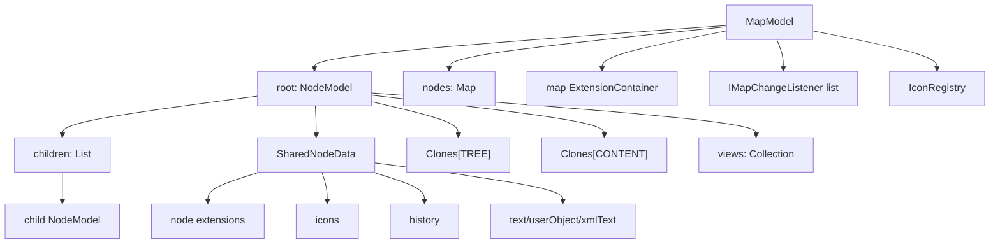
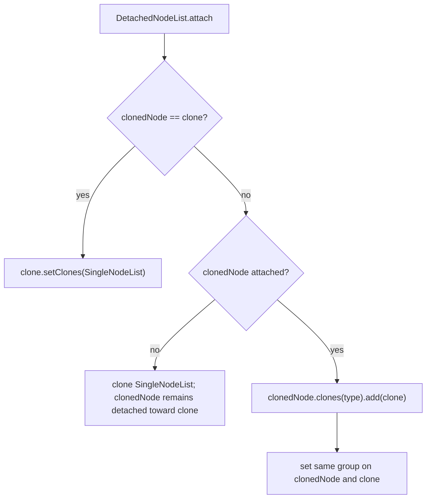

# 地图数据结构深度研究

本文聚焦核心数据结构：`MapModel`、`NodeModel`、`SharedNodeData`、extension container、clone 列表、node ID 注册、viewer 关系，以及 `MMapController` 如何维护结构变化。

## 结论摘要

Freeplane/Nexordia 的地图模型不是一棵简单树。它至少同时维护四类关系：

- 树关系：`NodeModel.parent` 与 `children`。
- 共享内容关系：content clone 共享 `SharedNodeData`。
- 克隆子树关系：tree clone 通过 `Clones` 维护结构对应关系。
- UI 观察关系：`NodeModel.views` 保存 `INodeView`，直接通知视图。

`MapModel` 比较薄，负责 map 级注册、根节点、扩展、监听器和保存状态。`NodeModel` 是主要复杂度所在，但它刻意不理解各 feature extension 的具体含义，只通过 `ExtensionContainer` 保存扩展对象。

## 数据结构总览



## `MapModel`

路径：

```text
freeplane/src/main/java/org/freeplane/features/map/MapModel.java
```

关键字段：

| 字段 | 含义 |
| --- | --- |
| `root` | 根 `NodeModel` |
| `nodes` | node ID 到 `NodeModel` 的注册表 |
| `extensionContainer` | map 级扩展 |
| `listeners` | map 自己的 `IMapChangeListener` |
| `changesPerformedSinceLastSave` | 保存脏标记计数 |
| `readOnly` | 只读状态 |
| `url` | map URL |
| `iconRegistry` | 图标/tag registry |
| `nodeChangeAnnouncer` | 通常是 `MapController` |
| `nodeDuplicator` | 节点复制策略 |

### 根节点

`createNewRoot`：

- 使用资源文本 `new_mindmap` 创建 root。
- 调用 `root.attach()`。

`setRoot`：

- 设置 root。
- 调用 `root.attach()`。
- 递归 `root.setMap(this)`。

注意：

- `attach()` 会激活 clone 列表关系。
- root 的 map 关系会递归传播给子节点。

### ID 注册表

`MapModel` 维护：

```text
Map<String, NodeModel> nodes
```

相关方法：

- `generateNodeID(proposedID)`。
- `registryID(value, node)`。
- `registryNode(node)`。
- `registryNodeRecursive(node)`。
- `unregistryNodes(node)`。
- `getNodeForID(id)`。

ID 特点：

- 自动生成形如 `ID_<random>`。
- 提议 ID 可用且未占用时会被保留。
- 重复 ID 会抛出 runtime exception。
- 删除节点时递归取消注册，但当前实现把 id 映射为 `null`，不是 remove key。

开发注意：

- 不要自己构造或复用 ID。
- 插入节点应走 `MapController.fireNodeInserted`，它会调用 `registryNodeRecursive`。
- 删除节点应走 controller，确保 `unregistryNodes` 被调用。

### 保存状态

`changesPerformedSinceLastSave`：

- `setSaved(true)` 归零。
- `setSaved(false)` 自增。
- `isSaved()` 判断是否为 0。

`MapController.fireMapChanged`、`MapController.nodeRefresh`、`MMapController` 的结构修改会根据事件类型调用 `mapSaved(map,false)` 或直接标记 dirty。

开发注意：

- 只刷新 UI 的事件应使用 `setsDirtyFlag=false`。
- 真实内容或结构变化必须设置 dirty。

### map 级扩展

`MapModel` 通过 `ExtensionContainer` 保存 map 级扩展：

- style model。
- bookmarks。
- templates。
- script listener storage。
- 插件自定义 map state。

扩展键是 class：

```text
Map<Class<? extends IExtension>, IExtension>
```

`addExtension` 如果同 class 已有不同对象会抛异常；`putExtension` 可以替换或移除。

## `ExtensionContainer`

路径：

```text
freeplane/src/main/java/org/freeplane/core/extension/ExtensionContainer.java
```

能力：

- `addExtension(clazz, extension)`：只允许首次注册或同对象。
- `putExtension(clazz, extension)`：替换或移除。
- `getExtension(clazz)`。
- `containsExtension(clazz)`。
- `removeExtension(clazz/extension)`。
- `extensionIterator()`。

设计影响：

- 扩展本身必须实现 `IExtension`。
- 扩展类型通常是功能状态的 owner。
- 对同一 class 的扩展不要重复 add，除非确认同对象。

节点和地图都使用 extension container，但节点扩展放在 `SharedNodeData` 中，因此 content clone 会共享这些扩展。

## `SharedNodeData`

路径：

```text
freeplane/src/main/java/org/freeplane/features/map/SharedNodeData.java
```

字段：

| 字段 | 含义 |
| --- | --- |
| `extensionContainer` | node 级共享扩展 |
| `historyInformation` | 创建/修改历史 |
| `icons` | `NodeIconSetModel` |
| `userObject` | 节点主内容对象 |
| `xmlText` | rich text HTML/XML 表示 |

文本处理：

- `setUserObject(String)` 会转入 `setText`。
- `setText` 使用 `RichTextModel` 规范化文本。
- 如果 rich text XML 是 HTML，则保存 `xmlText`，否则置空。
- `setXmlText` 解析 XML 并更新 `userObject` 与 `xmlText`。

开发影响：

- `NodeModel.getText()` 来自 `sharedData.userObject.toString()`。
- content clone 共享 `SharedNodeData`，所以文本、图标、history、node extensions 通常一起共享。
- 如果某个状态不应被 content clone 共享，不应该放进 `SharedNodeData.extensionContainer`。

## `NodeModel`

路径：

```text
freeplane/src/main/java/org/freeplane/features/map/NodeModel.java
```

关键字段：

| 字段 | 含义 |
| --- | --- |
| `children` | 子节点列表 |
| `parent` | 父节点 |
| `id` | map 内 ID |
| `folded` | 模型折叠标记 |
| `map` | 所属 `MapModel` |
| `side` | 布局 side |
| `views` | 绑定的 `INodeView` collection |
| `sharedData` | 共享内容和扩展 |
| `clones` | `Clones[TREE]` 与 `Clones[CONTENT]` |

`NodeModel` 注释说明它不应该知道具体 extension 的含义。feature 逻辑应该位于 extension packages，并把 `NodeModel` 当参数。

## 树关系

常用方法：

- `getChildren()` 返回不可修改 list。
- `getChildrenInternal()` 供内部结构修改。
- `insert(child,index)` 修改 children 并设置 child parent。
- `remove(index)` 触发 pre delete view 回调、断开 parent、移出 children。
- `getParentNode()`。
- `getIndex(node)`。
- `getPathToRoot()`。
- `isDescendantOf(node)`。
- `depth()`。

开发注意：

- 结构变化不要直接调用 `insert/remove`，应走 `MMapController` 或 `MapController`。
- `remove` 会通知 parent 的 views 进行 `onPreNodeDeleted`，但完整删除事件仍由 controller 触发。
- `getChildren()` 不可修改，避免外部绕过事件。

## map 关系

`setMap(map)`：

- 设置当前节点 map。
- 递归设置所有 children map。

`setParent(newParent)`：

- 根据 old/new parent 是否 attached 决定 attach/detach clones。
- 最后更新 parent。

attach/detach 与 clone 关系强相关：

- 节点接入已 attached 的 parent 时，clone 列表 attach。
- 节点脱离 attached tree 时，clone 列表 detach。
- 子树递归 attach/detach。

## folding 与 visibility

模型方法：

- `isFolded()` 返回 `folded || !isAccessible()`。
- `setFolded(folded)` 写模型标记，并发 `NodeChangeEvent(NodeChangeType.FOLDING)` 到 viewers。
- `isFoldable()` 排除 leaf/root/always unfolded。
- `hasVisibleContent(filter)` 需要不是 hidden summary 且满足 filter。
- `isVisible(filter)` 对 hidden summary 有特殊语义。
- `subtreeHasVisibleContent(filter)` 递归检查。

开发注意：

- folding 有模型状态，也有当前 view 下 hidden children 状态。
- 需要当前视图语义时用 `IMapViewManager`/`IMapSelection`。
- `MapController.setFolded(node, fold, filter)` 会处理 filter、hidden children、scroll 等细节。

## side 与 layout

`NodeModel.Side`：

```text
DEFAULT
TOP_OR_LEFT
BOTTOM_OR_RIGHT
AS_SIBLING_BEFORE
AS_SIBLING_AFTER
```

`setSide(side)`：

- 如果是 clone tree node，会把 side 同步给 `TREE` clones。
- 否则只改当前节点。

`isTopOrLeft(root)`：

- 优先询问已有 views 是否有标准 layout 且 root 匹配。
- 否则根据 `LayoutController.getEffectiveChildNodesLayout(parent)` 和 parent/root/side 推断。

开发注意：

- side 是布局语义，不是纯模型字段。
- 有 view 时结果可能受 view layout 影响。
- 移动节点时 `MMapController` 会根据目标 parent 建议新 side。

## Clone 模型

`NodeModel` 支持两种 clone：

```text
CloneType.TREE
CloneType.CONTENT
```

方法：

- `cloneTree()`。
- `cloneContent()`。
- `subtreeClones()` 返回 `TREE` clone group。
- `allClones()` 返回 `CONTENT` clone group。
- `convertToClone(node, cloneType)`。
- `isCloneTreeRoot()`。
- `isCloneTreeNode()`。
- `isCloneContentNodeOutsideCloneTree()`。
- `isCloneTreeRootOrContentClone()`。
- `isCloneNode()`。
- `subtreeContainsCloneOf(node)`。
- `isSubtreeCloneOf(node)`。

### content clone

`cloneContent()`：

- 禁止加密节点 clone。
- 创建新 `NodeModel(this, CONTENT)`。
- 新节点共享 `toBeCloned.sharedData`。
- children 初始为空。
- `CONTENT` clone list 指向原节点。

影响：

- 文本、icons、history、node extensions 共享。
- 树结构不共享。

### tree clone

`cloneTree()` 由 `Cloner` 递归完成：

- 禁止加密节点 clone。
- 每个节点通过 `cloneNode(TREE)` 创建。
- 递归复制 children。
- child clone 设置 parent 为 clone。
- child side 复制自原 child。

影响：

- 整棵结构都有对应 clone。
- 每个对应节点也共享 `SharedNodeData`。
- `TREE` clone 关系用于在插入/删除/移动时同步 clone 子树。

### clone 列表状态

接口：

```text
Clones
```

实现：

```text
DetachedNodeList
SingleNodeList
MultipleNodeList
```

状态含义：

| 实现 | 含义 |
| --- | --- |
| `DetachedNodeList` | 节点尚未 attach 到 map/tree，clone group 未激活 |
| `SingleNodeList` | 已 attach，但 group 只有一个节点 |
| `MultipleNodeList` | 已 attach，group 有多个 clone |

attach 流程：



detach 流程：

- `SingleNodeList.detach` 让节点回到 detached。
- `MultipleNodeList.detach` 从 group 移除节点。
- 如果 group 剩一个，降级为 `SingleNodeList`。
- detached 节点保留指向 head 的 `DetachedNodeList`，便于后续 attach。

开发注意：

- clone group 是否有效取决于 attached 状态。
- 不要直接替换 `clones` 数组。
- `swapData` 会交换 `SharedNodeData` 和 clones，并重新绑定 detached clone 到当前节点。

## Viewer 关系

`NodeModel.views` 保存 `INodeView`：

- `addViewer(viewer)`。
- `removeViewer(viewer)`。
- `getViewers()`。
- `acceptViewVisitor(visitor)`。
- `fireNodeChanged(event)` 直接通知 viewers。
- `fireNodeInserted`/`fireNodeRemoved` 通知 parent viewers。

注册来源：

```text
NodeViewFactory.updateNewView
  -> node.addViewer(newView)
```

释放来源：

```text
NodeView.releaseForMapClose/remove
  -> node.removeViewer(this)
```

开发注意：

- 一个 `NodeModel` 可能有多个 `NodeView`，例如同一 map 多 view。
- `MapView.getNodeView(node)` 会遍历 `node.getViewers()` 找属于当前 map view 的 `NodeView`。
- 视图刷新不是通过全局 Swing 查询，而是 model 直接通知 registered viewers。

## 事件分发与数据结构

`NodeModel` 有三类直接事件方法：

1. `fireNodeChanged(INodeChangeListener[], NodeChangeEvent)`：
   - 遍历 `CONTENT` clones。
   - 为每个 clone 创建 `event.forNode(clone)`。
   - 通知全局 node change listeners。
   - 再通知该 clone 的 viewers。

2. `fireNodeInserted(IMapChangeListener[], child, index)`：
   - 通知 map change listeners。
   - 通知 parent node 的 viewers。

3. `fireNodeRemoved(IMapChangeListener[], deletionEvent)`：
   - 先通知 parent node viewers。
   - 再通知 map change listeners。

`NodeModel.fireNodeMoved`：

- 先让 old parent viewers 接收 deleted。
- 通知 map change listeners `onNodeMoved`。
- 再让 new parent viewers 接收 inserted。

开发注意：

- content clone 节点变化会广播到所有 content clone。
- structural event 不同于 node property change。
- view tree 增删主要依赖 insert/delete/move event。

## `MMapController` 维护结构

路径：

```text
freeplane/src/main/java/org/freeplane/features/map/mindmapmode/MMapController.java
```

`MMapController` 是 MindMap 编辑模式下结构修改的主要入口。

### 新建节点

路径：

```text
addNewNode(...)
  -> insertNewNode(...)
  -> insertSingleNewNode(...)
  -> execute IActor
  -> insertNodeIntoWithoutUndo
  -> parent.insert
  -> fireNodeInserted
```

clone parent 处理：

- 如果 parent 有 subtree clones，会对每个 parent clone 插入 `newNode.cloneTree()`。

### 删除节点

路径：

```text
deleteNodes
  -> SummaryGroupEdgeListAdder
  -> deleteSingleNodeWithClones
  -> deleteSingleNode
  -> execute IActor
  -> deleteWithoutUndo
  -> firePreNodeDelete
  -> parent.remove
  -> fireNodeDeleted
  -> deleteSingleSummaryNode
```

clone 处理：

- 对 parent 的 subtree clones 逐一按相同 index 删除。

### 移动节点

路径：

```text
moveNodes
  -> SummaryGroupEdgeListAdder
  -> moveNodeAndItsClones
  -> moveSingleNode / insert clone / delete clone
  -> execute IActor
  -> moveNodeToWithoutUndo
  -> firePreNodeMoved
  -> oldParent.remove
  -> newParent.insert
  -> fireNodeMoved
```

保护规则：

- 不允许跨 map 移动。
- 不允许把节点移动到自己的子树或 clone 子树中。
- old/new parent clone 关系复杂时，通过 `NodeRelativePath` 找最近 target clone。
- 根据目标 parent 重新计算 side。

## 遍历辅助结构

`NodeStream`：

- `NodeStream.of(node)`：按 `NodeIterator.of` 遍历。
- `NodeStream.bottomUpOf(node)`：自底向上遍历。

`NodeSubtrees.getUniqueSubtreeRoots(nodes)`：

- 处理 clone 子树中重复选择的根。
- 如果 parent clone 的对应 child 已选中，就跳过当前节点。

`NodeRelativePath`：

- 找两个节点的公共祖先。
- 记录 begin/end 两条相对路径。
- 可在 common ancestor 的 clone 上重放路径。
- 用于 clone move 时把 old parent clone 映射到 new parent clone。

开发注意：

- selection 或移动多个节点时不要简单按 list 处理，需要考虑 clone 和父子包含关系。
- `NodeRelativePath` 是 clone 结构同步的重要工具。

## 读写与扩展边界

`NodeModel` 不应该知道 feature extension 含义。常见扩展由各 feature 包维护：

- style。
- logical style。
- note/detail。
- link。
- cloud/edge。
- encryption。
- tags/bookmarks。
- free node/summary node。

模式：

```text
feature controller -> node/map extension -> MapController.nodeChanged/fireMapChanged
```

开发规则：

- 新功能状态如果跟节点内容一起 clone，放到 node shared extension。
- 如果是 map 级配置，放到 map extension。
- 如果是 view-only 状态，不要放进 model extension。
- 如果状态变化需要撤销，必须通过 mode controller execute actor。

## 高风险点

- 直接改 `children` 会绕过 ID 注册、clone 同步、undo、listener 和 view。
- 混淆 `CONTENT` clone 与 `TREE` clone 会导致文本共享或结构同步错误。
- 将不应共享的状态放进 `SharedNodeData` 会让 content clone 意外联动。
- 将应持久化的状态只放进 view 会导致保存后丢失。
- 只通知 viewers 而不通知 map/node listeners 会漏掉脚本、动作状态、插件状态。
- 只通知 listeners 而不通知 viewers 会导致 UI 不刷新。

