# 监听器与事件流深度研究

本文聚焦 Freeplane/Nexordia 的事件体系：node change、map change、map lifecycle、selection、view change、API script listener，以及这些事件如何驱动动作状态、视图刷新、脚本回调和脏标记。

## 结论摘要

事件体系是多层的，不能只看一个 listener list：

- `MapController` 持有全局 node change、map change、map lifecycle、selection listeners。
- `MapModel` 自己也持有 map change listeners，`MapView` 会注册在这里。
- `NodeModel` 保存 `INodeView` viewers，node/structure event 会直接通知视图。
- `SelectionController` 负责 selected/deselected/selection set change。
- `MapViewChangeObserverCompound` 负责 view change/filter/window last selected view。
- script API 的 `NodeChangeListener` 通过 `NodeChangeListeners` 桥接到内部 `INodeChangeListener`。

一次用户操作通常会同时触发多条链路，例如：修改节点文本会更新 dirty flag、history、script listener、action enabled/selected 状态、所有 content clone 的 `NodeView`。

## 事件类型总览

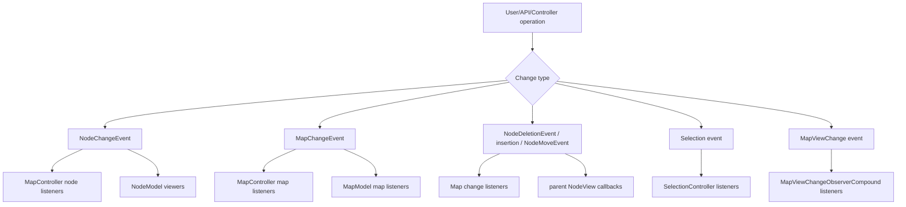

## 主要接口

### `INodeChangeListener`

路径：

```text
freeplane/src/main/java/org/freeplane/features/map/INodeChangeListener.java
```

方法：

```text
nodeChanged(NodeChangeEvent event)
```

继承 `ComparableByPriority`，因此 listener 会按 priority 排序。

用途：

- action enabled/selected 刷新。
- script API listener 桥接。
- connector repaint。
- formula/cache/style 等 feature 监听。

### `IMapChangeListener`

路径：

```text
freeplane/src/main/java/org/freeplane/features/map/IMapChangeListener.java
```

方法：

- `mapChanged(MapChangeEvent event)`。
- `onNodeDeleted(NodeDeletionEvent event)`。
- `onNodeInserted(parent, child, index)`。
- `onNodeMoved(NodeMoveEvent event)`。
- `onPreNodeMoved(NodeMoveEvent event)`。
- `onPreNodeDelete(NodeDeletionEvent event)`。

也继承 `ComparableByPriority`。

用途：

- map-level property 更新。
- 结构变化。
- 结构变化前预处理。
- 视图和插件同步。

### `IMapLifeCycleListener`

路径：

```text
freeplane/src/main/java/org/freeplane/features/map/IMapLifeCycleListener.java
```

方法：

- `onCreate(map)`。
- `onRemove(map)`。

用途：

- map 创建/移除后的全局初始化与清理。
- `MapViewController` 也监听生命周期。

### `INodeSelectionListener`

路径：

```text
freeplane/src/main/java/org/freeplane/features/map/INodeSelectionListener.java
```

方法：

- `onSelect(node)`。
- `onDeselect(node)`。
- `onSelectionSetChange(selection)`。

由 `SelectionController` 管理，`MapController` 继承 `SelectionController`。

### `IMapSelectionListener`

路径：

```text
freeplane/src/main/java/org/freeplane/features/map/IMapSelectionListener.java
```

方法：

- `beforeMapChange(oldMap,newMap)`。
- `afterMapChange(oldMap,newMap)`。

由 `MapViewChangeObserverCompound` 在 view 切换导致 map model 改变时调用。

### `IMapViewChangeListener`

路径：

```text
freeplane/src/main/java/org/freeplane/features/ui/IMapViewChangeListener.java
```

方法：

- `beforeViewChange(oldView,newView)`。
- `afterViewChange(oldView,newView)`。
- `afterViewClose(oldView)`。
- `afterViewCreated(newView)`。
- `afterViewDisplayed(oldView,newView)`。
- `afterFilterChange(view,filter)`。
- `afterWindowLastSelectedMapViewChanged(window,newView)`。
- `afterWindowLastSelectedMapViewRemoved(window)`。

用途：

- UI 组件和插件跟踪当前 view。
- 等待 view 真正显示和 layout 完成。
- filter 状态同步。

### `INodeView`

路径：

```text
freeplane/src/main/java/org/freeplane/features/map/INodeView.java
```

方法：

- `nodeChanged(event)`。
- `onPreNodeDeleted(event)`。
- `onNodeDeleted(event)`。
- `onNodeInserted(parent,child,index)`。
- `hasStandardLayoutWithRootNode(root)`。
- `isTopOrLeft()`。

`NodeView` 实现该接口，并通过 `NodeModel.addViewer` 注册。

## `MapController` listener 列表

路径：

```text
freeplane/src/main/java/org/freeplane/features/map/MapController.java
```

关键字段：

| 字段 | 含义 |
| --- | --- |
| `mapChangeListeners` | 全局 map/structure listener |
| `nodeChangeListeners` | 全局 node property listener |
| `mapLifeCycleListeners` | map create/remove listener |
| `areMapChangeListenersSorted` | 延迟排序标记 |
| `areNodeChangeListenersSorted` | 延迟排序标记 |

构造阶段注册：

- `ActionEnablerOnChange` 到 selection/node/map。
- `ActionSelectorOnChange` 到 selection/node/map。
- clipboard controller。
- map actions。

UI listener 注册方法：

- `addUIMapChangeListener(listener)`：非 headless 才注册。
- `addUINodeChangeListener(listener)`：非 headless 才注册。

普通 listener 注册方法：

- `addMapChangeListener(listener)`。
- `addNodeChangeListener(listener)`。
- `addMapLifeCycleListener(listener)`。

开发注意：

- headless 中 UI listener 不会注册。
- listener 会按 `ComparableByPriority.priority()` 排序。
- 默认 priority 是 10，数值小的更早执行。

## Node change 事件链

触发入口：

```text
MapController.nodeChanged(node, property, oldValue, newValue)
MapController.nodeRefresh(node, property, oldValue, newValue)
MapController.nodeRefresh(NodeChangeEvent)
```

差异：

| 方法 | dirty flag | modification time |
| --- | --- | --- |
| `nodeChanged` | true | true |
| `nodeRefresh` | false | false |

完整链路：

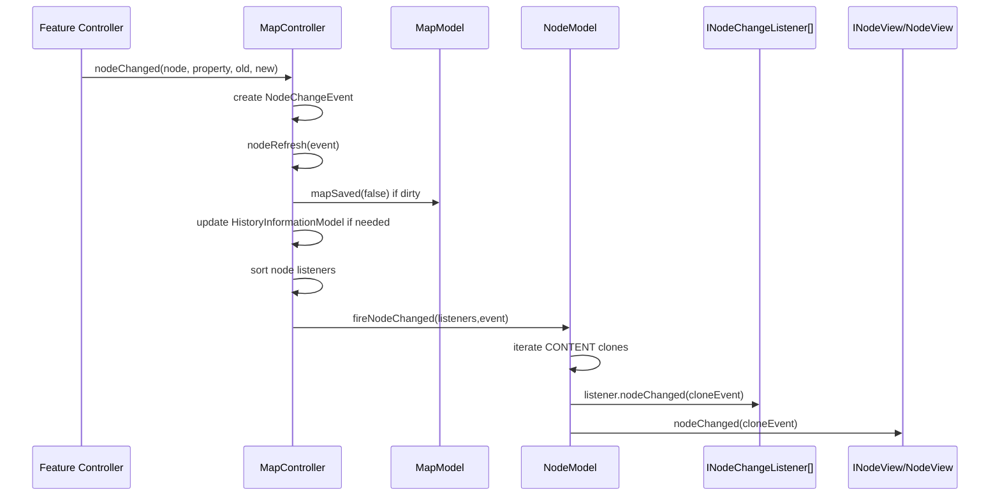

重要细节：

- `NodeModel.fireNodeChanged` 会遍历 `CONTENT` clones。
- 每个 clone 收到 `event.forNode(clone)`。
- listener 先于 view 回调执行：`fireSingleNodeChanged` 中先遍历 listeners，再 `fireNodeChanged(event)` 给 views。
- 如果事件更新 modification time，`MapController` 会通过 undo actor 修改 `HistoryInformationModel`，并额外 fire history node change。
- map loading 中 `nodeRefresh` 会直接返回，避免加载过程发事件。

### Node change 到 `NodeView`

`NodeView.nodeChanged` 会根据 property 分支处理：

- folding/hidden/encryption：更新 folding tree。
- layout property：重置 layout。
- visibility：更新可见性和 selection。
- icons/tag/icon size：更新图标。
- history：多数情况下忽略。
- 默认：更新 main view、content、style、cloud、numbering 等。

开发注意：

- 新增 property 后，如果 UI 需要特殊刷新，应更新 `NodeView.nodeChanged`。
- 如果只需要重绘但不 dirty，用 `nodeRefresh`。
- 如果内容真实改变，用 `nodeChanged`。

## Map change 事件链

触发入口：

```text
MapController.fireMapChanged(MapChangeEvent event)
```

完整链路：

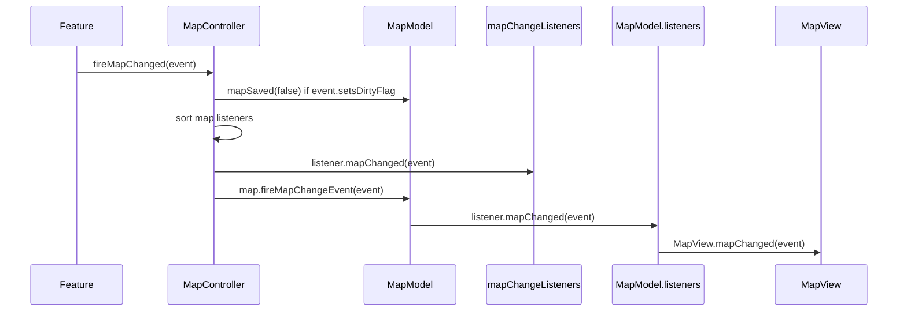

`MapView` 注册在 `MapModel.listeners` 上：

```text
viewedMap.addMapChangeListener(this)
```

开发影响：

- 如果只向 `MapModel.fireMapChangeEvent` 发事件，会绕过 `MapController` 的全局 map listeners 和 dirty 标记。
- 正常 feature 应使用 `MapController.fireMapChanged`。
- `MapChangeEvent.setsDirtyFlag=false` 可用于纯 UI/view 状态变化。

## 结构事件链：插入

典型入口：

```text
MMapController.addNewNode
  -> insertSingleNewNode
  -> execute IActor
  -> MapController.insertNodeIntoWithoutUndo
```

链路：

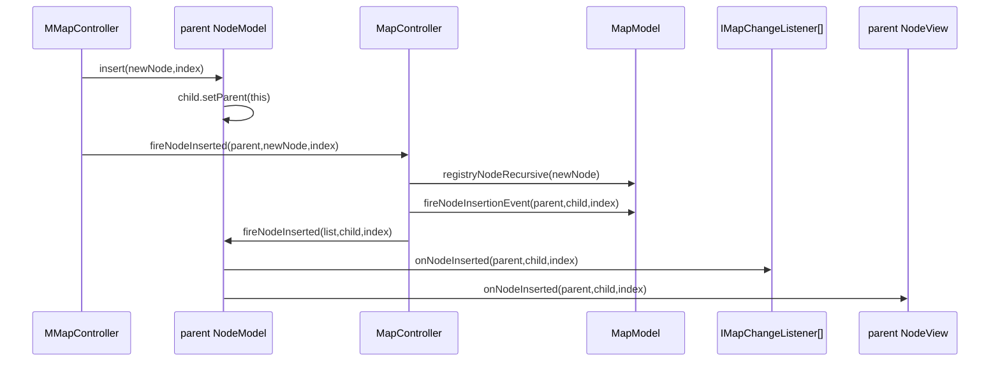

注意顺序：

- `MapModel.fireNodeInsertionEvent` 先通知 map 自己的 listeners。
- `parent.fireNodeInserted` 再通知全局 map listeners 和 parent views。

## 结构事件链：删除

入口：

```text
MMapController.deleteWithoutUndo
```

链路：

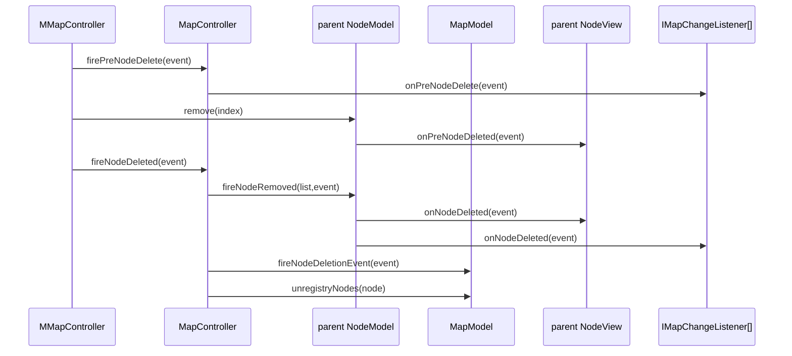

注意：

- `parent.remove` 内部会先触发 `onPreNodeDeleted` 到 parent viewers。
- `firePreNodeDelete` 是 map change listeners 的预删除通知。
- 删除后会取消 node ID 注册。

## 结构事件链：移动

入口：

```text
MMapController.moveNodeToWithoutUndo
```

链路：

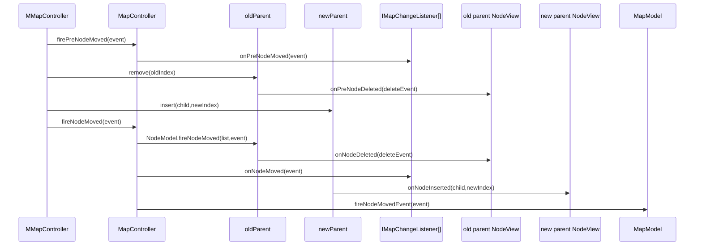

移动事件在 view 层表现为 old parent 删除 child view、新 parent 插入 child view。

开发注意：

- clone 移动由 `MMapController.moveNodeAndItsClones` 先拆成多次 move/insert/delete。
- 不要只监听 `onNodeMoved` 就假设 view 已经完成所有中间变化。

## Selection 事件链

`MapController` 继承：

```text
SelectionController
```

`SelectionController` 管理 `INodeSelectionListener`：

- `onSelect(node)`。
- `onDeselect(node)`。
- `onSelectionChange(selection)`。

`MapView.Selection` 触发：

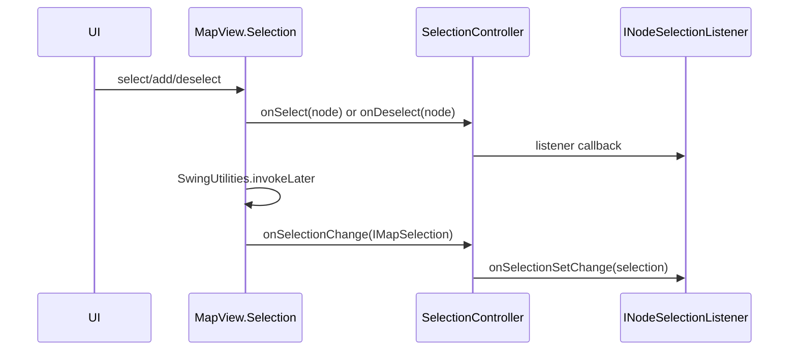

典型监听者：

- action enabler/selector。
- link controller。
- command search dialog。
- tag panel manager。
- bookmarks controller。
- logical style UI。
- note/text controller。
- creation/modification date presenter。
- `MMapController` 显示 node ID。

开发注意：

- selected node focused 变化和 selection set 变化不是同一个事件。
- selection set 变化延迟到 EDT。
- `IMapSelection` 包含当前 filter，很多操作应该从这里拿 filter。

## View change 事件链

管理者：

```text
MapViewChangeObserverCompound
```

由 `MapViewController` 调用。

view created/displayed：

```text
mapViewCreated(previous, created)
  -> afterViewCreated(created)
  -> if not showing: wait HierarchyListener
  -> if layout not completed: EventQueue.invokeLater retry
  -> afterViewDisplayed(previous, created)
```

view switch：

```text
beforeMapViewChange(old,new)
  -> beforeMapChange(oldModel,newModel) if model differs
  -> beforeViewChange(old,new)

afterMapViewChange(old,new)
  -> afterMapChange(oldModel,newModel) if model differs
  -> afterViewChange(old,new)
```

filter：

```text
fireFilterChanged(view, filter)
  -> IMapViewChangeListener.afterFilterChange
```

开发注意：

- 需要 Swing component 已显示、尺寸已确定的逻辑，监听 `afterViewDisplayed` 更可靠。
- map selection listener 只在 old/new model 不同时触发。
- 同一 map 的不同 view 切换只触发 view change，不一定触发 map change。

## API script listener 事件链

API：

```text
MindMap.addListener(NodeChangeListener)
NodeChangeListener.nodeChanged(NodeChanged)
```

内部桥接：

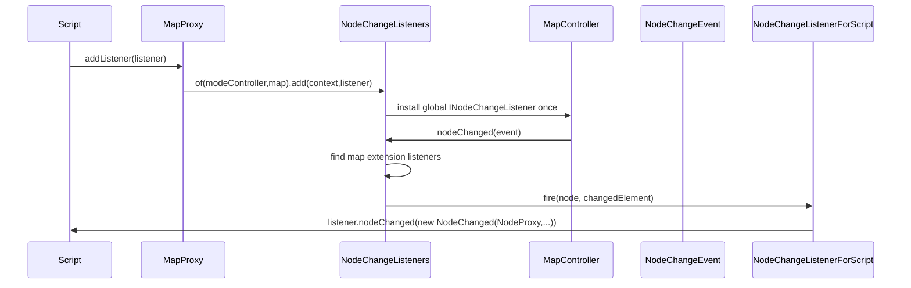

属性映射：

| 内部 property | API |
| --- | --- |
| `NodeModel.NODE_TEXT` | `ChangedElement.TEXT` |
| `DetailModel.class` | `DETAILS` |
| `NodeModel.NOTE_TEXT` | `NOTE` |
| `NodeAttributeTableModel.class` | `ATTRIBUTE` |
| `NodeModel.NODE_ICON` | `ICON` |
| `Tags.class` | `TAGS` |
| `FormulaCache.class` | `FORMULA_RESULT` |
| 其他 | `UNKNOWN` |

开发注意：

- script listener 存在 `MapModel` extension 中。
- mode controller 上只安装一次 bridge listener。
- 回调会恢复脚本 classloader。
- 新增 public script-visible node change 类型时需要更新映射。

## UI listener 与 headless

`MapController` 提供两套注册入口：

```text
addNodeChangeListener
addMapChangeListener

addUINodeChangeListener
addUIMapChangeListener
```

UI 版本在 headless 环境中不注册：

```text
if (!GraphicsEnvironment.isHeadless()) add...
```

典型用途：

- Swing action 状态刷新。
- connector repaint listener。
- UI 面板同步。

开发注意：

- headless loader/test 中不要依赖 UI listener。
- 业务逻辑 listener 不应使用 UI 注册入口。
- UI-only listener 应使用 UI 注册入口，避免 headless 中触发 Swing 依赖。

## Dirty flag 与 refresh

`NodeChangeEvent` 字段：

- `setsDirtyFlag`。
- `updatesModificationTime`。
- `property`。
- `oldValue`。
- `newValue`。

`MapChangeEvent` 字段：

- `setsDirtyFlag`。
- `property`。
- `oldValue`。
- `newValue`。
- `map`。

判断：

- 用户内容/结构变化：dirty true。
- 纯 UI refresh、view root、filter display：dirty false。
- 节点内容变化：modification time true。
- 仅样式刷新或计算缓存刷新：视语义决定。

## 延迟 refresh

`MapController.Refresher`：

- 使用 `ConcurrentHashMap<NodeRefreshKey, NodeRefreshValue>` 合并同一 node/property 的 refresh。
- 在 dispatch thread 上调用时延迟到 view controller invokeLater。
- 如果不是 dispatch thread，直接 `nodeRefresh`。
- 只刷新当前 mode controller 匹配的事件。

用途：

- 避免短时间大量 property refresh 导致重复 UI 更新。
- 保持 Swing 线程语境。

开发注意：

- 高频 UI 刷新优先看是否应使用 `delayedNodeRefresh`。
- 合并 key 是 node + property，不同 property 不会合并。

## 典型完整链路

### 用户新建子节点

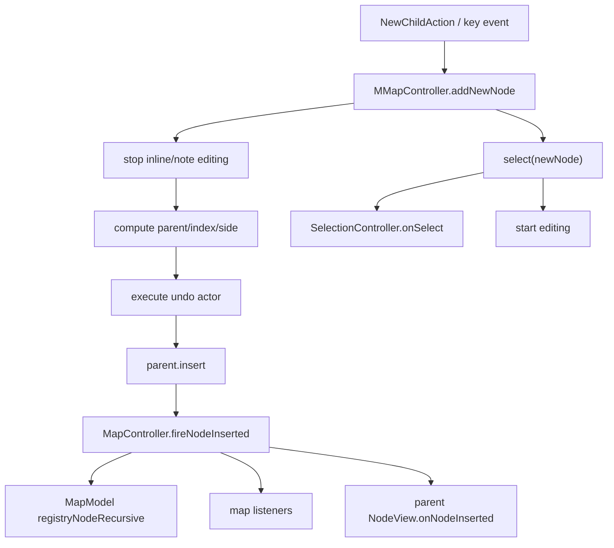

### API 修改节点文本

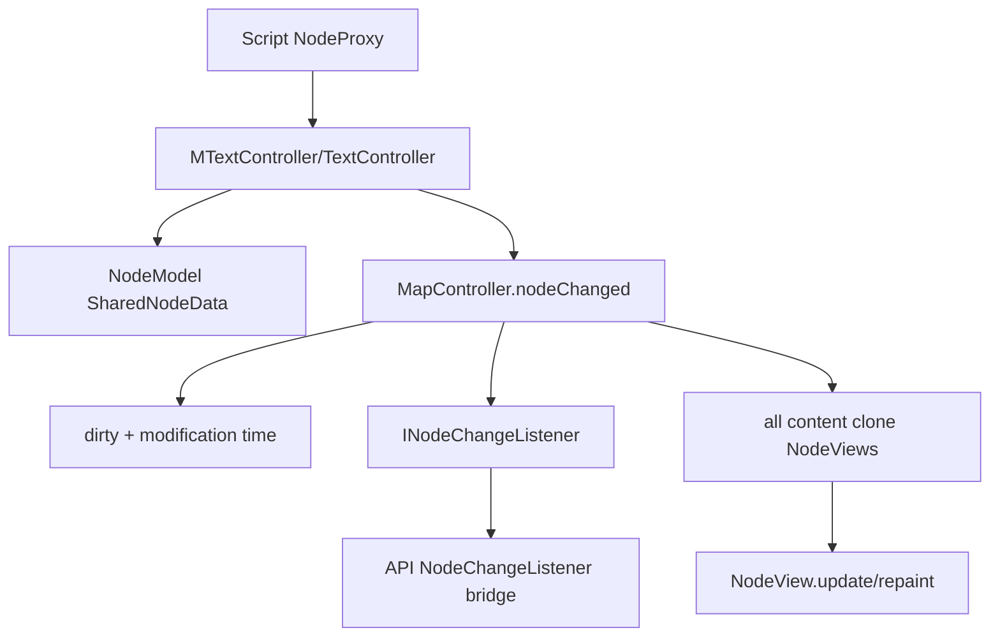

### 用户折叠节点

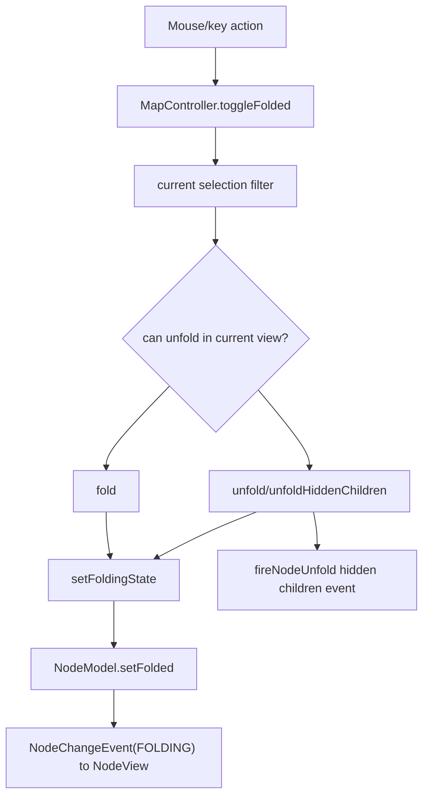

### Filter 变化

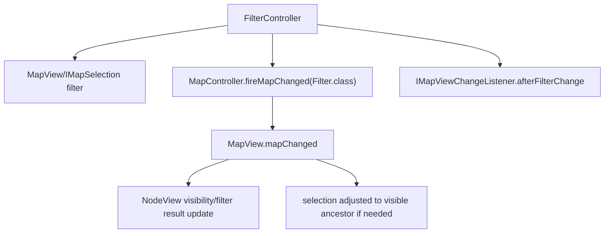

## 开发排查顺序

节点 UI 没刷新：

1. 是否调用了 `MapController.nodeChanged/nodeRefresh`？
2. property 是否被 `NodeView.nodeChanged` 正确处理？
3. 节点是否有当前 `MapView` 的 viewer？
4. 是否被 filter/folding/view root 隐藏？
5. 是否在 EDT 上触发了 Swing 更新？

脚本 listener 没收到：

1. 是否通过 `MindMap.addListener` 添加？
2. map 是否持有 `NodeChangeListeners` extension？
3. mode controller 是否安装 bridge listener？
4. 变化是否走了 `MapController.nodeChanged`？
5. property 是否映射到 API，或是否只收到 `UNKNOWN`？

结构变化异常：

1. 是否绕过了 `MMapController`？
2. clone parent 是否同步插入/删除/移动？
3. ID registry 是否更新？
4. pre delete/pre move 是否触发？
5. parent `NodeView` 是否收到 insertion/deletion？

动作状态没更新：

1. action 是否声明 check enabled/selection on change？
2. 是否注册到 `ActionEnablerOnChange` 或 `ActionSelectorOnChange`？
3. 变化是否发了 node/map/selection 事件？
4. headless 或当前 mode 是否导致 listener 未执行？

## 开发规则

- 模型内容变化走 `nodeChanged`。
- 纯刷新走 `nodeRefresh` 或 `delayedNodeRefresh`。
- map 配置变化走 `fireMapChanged`。
- 节点结构变化走 `MMapController`，不要直接改 `children`。
- view 切换和 filter 变化走 `IMapViewManager`/`MapViewController`。
- UI-only listener 用 `addUINodeChangeListener`/`addUIMapChangeListener`。
- script-visible change 需要同步 `NodeChangeListeners` 映射。
- 新增事件时同时思考 dirty flag、undo、history、clone、filter、多 view。

