# Sprint 001

## Task: Read context request hierarchy and presets
- **Status:** Finished
- **Scope:** Define a new internal NodeContentRequest hierarchy with content presets for focus, parent, and child nodes.
- **Research summary:**
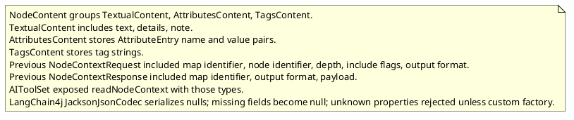
- **Design:**
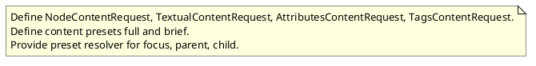
- **Test specification:**
  - Not applicable for structure-only change.

## Task: Remove Gson dependency from ai plugin
- **Status:** Implementation Review
- **Scope:** Remove the Gson dependency from the ai plugin build file and use Jackson provided by LangChain4j instead.
- **Modified production files:**
  - freeplane_plugin_ai/build.gradle
  - freeplane_plugin_ai/src/main/java/org/freeplane/plugin/ai/chat/AIModelCatalog.java
- **Modified test files:**
  - freeplane_plugin_ai/src/test/java/org/freeplane/plugin/ai/chat/AIModelCatalogTest.java
- **Research summary:**
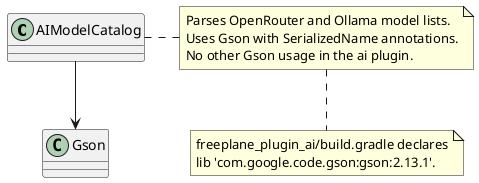
- **Design:**
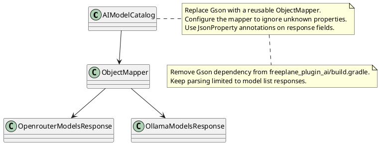
- **Test specification:**
  - Add a unit test that parses a sample OpenRouter response and returns the expected model identifiers.
  - Add a unit test that parses a sample Ollama response and returns the expected model names.

## Task: Implement reading methods
- **Status:** Implementation Review
- **Scope:** Implement read_node_content with a request that requires only map identifier and node identifier, always include node identifiers in the response, and return focus, parent, and child nodes with preset content; update AIToolSet to use the new method and remove the old read context request and response types.
- **Modified production files:**
  - freeplane_plugin_ai/src/main/java/org/freeplane/plugin/ai/tools/AIToolSet.java
  - freeplane_plugin_ai/src/main/java/org/freeplane/plugin/ai/tools/AttributesContentReader.java
  - freeplane_plugin_ai/src/main/java/org/freeplane/plugin/ai/tools/NodeContent.java
  - freeplane_plugin_ai/src/main/java/org/freeplane/plugin/ai/tools/NodeContentItem.java
  - freeplane_plugin_ai/src/main/java/org/freeplane/plugin/ai/tools/NodeContentItemReader.java
  - freeplane_plugin_ai/src/main/java/org/freeplane/plugin/ai/tools/NodeContentReader.java
  - freeplane_plugin_ai/src/main/java/org/freeplane/plugin/ai/tools/ReadNodeContentTool.java
  - freeplane_plugin_ai/src/main/java/org/freeplane/plugin/ai/tools/ReadNodeContentRequest.java
  - freeplane_plugin_ai/src/main/java/org/freeplane/plugin/ai/tools/ReadNodeContentResponse.java
  - freeplane_plugin_ai/src/main/java/org/freeplane/plugin/ai/tools/TagsContentReader.java
  - freeplane_plugin_ai/src/main/java/org/freeplane/plugin/ai/tools/TextualContentReader.java
- **Modified test files:**
  - freeplane_plugin_ai/src/test/java/org/freeplane/plugin/ai/tools/NodeContentReaderTest.java
  - freeplane_plugin_ai/src/test/java/org/freeplane/plugin/ai/tools/ReadNodeContentToolTest.java
  - freeplane_plugin_ai/src/test/java/org/freeplane/plugin/ai/tools/TextualContentReaderTest.java
- **Research summary:**
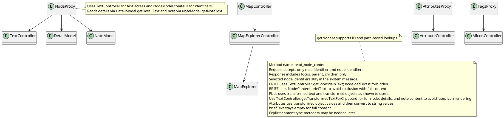
- **Design:**
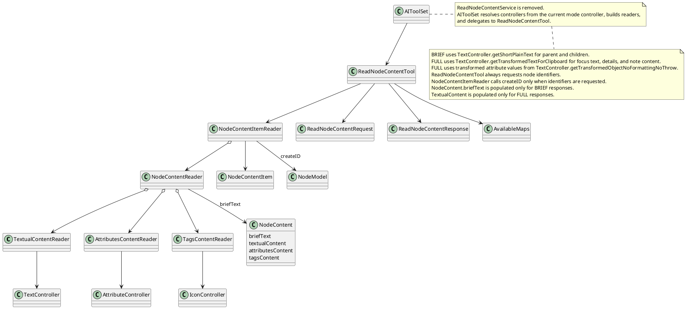
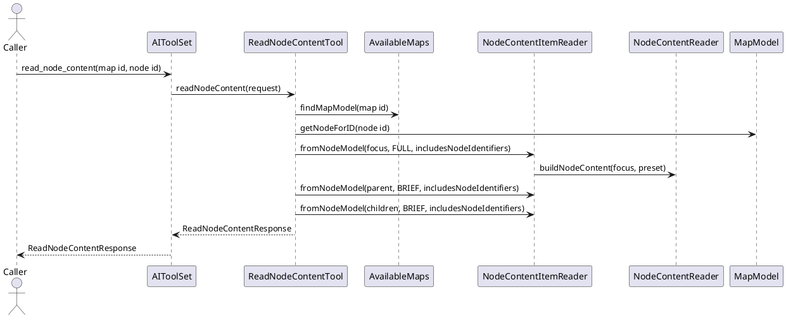
- **Test specification:**
  - Verify BRIEF response includes focus, parent, and children with briefText and node identifiers.
  - Verify missing parent returns null and empty children list.
  - Verify invalid map identifier throws a validation error.
- Verify TextController.getShortPlainText is used for BRIEF content.
- Verify TextualContent is null for BRIEF responses.
- Verify TextController.getShortPlainText is used for BRIEF content.
- Add tests for FULL focus content, including text, details, note, attributes, and tags.
- Add a test that full text uses TextController.getTransformedTextForClipboard.

## Task: AvailableMaps registry for map identifiers
- **Status:** Finished
- **Scope:** Introduce AvailableMaps to provide session map identifiers backed by weak references and allow lookup by identifier.
- **Modified production files:**
  - freeplane_plugin_ai/src/main/java/org/freeplane/plugin/ai/maps/AvailableMaps.java
  - freeplane_plugin_ai/src/main/java/org/freeplane/plugin/ai/maps/ControllerMapModelProvider.java
  - freeplane_plugin_ai/src/main/java/org/freeplane/plugin/ai/maps/MapModelProvider.java
- **Modified test files:**
  - freeplane_plugin_ai/src/test/java/org/freeplane/plugin/ai/maps/AvailableMapsTest.java
- **Research summary:**
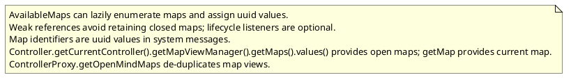
- **Design:**
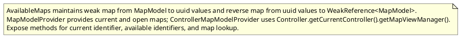
- **Test specification:**
  - Verify uuid stability for a map model.
  - Verify identifier list for open maps.
  - Verify lookup from identifier to map model.

## Task: System message map identifiers for reading methods
- **Status:** Finished
- **Scope:** Add the current map identifier, current root node identifier, and current selected node identifier to the system message output for reading methods.
- **Modified production files:**
  - freeplane_plugin_ai/src/main/java/org/freeplane/plugin/ai/chat/SystemMessageBuilder.java
  - freeplane_plugin_ai/src/main/java/org/freeplane/plugin/ai/maps/AvailableMaps.java
  - freeplane_plugin_ai/src/main/java/org/freeplane/plugin/ai/maps/ControllerMapModelProvider.java
  - freeplane_plugin_ai/src/main/java/org/freeplane/plugin/ai/maps/MapModelProvider.java
  - freeplane_plugin_ai/src/main/java/org/freeplane/plugin/ai/tools/AIToolSet.java
- **Modified test files:**
  - freeplane_plugin_ai/src/test/java/org/freeplane/plugin/ai/chat/SystemMessageBuilderTest.java
  - freeplane_plugin_ai/src/test/java/org/freeplane/plugin/ai/maps/AvailableMapsTest.java
- **Research summary:**
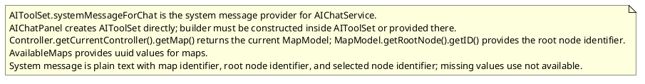
- **Design:**
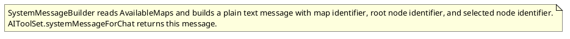
- **Test specification:**
  - Verify identifiers are present when available.
  - Verify not available when map or selection is missing.

## Task: Node content qualifiers for summary nodes
- **Status:** Finished
- **Scope:** Add node qualifiers so AI can recognize summary and first group nodes without filtering them out; explain qualifiers in the system message.
- **Research summary:**
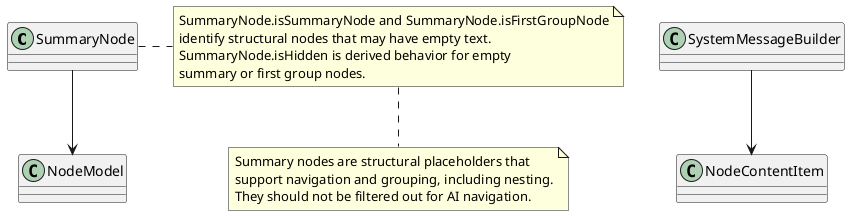
- **Design:**
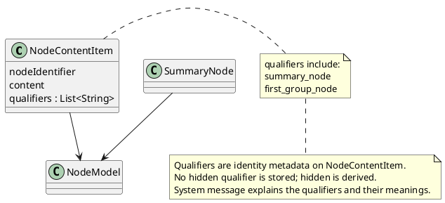
- **Test specification:**
  - Verify summary nodes include summary_node qualifier.
  - Verify first group nodes include first_group_node qualifier.
  - Verify non summary nodes have no qualifiers.
  - Verify system message includes qualifier descriptions.

## Task: Implement get_breadcrumbs tool
- **Status:** Implementation Review
- **Scope:** Implement get_breadcrumbs to return the root to node path, skipping hidden summary nodes and optionally including node identifiers.
- **Modified production files:**
  - freeplane_plugin_ai/src/main/java/org/freeplane/plugin/ai/tools/AIToolSet.java
  - freeplane_plugin_ai/src/main/java/org/freeplane/plugin/ai/tools/BreadcrumbsTool.java
  - freeplane_plugin_ai/src/main/java/org/freeplane/plugin/ai/tools/NodeContentItemReader.java
- **Modified test files:**
  - freeplane_plugin_ai/src/test/java/org/freeplane/plugin/ai/tools/BreadcrumbsToolTest.java
  - freeplane_plugin_ai/src/test/java/org/freeplane/plugin/ai/tools/NodeContentItemReaderTest.java
- **Research summary:**
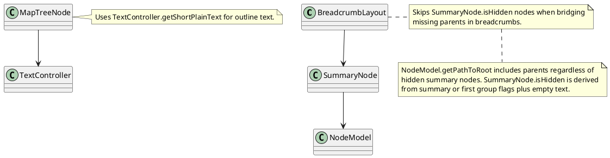
- **Design:**
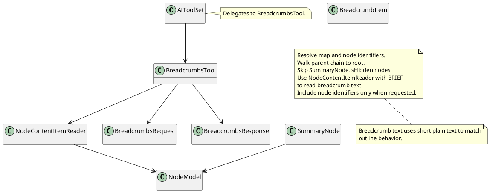
- **Test specification:**
  - Verify breadcrumbs include root to target nodes in order.
  - Verify SummaryNode.isHidden nodes are skipped.
  - Verify node identifiers are included only when requested.
  - Verify invalid map or node identifiers raise errors.
