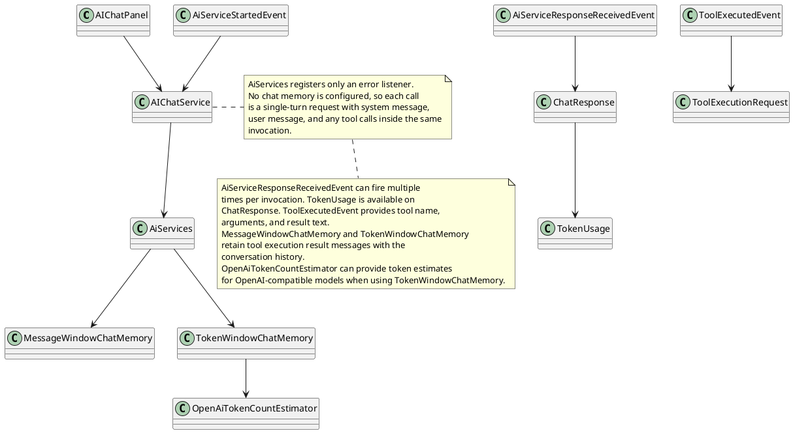
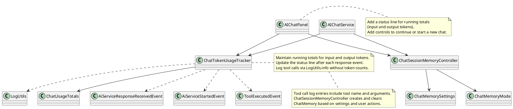

# Sprint 002

## Task: Chat session controls, token usage status, and tool call log
- **Status:** Designing
- **Scope:** Add chat memory controls for continuing or restarting sessions, show running token usage totals in the chat panel, and log tool calls without per-tool token counts.
- **Research summary:**

- **Design:**

- **Test specification:**
  - Verify chat memory is reused when continuing a session.
  - Verify chat memory is cleared when starting a new session.
  - Verify usage totals update after response events.
  - Verify a tool call event writes to LogUtils.
  - Verify the status line reflects cumulative totals.
