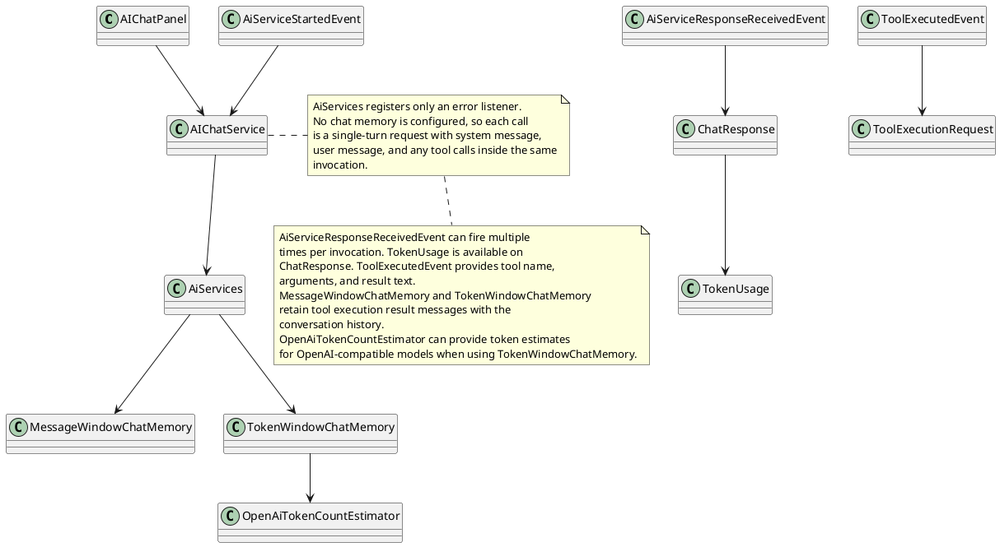
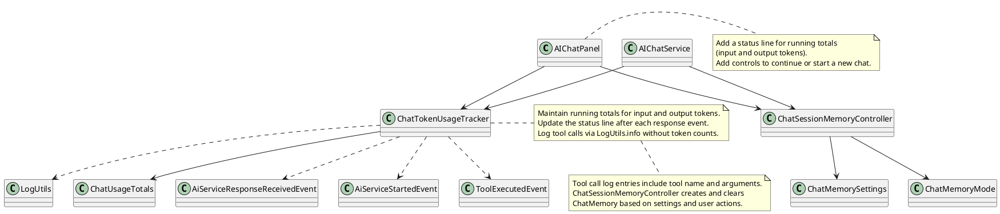
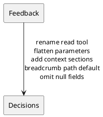
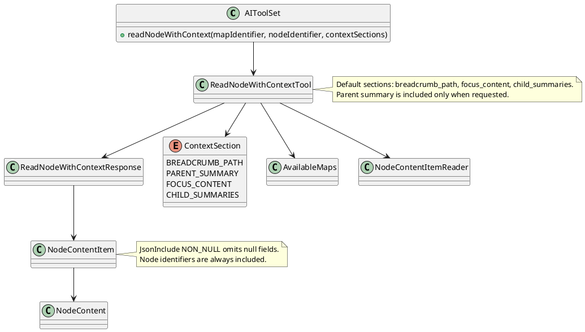
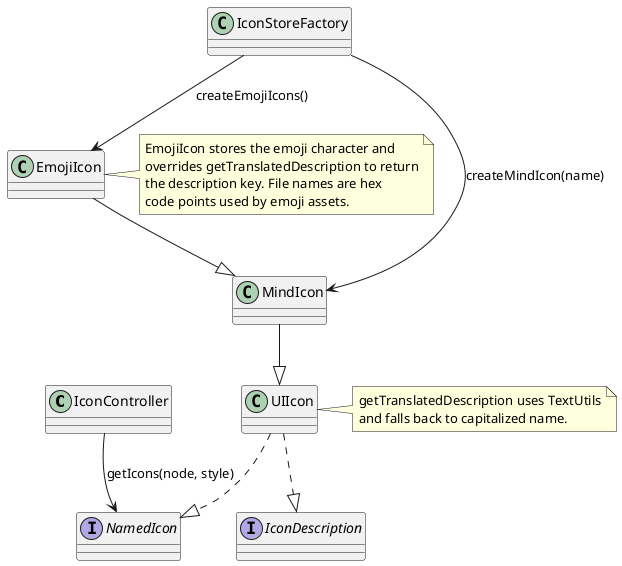
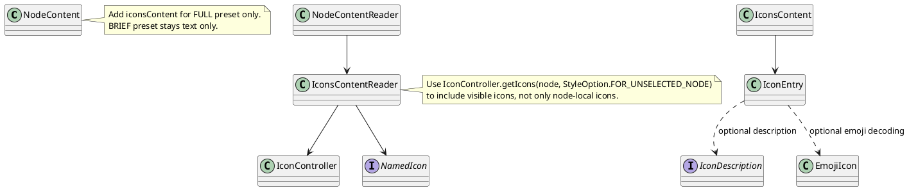

# Sprint 002

## Task: Chat session controls, token usage status, and tool call log
- **Status:** Finished
- **Scope:** Add chat memory controls for continuing or restarting sessions, show running token usage totals in the chat panel, and log tool calls without per-tool token counts.
- **Modified production files:**
  - freeplane_plugin_ai/src/main/java/org/freeplane/plugin/ai/chat/AIChatPanel.java
  - freeplane_plugin_ai/src/main/java/org/freeplane/plugin/ai/chat/AIChatService.java
  - freeplane_plugin_ai/src/main/java/org/freeplane/plugin/ai/chat/AIChatServiceFactory.java
  - freeplane_plugin_ai/src/main/java/org/freeplane/plugin/ai/chat/ChatMemoryMode.java
  - freeplane_plugin_ai/src/main/java/org/freeplane/plugin/ai/chat/ChatMemorySettings.java
  - freeplane_plugin_ai/src/main/java/org/freeplane/plugin/ai/chat/ChatSessionMemoryController.java
  - freeplane_plugin_ai/src/main/java/org/freeplane/plugin/ai/chat/ChatTokenUsageTracker.java
  - freeplane_plugin_ai/src/main/java/org/freeplane/plugin/ai/chat/ChatUsageTotals.java
- **Modified test files:**
  - freeplane_plugin_ai/src/test/java/org/freeplane/plugin/ai/chat/ChatSessionMemoryControllerTest.java
  - freeplane_plugin_ai/src/test/java/org/freeplane/plugin/ai/chat/ChatTokenUsageTrackerTest.java
- **Research summary:**

- **Design:**

- **Test specification:**
  - Verify chat memory is reused when continuing a session.
  - Verify chat memory is cleared when starting a new session.
  - Verify usage totals update after response events.
  - Verify a tool call event writes to LogUtils.
  - Verify the status line reflects cumulative totals.

## Task: Review llm feedback for read tools
- **Status:** Implementation Review
- **Scope:** Apply feedback to the read tool by renaming it to readNodeWithContext, flattening parameters, adding section selectors, and omitting null fields in responses.
- **Modified production files:**
  - freeplane_plugin_ai/src/main/java/org/freeplane/plugin/ai/tools/AIToolSet.java
  - freeplane_plugin_ai/src/main/java/org/freeplane/plugin/ai/tools/ContextSection.java
  - freeplane_plugin_ai/src/main/java/org/freeplane/plugin/ai/tools/NodeContent.java
  - freeplane_plugin_ai/src/main/java/org/freeplane/plugin/ai/tools/NodeContentItem.java
  - freeplane_plugin_ai/src/main/java/org/freeplane/plugin/ai/tools/NodeContentItemReader.java
  - freeplane_plugin_ai/src/main/java/org/freeplane/plugin/ai/tools/ReadNodeWithContextResponse.java
  - freeplane_plugin_ai/src/main/java/org/freeplane/plugin/ai/tools/ReadNodeWithContextTool.java
  - freeplane_plugin_ai/src/main/java/org/freeplane/plugin/ai/tools/TextualContent.java
  - freeplane_plugin_ai/src/main/java/org/freeplane/plugin/ai/tools/AttributesContent.java
  - freeplane_plugin_ai/src/main/java/org/freeplane/plugin/ai/tools/TagsContent.java
- **Modified test files:**
  - freeplane_plugin_ai/src/test/java/org/freeplane/plugin/ai/tools/ReadNodeWithContextToolTest.java
- **Research summary:**

- **Design:**

- **Test specification:**
  - Verify default sections include focus content, child summaries, and breadcrumb path.
  - Verify parent summary is included when requested.
  - Verify focus content is omitted when not requested.
  - Verify invalid map identifiers fail fast.

## Task: Add icon content to node responses
- **Status:** Designing
- **Scope:** Expose node icons in read responses with icon names and optional emoji decoding for emoji icons.
- **Research summary:**

- **Design:**

- **Test specification:**
  - Verify icon entries include name and file for each icon.
  - Verify emoji icons include an emoji value when decoding is enabled.
  - Verify no icons content is returned for BRIEF preset.
